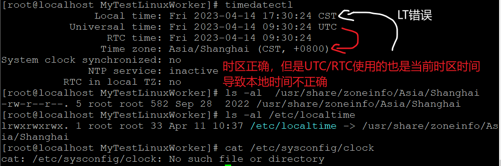
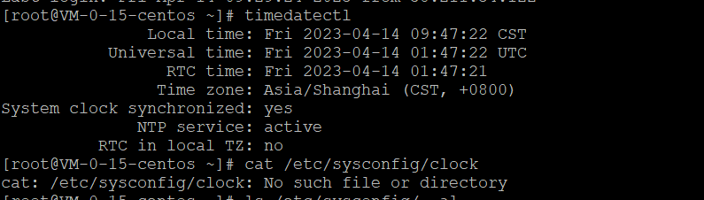

**RHEL/CentOS 8 UTC、RTC时间不正确导致本地时间错误的问题【timedatectl、hwclock/clock、date、ntp时间同步命令详解】**

[toc]

> 通常 **本地时间 LT - Local Time 指的就是系统时间**，系统时间 也称为 Wall Time，简称 WT时间；
> 
> RTC - real time clock 实时时间时钟，指的是 硬件时间 或 硬件时钟，同时 RTC 分为 UTC时间的RTC 和 当前时区的RTC 。硬件时钟 也称为 BIOS时间【因此，也可以在机器启动时的BIOS中设置】。
>
> `hwclock` 或 `hwclock --show` （硬件时钟 hardware clock）显示的时间 标准表述为 当前时区RTC。

> 解决本地时间错误的方法：
> 
> - 方法一：通过 `hwclock --set --date` 设置正确的 当前时区 RTC 时间，然后执行 `hwclock --hctosys` 将当前时区 RTC 时间设置到系统时间，使本地时间正确。
>
> - 方法二 · 推荐：`timedatectl set-time` 设置正确的系统时间即可。
>
> - 方法三·更推荐：`timedatectl set-ntp true` 开启NTP时间同步。【`true/false yes/no`】有时需要启用停用多次，主要确认`System clock synchronized: yes`
>
> - 方法四：`date -s` 或 `date --set` 设置正确的本地时间，然后执行 `hwclock --systohc` 将系统时间设置到当前时区 RTC 时间（硬件时钟），使RTC正确。
>
> - 方法五·未测试·不推荐：使用 ntpdate 工具。

> 通常 或 默认情况下，centos认为 rtc就是utc（从 utc 读取作为 rtc）。而 localtime 是 utc+时区偏移
>
> “相应的，windows认为 rtc 是utc+8 所以 双系统会有时间错误的问题”

> 设置本地时间，会自动调整 UTC 时间；设置本地时区RTC，会自动调整UTC的RTC。
>
> **UTC时间是按照时区偏移，根据系统时间自动设置的。**

> timedatectl是在RHEL7及CentOS7中新增的systemd的一部分，date是传统的日期时间设置命令，hwclock单元访问的是硬件时钟。

# 本地时间 不正确的问题



关于 本地时间LT 错误的问题，可以看到时区正确，但是 UTC 采用了当前时区的时间，导致 本地时间 错误。

那么如何设置 UTC 、RTC 时间正确？

搜到的资料都是修改 `/etc/sysconfig/clock` 设置BIOS时钟，即关于 RTC 时间。

```sh
$ vi /etc/sysconfig/clock   #编辑时间配置文件

    ZONE="Asia/Shanghai"

    UTC=false                   #设置为false，硬件时钟不于utc时间一致

    ARC=false

$ /sbin/hwclock --systohc   #设置硬件时间和系统时间一致并校准
```

关于设置 RTC 实时时间时钟 的文件，使用 cat 命令 `cat /etc/sysconfig/clock` 可以看到文件不存在。


同时，后面对比了一个 UTC 正确的系统，可以看到同样没有 `/etc/sysconfig/clock` 文件，但是其 UTC 是正确的：



也就是，**正确设置 UTC、RTC 时间的方式，不是或不必是 修改或创建 `/etc/sysconfig/clock` 配置文件**。

> 感觉搜到这一块的内容有点误导人...

# hwclock 显示和设置硬件时钟

## clock 和 hwclock 是同一个命令（实质并不完全相同）

clock 软链接到 hwclock，两者是同一个命令。

```sh
# type hwclock
hwclock is hashed (/usr/sbin/hwclock)
# type -a clock
clock is /usr/sbin/clock
# ls -al /usr/sbin/clock
lrwxrwxrwx. 1 root root 7 Jul 21  2021 /usr/sbin/clock -> hwclock

```

## hwclock 是一个时间时钟工具，hwclock --show 显示的是本地时间

`hwclock`，`hwclock --show` 显示本地时间。

`hwclock -s`, `hwclock --hctosys` ：从硬件时钟设置系统时间

`hwclock -w`, `hwclock --systohc` ：从当前系统时间设置硬件时钟

如下，直接通过 `hwclock --show` 、`date`、`timedatectl` 就可以看出其中的异同。

```sh
# hwclock --systohc
# hwclock --show
2023-04-14 21:56:50.962264+08:00
# date
Fri Apr 14 21:56:51 CST 2023
# hwclock --hctosys
# hwclock --show
2023-04-14 21:57:11.196269+08:00
# date
Fri Apr 14 21:57:13 CST 2023
# timedatectl
               Local time: Fri 2023-04-14 21:57:39 CST
           Universal time: Fri 2023-04-14 13:57:39 UTC
                 RTC time: Fri 2023-04-14 13:57:39
                Time zone: Asia/Shanghai (CST, +0800)
System clock synchronized: no
              NTP service: inactive
          RTC in local TZ: no
```

> `hwclock --systohc` 和 `hwclock --hctosys` 此处设置无效的原因是 `hwclock --show` 和 `date` 本来就相同。

虽然 `hwclock --help` 显示 `--show` 为 RTC 时间，但是，**严格说，它显示的是处理过时区偏移的RTC时间**，具体看`--get`的解释。

```sh
# hwclock --help

Usage:
 hwclock [function] [option...]

Time clocks utility.

Functions:
 -r, --show           display the RTC time
     --get            display drift corrected RTC time

```

## hwclock --set --date 设置当前时区 RTC 时间，然后 `hwclock --hctosys`【解决本地时间错误的方法一】

如下，`hwclock --set --date` 设置 时区偏移的RTC 时间，`timedatectl` 查看 RTC 为减去时区偏移的'标准'RTC时间：

```sh
# hwclock --set --date "Fri 2023-04-14 14:22:30"
# timedatectl
               Local time: Fri 2023-04-14 22:16:06 CST
           Universal time: Fri 2023-04-14 14:16:06 UTC
                 RTC time: Fri 2023-04-14 06:22:35
                Time zone: Asia/Shanghai (CST, +0800)
System clock synchronized: no
              NTP service: inactive
          RTC in local TZ: no
# date
Fri Apr 14 22:16:15 CST 2023

```

本地时间 Local time 与 date 日期时间保持一致。

然后，执行 `hwclock --hctosys` 从正确的硬件时钟（当前时区RTC）设置系统时间。

```sh
# hwclock --hctosys
# date
Fri Apr 14 14:31:13 CST 2023
# hwclock --show
2023-04-14 14:31:16.556058+08:00
# timedatectl
               Local time: Fri 2023-04-14 14:31:20 CST
           Universal time: Fri 2023-04-14 06:31:20 UTC
                 RTC time: Fri 2023-04-14 06:31:20
                Time zone: Asia/Shanghai (CST, +0800)
System clock synchronized: no
              NTP service: inactive
          RTC in local TZ: no
```

可以看到，通过`hwclock --set --date`设置


# timedatectl 命令 查看设置日期、时间和时区【推荐】

> 方法一中可以看出，设置本地时间，会自动调整 UTC 时间；设置本地时区RTC，会自动调整UTC的RTC。

timedatectl 或 `timedatectl status` 可以查看当前系统的本地时间、UTC、RTC、时区、是否同步、是否启用NTP等信息。

## timedatectl 设置硬件时钟 是否为 UTC

默认硬件时钟与UTC一致，也是推荐的设置。

上面介绍的 `vi /etc/sysconfig/clock` 修改 `UTC=false` 就是使 RTC与UTC 不一致【未测试】

### 查看硬件时钟是否设置为本地时区（local timezone）

```sh
# timedatectl | grep local
          RTC in local TZ: no
```

### 设置 硬件时钟 为 本地时区

```sh
# timedatectl set-local-rtc 1
```

查看时间时 `timedatectl` 提示 `The system is configured to read the RTC time in the local time zone...`

```sh
# timedatectl
               Local time: Fri 2023-04-14 20:00:24 CST
           Universal time: Fri 2023-04-14 12:00:24 UTC
                 RTC time: Fri 2023-04-14 20:00:25
                Time zone: Asia/Shanghai (CST, +0800)
System clock synchronized: no
              NTP service: inactive
          RTC in local TZ: yes

Warning: The system is configured to read the RTC time in the local time zone.
         This mode cannot be fully supported. It will create various problems
         with time zone changes and daylight saving time adjustments. The RTC
         time is never updated, it relies on external facilities to maintain it.
         If at all possible, use RTC in UTC by calling
         'timedatectl set-local-rtc 0'.
```

### 设置 硬件时钟 为 UTC 【推荐 · 默认】

```sh
# timedatectl set-local-rtc 0
```

查看

···sh
# timedatectl
               Local time: Fri 2023-04-14 20:00:44 CST
           Universal time: Fri 2023-04-14 12:00:44 UTC
                 RTC time: Fri 2023-04-14 12:00:44
                Time zone: Asia/Shanghai (CST, +0800)
System clock synchronized: no
              NTP service: inactive
          RTC in local TZ: no
···

从上面的设置可以看出，RTC 时间没问题，来自 UTC，LT 与 UTC 之间为时区偏移。


## timedatectl set-time 设置正确的日期时间【解决本地时间错误的方法二·推荐】

可以看到，`timedatectl set-time`设置本地时间，UTC、RTC、本地时区RTC、date当前时间 均自动调整，并显示正确！

```sh
# timedatectl set-time "Fri 2023-04-14 13:53:22"
# timedatectl
               Local time: Fri 2023-04-14 13:53:23 CST
           Universal time: Fri 2023-04-14 05:53:23 UTC
                 RTC time: Fri 2023-04-14 05:53:24
                Time zone: Asia/Shanghai (CST, +0800)
System clock synchronized: no
              NTP service: inactive
          RTC in local TZ: no
# date
Fri Apr 14 13:53:33 CST 2023
# hwclock --show
2023-04-14 13:53:35.102550+08:00
```

## timedatectl set-time YYYY-MM-DD 设置日期

```sh
timedatectl set-time 2023-03-01
```

## timedatectl set-time HH:MM:SS 设置时间

```sh
timedatectl set-time 12:12:12
```

## 查看、修改时区

- `timedatectl list-timezones` 列出所有时区

- `timedatectl list-timezones | grep -o "Asia/S.*"`  查询亚洲且地区以S开头的时区

- `timedatectl set-timezone Asia/Shanghai` 设置时区为上海（北京时区）

## 重启timedatectl服务

```sh
# systemctl restart systemd-timedated.service
```

> RHEL8 、 CentOS8 下是无法重启的，因为它的Unit为masked。

# 设置NTP服务器时间同步【解决本地时间错误的方法三·更推荐】

> 网络时间协议NTP（Network Time Protocol），用于客户端和服务器之间进行时钟同步

`timedatectl set-ntp yes` 设置开启NTP服务同步。

**通过停用和启用，可以实现时间服务器至少同步一次**（实际测试，默认时执行yes没有任何效果。先false后yes可以执行同步，设置正确时间，并正确启用NTP！）

**有时需要停用启用多次才能生效，主要看`System clock synchronized: yes`是否已同步为准！**

```sh
timedatectl set-ntp false # true/false yes/no 都可以
timedatectl set-ntp true
```

> **`systemctl disable --now chronyd` 可以禁用 NTP 服务**。

> 如果报错 `Failed to set ntp: NTP not supported`，则可以通过 `yum installl ntp` 安装NTP实现。

```sh
# timedatectl set-ntp yes
# timedatectl
               Local time: Fri 2023-04-14 14:13:51 CST          # 错误时间
           Universal time: Fri 2023-04-14 06:13:51 UTC
                 RTC time: Fri 2023-04-14 06:13:51
                Time zone: Asia/Shanghai (CST, +0800)
System clock synchronized: no
              NTP service: active
          RTC in local TZ: no
# timedatectl set-ntp false
# timedatectl
               Local time: Fri 2023-04-14 15:26:01 CST          # 此时就已同步
           Universal time: Fri 2023-04-14 07:26:01 UTC
                 RTC time: Fri 2023-04-14 07:26:01
                Time zone: Asia/Shanghai (CST, +0800)
System clock synchronized: yes
              NTP service: inactive
          RTC in local TZ: no
# timedatectl set-ntp yes
# timedatectl
               Local time: Fri 2023-04-14 15:26:15 CST          # 时间正确
           Universal time: Fri 2023-04-14 07:26:15 UTC
                 RTC time: Fri 2023-04-14 07:26:15
                Time zone: Asia/Shanghai (CST, +0800)
System clock synchronized: no
              NTP service: active
          RTC in local TZ: no
```

> 由 `System clock synchronized` 也可以看出系统时钟是否已同步。

> **启用NTP后，手动设置时间的命令将不生效！**
> 
> ```sh
> # timedatectl set-time 15:50:02
> Failed to set time: NTP unit is active
> ```

# date 查看设置时间

## date 命令 设置时间【解决本地时间错误的方法四】

`date -s` 或 `date --set` 使用 date 命令 设置时间。

- 设置日期

```sh
# date -s 20230315
```

- 设置时间

```sh
# date -s 15:23:36
```

- 设置日期和时间

```sh
# date -s "20230315 15:23:36"
```

如下 `date -s` 设置本地时间，可以看到，只自动调整了UTC，但会导致 RTC 时间、hwclock 时间错误，还需要执行`hwclock --systohc`

```sh
# date -s 20230315
Wed Mar 15 00:00:00 CST 2023
# timedatectl
               Local time: Wed 2023-03-15 00:00:05 CST
           Universal time: Tue 2023-03-14 16:00:05 UTC
                 RTC time: Fri 2023-04-14 08:01:03
                Time zone: Asia/Shanghai (CST, +0800)
System clock synchronized: no
              NTP service: active
          RTC in local TZ: no

```

> `date --set '2023-12-17 12:43:23' --utc` 设置UTC时间

## date --utc 查看UTC时间

date 默认查看的是本地时间。

```sh
# date --utc
Fri Apr 14 10:13:47 UTC 2023
# date
Fri Apr 14 18:13:51 CST 2023
```

## date +format 显示指定格式的时间

```sh
# date +"%H"
16
# date +"%M"
23
# date +"%D"
12/18/17
# date +"%Y"
2023
# date +"%F"
2023-12-18
# date +"%T"
16:23:31
# date +"%d"
18
# date +"%Y-%m-%d %H:%M"
2023-12-18 16:26
```

# 借助 ntpdate 工具【解决本地时间错误的方法五·未测试·不推荐】

- 安装ntpdate工具

```sh
# yum -y install ntp ntpdate
```

- 设置系统时间与网络时间同步

```sh
# ntpdate cn.pool.ntp.org
```

- 将系统时间写入硬件时间

```sh
# hwclock --systohc
```

# 附：/etc/localtime 文件用来设置系统的时区

系统时区的 /etc/localtime 文件，软链接到二进制时区标识文件。**链接到不同的时区文件，则设置为不同的系统时区！**

## 查看

```sh
# ls -l /etc/localtime
lrwxrwxrwx. 1 root root 33 Apr 11 10:37 /etc/localtime -> /usr/share/zoneinfo/Asia/Shanghai
```

## 通过软链接来修改时区

通过修改时区的链接文件 `/etc/localtime` 到 `/usr/share/zoneinfo` 目录下的时区文件来修改时区。

修改是即时生效的。

比如，修改时区如下：

```sh
sudo ln -sf /usr/share/zoneinfo/America/Toronto /etc/localtime
```

修改为上海(中国)时区：

```sh
ln -sf /usr/share/zoneinfo/Asia/Shanghai /etc/localtime
```

> `ln -sf 源 目标`

> **不要通过直接的复制(cp)时区文件，修改系统时区，可能会出现问题**。可以参见 [CentOS7修改时区的正确姿势](https://blog.csdn.net/yin138/article/details/52765089)

# 附：Unix时间戳

在计算机中看到的UTC时间都是从（1970年01月01日 0:00:00)开始计算秒数的。所看到的UTC时间就是从1970年这个时间点起到具体时间共有多少秒。这个秒数就是Unix时间戳。 

# 附：CST时间

CST 可以代表如下 4 个不同的时区： 
 
 Central Standard Time (USA) UT-6:00 
 
 Central Standard Time (Australia) UT+9:30 
 
 China Standard Time UT+8:00    中国标准时间 - CST
 
 Cuba Standard Time UT-4:00 

# 附：硬件时钟和系统时钟

Linux将时钟分为系统时钟(System Clock)和硬件(Real Time Clock，简称RTC)时钟两种。

系统时间是指当前Linux Kernel中的时钟，而硬件时钟则是主板上由电池供电的那个主板硬件时钟，这个时钟可以在BIOS的"Standard BIOS Feture"项中进行设置。

既然Linux有两个时钟系统，那么Linux默认使用哪种时钟系统呢？会不会出现两种系统时钟冲突的情况呢？

首先，Linux并没有默认哪个时钟系统。当Linux启动时，硬件时钟会被读取，用于系统时钟的设置，然后系统时钟就会独立于硬件运作。

从Linux启动过程来看，系统时钟和硬件时钟不会发生冲突，但Linux中的所有命令(包括函数)都是采用的系统时钟设置。不仅如此，系统时钟和硬件时钟还可以采用异步方式，即系统时间和硬件时间可以不同。这样做的好处对于普通用户意义不大，但对于Linux网络管理员却有很大的用处。

例如，要将一个很大的网络中(跨越若干时区)的服务器同步，假如位于美国纽约的Linux服务器和北京的Linux服务器，其中一台服务器无须改变硬件时钟而只需临时设置一个系统时间，如要将北京服务器上的时间设置为纽约时间，两台服务器完成文件的同步后，再与原来的时钟同步一下即可。这样系统和硬件时钟就提供了更为灵活的操作。

> clock和hwclock用法相近，只不过clock命令除了支持x86硬件体系外，还支持Alpha硬件体系。由于目前绝大多数用户使用x86硬件体系，所以可以视这两个命令为一个命令来学习。

硬件时钟从根本上讲是CMOS时钟。【硬件时钟、实时时钟、RTC、BIOS时钟】

系统时钟是由内核维护的，由计时器中断驱动，它是从1969年末（即传说中的标志Unix时代开端的那个拂晓，即1970-01-01）开始算起的累积秒数，不考虑闰秒。

在DOS或Mac系统中，起作用的是硬件时钟。绝大多数电脑时钟都是很不准确的。它们从根本上讲是由小型电池供电的警报器时钟。


# 参考

- [Linux —— 时间（hwlock设置硬件时间）](https://blog.csdn.net/weixin_42167759/article/details/90707331)

- [Centos7 设置系统时间](https://blog.csdn.net/u011987014/article/details/103832971)

- [How to Set Time, Timezone and Synchronize System Clock Using timedatectl Command](https://www.tecmint.com/set-time-timezone-and-synchronize-time-using-timedatectl-command/)

- [hwclock命令参数及用法详解--Linux显示/设置硬件时钟命令](https://www.cnblogs.com/ncepu/p/13695093.html)

- 不错的一篇 [hwclock显示系统硬件时钟的日期和时间](https://zhuanlan.zhihu.com/p/73804086)