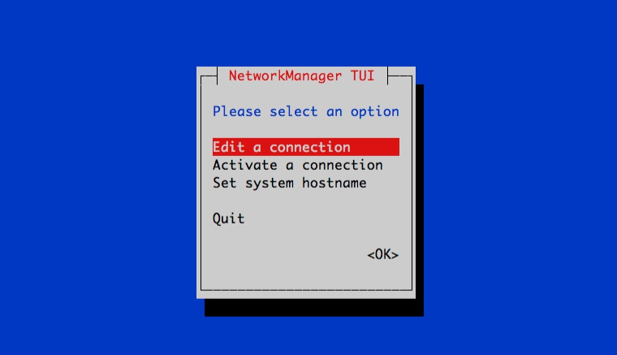
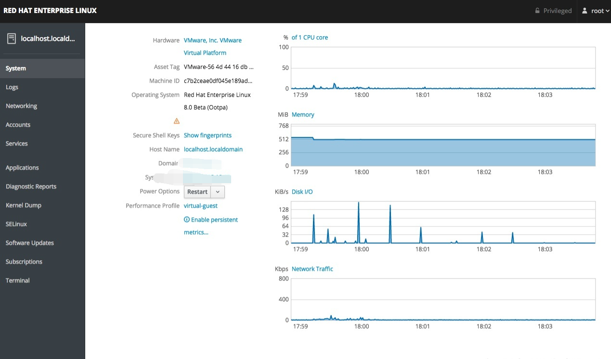

**RHEL8/CentOS8的网络网卡配置详解&常用命令【转】**

[toc]

> 原文 [RHEL8/CentOS8的网络网卡配置详解&常用命令](https://blog.csdn.net/qq_39565646/article/details/115521803)

- `nmcli c` / `nmcli connection` 查看连接
- `nmcli d` / `nmcli device` 查看网络设备
- `nmcli c up xxx` / `nmcli d reapply xxx` / `nmcli d connect xxx` 切换连接【或者 ` nmcli c reload`重新加载连接配置，再连接指定连接或设备】
- 参见下面的 **nmcli常用命令一览**

> 另 [RHEL8怎么重启网络服务](https://blog.csdn.net/qq_45617652/article/details/102690087) 也是不错的一篇文章

# Centos8网络配置

➡ 在rhel8(含centos8)上，没有传统的 `network.service`，在`/etc/sysconfig/network-scripts/`里也看不到任何脚本文件，那么该如何进行网络配置呢。

➡ 本文详细阐述基于rhel8的网络配置，包含多种配置方法。

➡ 事先声明：本文提及的所有内容，仅适用rhel8/centos8，因为不同linux系统的NetworkManager行为存在部分差异。

## rhel8与7的区别

在rhel7上，同时支持network.service和NetworkManager.service(简称NM)。默认情况下，这2个服务都有开启，但许多人都会将NM禁用掉。

在rhel8上，已废弃network.service，因此只能通过NM进行网络配置，包括动态ip和静态ip。换言之，在rhel8上，必须开启NM，否则无法使用网络。

rhel8依然支持network.service，只是默认没安装，详见本文最后的Tips。

# NetworkManager介绍

NetworkManager 是2004年 Red Hat 启动的项目，旨在能够让Linux用户更轻松地处理现代网络需求，尤其是无线网络，能自动发现网卡并配置ip地址。

> 类似在手机上同时开启wifi和蜂窝网络，自动探测可用网络并连接，无需手动切换。

虽然初衷是针对无线网络，但在服务器领域，NM已大获成功。

**NM能管理各种网络**

▷ 有线网卡、无线网卡

▷ 动态ip、静态ip

▷ 以太网、非以太网

▷ 物理网卡、虚拟网卡

## **使用方法**

▷ nmcli：命令行。这是最常用的工具，本文将详细讲解该工具使用。

▷ nmtui：在shell终端开启文本图形界面。示意图见本文最后的Tips

▷ Freedesktop applet：如GNOME上自带的网络管理工具

▷ cockpit：redhat自带的基于web图形界面的"驾驶舱"工具，具有dashborad和基础管理功能。示意图见本文最后的Tips

## **为什么要用NM**

▷ 工具齐全：命令行、文本界面、图形界面、web

▷ 广纳天地：纳管各种网络，有线、无线、物理、虚拟

▷ 参数丰富：多达200多项配置参数(包括ethtool参数)

▷ 一统江湖：RedHat系、Suse系、Debian/Ubuntu系，均支持

▷ 大势所趋：下一个大版本的rhel只能通过NM管理网络

## **nmcli使用方法**

nmcli使用方法非常类似linux ip命令、cisco交换机命令，并且支持tab补全(详见本文最后的Tips)，也可在命令最后通过-h、--help、help查看帮助。


在nmcli中有2个命令最为常用：

- **nmcli connection**

译作**连接**，可理解为配置文件，相当于`ifcfg-ethX`。可以简写为 `nmcli c`

- **nmcli device**

译作**设备**，可理解为实际存在的网卡(包括物理网卡和虚拟网卡)。可以简写为 `nmcli d`

在NM里，有2个维度：**连接(connection)**和**设备(device)**，这是多对一的关系。

想给某个网卡配ip，首先NM要能纳管这个网卡。设备里存在的网卡(即`nmcli d`可以看到的)，就是NM纳管的。接着，可以为一个设备配置多个连接(即`nmcli c`可以看到的)，每个连接可以理解为一个`ifcfg`配置文件。同一时刻，一个设备只能有一个连接活跃。可以 **通过 `nmcli c up` 切换连接**。

- **connection有2种状态**：

▷ 活跃(带颜色字体)：表示当前该connection生效

▷ 非活跃(正常字体)：表示当前该connection不生效

- **device有4种常见状态**：

▷ connected：已被NM纳管，并且当前有活跃的connection

▷ disconnected：已被NM纳管，但是当前没有活跃的connection

▷ unmanaged：未被NM纳管

▷ unavailable：不可用，NM无法纳管，通常出现于网卡link为down的时候(比如ip link set ethX down)

# nmcli常用命令一览

```sh
 # 查看ip(类似于ifconfig、ip addr)
 nmcli
 ​
 # 创建connection，配置静态ip(等同于配置ifcfg，其中BOOTPROTO=none，并ifup启动)
 nmcli c add type ethernet con-name ethX ifname ethX ipv4.addr 192.168.1.100/24 ipv4.gateway 192.168.1.1 ipv4.method manual
 ​
 # 创建connection，配置动态ip(等同于配置ifcfg，其中BOOTPROTO=dhcp，并ifup启动)
 nmcli c add type ethernet con-name ethX ifname ethX ipv4.method auto
 ​
 # 修改ip(非交互式)
 nmcli c modify ethX ipv4.addr '192.168.1.200/24'
 nmcli c up ethX
 ​
 # 修改ip(交互式)
 nmcli c edit ethX
 nmcli> goto ipv4.addresses
 nmcli ipv4.addresses> change
 Edit 'addresses' value: 192.168.1.200/24
 Do you also want to set 'ipv4.method' to 'manual'? [yes]: yes
 nmcli ipv4> save
 nmcli ipv4> activate
 nmcli ipv4> quit
 ​
 # 启用connection(相当于ifup)
 nmcli c up ethX
 ​
 # 停止connection(相当于ifdown)
 nmcli c down
 ​
 # 删除connection(类似于ifdown并删除ifcfg)
 nmcli c delete ethX
 ​
 # 查看connection列表
 nmcli c show
 ​
 # 查看connection详细信息
 nmcli c show ethX
 ​
 # 重载所有ifcfg或route到connection(不会立即生效)
 nmcli c reload
 ​
 # 重载指定ifcfg或route到connection(不会立即生效)
 nmcli c load /etc/sysconfig/network-scripts/ifcfg-ethX
 nmcli c load /etc/sysconfig/network-scripts/route-ethX
 ​
 # 立即生效connection，有3种方法
 nmcli c up ethX
 nmcli d reapply ethX
 nmcli d connect ethX
 ​
 # 查看device列表
 nmcli d
 ​
 # 查看所有device详细信息
 nmcli d show
 ​
 # 查看指定device的详细信息
 nmcli d show ethX
 ​
 # 激活网卡
 nmcli d connect ethX
 ​
 # 关闭无线网络(NM默认启用无线网络)
 nmcli r all off
 ​
 # 查看NM纳管状态
 nmcli n
 ​
 # 开启NM纳管
 nmcli n on
 ​
 # 关闭NM纳管(谨慎执行)
 nmcli n off
 ​
 # 监听事件
 nmcli m
 ​
 # 查看NM本身状态
 nmcli
 ​
 # 检测NM是否在线可用
 nm-online

```

> 注：**示例中的 `ethX` 为 连接的name 或 设备的device。**

> 本文提及的ifcfg均指代 /etc/sysconfig/network-scripts/ifcfg-ethX 及 /etc/sysconfig/network-scripts/route-ethX

# nmcli connection 重点

## nmcli c show

▪ 第一列是connection名字，简称con-name(注意con-name不是网卡名)

▪ 第二列是connection的UUID

▪ 最后一列才是网卡名(标准说法叫device名)，可通过`nmcil d`查看device

对connection做操作时需要指定标识，标识可以是con-name、UUID、如果存在ifcfg文件则也可以用ifcfg的完整路径，即`/etc/sysconfig/network-scripts/ifcfg-ethX` 

```sh
 nmcli c show ethX
 nmcli c show cae3f1ef-e79a-46c3-8e0c-946b91a65e11
 nmcli c show /etc/sysconfig/network-scripts/ifcfg-ethX
```

## nmcli c 的 con-name

同时对应`ifcfg`的文件名以及内容中的NAME=，该参数表示连接(connection)的名字，无需和网卡名相同，可以为一个设备(device)创建多个连接，但同一时刻只能有一个连接生效。

当有多个连接时候，`nmcli c delete`删除当前连接，就会自动选择同一个设备的其他连接来顶替生效。可以通过`nmcli c up`来将指定连接切换生效。

> 注意：通过`nmcli c modify`修改con-name，只会对应修改ifcfg文件中的NAME，而不会更改ifcfg文件名。

## nmcli c 的 ipv4.method

对应`ifcfg`文件内容的`BOOTPROTO`，`ipv4.method`默认为`auto`，对应为`BOOTPROTO=dhcp`，这种时候如果指定ip，就可能导致网卡同时有dhcp分配的ip和静态ip。设置为`manual`表示`BOOTPROTO=none`，即只有静态ip。

**例子：创建一个连接(connection)**

```sh
 nmcli c add type ethernet con-name ethX-test ifname ethX ipv4.addresses '192.168.1.100/24,192.168.1.101/32' ipv4.routes '10.0.0.0/8 192.168.1.10,192.168.0.0/16 192.168.1.11' ipv4.gateway 192.168.1.254 ipv4.dns '8.8.8.8,4.4.4.4' ipv4.method manual
```

▪ type ethernet：创建连接时候必须指定类型，类型有很多，可以通过`nmcli c add type -h`看到，这里指定为ethernet。

▪ con-name ethX ifname ethX：第一个ethX表示连接(connection)的名字，这个名字可以任意定义，无需和网卡名相同；第二个ethX表示网卡名，这个ethX必须是在`nmcli d`里能看到的。

▪ ipv4.addresses '192.168.1.100/24,192.168.1.101/32'：配置2个ip地址，分别为192.168.1.100/24和192.168.1.101/32

▪ ipv4.gateway 192.168.1.254：网关为192.168.1.254

▪ ipv4.dns '8.8.8.8,4.4.4.4'：dns为8.8.8.8和4.4.4.4

▪ ipv4.method manual：配置静态IP

对应的ifcfg和dns就是：

```sh
 # /etc/sysconfig/network-scripts/ifcfg-ethX-test
 TYPE=Ethernet
 PROXY_METHOD=none
 BROWSER_ONLY=no
 BOOTPROTO=none
 IPADDR=192.168.1.100
 PREFIX=24
 IPADDR1=192.168.1.101
 PREFIX1=32
 GATEWAY=192.168.1.254
 DNS1=8.8.8.8
 DNS2=4.4.4.4
 DEFROUTE=yes
 IPV4_FAILURE_FATAL=no
 IPV6INIT=yes
 IPV6_AUTOCONF=yes
 IPV6_DEFROUTE=yes
 IPV6_FAILURE_FATAL=no
 IPV6_ADDR_GEN_MODE=stable-privacy
 NAME=ethX-test
 UUID=9a10ad89-437c-4caa-949c-a394a6d28c8d
 DEVICE=ethX
 ONBOOT=yes
 ​
 # /etc/resolv.conf
 nameserver 8.8.8.8
 nameserver 4.4.4.4

```

此时，通过 `nmcli c` 应该可以看到增加了一条连接

> 注意：**如果这是为ethX创建的第一个连接，则自动生效；如果此时已有连接存在，则该连接不会自动生效**。
> 
> 可以执行`nmcli c up ethX-test`来切换生效。

# nmcli device 重点

## nmcli d connect ethX

由NM对指定网卡进行管理，同时刷新该网卡对应的活跃connection(如果之前有修改过connection配置)；如果有connection但是都处于非活跃状态，则自动选择一个connection并将其活跃；如果没有connection，则自动生成一个并将其活跃。

## nmcli d disconnect ethX

让NM暂时不管理指定网卡，此操作不会变更实际网卡的link状态，只会使对应的connection变成非活跃。若重启系统则又会自动connect。

另外，如果手工将该网卡的connection全部删掉，该网卡状态也会自动变为disconnected。

## nmcli d reapply ethX

专门用于刷新connection，前提是网卡的device处于connected状态，否则会报错。

## nmcli d set ethX autoconnect yes|no managed yes|no

可以设置是否自动连接和是否自动管理，但经测试只能用于当前开机状态， 如果这2个参数都设置为no，然后重启系统，又会自动恢复成connected和managed yes的状态。所以该命令用途不大。

注意事项：如果managed设置为no，那么`nmcli c reload`会读取配置文件，但是不会立即生效，接着如果执行`nmcli c up ethX`，就会立即生效，同时managed自动变为yes。

> 重启系统自动恢复成connected和managed yes的状态，这种逻辑并不实用也不够合理，笔者已将此问题提交给redhat，据回复，这么设计是因为目前没有一个有效的手段来证明“我是我”，
> 
> 比如当网卡重新拔插到其他插槽时候，网卡名有很大可能性会发生变化，因此无法确定关机前设置的是对应开机后的哪个网卡，目前暂无办法解决，笔者将持续跟进。

## 3种网络配置方法

在讲3种配置方法前，需要先明白 ifcfg 和 NM connection 的关联：虽然 network.service 被废弃了，但是redhat为了兼容传统的ifcfg，通过NM进行网络配置时候，会自动将connection同步到ifcfg配置文件中。

也可以通过`nmcli c reload`或者`nmcli c load /etc/sysconfig/network-scripts/ifcfg-ethX`的方式来让NM读取ifcfg配置文件到connection中。因此，**ifcfg和connection是一对一的关系**，另外上面有提到，**connection和device是多对一的关系**。

**在rhel8上，有3种方法进行网络配置**

▷ 1. 手工配置ifcfg，通过NM来生效

▷ 2. 通过NM自带工具配ip，比如nmcli

▷ 3. 手工配置ifcfg，通过传统 network.service 来生效

**建议：**

推荐使用上述第1种网络配置方法(手工配置ifcfg，通过NM生效)，因为这样既兼容了传统的ifcfg配置，又能熟悉nmcli。举例：

```sh
 cat > /etc/sysconfig/network-scripts/ifcfg-eth0 <<EOF
 NAME=eth0
 DEVICE=eth0
 ONBOOT=yes
 BOOTPROTO=none
 TYPE=Ethernet
 IPADDR=192.168.1.10
 NETMASK=255.255.255.0
 GATEWAY=192.168.1.1
 EOF
 ​
 # nmcli c reload
 # nmcli c up eth0 # 如果之前没有eth0的connection，则上一步reload后就已经自动生效了
```

这么做有2个好处：

▷ 按官方建议使用NM而不是network.service

▷ 当还不太熟悉nmcli命令时候，这样最稳妥

# **Tips**

**1.** nmcli命令支持tab补全，但是需要`yum install bash-completion`

**2.** 如果希望NM不要纳管网卡，只有一个办法最彻底最靠谱，就是自己写ifcfg，内容加上`NM_CONTROLLED=no`，这样该device的状态就会始终保持unmanaged。`nmcli c up`、`nmcli c reload`、`nmcil c load`都不会对其起任何作用。

**3.** NM只能对link状态为up的网卡进行操作，如果手动`ip link set ethX down`，那么NM就无法对该网卡做任何操作(即使`nmcli d connect`也没有用)。

**4.** 可以通过`yum install network-scripts`来安装传统的`network.service`，不过redhat说了，在下一个rhel的大版本里将彻底废除，因此不建议使用`network.service`。

**5.** 手工创建新的ifcfg或者在ifcfg里修改ip等配置，NM不会自动读取，需要手工执行`nmcli c reload`或者`nmcli c load /etc/sysconfig/network-scripts/ifcfg-ethX`。这一点可能和其他系统的NM行为不太一样，但这种做法实则更适合服务器。

**6.** 不手工配置ifcfg，使用默认的dhcp情况下，网卡的增减是不会自动生成ifcfg，此时`nmcli c`看到的con-name将类似'System ethX'或者'Wired connection 1'。

**7.** NetworkManager支持3种获取dhcp的方式：dhclient、dhcpcd、internal，当`/etc/NetworkManager/NetworkManager.conf`配置文件中的 [main] 部分没配置`dhcp=`时候，默认使用 internal(rhel7/centos7默认是dhclient)。**internal是NM内部实现的dhcp客户端**。

**8.** 关于手动指定网关ip的方法，经过实测，`/etc/sysconfig/network`中的GATEWAY仅在3种情况下有效：`NM_CONTROLLED=no`或`ipv4.method manual`或`从ipv4.method manual第一次转到ipv4.method auto时候`。建议：当 NM\_CONTROLLED=no 时，将网关写在`/etc/sysconfig/network`(GATEWAY)；当使用NM时候，使用`nmcli c`命令配置网关(比如`nmcli c modify ethX ipv4.gateway 192.168.1.1`)。

**9.** NM默认会从dhcp里获取dns信息，并修改`/etc/resolv.conf`，如果不想让NM管理`/etc/resolv.conf`，则只需在`/etc/NetworkManager/NetworkManager.conf`里的 [main] 里增加`dns=none`即可。

**10.** 如果想让NM不要自动管理新网卡(比如不要给新网卡获取ip地址)，则只需在`/etc/NetworkManager/NetworkManager.conf`里的 [main] 里增加`no-auto-default=*`即可，改完后通过`systemctl restart NetworkManager`或者重启系统来生效。除了手工在`NetworkManager.conf`里加配置，也可以`yum install NetworkManager-config-server`，这会生成`/usr/lib/NetworkManager/conf.d/00-server.conf`，内容为如下截图。**建议使用前者方案**，因为后者的`ingore-carrier`是不被推荐的参数。

**11.** 更多NetworkManager参数详见`man NetworkManager.conf`

**12.** nmtui 示意图:



cockpit示意图:



> 在rhel8.0 beta时候，必须要先将 **浏览器语言设置为英语**，才可以使用，如果为中文，在登陆后是空白页面。
