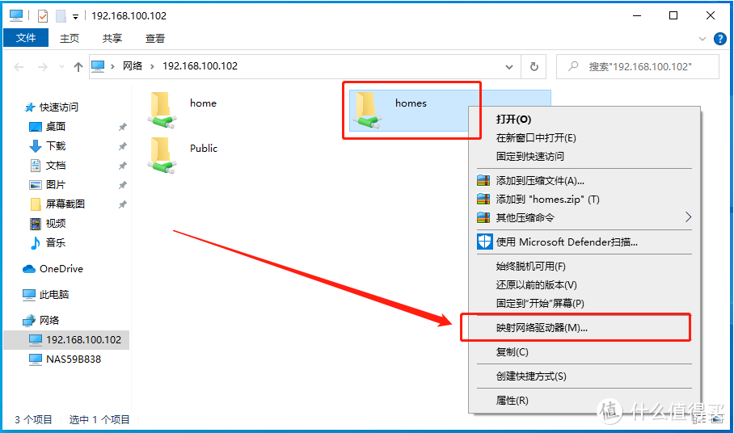
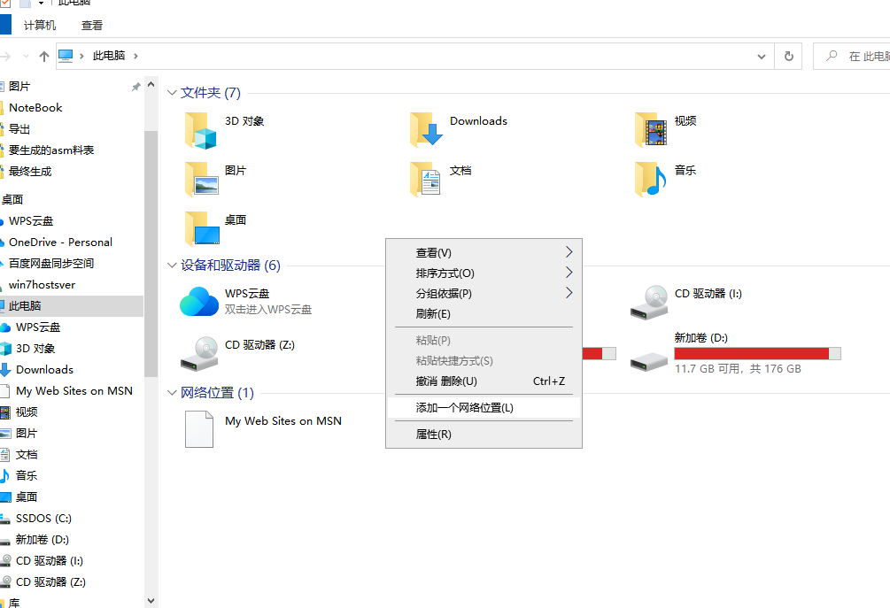
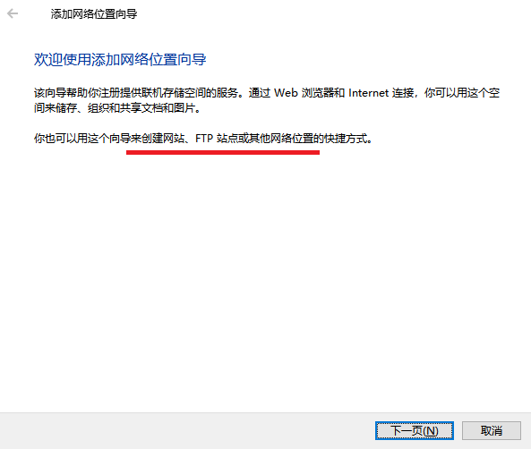
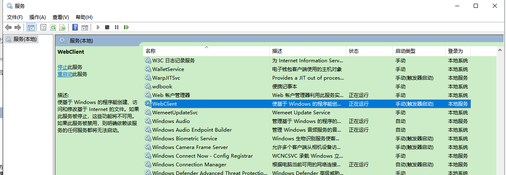
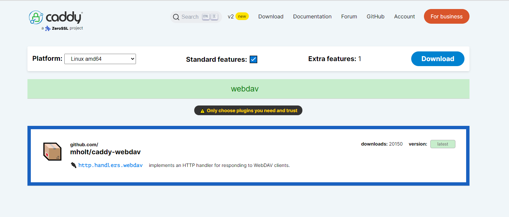

**SMB、FTP、WebDAV等文件管理存储协议介绍**

[toc]

SMB、FTP、NFS、DLNA、WebDAV等协议可以用于文件的管理、存储等，主要用于NAS（Network Attached Storage：网络附属存储）中。也就是，用于网络上的文件存储，因此，使用这些协议的存储，也可以称为网络存储器。这样，可以实现存储设备和电脑(服务器)的彻底分离，比如 NAS 可以集中管理数据，提高性能、降低成本，相对于直接连接的物理存储，效率要高的多。

通俗的解释，就是类似一个存储用的云盘服务，可以存放和访问文件、图片、视频等...

SMB/CIFS、WebDAV、FTP、NFS、DLNA 是 NAS 主要使用的五个协议。

# SMB/CIFS、Samba协议

SMB（Server Message Block）通信协议是微软和英特尔在1987年制定的协议，主要是作为Microsoft网络的通讯协议，它是当今世上网络文件系统协议两极之一的存在。

SMB使用NetBIOS接口实现网络访问，由于SMB是开放性协议，允许协议扩展，这使得它变得功能强大且复杂：大约有65个最上层的作业，而每个作业都超过120个函数，甚至Windows NT也没有全部支持到。

微软已将 SMB 改名为 CIFS（Common Internet File System），加入了许多新功能。

SMB协议是在局域网上用于服务器文件访问和打印的协议。

CIFS可以看做是应用层协议如文件传输协议和超文本传输协议的一个实现。

**Samba 是 SMB/CIFS（Server Message Block / Common Internet File System）网络协议的重新实现，可以在局域网不同计算机之间进行文件、打印机等资源共享，和 NFS 功能类似。**

> SMB 最早是微软为自己需求设计的专用协议，用来实现微软主机之间的文件共享与打印共享，并不支持在 Linux 上运行。
> 
> 著名黑客、技术大牛 Andrew Tridgell 通过逆向工程，在 Linux 上实现的 SMB / CIFS 兼容协议，命名为 Samba，通过该程序实现了 Windows 和 Linux 之间的文件共享。

**通过设置“NetBIOS over TCP/IP”，Samba 不但能与局域网络主机分享资源，还能与全世界的电脑分享资源。**

**SMB 的优点之一是兼容性好，在各平台获得了广泛支持，包括 Windows、Linux、macOS 等各系统挂载访问都很方便。另外 SMB 也是各种电视、电视盒子默认支持的协议，可以通过 SMB 远程播放电影、音乐和图片。**

另外 SMB 提供端到端加密、安全性高，配置选项丰富，支持 ACL 并支持多种用户认证模式。

SMB 的缺点是传输效率稍低，速度不太稳定，会有波动。

使用SMB协议，可以直接通过 我的电脑 进行“网络”挂载（映射网络驱动器）。

  

# WebDAV协议

 WebDAV （Web-based Distributed Authoring and Versioning） 一种基于HTTP 1.1协议的通信协议。它扩展	了HTTP 1.1，在GET、POST、HEAD等几个HTTP标准方法以外添加了一些新的方法，使应用程序可对 Web Server 直接读写，并支持写文件锁定(Locking)及解锁(Unlock)，支持文件的版本控制。

WebDAV 基于HTTP协议，在服务器上划出一块存储空间，可以使用用户名和密码来控制访问，让用户可以直接存储、下载、编辑文件。

WebDAV 可以配合客户端使用，比如RaiDrive、OneDrive等，也可以直接网络映射挂载。

WebDAV 允许客户端处理服务器上 WebDAV 发布目录中的资源。其操作具有以下优点:

1、具有正确权限的用户可以在 WebDAV目录中复制和移动文件。

2、修改与某些资源相关联的属性。例如，用户可写入并检索文件的属性信息。

3、锁定并解锁资源以便多个用户可同时读取一个文件。但每次只能有一个人修改文件。

4、搜索 WebDAV 目录中的文件的内容和属性。

在服务器上设置 WebDAV 发布目录与通过 Internet 信息服务管理单元设置虚拟目录一样简单。设置好发布目录后，具有适当权限的用户就可以向服务器发送文档，并处理目录中的文件。

由于 WebDAV 是基于 HTTP 的，所以具有 HTTP 的所有优点，包括容易穿越防火墙、使用 HTTPS 来传输数据，因此在很多方面可以替代 FTP。

WebDAV 可以通过 Nginx 或 Apache 等 Web 服务器部署。在客户端 WebDAV 也获得了许多软件的支持，比如 Office 就可通过 WebDAV 编辑远程文档。

# FTP/SFTP/SCP 协议

FTP（File Transfer Protocol，文件传输协议） 是 TCP/IP 协议组中的协议之一。FTP协议包括两个组成部分，其一为FTP服务器，其二为FTP客户端。

FTP服务器用来存储文件，用户可以使用FTP客户端通过FTP协议访问位于FTP服务器上的资源。在开发网站的时候，通常利用FTP协议把网页或程序传到Web服务器上。此外，由于FTP传输效率非常高，在网络上传输大的文件时，一般也采用该协议。

**由于 FTP 是明文传输安全性不高，后来又出现了 SFTP 和 FTPS 等加密传输**。FTP 的特点之一是独立于系统用户组，只要通讯端口开启就能方便访问，所以特别适合外网共享，一些老牌共享软件就常常通过 FTP 发布下载链接。

> SCP和SFTP是基于SSH的加密，但SFTP支持断点续传，SCP不支持。

FTP 主要用于客户端和服务器之间的文件上传和下载，并不适用于服务器上文件修改。因为 FTP 通常需要先获取远程文件的副本，然后对副本修改，最后再将修改后的文件副本上传服务器。

请注意，默认情况下FTP协议使用TCP端口中的 20 和 21 这两个端口，其中20用于传输数据，21用于传输控制信息。但是，是否使用20作为传输数据的端口与FTP使用的传输模式有关，如果采用主动模式，那么数据传输端口就是20；如果采用被动模式，则具体最终使用哪个端口要服务器端和客户端协商决定。

所以，在外网中使用FTP服务的时候注意最好将20,21端口开放，可以同时转发出去。此外，考虑安全性，可以使用其他端口作为FTP服务。

在“我的电脑”，直接右键，或右键点击空白位置，可以添加一个网络位置，网络位置的添加，支持SMB、WebDAV、FTP等。

  

  

# NFS协议

NFS 是 NetworkFileSystem 的简写，即网络文件系统，它是FreeBSD支持的文件系统中的一种。NFS允许一个系统在网络上与他人共享目录和文件。通过使用NFS，用户和程序可以像访问本地文件一样访问远端系统上的文件。

NFS 基于开放网络运算远程过程调用（ONC RPC）协议：一个开放、标准的 RFC 协议，任何人或组织都可以依据标准实现它。

NFS的优点如下：

1. 本地工作站使用更少的磁盘空间，因为通常的数据可以存放在一台机器上而且可以通过网络访问到。

2. 用户不必在每个网络上都有一个home目录。Home目录可以被放在NFS服务器上并且在网络上处处可用。

3. 诸如软驱，CDROM，和Zip之类的存储设备可以在网络上面被别的机器使用。这可以减少整个网络上的可移动介质设备的数量。

NFS至少有两个主要部分：一台服务器和一台（或者更多）客户机。客户机远程访问存放在服务器上的数据。为了正常工作，一些进程需要被配置为永久运行。

NFS协议相对在Linux环境中运行的较多（Unix 操作系统上，比如 Solaris、AIX 及 HP-UX 和其他类 Unix 操作系统，例如 Linux 及 FreeBSD），对于Windows中的使用，可以参考 http://www.mayanpeng.cn/archives/119.html。

NFS 的优点是内核直接支持，部署简单、运行稳定，协议简单、传输效率高。

NFS 的缺点是没有加密授权等功能，仅依靠 IP 地址或主机名来决定用户能否挂载共享目录，对具体目录和文件无法进行 ACL 权限控制（NFSv4 以前）。通常的做法是通过 Kerberos 对 NFS 进行认证及加密，不过部署配置比较麻烦。

# DLNA协议

DLNA（DIGITAL LIVING NETWORK ALLIANCE，数字生活网络联盟) 其前身是DHWG （Digital Home Working Group，数字家庭工作组），成立于2003年6月24 日，是由索尼、英特尔、微软等发起成立的一个非营利性的、合作性质的商业组织。

DLNA旨在解决个人PC、消费电器、移动设备在内的无线网络和有线网络的互联互通，使得数字媒体和内容服务的无限制的共享和增长成为可能。DLNA的口号是Enjoy your music, photos and videos, anywhere anytime。

DLNA并不是创造技术，而是形成一种解决的方案，一种大家可以遵守的规范。所以，其选择的各种技术和协议都是当前所应用很广泛的技术和协议。

DLNA将其整个应用规定成5个功能组件。从下到上依次为：网络互连，网络协议，媒体传输，设备的发现控制和管理，媒体格式。

2017年2月20日，DLNA在其官网宣布：本组织的使命已经完成，已于2017年1月5日正式解散，相关的认证将移交给SpireSpark公司，未来不会再更新DLNA标准。

> **总体来说smb协议的兼容性最好，windows/mac/linux均可支持，各个厂商的电视、盒子和各个手机端的播放器均支持smb协议传输，ftp和webdav原生支持的较少。**
>
> **但 smb协议 通常只用于局域网，像 Samba 要用于外网访问，可考虑设置`NetBIOS over TCP/IP`**
> 
> 对于外网共享和连接来说，相对推荐WebDAV。另外，Office 就可通过 WebDAV 编辑远程文档
>
> 在 Windows10/11 中，用于账号安全性的提升（默认禁用匿名访问、PIN账号、微软账号代替本地账号等），使得 Samba 访问并不理想，且有 Samba V1.0 和 V2.0 的支持设置。
> 
> FTP不适合修改文件，通常用于上传和下载。且 FTP 的速度并不友好。
>
> 

# WebDav协议 连接 OneDriver 和 Windows 挂载 WebDav 服务器

具体参见 [被抛弃的WebDAV，从未有过青春！](https://juejin.cn/post/6939309167974809614)

Windows下映射网络驱动器连接WebDav。

> 服务要开启WebClient，不过基本都会自动启动，不需要单独进入服务，执行启动操作
> 
>   

# WebDav 替代Samba

## WebDav

[WebDav 替代Samba](https://www.codenong.com/cs109545611/)介绍关于 Samba 的安全问题。

Samba 以及其监听的 445 端口容易被各种病毒入侵，所以因为安全原因，一般公司都会禁用 445 端口。并且，Windows 连接 samba 服务器只能使用默认的 445 端口，无法修改端口。

而 WebDav 由于基于HTTP协议，可以很好的更换端口、管理防火墙进出规则。

坚果云等很少的云盘提供了 WebDav 的连接。

> 挂载成本地的虚拟磁盘。

## linux下创建WebDav服务器

大部分 Web 服务器都支持创建 WebDav 服务，例如 Nginx、Apache 等。

Caddy 是 Go 语言编写的 开源的web服务器，并且自动适配HTTPs，提供有二进制可执行文件，方便安装使用。官方地址：https://caddyserver.com

下载时，记得选择 `caddy-webdav`（`http.handlers.webdav`）插件。

  

> 后续待进一步了解

# 参考

- [SMB、FTP、WebDAV协议，傻傻分不清？5000字教程，教你快速上手](https://post.smzdm.com/p/ar6k932q/)
- [NFS、FTP、SMB、WebDav、DLNA协议，傻傻分不清？](https://zhuanlan.zhihu.com/p/411161467)
- [科普又来了：Samba、Ftp、Upnp（DLNA）、NFS 如何选？](https://www.right.com.cn/FORUM/thread-382893-1-1.html)

另，对NAS介绍的文章，[入门NAS？一篇就够了](https://post.smzdm.com/p/a4wmxw98/)，整体还算不错，虽然内容有些碎...
