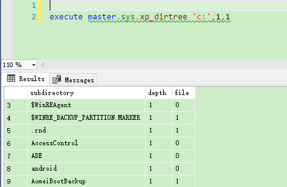

SQL Server从路径中提取文件名、目录，获取本地文件和文件夹

[toc]

# sys.xp_dirtree 获取本地路径

可以看到，第一个参数为要获取的路径，第二个为深度，第三个表示是否为`file`。

```sql
execute master.sys.xp_dirtree 'c:',1,1
```



# 获取路径中的文件名、文件夹

## 文件名

```sql
-- =============================================
-- Description:   Returns a filename with extension
--                from a full path:
--                    D:\Temp\Resources\Images\My.Picture.jpg
--                ==> My.Picture.jpg
-- =============================================
CREATE FUNCTION [dbo].[GetFileName]
(
    @Path NVARCHAR(MAX)
)
RETURNS NVARCHAR(MAX)
AS
BEGIN
    DECLARE @FileName NVARCHAR(MAX)

    SELECT @FileName = RIGHT(@Path, CHARINDEX('\', REVERSE(@Path))-1)
 
    RETURN @FileName
END
```

测试：

```sql
SELECT [dbo].[GetFileName]('D:\Temp\Resources\Images\My.Picture.jpg');
```

## 不带扩展名的文件名

```sql
-- =============================================
-- Description:   Returns a filename without extension
--                from a full path:
--                    D:\Temp\Resources\Images\My.Picture.jpg
--                ==> My.Picture
-- =============================================
CREATE OR ALTER FUNCTION [dbo].[GetFileNameWithoutExtension]
(
    @Path NVARCHAR(MAX)
)
RETURNS NVARCHAR(MAX)
AS
BEGIN
    DECLARE @FileName NVARCHAR(MAX)
    DECLARE @ExtLength INT
 
    SELECT @FileName = RIGHT(@Path, CHARINDEX('\', REVERSE(@Path))-1)
    SELECT @FileName = LEFT(@FileName, LEN(@FileName) - CHARINDEX('.', REVERSE(@FileName)))
    RETURN @FileName
END
```

测试：

```sql
SELECT dbo.GetFileNameWithoutExtension('D:\Temp\Resources\Images\My.Picture.jpg');
```

## 根据文件路径获取目录（无文件名）

```sql

-- =============================================
-- Description:   Returns the path without the file name
--                from a full path:
--                    D:\Temp\Resources\Images\My.Picture.jpg
--                ==> D:\Temp\Resources\Images
-- =============================================
CREATE OR ALTER FUNCTION [dbo].[GetDirectoryPath]
(
    @Path NVARCHAR(MAX)
)
RETURNS NVARCHAR(MAX)
AS
BEGIN
    DECLARE @FileName NVARCHAR(MAX)
    DECLARE @FileLength INT
 
    SELECT @FileLength = CHARINDEX('\', REVERSE(@Path))
    SELECT @FileName = LEFT(@Path, LEN(@Path) - @FileLength)
    RETURN @FileName
END
```

测试

```sql
SELECT dbo.[GetDirectoryPath]('D:\Temp\Resources\Images\My.Picture.jpg');
```

## 获取文件扩展名

```sql
-- =============================================
-- Description:   Returns the extension only
--                from a full path:
--                    D:\Temp\Resources\Images\My.Picture.jpg
--                ==> jpg
-- =============================================
CREATE OR ALTER FUNCTION [dbo].[GetFileExtension]
(
    @Path NVARCHAR(MAX)
)
RETURNS NVARCHAR(MAX)
AS
BEGIN
    DECLARE @FileName NVARCHAR(MAX)
    DECLARE @ExtLength INT

    SET @FileName = ''
    SELECT @ExtLength = CHARINDEX('.', REVERSE(@Path))
    IF (@ExtLength > 0)
    BEGIN
       SELECT @FileName = RIGHT(@Path, @ExtLength - 1)
    END
    RETURN @FileName
END
```

测试：

```sql
SELECT dbo.[GetFileExtension]('D:\Temp\Resources\Images\My.Picture.jpg');
```

# 附：CHARINDEX 返回的是基于1的字符首次出现的位置

参见 [CHARINDEX (Transact-SQL)](https://learn.microsoft.com/en-us/sql/t-sql/functions/charindex-transact-sql)

```sql
CHARINDEX ( expressionToFind , expressionToSearch [ , start_location ] )   
```

returning the `starting position` of the first expression if found.

The `starting position` returned is 1-based, not 0-based.

**未找到返回0。**

# 附：添加是否是路径的判断

为了增加安全性，还可以考虑判断路径中，是否包含`\`，不包含则说明不是正确路径。则不进行路径、文件名等的获取操作

```sql
CREATE OR ALTER FUNCTION dbo.IsPath (@FullName VARCHAR(500))
returns BIT
AS
  BEGIN
      DECLARE @result BIT
      IF Charindex('\', @FullName) = 0
        SET @result=0
      ELSE
        SET @result=1

      RETURN @result
  END 
```

比如，修改`GetFileName`函数，增加判断：

```sql
CREATE OR ALTER FUNCTION [dbo].[GetFileName]
(
    @Path NVARCHAR(MAX)
)
RETURNS NVARCHAR(MAX)
AS
BEGIN
    DECLARE @FileName NVARCHAR(MAX)

    IF ( dbo.IsPath(@Path) = 1 )
        SELECT @FileName = RIGHT(@Path, CHARINDEX('\', REVERSE(@Path))-1)
 
    RETURN @FileName
END
```

# 参考

[在 SQL Server 中从完整路径提取文件名(sql 玩转文件路径)](https://blog.csdn.net/angle_greensky110/article/details/46828671)