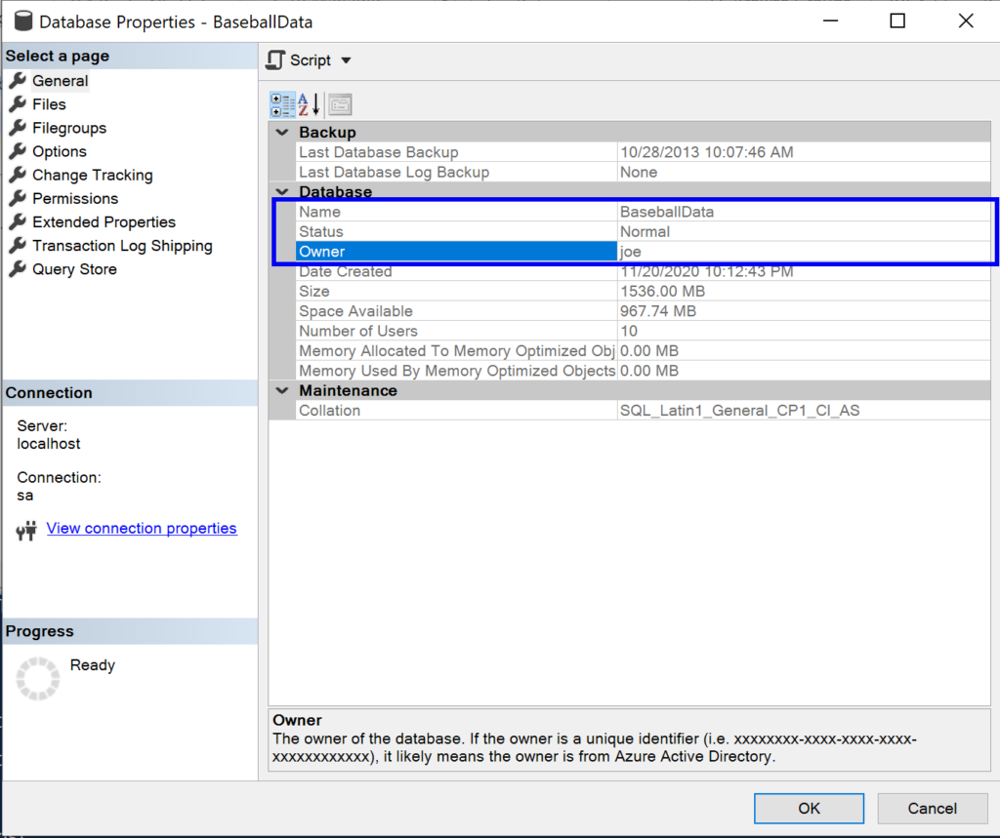
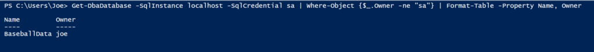
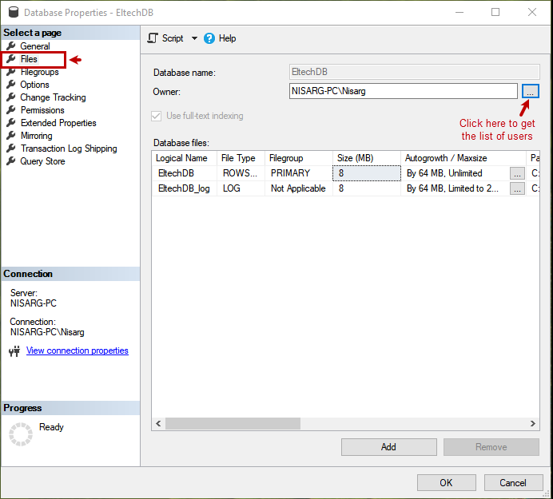

**SQL Server查找和修改数据库owner用户的方法**

[toc]

> 默认，创建数据库 或 附加数据库 的用户，就是数据库的owner。

在 SQL Server 中，当创建数据库时，当前用户会作为数据库的owner用户。

owner用户可以修改配置参数、执行维护、授予当前数据库的权限给其他用户、甚至完全删除数据库等。

在高度安全的环境中（任何环境都应该确保安全），所有这些权限都会给审计员、首席信息安全官、甚至DBA带来麻烦。

> In highly secure environments (and what environment shouldn’t be classified as highly secure these days?) all of these permissions can create headaches for auditors, CISOs, and even DBAs.

# 查找数据库的所有者

## SSMS 或 ADS 中查看所有者

通过数据库的属性可以查看数据库的owner所有者。

在 SQL Server Management Studio (SSMS) 或 Azure Data Studio (ADS) 中，右键数据库选择属性。在属性页中就能看到所有者：



## T-SQL 查找数据库的所有者

- 查看SQL Server实例中每个DB的所有者。

```sql
 SELECT name, 
        suser_sname( owner_sid ) AS DBOwnerName
 FROM master.sys.databases;
```

- 非 sa 用户所有者的数据库

```sql
 SELECT name, 
        suser_sname( owner_sid ) AS DBOwnerName
 FROM master.sys.databases
 WHERE suser_sname( owner_sid ) != 'sa';
```

- 查看指定数据库的所有者

```sql
 SELECT suser_sname( owner_sid ) AS DBOwnerName
 FROM master.sys.databases
 WHERE name = 'db_name';
```

- 查看数据库的所有者：

```sql
SELECT suser_sname(owner_sid) FROM master.sys.databases WHERE name = @dbName;
```

- 结合`sys.sql_logins`查看所有者的名称：

```sql
SELECT d.name, d.owner_sid, sl.name
FROM sys.databases AS d
JOIN sys.sql_logins AS sl
ON d.owner_sid = sl.sid;
```

- 结合`sys.server_principals`查看所有者的名称：

```sql
select db.name as [Database Name],sp.name [SQL Login Name] from sys.databases db left join sys.server_principals sp on db.owner_sid=sp.sid
where db.name='<db_name>'
```

```sql
select db.name as [Database Name],sp.name [SQL Login Name] from sys.databases db left join sys.server_principals sp on db.owner_sid=sp.sid
where database_id>5
```

## PowerShell 和 `dbatools.io` 查看数据库的owner用户

`Get-DbaDatabase` 命令。

下面的代码通过传递结果给`Where-Object`，实现仅显示不为`sa`所有的数据库。并传递结果到`Format-Table`，使结果更易阅读。

```sh
Get-DbaDatabase -SqlInstance localhost -SqlCredential sa | Where-Object {$_.Owner -ne "sa"} | Format-Table -Property Name, Owner 
```




# 修改数据库的所有者 owner 用户

## SSMS 或 ADS 的属性中

最简单的还是在SSMS的属性中，重新选择Owner用户。



## ALTER AUTHORIZATION 【推荐】

`ALTER AUTHORIZATION`命令可以实现修改所有者。

语法为：`ALTER AUTHORIZATION ON DATABASE::<db_name> TO user;`

比如：

```sql
ALTER AUTHORIZATION ON DATABASE::AdventureWorks2014 TO sa;
```


## sp_changedbowner 【不推荐】

`sp_changedbowner` 存储过程。

之前版本使用的改变`owner`的方式，不过已经不推荐使用。将来的版本会被废弃，有可能无法使用（目前都还有效）。

使用方式如下：

```sql
USE [AdventureWorks2014]
GO
EXEC dbo.sp_changedbowner @loginame = N'sa'
GO
```

## 使用 PowerShell 和 `dbatools.io` 更改 owner

`dbatools.io` 的 [Set-DbaDbOwner](https://docs.dbatools.io/#Set-DbaDbOwner) 命令可以修改owner。

比如，设置数据库`BaseballData`的所有者为sa：

```sh
Set-DbaDbOwner -SqlInstance localhost -SqlCredential sa -Database BaseballData
```

- TargetLogin 参数

```sh
Set-DbaDbOwner -SqlInstance localhost -SqlCredential sa -Database BaseballData -TargetLogin disabled_login_with_complex_pwd
```

- 设置实例上的所有数据库为sa

```sh
Set-DbaDbOwner -SqlInstance localhost -SqlCredential sa 
```

# 处理owner角色 `db_owner`

```sql
ALTER ROLE db_owner ADD MEMBER my_dbogroup_user;
```

查看当前用户，是否是 `db_owner` 的角色：

```sql
SELECT IS_MEMBER ('db_owner');
```

> 推荐官方的这篇 [ALTER AUTHORIZATION (Transact-SQL) #best-practice](https://learn.microsoft.com/en-us/sql/t-sql/statements/alter-authorization-transact-sql?view=sql-server-ver16#best-practice)

# 参考

- [How to Change Owner of Database in SQL SERVER? – Interview Question of the Week #117](https://blog.sqlauthority.com/2017/04/09/change-owner-database-sql-server-interview-question-week-116/)

- [Who’s the SQL Server Database Owner and How Can You Change It?](https://theserogroup.com/sql-server/whos-the-sql-server-database-owner-and-how-can-you-change-it/)

- [Different ways to change database owners in SQL Server](https://www.sqlshack.com/different-ways-to-change-database-owners-in-sql-server/)