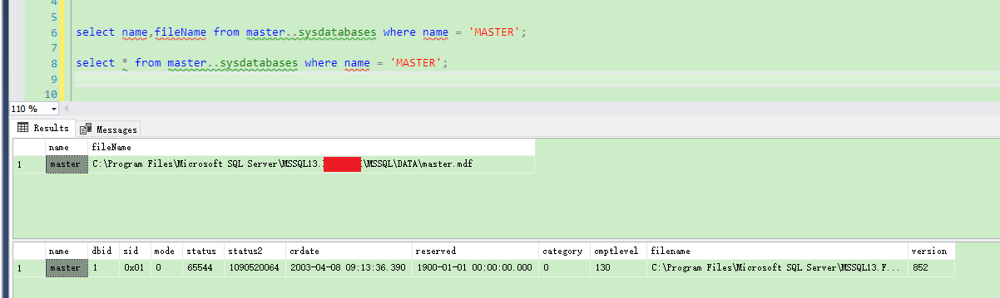
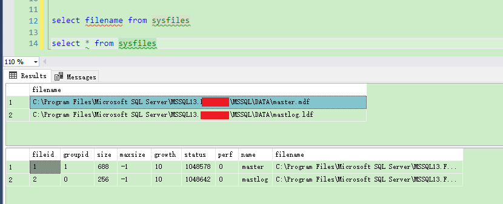
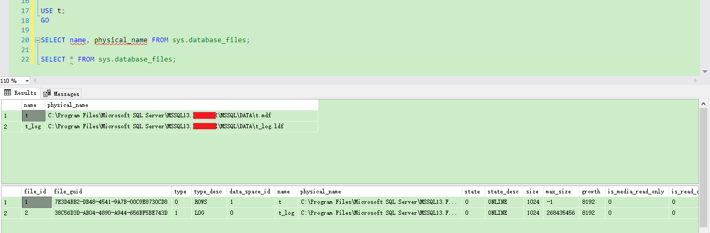

**SQL Server获取数据库的物理路径、数据库默认保存位置**

[toc]

> 直接使用 `CREATE TABLE db_name;` 命令，就可以在SQL Server默认的数据库路径下创建数据库文件。即 创建数据库时不指定路径，会在默认的文件夹下创建。

# 获取数据库的物理路径

## 系统视图 sys.master_files

```sql
SELECT name,physical_name FROM sys.master_files WHERE NAME='db_name';
```

如下，查看 master 数据库的文件名：

```sql
SELECT name,physical_name FROM sys.master_files WHERE NAME='MASTER';
```


查看当前所有数据库的路径：`SELECT name,physical_name FROM sys.master_files;`

```sql
SELECT NAME,
   physical_Name,
   database_id,
   FILE_ID,
   type_desc,
   state_desc,
   SIZE * 8 / 1024 AS SizeMB
FROM   sys.master_files
```

## 系统表 master..sysdatabases

```sql
select name,fileName from master..sysdatabases where name = 'db_name';
```

查看 master 数据库的文件名：

```sql
select name,fileName from master..sysdatabases where name = 'MASTER';
```




# 获取数据库所有文件的路径

上面可以看到，获取的是 .mdf 数据文件的路径。想要获取包括 .ldf 在内的所有路径，可以使用`sysfiles` 或 `sys.database_files`，**获取当前连接使用的数据库的文件信息**。

## sysfiles

```sql
select filename from sysfiles

select * from sysfiles
```




```sql
USE db_name;
select filename from sysfiles
```

## sys.database_files

```sql
SELECT name, physical_name FROM sys.database_files;

SELECT * FROM sys.database_files;
```



# 直接 获取数据库数据文件和日志文件默认的保存位置

> 之所以说“直接获取”，是因为可以从前面的 master 数据库位置，提取出默认位置。虽然不严谨，因为有可能安装完
SQL Server后修改默认位置。

通过 `InstanceDefaultDataPath`、`InstanceDefaultLogPath` 服务器属性获取。

```sql
SELECT
  SERVERPROPERTY('InstanceDefaultDataPath') AS 'Data Files',
  SERVERPROPERTY('InstanceDefaultLogPath') AS 'Log Files';
```


# 参考

- [How to Find the Default File Location for Data Files and Log Files in SQL Server](https://database.guide/how-to-find-the-default-file-location-for-data-files-and-log-files-in-sql-server/)

- [How to Find the Location of Data Files and Log Files in SQL Server](https://database.guide/how-to-find-the-location-of-data-files-and-log-files-in-sql-server/)