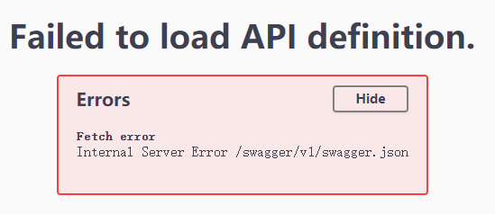

**Swagger报错 Failed to load API definition Internal Server Error /swagger/v1/swagger.json**

通常的原因是 Action 方法的路由设置不正确或没有设置导致。

比如：

1. 没写HTTP方法，如 [HttpGet]、[HttpPost] ，在方法上添加上即可。
2. HTTP方法中的模板路由不正确或与实际的Action不匹配，配置正确或删除多余的路由信息。比如，`[HttpGet("[action]/{Info}")]`，若Action方法没有对应的Info，就需要把多余的删除。
3. 将一些原本应该是私有的方法，写为了public导致的。控制器内的公共方法是作为接口提供的，如果为public则必须指定HTTP方法，没有则要改为私有方法。

无需暴露的方法都设置为私有，考虑在Controller级别设置`[Route("api/[controller]/[action]")]`。

4. 生成的XML文件没有使用相对地址。注意：默认使用的是绝对地址，源码位置一有变化就会出问题。

5. XML文件需设置为“始终复制”

参考 [解决 Internal Server Error /swagger/v1/swagger.json](https://www.cnblogs.com/suterfo/p/13559769.html)