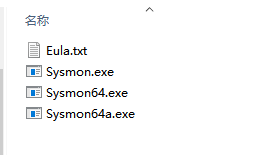
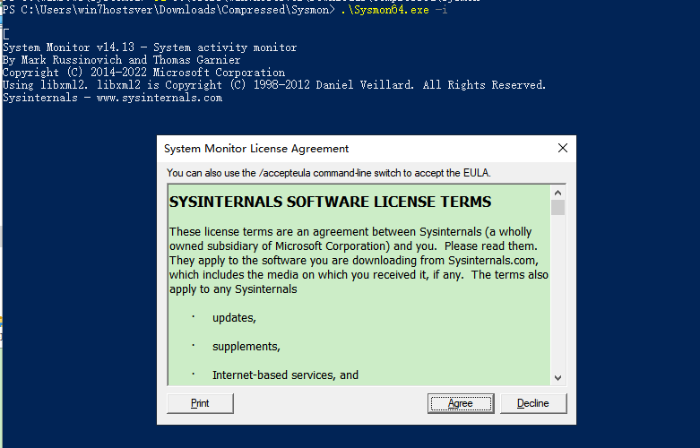
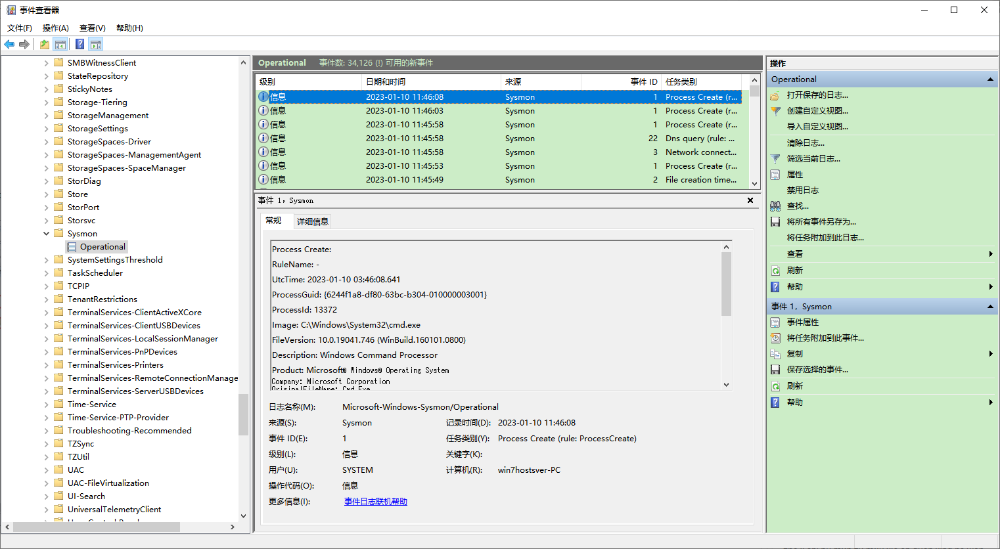

**Sysinternals中的系统监视器Sysmon**

[toc]

System Monitor (Sysmon) 是Windows系统服务和设备驱动程序，安装后会驻留在系统重新引导中，监视系统活动，并log记录到Windows事件日志中。它可以提供进程创建、网络连接和文件创建时间更改的详细信息，可以通过 Windows Event Collection 或 SIEM代理 收集其生成的事件，并分析它们，从而识别恶意或异常活动，了解入侵者和恶意软件的行为。

Sysmon 仅提供相关的事件，并不会对事件进行分析，也不会尝试保护或隐藏自己免受攻击者的侵害。

Sysmon 相当于对原生 Windows 日志记录功能的补充，可以两者结合参考使用。

目前最新版本为 Sysmon v14.13，官方下载地址和介绍：[Sysmon](https://learn.microsoft.com/en-us/sysinternals/downloads/sysmon)

# 安装

直接从上面的官方地址下载，解压后可以看到四个文件：

  

通常安装 Sysmon64.exe 即可，以管理员身份运行Powershell，执行安装 `.\Sysmon64.exe -i`

  

> 卸载 `sysmon64.exe -u`

# 更新 Sysmon 配置

参考 https://github.com/SwiftOnSecurity/sysmon-config 中 sysmonconfig-export.xml 的配置

下载该配置文件后，放在 `Sysmon64.exe` 同级目录下，使用参数 `-c` 指定该配置文件，更新 Sysmon 

```C#
PS C:\Users\win7hostsver\Downloads\Compressed\Sysmon> .\Sysmon64.exe -c sysmonconfig-export.xml


System Monitor v14.13 - System activity monitor
By Mark Russinovich and Thomas Garnier
Copyright (C) 2014-2022 Microsoft Corporation
Using libxml2. libxml2 is Copyright (C) 1998-2012 Daniel Veillard. All Rights Reserved.
Sysinternals - www.sysinternals.com

Loading configuration file with schema version 4.50
Sysmon schema version: 4.83
Configuration file validated.
Configuration updated.

PS C:\Users\win7hostsver\Downloads\Compressed\Sysmon>
```

# sysmon 事件

打开 Windows 事件查看器 —— 应用程序和服务日志 —— Microsoft —— windows —— sysmon （`Applications and Services Logs/Microsoft/Windows/Sysmon/Operational`，Vista之前的版本日志记录在System事件日志中）

> `win + r` 运行 `eventvwr.msc` 打开事件查看器。

比如下面，一个事件示例：

  

Sysmon生成的事件类型如下：

- Event ID 1: Process creation

进程创建事件提供关于新创建的进程的额外信息。Sysmon完整的命令行提供进程执行的上下文。`ProcessGUID`字段是整个域中的唯一值，可以简化事件关联。哈希是使用`HashType`字段中的算法计算的文件的完整哈希。

- Event ID 2: A process changed a file creation time

当一个文件创建时间被一个进程显式地修改，更改文件创建时间事件会被注册。该事件用于帮助跟踪文件真实的创建时间。

攻击者可能会更改后门文件的创建时间，使其看起来像和系统一起安装的。注意，许多进程可以合法地修改文件的创建时间，这不一定表示恶意行为。

- Event ID 3: Network connection

网络连接事件记录机器上的 TCP/UDP 连接。该事件默认是禁用的。每一个连接可以通过 `ProcessId` 和 `ProcessGuid` 与进程关联。该事件也包含源和目标主机名称的IP地址、端口号和IPv6状态。

- Event ID 4: Sysmon service state changed

服务状态改变事件报告Sysmon服务的状态（启动或停止）

- Event ID 5: Process terminated

进程终止时，进程终止事件会报告。它提供进程的 UtcTime、ProcessGuid 和 ProcessId。

- Event ID 6: Driver loaded

驱动加载事件提供系统中正在加载的驱动程序的信息。提供配置的哈希以及签名信息。出于性能原因，会异步创建签名，并指示加载后是否删除了文件。

- Event ID 7: Image loaded

当一个模块加载进一个指定进程时，映像加载事件会记录下来。该事件默认禁用，并且需要使用`-l`选项配置。它指示加载模块的进程、哈希和签名信息。出于性能原因，会异步创建签名，并指示加载后是否删除了文件。

配置此事件应该要小心，因为监视所有的映像加载事件会生成大量日志。

- Event ID 8: CreateRemoteThread

当一个进程在另一个进程创建线程时，会生成`CreateRemoteThread`事件。恶意软件使用此技术注入代码并隐藏在其他进程中。该事件指示源进程和目标进程，它提供了将在新线程中运行的代码的信息：`StartAddress`、`StartModule` 和 `StartFunction`。注意，`StartModule` 和 `StartFunction`字段是推断的，如果开始地址在加载的模块或已知导出的函数之外，它们可能为空。

- Event ID 9: RawAccessRead

`RawAccessRead`事件检测进程何时使用`\\.\`从驱动器执行读取操作。恶意软件经常使用此技术用于锁定文件的数据泄露读取，以及避免文件访问审核工具。该事件指示源进程和目标设备。

- Event ID 10: ProcessAccess

当一个进程打开另一个进程时，进程访问事件会报告，通常，该操作后跟信息查询或读取和写入目标进程的地址空间。这样可以检测读取进程的内存内容一类的黑客工具，比如本地安全机构 （`Local Security Authority` —— Lsass.exe），以便窃取用于哈希传递攻击(`Pass-the-Hash attack`)的凭据。如果存在重复打开进程以查询其状态的活动诊断实用程序，则启用它会生成大量日志记录，因此，通常应仅使用移除预期访问的筛选器执行此操作。

- Event ID 11: FileCreate

当文件被创建或覆盖时，文件创建操作会被记录。此事件对于监视自动启动位置（如 Startup文件夹）以及临时目录和下载目录非常有用，这些目录是恶意软件在初始感染期间进入的常见位置。

- Event ID 12: RegistryEvent (Object create and delete)

注册表项和值的创建和删除操作会映射到此事件类型，这对于监视注册表自动启动位置，或特定的恶意软件注册表的修改非常有用。

Sysmon 使用注册表根目录键名的缩写版本，具体参见以下映射：

| Key name | Abbreviation |
| --- | --- |
| `HKEY_LOCAL_MACHINE` | `HKLM` |
| `HKEY_USERS` | `HKU` |
| `HKEY_LOCAL_MACHINE\System\ControlSet00x` | `HKLM\System\CurrentControlSet` |
| `HKEY_LOCAL_MACHINE\Classes` | `HKCR` |

- Event ID 13: RegistryEvent (Value Set)

该注册表事件类型指示注册表值的修改。该事件记录写入 `DWORD` 和 `QWORD` 类型的注册表值。

- Event ID 14: RegistryEvent (Key and Value Rename)

注册表键和值重命名操作将映射到该事件类型，记录重命名的key或value的新名字。

- Event ID 15: FileCreateStreamHash

当创建命名文件流时，会记录此事件，并生成记录 被分配流（未命名流）的文件内容哈希 以及 命名流内容 的事件。有些恶意软件变种通过浏览器下载删除其可执行文件或配置设置，此事件旨在捕获 基于浏览器中的附加 `Zone.Identifier` 标记的web流。

- Event ID 16: ServiceConfigurationChange

该事件记录Sysmon配置的更改，比如过滤规则的更新。

- Event ID 17: PipeEvent (Pipe Created)

当命名管道被创建时，该事件会生成。恶意软件经常使用命名管道进行进程间通信。

- Event ID 18: PipeEvent (Pipe Connected)

当客户端和服务器之间的命名管道连接创建时，该事件会记录。

- Event ID 19: WmiEvent (WmiEventFilter activity detected)

当 WMI 事件筛选器（恶意软件用来执行的方法）注册时，此事件会记录 WMI 命名空间、筛选器名称和筛选器表达式。

- Event ID 20: WmiEvent (WmiEventConsumer activity detected)

该事件记录 WMI 使用者的注册，包括使用者名称、日志和目标

- Event ID 21: WmiEvent (WmiEventConsumerToFilter activity detected)

当使用者绑定到过滤器，该事件记录使用者名称和过滤路径

- Event ID 22: DNSEvent (DNS query)

当一个进程执行DNS查询时会生成该事件，不管DNS查询的结果是失败还是成功、是否缓存。该技术在 Windows 8.1 中被加入，因此win7及之前版本不可用

- Event ID 23: FileDelete (File Delete archived)

文件被删除会记录该事件，此外，被删除的文件还会保存在`ArchiveDirectory`(默认为`C:\Sysmon`)。在正常操作条件下，此目录可能会增长到不合理的大小 - 请参阅事件 ID 26：`FileDeleteDetection` 了解与之类似的行为，但不保存已删除的文件。

- Event ID 24: ClipboardChange (New content in the clipboard)

系统剪切板内容更改时生成该事件。

- Event ID 25: ProcessTampering (Process image change)

当检测到“hollow”或“herpaderp”等进程隐藏技术时，将生成此事件。

- Event ID 26: FileDeleteDetected (File Delete logged)

文件被删除

- Event ID 27: FileBlockExecutable

当 Sysmon 检测到并阻止创建可执行文件时，将生成此事件。

- Event ID 28: FileBlockShredding

当 Sysmon 检测到并阻止来自 SDelete 等工具的文件粉碎时，将生成此事件。

- Event ID 255: Error

当 Sysmon 内部发生错误时生成该事件。如果系统负载严重并且某个任务不能执行，或者Sysmon服务存在bug，或者不满足某些安全性和完整性条件 等，都会产生错误。你可以在 Sysinternals 论坛或 Twitter ([@markrussinovich](https://twitter.com/markrussinovich) 上报告任何相关错误。

# 配置文件等

Sysmon 可以通过 `-i` 或 `-c` 指定配置文件，进行指定设置的安装或更新。

更多介绍参见下面的官方文档。


# 日志导出

如果想要将日志信息导出，则可按照以下流程进行。

首先，下载[大佬的脚本](https://links.jianshu.com/go?to=https%3A%2F%2Fraw.githubusercontent.com%2FOTRF%2FSecurity-Datasets%2Fmaster%2Fscripts%2Fdata-collectors%2FExport-WinEvents.ps1)

然后打开`powershell`，运行命令导入脚本：

```css
Import-Module .\Export-WinEvents.ps1
```

其中，空格后面的部分为要引入的脚本路径（本句表示脚本在当前目录下），注意此处为反斜杠表示分隔符

然后，运行命令清空当前的`sysmon`日志：

```css
@('Microsoft-Windows-Sysmon/Operational') | Clear-WinEvents
```

最后，运行命令导出日志：

```bash
$FromDate = get-date;
@('Microsoft-Windows-Sysmon/Operational') | Export-WinEvents -EndDate $FromDate -OutputPath "SecurityDataset_$(get-date -format yyyy-MM-ddTHHmmssff).json" -Verbose
```

其中，`@()`内的代表日志的类型，可以为多个；而`-OutputPath`后引号内的参数为导出的日志文件的路径和名称

# 参考

- [Sysmon](https://learn.microsoft.com/en-us/sysinternals/downloads/sysmon) 
- [sysmon安装配置及其使用](https://www.jianshu.com/p/43bf5aadfd28)

另，推荐参考 

[关于sysmon的基本使用(1)](https://blog.csdn.net/qq_34367997/article/details/94749805) 配置和参数介绍。

[系统监视器(Sysmon)工具的使用](https://blog.51cto.com/u_14153008/2765715) 介绍的影子账户。