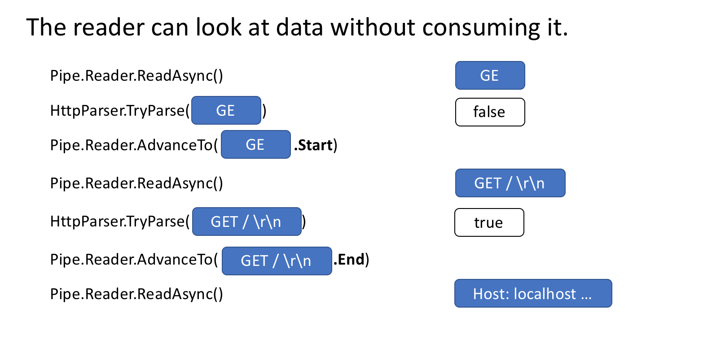
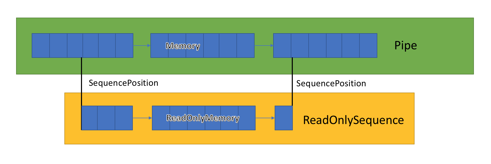

**System.IO.Pipelines: .NET中的高性能IO**

[toc]

> 基本参考自 [System.IO.Pipelines: .NET高性能IO](https://zhuanlan.zhihu.com/p/39453491)，对翻译感觉不好的地方进行了修改。
>
> 原文为 [System.IO.Pipelines: High performance IO in .NET](https://devblogs.microsoft.com/dotnet/system-io-pipelines-high-performance-io-in-net/)

> 本篇的介绍是基于 ASP.NET Core 2.1 的，实际上就是官方示例的介绍，如果想了解更深入或更新版本的使用和介绍，可以参考官网文档 [System.IO.Pipelines in .NET](https://learn.microsoft.com/en-us/dotnet/standard/io/pipelines)，基本没有出入。

[System.IO.Pipelines](https://www.nuget.org/packages/System.IO.Pipelines/) 是一个新的库，旨在简化 .NET 中高性能IO的执行。它是一个依赖.NET Standard的库，**适用于所有.NET实现**。

Pipelines诞生于.NET Core团队，为使Kestrel成为[业界最快的Web服务器](https://www.techempower.com/benchmarks/#section=data-r16&hw=ph&test=plaintext)之一。最初从作为 Kestrel 内部的实现细节发展成为可重用的API，它在 .Net Core 2.1 中作为可用于所有 .NET 开发人员的最高级 BCL API（System.IO.Pipelines）提供。

# 它解决了什么问题？

为了正确解析 Stream 或 Socket 中的数据，代码有固定的样板，并且有许多极端情况，为了处理他们，不得不编写难以维护的复杂代码。

实现高性能和正确性，同时就难以处理这种复杂性。Pipelines 旨在解决这种复杂性。

# 有多复杂？

让我们从一个简单的问题开始吧。我们想编写一个TCP服务器，它接收来自客户端的用行分隔的消息（由`\n`分隔）。（译者注：即一行为一条消息）

# 使用 NetworkStream 的 TCP 服务器

> 声明：与所有对性能敏感的工作一样，应在应用程序中测量每个方案的实际情况。根据您的网络应用程序需要处理的规模，可能不需要在乎各种技术的开销。

在 Pipelines 之前用.NET编写的典型代码如下所示：

```C#
async Task ProcessLinesAsync(NetworkStream stream)
{
    var buffer = new byte[1024];
    await stream.ReadAsync(buffer, 0, buffer.Length);

    // 在buffer中处理一行消息
    ProcessLine(buffer);
}
```

此代码可能在本地测试时正确工作，但它有几个潜在错误：

- 一次`ReadAsync`调用可能没有收到整个消息（行尾）。
- 它忽略了`stream.ReadAsync()`返回值中实际填充到`buffer`中的数据量。（译者注：即不一定将`buffer`填充满）
- 一次`ReadAsync`调用不能处理多条消息。


这些是读取流数据时常见的一些缺陷。为了解决这个问题，我们需要做一些改变：

- 我们需要缓冲传入的数据，直到找到新的行。
- 我们需要解析缓冲区中返回的所有行

```C#
async Task ProcessLinesAsync(NetworkStream stream)
{
    var buffer = new byte[1024];
    var bytesBuffered = 0;
    var bytesConsumed = 0;

    while (true)
    {
        var bytesRead = await stream.ReadAsync(buffer, bytesBuffered, buffer.Length - bytesBuffered);
        if (bytesRead == 0)
        {
            // EOF 已经到末尾
            break;
        }
        // 跟踪已缓冲的字节数
        bytesBuffered += bytesRead;

        var linePosition = -1;

        do
        {
            // 在缓冲数据中查找找一个行末尾
            linePosition = Array.IndexOf(buffer, (byte)'\n', bytesConsumed, bytesBuffered - bytesConsumed);

            if (linePosition >= 0)
            {
                // 根据偏移量计算一行的长度
                var lineLength = linePosition - bytesConsumed;

                // 处理这一行
                ProcessLine(buffer, bytesConsumed, lineLength);

                // 移动bytesConsumed为了跳过我们已经处理掉的行 (包括\n)
                bytesConsumed += lineLength + 1;
            }
        }
        while (linePosition >= 0);
    }
}
```

这一次，这可能适用于本地开发，但一行可能大于1KiB（1024字节）。我们需要调整输入缓冲区的大小，直到找到新行。

因此，我们可以在堆上分配缓冲区去处理更长的一行。我们从客户端解析较长的一行时，可以通过使用ArrayPool<byte>避免重复分配缓冲区来改进这一点。

```C#
async Task ProcessLinesAsync(NetworkStream stream)
{
    byte[] buffer = ArrayPool<byte>.Shared.Rent(1024);
    var bytesBuffered = 0;
    var bytesConsumed = 0;

    while (true)
    {
        // 在buffer中计算中剩余的字节数
        var bytesRemaining = buffer.Length - bytesBuffered;

        if (bytesRemaining == 0)
        {
            // 将buffer size翻倍 并且将之前缓冲的数据复制到新的缓冲区
            var newBuffer = ArrayPool<byte>.Shared.Rent(buffer.Length * 2);
            Buffer.BlockCopy(buffer, 0, newBuffer, 0, buffer.Length);
            // 将旧的buffer丢回池中
            ArrayPool<byte>.Shared.Return(buffer);
            buffer = newBuffer;
            bytesRemaining = buffer.Length - bytesBuffered;
        }

        var bytesRead = await stream.ReadAsync(buffer, bytesBuffered, bytesRemaining);
        if (bytesRead == 0)
        {
            // EOF 末尾
            break;
        }

        // 跟踪已缓冲的字节数
        bytesBuffered += bytesRead;

        do
        {
            // 在缓冲数据中查找找一个行末尾
            linePosition = Array.IndexOf(buffer, (byte)'\n', bytesConsumed, bytesBuffered - bytesConsumed);

            if (linePosition >= 0)
            {
                // 根据偏移量计算一行的长度
                var lineLength = linePosition - bytesConsumed;

                // 处理这一行
                ProcessLine(buffer, bytesConsumed, lineLength);

                // 移动bytesConsumed为了跳过我们已经处理掉的行 (包括\n)
                bytesConsumed += lineLength + 1;
            }
        }
        while (linePosition >= 0);
    }
}
```

这段代码有效，但此处通过重新调整缓冲区大小，会产生更多的缓冲区副本。这将使用更多内存，因为根据代码逻辑，在处理完一行后没有收缩缓冲区的大小。为避免这种情况，我们可以存储一组缓冲区序列，而不是每次超过1KiB大小时调整大小。

此外，我们在 1KiB的 缓冲区 完全为空 之前，没有增加它的大小。这意味着我们最终传递给`ReadAsync`越来越小的缓冲区，这将导致对操作系统的更多的调用。

为了缓解这种情况，我们将在现有缓冲区中剩余少于512个字节时分配一个新缓冲区：

> 译者注：这段代码太复杂了，懒得翻译注释了，大家将就看吧

```C#
public class BufferSegment
{
    public byte[] Buffer { get; set; }
    public int Count { get; set; }

    public int Remaining => Buffer.Length - Count;
}

async Task ProcessLinesAsync(NetworkStream stream)
{
    const int minimumBufferSize = 512;

    var segments = new List<BufferSegment>();
    var bytesConsumed = 0;
    var bytesConsumedBufferIndex = 0;
    var segment = new BufferSegment { Buffer = ArrayPool<byte>.Shared.Rent(1024) };

    segments.Add(segment);

    while (true)
    {
        // Calculate the amount of bytes remaining in the buffer
        if (segment.Remaining < minimumBufferSize)
        {
            // Allocate a new segment
            segment = new BufferSegment { Buffer = ArrayPool<byte>.Shared.Rent(1024) };
            segments.Add(segment);
        }

        var bytesRead = await stream.ReadAsync(segment.Buffer, segment.Count, segment.Remaining);
        if (bytesRead == 0)
        {
            break;
        }

        // Keep track of the amount of buffered bytes
        segment.Count += bytesRead;

        while (true)
        {
            // Look for a EOL in the list of segments
            var (segmentIndex, segmentOffset) = IndexOf(segments, (byte)'\n', bytesConsumedBufferIndex, bytesConsumed);

            if (segmentIndex >= 0)
            {
                // Process the line
                ProcessLine(segments, segmentIndex, segmentOffset);

                bytesConsumedBufferIndex = segmentOffset;
                bytesConsumed = segmentOffset + 1;
            }
            else
            {
                break;
            }
        }

        // Drop fully consumed segments from the list so we don't look at them again
        for (var i = bytesConsumedBufferIndex; i >= 0; --i)
        {
            var consumedSegment = segments[i];
            // Return all segments unless this is the current segment
            if (consumedSegment != segment)
            {
                ArrayPool<byte>.Shared.Return(consumedSegment.Buffer);
                segments.RemoveAt(i);
            }
        }
    }
}

(int segmentIndex, int segmentOffest) IndexOf(List<BufferSegment> segments, byte value, int startBufferIndex, int startSegmentOffset)
{
    var first = true;
    for (var i = startBufferIndex; i < segments.Count; ++i)
    {
        var segment = segments[i];
        // Start from the correct offset
        var offset = first ? startSegmentOffset : 0;
        var index = Array.IndexOf(segment.Buffer, value, offset, segment.Count - offset);

        if (index >= 0)
        {
            // Return the buffer index and the index within that segment where EOL was found
            return (i, index);
        }

        first = false;
    }
    return (-1, -1);
}
```

此代码只是让我们看到了很多的“更加复杂”。当正在寻找分隔符时，我们同时跟踪已填充的缓冲区序列。为此，当查找新行分隔符时，此处使用`List<BufferSegment>`表示缓冲数据。其结果是，`ProcessLine`和`IndexOf`现在接受`List<BufferSegment>`作为参数，而不是一个`byte[]，offset和count`。我们的解析逻辑现在变成了需要处理一个或多个缓冲区序列。

我们的服务器现在处理部分消息，它使用池化内存来减少总体内存消耗，但我们仍需要执行很多的修改：

1. 我们使用的 `byte[]` 和 `ArrayPool<byte>` 只是普通的托管数组。这意味着无论何时执行`ReadAsync`或`WriteAsync`，这些缓冲区都会在异步操作的生命周期内被固定（以便与操作系统上的本机IO API互操作）。这对GC有性能影响，因为无法移动固定内存，这可能导致堆碎片。根据异步操作挂起的时间长短，池的实现可能需要更改。

2. 可以通过解耦 **读取逻辑** 和 **处理逻辑** 来优化吞吐量。这会创建一个批处理效果，使解析逻辑可以使用更大的缓冲区块，而不是仅在解析单个行后才读取更多数据。这引入了一些额外的复杂性

   - 我们需要两个彼此独立运行的循环。一个读取Socket；一个解析缓冲区。
   
   - 当数据可用时，我们需要一种方法来向 **解析逻辑** 发出信号。
   
   - 我们需要决定，如果循环读取Socket“太快”会发生什么。如果**解析逻辑**无法跟上，我们需要一种方法来限制**读取循环（逻辑）**。这通常被称为“流量控制”或“背压”（`“flow control” or “back pressure”`）。
   
   - 我们需要确保操作是线程安全的。我们现在在 **读取循环** 和 **解析循环** 之间共享多个缓冲区，并且这些缓冲区在不同的线程上独立运行。

   - **内存管理逻辑**现在分布在两个不同的代码段中，填充缓冲区池的代码来自**套接字的读取**，而获取缓冲区池的代码来自**解析逻辑**。

   - 我们需要非常小心，在**解析逻辑**完成之后如何处理缓冲区序列。如果不小心，可能会返回一个仍由 Socket读取逻辑 写入的 缓冲区序列。

复杂性已经到了极端（我们甚至没有涵盖所有案例）。高性能网络应用通常意味着编写非常复杂的代码，以便从系统中获得更高的性能。

**System.IO.Pipelines的目标是使这种类型的代码更容易编写。**

# 使用 System.IO.Pipelines 的 TCP 服务器

让我们来看看这个 `System.IO.Pipelines` 例子的样子：

```C#
async Task ProcessLinesAsync(Socket socket)
{
    var pipe = new Pipe();
    Task writing = FillPipeAsync(socket, pipe.Writer);
    Task reading = ReadPipeAsync(pipe.Reader);

    return Task.WhenAll(reading, writing);
}

async Task FillPipeAsync(Socket socket, PipeWriter writer)
{
    const int minimumBufferSize = 512;

    while (true)
    {
        // 从PipeWriter至少分配512字节
        Memory<byte> memory = writer.GetMemory(minimumBufferSize);
        try 
        {
            int bytesRead = await socket.ReceiveAsync(memory, SocketFlags.None);
            if (bytesRead == 0)
            {
                break;
            }
            // 告诉PipeWriter从套接字读取了多少
            writer.Advance(bytesRead);
        }
        catch (Exception ex)
        {
            LogError(ex);
            break;
        }

        // 标记数据可用，让PipeReader读取
        FlushResult result = await writer.FlushAsync();

        // 获取一个值，该值指示读取器不再读取写入 PipeWriter 的数据。
        // Gets a value that indicates the reader is no longer reading data written to the PipeWriter.
        if (result.IsCompleted)
        {
            break;
        }
    }

    // 告诉PipeReader没有更多的数据
    writer.Complete();
}

async Task ReadPipeAsync(PipeReader reader)
{
    while (true)
    {
        ReadResult result = await reader.ReadAsync();

        ReadOnlySequence<byte> buffer = result.Buffer;
        SequencePosition? position = null;

        do 
        {
            // 在缓冲数据中查找找一个行末尾
            position = buffer.PositionOf((byte)'\n');

            if (position != null)
            {
                // 处理这一行
                ProcessLine(buffer.Slice(0, position.Value));

                // 跳过 这一行+\n (basically position 主要位置？)
                buffer = buffer.Slice(buffer.GetPosition(1, position.Value));
            }
        }
        while (position != null);

        // 告诉PipeReader我们已经处理多少 buffer(缓冲)
        reader.AdvanceTo(buffer.Start, buffer.End);

        // 如果没有更多的数据，停止读取
        if (result.IsCompleted)
        {
            break;
        }
    }

    // 将PipeReader标记为完成
    reader.Complete();
}
```

我们的行读取器的pipelines版本有2个循环：

- `FillPipeAsync`从Socket读取并写入PipeWriter。
- `ReadPipeAsync`从PipeReader中读取并解析传入的行。

与原始示例不同，在任何地方都没有分配显式缓冲区。这是管道的核心功能之一。所有缓冲区管理都委托给`PipeReader/PipeWriter`实现。

**这使得使用代码更容易专注于业务逻辑而不是复杂的缓冲区管理。**

在第一个循环中，我们首先调用 `PipeWriter.GetMemory(int)` 从底层编写器获取一些内存; 然后我们调用 `PipeWriter.Advance(int)` 告诉 PipeWriter 我们实际写入缓冲区的数据量。然后，**调用 `PipeWriter.FlushAsync()` 来提供数据给 `PipeReader`**。

在第二个循环中，我们不断消费(或处理使用) 最原始来自 Socket 的由 PipeWriter 写入的缓冲区。当调用`PipeReader.ReadAsync()`返回时，我们得到的一个`ReadResult`包含2条重要信息，包括以`ReadOnlySequence<byte>`形式读取的数据和`bool IsCompleted`，让`reader`知道`writer`是否写完（EOF）。在找到行尾（EOL）分隔符并解析该行之后，我们将缓冲区切片以跳过我们已经处理过的内容，然后我们 **调用`PipeReader.AdvanceTo`告诉`PipeReader`我们消耗了多少数据**。

在每个循环结束时，我们完成了（`Complete`）`reader`和`writer`。这允许底层`Pipe`释放它分配的所有内存。

> 感觉这个处理中，比较难理解的是 `PipeWriter.PipeWriter()` 之后的其结果的 `result.IsCompleted` 判断，它是和 `PipeReader.ReadAsync()` 结果的 `IsCompleted` 是关联的，用来判断读取器是否读取完成：
> 
> ```C#
>  // 获取一个值，该值指示读取器不再读取写入 PipeWriter 的数据。
>  // Gets a value that indicates the reader is no longer reading data written to the PipeWriter.
>  if (result.IsCompleted)
>  {
>      break;
>  }
> ```


# System.IO.Pipelines

除了处理内存管理之外，其他核心管道功能还包括，能够在`Pipe`不实际消费(consuming)数据的情况下查看数据。

`PipeReader`有两个核心API `ReadAsync`和`AdvanceTo`。`ReadAsync`获取Pipe数据，`AdvanceTo`告诉`PipeReader`不再需要这些缓冲区，以便可以丢弃它们（例如返回到底层缓冲池）。

此处是一个http解析器的示例，在Pipe中读取部分数据缓冲区数据，一直到有效的起始行被接受。



# `ReadOnlySequence<T>`

`Pipe`实现 存储 一个 在`PipeWriter`和`PipeReader`之间传递的缓冲区的 链接列表。`PipeReader.ReadAsync`暴露一个新的BCL类型`ReadOnlySequence<T>`，它表示一个或多个`ReadOnlyMemory<T>`段的视图，类似于`Span<T>`和`Memory<T>`提供数组和字符串的视图。



`Pipe`在内部维护指向reader和writer在整个分配的数据集中的位置的指针，并在写入或读取数据时更新它们。`SequencePosition`表示缓冲区链列表中的单个点，可用于有效地对`ReadOnlySequence<T>`进行切片。

由于`ReadOnlySequence<T>`可以支持一个或多个段，因此高性能处理逻辑通常基于单个或多个段来分割快速和慢速路径（fast and slow paths?）。

例如，以下是一个将 ASCII `ReadOnlySequence<byte>` 转换为 `string` 的例程(`routine`)：

```C#
string GetAsciiString(ReadOnlySequence<byte> buffer)
{
    if (buffer.IsSingleSegment)
    {
        return Encoding.ASCII.GetString(buffer.First.Span);
    }

    return string.Create((int)buffer.Length, buffer, (span, sequence) =>
    {
        foreach (var segment in sequence)
        {
            Encoding.ASCII.GetChars(segment.Span, span);

            span = span.Slice(segment.Length);
        }
    });
}
```


# 背压和流量控制 - Back pressure and flow control

在一个完美的世界中，读取和解析工作是一个团队：**读取线程消耗来自网络的数据并将其放入缓冲区，而解析线程负责构建适当的数据结构**。通常，解析将比 仅从网络复制数据块 花费更多时间。结果，读取线程的性能或处理速度，可以轻易地压倒解析线程。最终变成了，**读取线程必须减慢或分配更多内存来存储解析线程的数据**。为获得最佳性能，需要在频繁暂停和分配更多内存之间存在平衡。

为了解决这个问题，管道(`Pipe`)有两个设置来控制数据的流量，即 `PauseWriterThreshold`和`ResumeWriterThreshold`。

- `PauseWriterThreshold` 决定 在调用 `PipeWriter.FlushAsync` 暂停之前应该缓冲多少数据。

- `ResumeWriterThreshold` 控制 reader必须消耗多少数据后写入才可以恢复。


当管道中的数据量超过 `PauseWriterThreshold` 时，`PipeWriter.FlushAsync` 会“阻塞”；当数据量低于 `ResumeWriterThreshold` 时，它会“取消阻塞”。两个值用于防止在极限附近反复跳动。

# IO调度 - Scheduling IO

通常在使用 `async/await` 时，会在线程池线程或当前 `SynchronizationContext` 上调用`continuations`。

在执行 IO 时，对执行 IO 的位置进行细粒度控制非常重要，这样才能更有效地利用 CPU 缓存，这对于 Web 服务器等高性能应用程序至关重要。

`Pipelines` 公开一个 `PipeScheduler`，用于确定异步回调的运行位置。这使调用方能够精细控制用于 IO 的线程。

在实践中，这方面的一个例子是在 Kestrel Libuv 传输中，其中 IO 回调在专用事件循环线程上运行。

# PipeReader模式的其他好处：

- 某些底层系统支持“无缓冲区等待”(`bufferless wait`)，也就是说，在底层系统中实际有可用数据之前，永远不需要分配缓冲区。

例如，在带有 epoll 的 Linux 上，可以等到数据准备就绪后再实际提供缓冲区进行读取。这避免了下面的问题：等待数据的大量线程不会立即请求保留大量内存。

- 使用默认的 Pipe，可以轻松地针对网络代码编写单元测试，因为分析逻辑与网络代码是分开的，因此单元测试仅针对内存缓冲区运行分析逻辑，而不是直接从网络消费使用。它还可以轻松测试那些发送部分数据的难以测试的模式。 

`ASP.NET Core` 使用它来测试 Kestrel 的 http 解析器的各个方面。

- 允许向用户代码公开基础操作系统缓冲区（如 Windows 上的 Registered IO API）的系统非常适合管道，因为缓冲区始终由 `PipeReader` 实现提供。


# 其他相关类型

作为创建 `System.IO.Pipelines` 的一部分，我们还添加了许多新的原始BCL类型(`primitive BCL type`)：

- [`MemoryPool<T>`](https://docs.microsoft.com/en-us/dotnet/api/system.buffers.memorypool-1?view=netcore-2.1)、[`IMemoryOwner<T>`](https://docs.microsoft.com/en-us/dotnet/api/system.buffers.imemoryowner-1?view=netcore-2.1)、[`MemoryManager<T>`](https://docs.microsoft.com/en-us/dotnet/api/system.buffers.memorymanager-1?view=netcore-2.1) —— .NET Core 1.0添加了[`ArrayPool<T>`](https://docs.microsoft.com/en-us/dotnet/api/system.buffers.arraypool-1?view=netcore-2.1)，在 .NET Core 2.1 中，我们对适用于任何`Memory<T>`的池进行了更通用的抽象。这提供了一个扩展点，允许你插入更高级的分配策略以及控制缓冲区的管理方式（例如，提供预固定缓冲区而不是纯托管数组）。

- [`IBufferWriter<T>`](https://docs.microsoft.com/en-us/dotnet/api/system.buffers.ibufferwriter-1?view=netcore-2.1) – 表示用于写入同步缓冲数据的槽(sink)。（`PipeWriter` 实现了这一点）

- [IValueTaskSource](https://docs.microsoft.com/en-us/dotnet/api/system.threading.tasks.sources.ivaluetasksource-1?view=netcore-2.1) – [`ValueTask<T>`](https://docs.microsoft.com/en-us/dotnet/api/system.threading.tasks.valuetask-1?view=netcore-2.1) 自 .NET Core 1.1 以来就已经存在，但在 .NET Core 2.1 中获得了一些超能力，允许无分配的等待异步操作。有关更多详细信息，请参阅 https://github.com/dotnet/corefx/issues/27445。

# 如何使用 Pipelines？

API存在于 [System.IO.Pipelines](https://www.nuget.org/packages/System.IO.Pipelines/) nuget 包中。

下面是一个 .NET Core 2.1 服务器应用程序的示例，该应用程序使用管道来处理基于行的消息（上面的示例）https://github.com/davidfowl/TcpEcho。

它应该与`dotnet run`一起运行（或通过在 Visual Studio 中运行它）。它侦听端口 8087 上的套接字，并将收到的消息写出到控制台。你可以使用像 netcat 或 putty 这样的客户端连接到 8087，并发送基于行的消息以查看其工作情况。

今天，Pipelines 为 Kestrel 和 SignalR 提供支持，我们希望看到它成为 .NET 社区中许多网络库和组件的中心。


**资料**

- [Pipelines - a guided tour of the new IO API in .NET, part 1](https://link.zhihu.com/?target=https%3A//blog.marcgravell.com/2018/07/pipe-dreams-part-1.html)
- [Pipelines - a guided tour of the new IO API in .NET, part 2](https://link.zhihu.com/?target=https%3A//blog.marcgravell.com/2018/07/pipe-dreams-part-2.html)
- 上面资料的中文翻译 [Pipelines - .NET中的新IO API指引(一)](https://zhuanlan.zhihu.com/p/39223648)
- [System.IO.Pipelines-Nuget包](https://link.zhihu.com/?target=https%3A//www.nuget.org/packages/System.IO.Pipelines/)


