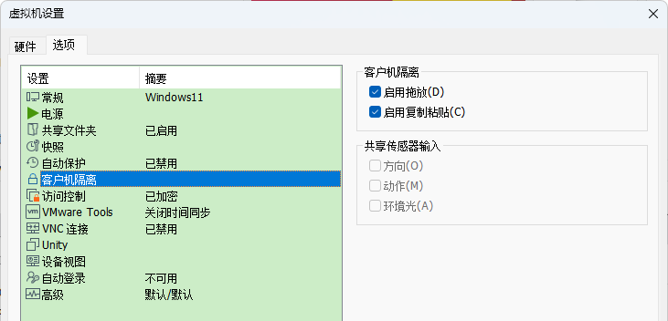
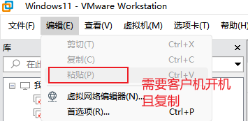

**VMware的一些记录**

[toc]

# 启用或关闭拖拽和拖入（Drag and Drop）

在虚拟机设置（右键，或 直接点击'编辑虚拟机设置'），选项中，选择“客户机隔离”（`Guest Isolation`），可以启用拖放、启用复制粘贴：

**默认都是启用的！**

# 拖放 和 复制粘贴无效的解决办法

目前在 Windows 11 的主机上，安装VMware虚拟机Windows 11，测试无法实现 主机和虚拟机（客户机）的文件拖放、复制粘贴等功能。

未解决，包括卸载 VMware Tools 并重启，再次安装 VMware Tools 并重启，都没有效果。 

在虚拟机中，VMware Tool 的 Windows服务 也是启动的。

- Uninstall VMware Tools
- Reboot guest OS
- Install VMware Tools
- Reboot guest OS.

# 菜单栏中的 粘贴(Paste) 可用

直接的赋值粘贴不管用，包括客户机与主机的双向复制粘贴。

但是，在 主机 赋值的内容，可以通过 VMware 顶部菜单栏中 “编辑” -> “粘贴” 复制到打开的客户机中。

