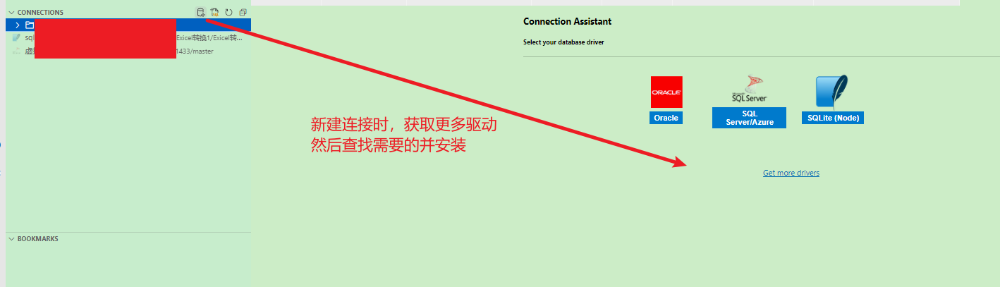
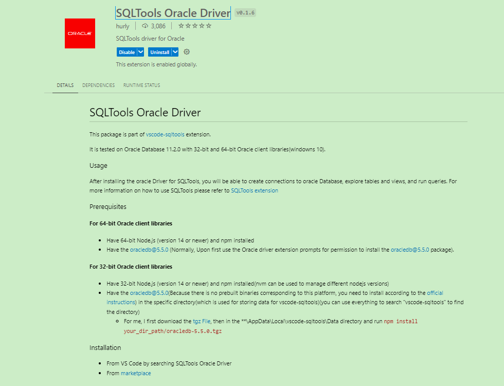
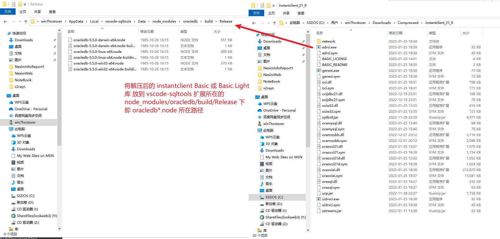

**VSCode的SQLTool扩展设置连接Oracle数据库**

[toc]


# 安装设置

## SQLTools Oracle Driver 扩展

vscode 中安装 SQLTools 连接Oracle 所需的的 SQLTools Oracle Driver 扩展：






## 安装oracledb@5.5.0

应该在 `%LocalAppData%\vscode-sqltools\Data` 路径执行终端命令。或者，在 SQLTool 提示安装 `oracledb@5.5.0` 点击“现在安装”，会自动在正确路径执行：


```sh
npm install oracledb@5.5.0 && exit 0
```

或

```sh
npm install oracledb
```

## 下载 Oracle Client Library 并设置目录

下载 Instant Client ‘Basic’ or ‘Basic Light’ 均可以，免费，下载地址 [Oracle Technology Network](https://www.oracle.com/database/technologies/instant-client/winx64-64-downloads.html)。32 位的下载地址 [32-bit Instant Client](https://www.oracle.com/database/technologies/instant-client/microsoft-windows-32-downloads.html)


将解压后的 instantclient Basic 或 Basic Light 库，放到 vscode-sqltools 扩展所在的 `node_modules/oracledb/build/Release` 下，即 oracledb*.node 所在路径。



> 不正确设置路径，将会报错如下：
> 
> ERROR: Error opening connection DPI-1047: Cannot locate a 64-bit Oracle Client library: "The specified module could not be found". See https://oracle.github.io/node-oracledb/INSTALL.html for help

# 参考

[Install the free Oracle Instant Client ZIP](https://node-oracledb.readthedocs.io/en/latest/user_guide/installation.html#install-the-free-oracle-instant-client-zip)
