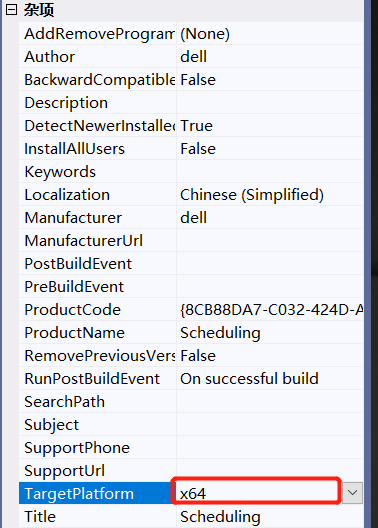

VSInstall打包报错targeting ‘AMD64‘ is not compatible with the project‘s target platform ‘x86‘.md

ERROR: File 'Microsoft.Management.Infrastructure.Native.dll' targeting 'AMD64' is not compatible with the project's target platform 'x86'

选中安装项目，按F4 或 选择属性面板,将弹出窗体的TargetPlatform属性设置成x64（默认为x86）

> 注：**这个错误，是在自定义install处理类库中，添加了`System.Management.Automation.dll`了出现的**！！！
