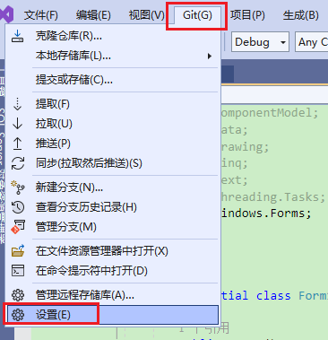
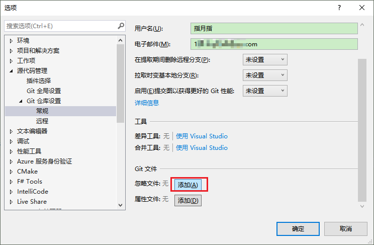
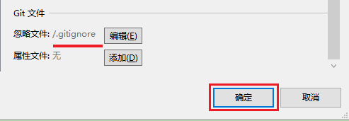
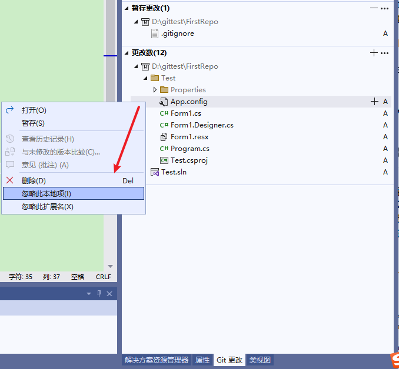
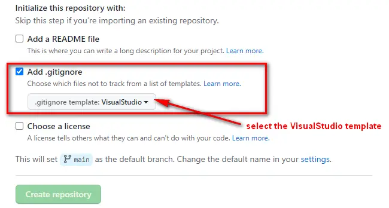

**Visual Studio中如何添加.gitignore，及推荐的.gitignore文件**

[toc]

git仓库中添加 .gitignore 文件非常非常重要，它用于告知git不进行追踪的文件，比如发布文件、临时文件等很多不必要的，都不需要追踪、推送到远程库。

Visual Studio 2019 开始，已经集成了git，很多git相关的操作也不断易于操作，VS可以像添加项目一样，添加.gitignore文件，否则，只能手动添加，或者在远程库中添加。

# VS 中添加 .gitignore

Visual Studio 的顶部菜单栏中，点击 Git > Settings：

  

在选项窗口，导航到 Source Control > Git Repository Settings，在 Git files 部分，点击 Ignore file 旁边的“添加”

  

点击后，将会在仓库的根目录下添加 .gitignore 文件，UI界面会立即显示，点击“确定”保存。

  

点击“编辑”，可以查看、修改 .gitignore 文件。

> VS 会自动暂存`.gitignore`，只需提交和推送即可。

# 忽略更多的文件和文件夹

VS默认的`.gitignore`模板已经足够好，但开发中我们仍可能需要忽略更多的文件、扩展名或目录。

## UI中忽略文件

在 Git更改 视图中的 Git Changes 部分，右键要忽略的文件，选择**Ignore this local item**，即可忽略文件。

  

它会更新`.gitignore`并暂存（只需提交和推送即可）。

## 手动编辑 .gitignore

如上面添加文件时提到的进行编辑。

打开选项（`Options`）窗口，Git > Settings > Source Control > Git Repository

Git files 部分，点击 Ignore file 旁边的“编辑”。

比如，`.gitignore`中指定忽略 appsettings.Development.json 文件。然后保存文件。

```conf
# My files to ignore
appsettings.Development.json
```

# 在服务器端添加 .gitignore

这个很简单，都遇到过。

  

# 手动添加更好的 .gitignore 模板

除了借出VS，还可以手动创建添加 .gitignore 文件。

此处推荐一个更好的 .gitignore 模板：[https://github.com/github/gitignore/blob/main/VisualStudio.gitignore](https://github.com/github/gitignore/blob/main/VisualStudio.gitignore)

该项目包含有N多项目、不同编程语言、不同IDE相关的 .gitignore 文件，可以直接使用。

# 参考

[How to add .gitignore in Visual Studio](https://makolyte.com/how-to-add-gitignore-in-visual-studio/)