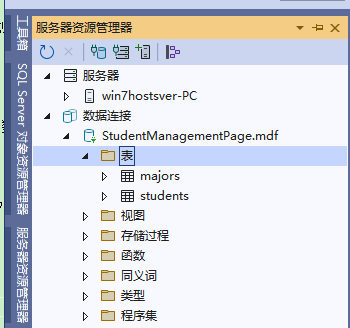

**Visual Studio连接SQL Server并简单实现一个学生信息管理页**

[toc]

> 主要参考自 [手把手教你用SQLServer连接Visual Studio2019并编写一个学生信息管理页面](https://blog.csdn.net/weixin_45906196/article/details/121423491)，并对数据表有所修改，增加DataGridView控件、精简控件等。

# 创建项目和设置数据库

## 创建项目

新建一个Winform窗体项目`StudentManagementPage_Winform`：

  

> 后续改为了 .NET6 版本，而不是Framework。

## 连接创建数据库文件

**视图** 下打开 **服务器资源管理器**，右键 **数据连接**，点击“添加连接”：

  

数据源选择`Microsoft SQL Server数据库文件（SqlClient）`。该选项将会把一个数据库文件附加到本地的SQLServer实例，由于是本地实例，后续可以选择**Windows身份验证**。

数据库文件名输入`StudentManagementPage` 不存在将创建的数据库

登录方式身份验证选`Windows身份验证`

点击`确定`。

  

提示创建数据库文件，点击“是”：

  

## 创建表

新建两个表：

- 一个students表，存储学号(主键）、姓名、年龄、分数。

- 一个majors表，存储专业号（主键），和专业名。

操作步骤：

“服务器资源管理器”中，选择刚建好的数据库，双击打开。

找到 **表**，右键，选择 **添加新表**：

  

如下创建 majors 表，字段为 id、name：

  

同样，右键表，选择`添加新表`，创建 students 表，添加字段 Id、name、gender、age、score、majors_Id ：

  

点击“更新”创建表，如下提示“更新数据库”：

  

在 students 表设计中，右侧的 “外键”，右键“添加新外键”，并在下面的脚本中，修改外建名、外键字段、引用表(字段)： 

  

点击“更新”，更新表。

在 数据连接 下的 表 中，右键刷新，可以看到创建的表：

  

# Winform 窗体设计

在项目`StudentManagementPage_Winform`中，重命名默认`Form1.cs`为`MainForm.cs`，双击打开窗体设计器。

添加对应控件，窗体的设计布局效果如下：

控件在工具箱中添加：

- 左部：name=groupbox1 text=学生列表

- 中间：name=groupbox2 text=学生详情

- 右边：name=groupbox3 text=学生操作

- 下边：name=groupbox3 text=专业管理

