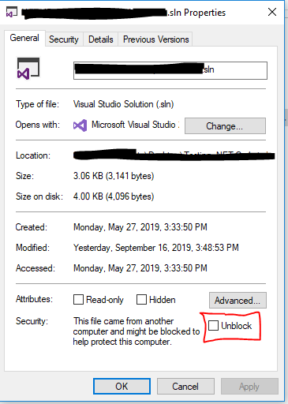
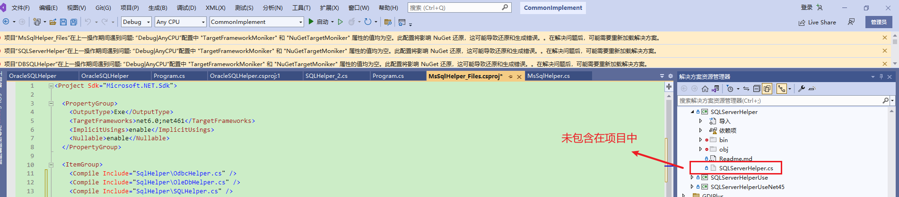

**项目在上一操作期间遇到问题："TargetFrameworkMoniker" 和 "NuGetTargetMoniker" 属性的值均为空**

> **其实最终这个问题是没有解决的，虽然操作中确实没这个提示了，但后续过几天仍然出现。不过不影响使用，暂时就先不管了。**
> 
> **最后 删除解决方案下的`.vs`文件夹解决。**

完整的错误提示：项目“DBSQLHelper”在上一操作期间遇到问题: “Debug|AnyCPU”配置中 "TargetFrameworkMoniker" 和 "NuGetTargetMoniker" 属性的值均为空。此配置将影响 NuGet 还原，这可能导致还原和生成错误。。在解决问题后，可能需要重新加载解决方案。 

> The project ran into a problem during the last operation: The value of the 'TargetFrameworkMoniker' and 'NuGetTargetMoniker' properties in the 'Debug|AnyCPU' configuration are both empty. This configuration will not contribute to NuGet restore, which may result in restore and build errors.

  

解决办法：

- **删除`.vs`文件夹似乎可以解决这个问题。**
- **升级Visual Studio版本。**
- **设置 .sln 和 .csproj 、web.config 或 app.config 等文件非只读，或者不要锁定文件。**

  

对于最后一个解决方法，向导之前的项目创建是在 管理员模式 下的VS中，现在普通情况下直接发开，应该和文件权限有关(`.csproj`)，才导致提示此问题。

重试，**重新以管理员权限打开VS，并打开解决方案**。之前的错误没有了，改为了下面的：

> 项目“OracleSQLHelper”在上一操作期间遇到问题: MSBuildProjectExtensionsPath 属性的值在目标框架之间不一致。此属性必须相同以便 NuGet 还原正常运行。将使用“Debug|AnyCPU|netstandard2.1”配置中的值 D:\SoftWareDevelope\CSharp\csharp-common-implement\DBSQLHelper\MySqlHelper\obj\，而其他目标框架可能无法选取 NuGet 资产。。在解决问题后，可能需要重新加载解决方案。 

> 项目“OracleSQLHelper”在上一操作期间遇到问题: TargetFrameworks 属性的值在目标框架之间不一致。此属性必须相同以便 NuGet 还原正常运行。将使用“Debug|AnyCPU|netstandard2.1”配置中的值 netstandard2.1;net452;net45，而其他目标框架可能无法选取 NuGet 资产。。在解决问题后，可能需要重新加载解决方案。 

  

由于项目原本就没有错误，重新生成一下项目，生成成功后，又出现了`'TargetFrameworkMoniker' and 'NuGetTargetMoniker'`的错误提示。

后面无意间发现，项目下面的程序文件，没有包括在项目中，如下，`.cs`文件：

  

虽然这种情况下，重新生成还是成功的，没有错误。

右键`.cs`文件，选择“包括在项目中”，错误消失。【如果错误未消失，重启下vs即可】

**比较纳闷的是，为什么文件被从项目中排除，没有动过它。**

相关参考：

[Error when changing to <TargetFrameworks> (plural) in .NET Core csproj file](https://stackoverflow.com/questions/57981214/error-when-changing-to-targetframeworks-plural-in-net-core-csproj-file)