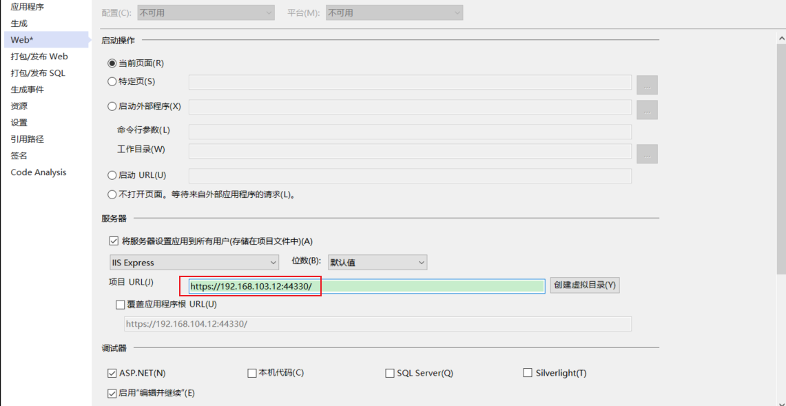

**Visual Studio启动ASP.NET网站通过ip访问报错Invalid Hostname**

如下，是通过ip地址访问 VS 启动的 ASP.Net MVC 网站，使用的 IIS Express，报错 Bad Request - Invalid Hostname ：


和 IIS 网站的绑定信息是一样的，默认 VS启动绑定的站点信息为`*:port:localhost`，因为调试状态，所以绑定到`localhost`。

这就导致，通过IP访问时，Hostname 不正确。同样，**实际 IIS 站点绑定，如果限制了主机名，同样会报错**。

# 解决办法（修改后，需要以管理员身份重新运行VS）

VS解决方案目录下，找到 `.vs\{ProjectName}\config\application.config` 文件，打开并查找 VS调试启动的站点。

```xml
    <site name="WebProject" id="2">
        <application path="/" applicationPool="Clr4IntegratedAppPool">
            <virtualDirectory path="/" physicalPath="D:\SoftWareDevelope\CSharp\solution\WebProject" />
        </application>
        <bindings>
            <binding protocol="https" bindingInformation="*:44330:localhost" />
            <binding protocol="http" bindingInformation="*:10518:localhost" />
        </bindings>
    </site>
```

`bindingInformation` 修改为ip或127.0.0.1

```xml
    <site name="WebProject" id="2">
        <application path="/" applicationPool="Clr4IntegratedAppPool">
            <virtualDirectory path="/" physicalPath="D:\SoftWareDevelope\CSharp\solution\WebProject" />
        </application>
        <bindings>
            <binding protocol="https" bindingInformation="*:44330:192.168.103.12" />
            <binding protocol="http" bindingInformation="*:10518:192.168.103.12" />
        </bindings>
    </site>
```

同时，要设置项目属性(右键->属性) -> Web -> 项目URL 地址也改为IP：



保存后，以管理员身份重新运行vs（Visual Studio），重新启动项目。即可通过ip访问，不再报错Invalid Hostname

查找资料介绍，**如果想配置非localhost的绑定，VS必须以管理员权限运行才行**。否则，就会在运行VS时，重新生成一个新的含有`localhost`的节点。

实际测试，无法使用 `*` 的同时不管是否管理员权限运行，都会自动生成新节点。解决办法是改为绑定IP。

同时，属性 -> Web 中设置 服务器 项目URL 为对应的IP。

> 对应 IIS 中UI绑定信息：
>
> 

# 通过 系统任务托盘 的 IIS Express 图标查找配置文件

> 注：

1. .在状态栏中，右键选择IIS EPress - 显示所有应用程序


2. 单击站点名称,在下面提示的路径中选择配置路径 applicationhost.config 文件


# 参考

- [调试asp.net网站，通过localhost访问是有效的,但是通过本机IP甚至127.0.0.1访问无效](https://www.cnblogs.com/caiyt/p/15984507.html)
- [“Bad Request - Invalid Hostname”的解决办法](https://hadb.me/bad-request-invalid-hostname/)