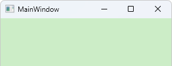

**C#/WPF中实现拖动窗体的正确处理，WPF最大化、最小化和关闭按钮的禁用隐藏、无边框窗体**

[toc]

# WPF 自带的 DragMove 方法

## DragMove 实现拖动窗体

WPF 内置提供了可以直接使用的 DragMove 方法，以拖动窗体。窗体的拖动或拖拽是基本的功能，通常在左键按下标题栏并移动鼠标时实现窗体移动，这是默认行为。

如果想要实现点击窗体内任一位置拖动窗体，则可以在 `MouseMove` 事件中判断是否按下了左键，然后调用`DragMove()`移动窗体即可。

```C#
MouseMove += (_, e) =>
{
    if (e.LeftButton == MouseButtonState.Pressed)
    {
        DragMove();
    }
};
```

非常简单。

如果想要实现，在某个控件元素左键按下拖动时移动窗体，可以在该控件的`MouseMove`事件中实现。

如 Image 元素 `myImage`：

```C#
myImage.MouseMove += (_, e) =>
{
    if (e.LeftButton == MouseButtonState.Pressed)
    {
        DragMove();
    }
};
```

## 左键按下拖动 TextBox 时报错 System.InvalidOperationException

上面的实现很简洁。但是，如果WPF窗体内包含TextBox文本框，点击文本框并拖动，将会发生错误 `System.InvalidOperationException:“调度程序进程已挂起，但消息仍在处理中。”`

这是因为在文本框中的左键按下然后拖动是`文本选择`的功能及处理，此时，若在添加一个移动窗体的处理，将会发生冲突，产生上面的错误。

一个很直观的解决办法是，在 TextBox 的 MouseMove 事件中设置事件已处理，禁止WPF的路由事件上传到窗体中处理。

```C#
infoTxt.MouseMove += (_, e) =>
{
    e.Handled= true;
};
```

除了直观处理，还要考虑如果有多个 TextBox 元素时，是否要每个都统一添加 MouseMove 事件。

如何获取 WPF内所有的 TextBox 并统一设置事件处理？这需要进行 WPF元素的遍历，然后判断元素类型并添加事件处理。

## WPF 事件中 `e.Handled=true` 阻止事件上传到父元素和窗口

 WPF 事件中 `e.Handled=true` 应该不是阻止事件上传到父元素，而只是指示事件已经被处理，父元素相关事件不触发执行。

 这对于，将事件上传到Window窗体(或父级的元素)事件处理 中，可能会有处理冲突的问题的解决，非常实用。

## 拖动窗体更优雅的实现或正确的处理

处理遍历元素判断`TextBox`类型并添加 MouseMove 处理之外，还有一个比较好的方式：**在窗体的`MouseMove`事件中判断事件来源是否为`TextBox`**，实现统一处理。

如下，较为优雅的实现，当事件最初的源为`TextBox`时直接返回，不处理窗体移动。

```C#
MouseMove += (_, e) =>
{
    // 统一处理 TextBox 的拖拽。TextBlock\Label 等不影响
    if (e.OriginalSource is TextBox)
    {
        return;
    }
    if (e.LeftButton == MouseButtonState.Pressed)
    {
        DragMove();
    }
};
```

后面测试，对于拖拽 TextBlock\Label 等元素不会产生此报错。

# 设置窗体的最大化、最小化和关闭按钮

WPF中没有直接控制最大化、最小化和关闭按钮的属性，比较方便的方式时通过设置 ResizeMode

默认显示效果如下：

  

## ResizeMode.NoResize 不能改变窗口大小，去掉最大化和最小化按钮

```C#
ResizeMode = ResizeMode.NoResize;
```
 
## ResizeMode.CanMinimize 禁用最大化，最小化按钮可用

```C#
ResizeMode = ResizeMode.CanMinimize;
```

## WindowStyle.None 设置无边框窗体

无边框窗体的最大化、最小化和关闭按钮将都不显示。

```C#
WindowStyle = WindowStyle.None;
```

## 禁用关闭按钮

`OnClosing`和`Closing`事件中的处理本质是一样的，调用`OnClosing`方法就会触发`Closing`事件。

> **重载`OnClosing`函数和`Closing`事件处理，可以捕获 `Alt + F4` 关闭窗口的操作。**

### 重载OnClosing函数取消关闭

OnClosing函数的重载中，通过设置参数 `CancelEventArgs` `e.Cancel = true` 可以取消关闭操作，实现禁用关闭功能的作用。

```C#
/// <summary>
/// 禁用关闭
/// </summary>
/// <param name="e"></param>
protected override void OnClosing(System.ComponentModel.CancelEventArgs e)
{
    // base.OnClosing(e);
    e.Cancel = true;
}
```

### Closing事件中取消关闭

```C#
Closing += MainWindow_Closing;

/// ...

private void MainWindow_Closing(object sender, System.ComponentModel.CancelEventArgs e)
{
    e.Cancel = true;
}
```

### win32 API 实现关闭按钮的禁用

需要 DllImport 引入几个 USER32 API，然后在窗体`Window`的`Loaded`加载事件中，获取窗口句柄并调用API。这样可以让 **关闭按钮 变灰禁用掉**。

```C#
Loaded += MainWindow_Loaded;

/// ...

#region 禁用关闭按钮
[DllImport("USER32.DLL", CharSet = CharSet.Unicode)]
private static extern IntPtr GetSystemMenu(IntPtr hWnd, UInt32 bRevert);
[DllImport("USER32.DLL ", CharSet = CharSet.Unicode)]
private static extern UInt32 RemoveMenu(IntPtr hMenu, UInt32 nPosition, UInt32 wFlags);
private const UInt32 SC_CLOSE = 0x0000F060;
private const UInt32 MF_BYCOMMAND = 0x00000000;

private void MainWindow_Loaded(object sender, RoutedEventArgs e)
{
    var hwnd = new WindowInteropHelper(this).Handle;  //获取window的句柄
    IntPtr hMenu = GetSystemMenu(hwnd, 0);
    RemoveMenu(hMenu, SC_CLOSE, MF_BYCOMMAND);
}
#endregion
```
