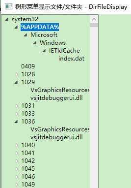

**WPF树形控件TreeView实现显示文件夹和文件**

[toc]

# 简要介绍

> 位于 `WPF\CommonEffect_Elements` 下 `TreeViewEffect` 文件夹， `DirFileDisplayWindow.xaml`。

- DirFileRecord - 文件/文件夹信息记录类

```C#
    /// <summary>
    /// 文件/文件夹信息记录类
    /// 通过指定路径递归加载子路径和子文件，如果遇到目录较深可能会耗时和卡顿
    /// </summary>
    public class DirFileRecord
    {
        /// <summary>
        /// 目录深度，默认从原始初始化时指定的路径开始，目录深度为3
        /// 如需加载更深的目录，则可以增加 DirDepth 的大小，并调用 ChildDirFiles 方法？【暂未实现】
        /// </summary>
        public static int DirDepth { get; set; } = 3;

        /// <summary>
        /// 还需要维护当前的目录深度 【暂时未实现】
        /// </summary>
        static int CurrDirDepth { get; set; }

        /// <summary>
        /// 文件或文件夹路径
        /// </summary>
        public string dirOrFilePath { get; }
        /// <summary>
        /// 文件或文件夹名称
        /// </summary>
        public string Name { get;  }

        /// <summary>
        /// 是否为 文件 【不存在为 null】
        /// </summary>
        public bool? isFile { get; set; }
        /// <summary>
        /// 文件或文件夹的图标路径
        /// </summary>
        public string IconPath { get; set; }

        public DirFileRecord(string path)
        {
            dirOrFilePath = path;
            Name= System.IO.Path.GetFileName(path);
            if (Directory.Exists(path))
            {
                isFile = false;
            }
            else if (File.Exists(path))
            {
                isFile=true;
            }
        }


        public IEnumerable<DirFileRecord> ChildDirFiles
        {
            get
            {
                if (isFile==false)
                {
                    var Info = new DirectoryInfo(dirOrFilePath);
                    // Info.GetDirectories("*", SearchOption.TopDirectoryOnly)
                    var dirs = from di in Info.GetDirectories()
                           select new DirFileRecord(di.FullName);
                    return dirs.Concat(from di in Info.GetFiles()
                                       select new DirFileRecord(di.FullName));
                }

                //return new DirFileRecord[0];
                return null;
            }
        }
    }
```

- DirFileDisplayWindow 窗体处理

```xml
        <TreeView x:Name="directoryTreeView">
            <TreeView.Resources>
                <HierarchicalDataTemplate DataType="{x:Type local:DirFileRecord}"
                        ItemsSource="{Binding ChildDirFiles}" >
                    <StackPanel Orientation="Horizontal">
                        <!--<Image Source="Images/folder.png" Width="16" Height="16"/>-->
                        <TextBlock Text="{Binding Name}"/>
                    </StackPanel>
                </HierarchicalDataTemplate>
            </TreeView.Resources>
        </TreeView>
```

```C#
       /// <summary>
        /// 要显示的文件夹路径
        /// </summary>
        private string displayFolderPath;

        public DirFileDisplayWindow()
        {
            InitializeComponent();

            // 设置初始化显示的路径
            displayFolderPath=Environment.GetFolderPath(Environment.SpecialFolder.System);

            Loaded += MainWindow_Loaded;

            // 选择TreeView菜单项
            directoryTreeView.SelectedItemChanged += DirectoryTreeView_SelectedItemChanged;
        }

        private async void DirectoryTreeView_SelectedItemChanged(object sender, RoutedPropertyChangedEventArgs<object> e)
        {
            if (e.NewValue is DirFileRecord record)
            {
                // 处理读取选择的文件/文件夹。比如读取文件内容
                // Encoding.UTF7 似乎更好
                var text = await EncoderAndDecoder.ReadStringFromFileAsync(record.dirOrFilePath, Encoding.UTF7);

               // ..........
            }
        }


        private void MainWindow_Loaded(object sender, RoutedEventArgs e)
        {
            SetDirTreeViewDatas(displayFolderPath);
        }

        /// <summary>
        /// 设置 directoryTreeView.ItemsSource
        /// </summary>
        /// <param name="folderPath">文件夹路径</param>
        private void SetDirTreeViewDatas(string folderPath)
        {
            if (string.IsNullOrWhiteSpace(folderPath))
            {
                return;
            }
            var directory = new ObservableCollection<DirFileRecord>
            {
                new DirFileRecord(folderPath)
            };
            directoryTreeView.ItemsSource = directory;
        }
```

- 基本效果

未实现显示图标（文件夹、不同文件类型图标）



# 附：DataGrid 根据选择的元素内容的数据自动生成列和数据绑定

[WPF-TreeView获取文件夹目录、DataGrid获取目录下文件信息](https://www.cnblogs.com/amourjun/p/6534161.html) 或 [WPF 4 目录树型显示](https://www.cnblogs.com/gnielee/archive/2010/06/04/wpf4-directory-treeview.html) 中给出的示例是自动生成 DataGrid 列，感觉很不错，在此记录下来。

- WAML 结构

```xml
 <TreeView x:Name="directoryTreeView">
     <TreeView.Resources>
        <HierarchicalDataTemplate DataType="{x:Type local:DirectoryRecord}"
                        ItemsSource="{Binding Directories}" >
          <StackPanel Orientation="Horizontal">
                  <TextBlock Text="{Binding Info.Name}"/>
            </StackPanel>
          </HierarchicalDataTemplate>
      </TreeView.Resources>
 </TreeView>


<DataGrid x:Name="fileInfoDataGrid" ItemsSource="{Binding SelectedItem.Files, ElementName=directoryTreeView}">
```

- `TreeView`数据绑定的`DirectoryRecord`类型结构

```C#
/// <summary>
/// 文件夹信息记录类
/// </summary>
public class DirectoryRecord
{
    public DirectoryInfo Info { get; }
    public string folderPath { get; }


    public DirectoryRecord(string folderPath)
    {
        this.folderPath = folderPath;
        if (Directory.Exists(folderPath))
        {
            Info = new DirectoryInfo(folderPath);
        }
    }
    public DirectoryRecord(DirectoryInfo Info)
    {
        this.Info = Info;
        folderPath = Info.FullName;
    }

    public IEnumerable<FileInfo> Files
    {
        get
        {
            return Info?.GetFiles();
        }
    }

    public IEnumerable<DirectoryRecord> Directories
    {
        get
        {
            return from di in Info?.GetDirectories("*", SearchOption.TopDirectoryOnly)
                   select new DirectoryRecord( di);
        }
    }
}
```

- `DataGrid.AutoGeneratingColumn` 自动生成列事件

```js
//DataGrid事件，设置列标
fileInfoDataGrid.AutoGeneratingColumn += fileInfoDataGridColumn_Load;

private void fileInfoDataGridColumn_Load(object sender, DataGridAutoGeneratingColumnEventArgs e)
        {
            List<string> requiredProperties = new List<string>
            {
                "Name", "Length", "FullName", "LastWriteTime"
            };

            if (!requiredProperties.Contains(e.PropertyName))
            {
                e.Cancel = true;
            }
            else
            {
                e.Column.Header = e.Column.Header.ToString();
            }
        }
```

- 树形控件数据的绑定赋值

```C#
/// <summary>
/// 设置 directoryTreeView.ItemsSource
/// </summary>
/// <param name="folderPath">文件夹路径</param>
private void SetDirTreeViewDatas(string folderPath)
{
    var directory = new ObservableCollection<DirectoryRecord>
    {
        new DirectoryRecord(folderPath)
    };
    directoryTreeView.ItemsSource = directory;
}
```

- 最后就是指定要加载的文件夹路径`folderPath`，调用`SetDirTreeViewDatas`：

比如窗体加载事件中显示 "C:\Windows" 下的文件夹

```C#
Loaded += MainWindow_Loaded;

// .....

private void MainWindow_Loaded(object sender, RoutedEventArgs e)
{
    SetDirTreeViewDatas(@"C:\Windows");
}
```

# 附：关于 ObservableCollection 类


# 参考

- [WPF-TreeView获取文件夹目录、DataGrid获取目录下文件信息](https://www.cnblogs.com/amourjun/p/6534161.html)