**Windows下搭建和配置私有的Git服务器(Bonobo Git Server)【404.5错误 请求筛选】**

[toc]

Bonobo Git Server 是可以直接部署在 Windows IIS 下的非常简单、开源免费（MIT协议）、界面友好的 git服务器，可以方便地用来部署为私有的Git服务。

Bonobo Git Server 需要 IIS7+ 及 .NET Framework 4.6 的环境，目前最新版本为 6.5.0。

> 其开发基于 ASP.NET MVC，数据库用的是SQLite，Git部分用的是GitSharp。

> 注：**Bonobo Git Server 的Git服务器，无法使用SSH进行登陆管理。**
> 
> 参见：[Add support for user certificates for pushing/pulling instead of username+password #149](https://github.com/jakubgarfield/Bonobo-Git-Server/issues/149)、[Enabling SSH access to repositories #900](https://github.com/jakubgarfield/Bonobo-Git-Server/issues/900)
>
> 不知道在将来会不会实现，这是一个极其重要的功能点，或便利的方式。

> **Gogs（推荐）、Gitblit 等服务，都可以做到在 Windows 下部署的 SSH 登陆管理**。相对 Bonobo Git Server 的功能还是弱了些。

> **后续测试，目前即使Git使用http(s)，也只需要在第一次时输入用户名密码，后续不需要每次使用时都输入。**

# 安装配置 

## 下载

直接从 [Bonobo Git Server 官网](https://bonobogitserver.com/) 首页下载最新版本的压缩包，并将其解压缩至`C:\inetpub\wwwroot`目录下（可根据需要修改为其它位置、或者修改名称）。

`C:\inetpub\wwwroot\Bonobo.Git.Server`

## 允许 IIS 用户修改 Bonobo.Git.Server 下的App_Data文件夹

- 右键选择`App_Data`文件夹的属性。
- “安全”中，点击“编辑”。
- 选择 IIS 用户（通常为 `IIS_IUSRS`），添加修改和写入权限。
- 点击应用和确认。

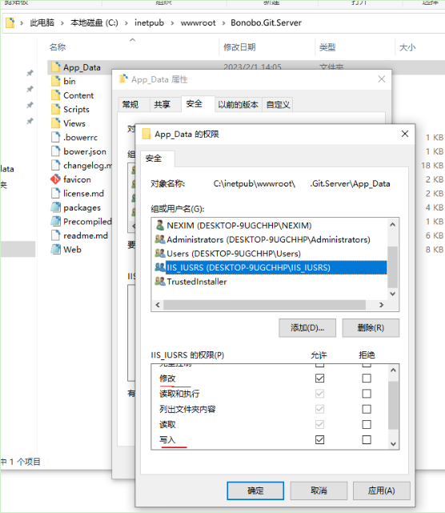  

> 所有的仓库数据、用户数据等，都默认保存在`App_Data`目录下，因此，如果想要备份数据，可以直接备份该文件夹。

## 在 IIS 中转换 Bonobo.Git.Server 为应用程序

- 打开 IIS 管理器，导航到 站点->`Default Web Site`。
- 右键“Bonobo Git Server”，选择“转换为应用程序”。
- 检查是否选择应用程序池运行在 .NET 4.0 上，并 点击确定，转换为站点。

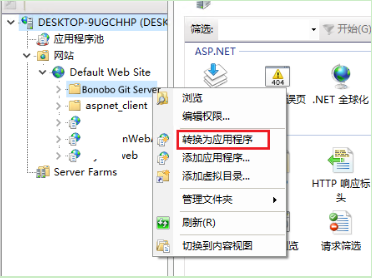  

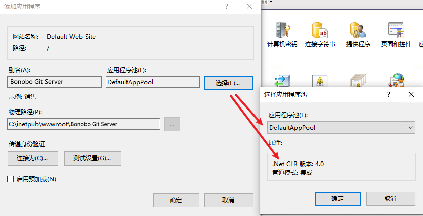  

> 一般都是运行在 .NET 4.0 ，如果很老旧的版本，应用程序池不是 .NET 4.0，可以执行 `%windir%\Microsoft.NET\Framework\v4.0.30319\aspnet_regiis.exe -ir` 进行注册。
> 
> 注册完成后，在 IIS 管理器的应用程序池中，修改运行的 .NET 版本。

-  配置认证

在转换后的站点下，进入“身份认证”图标下，启用匿名身份认证（`Anonymous Authentication`，默认已启用），其他禁用。

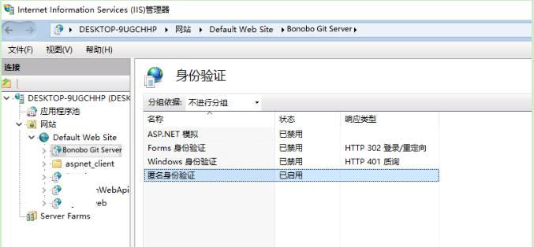  

- 浏览器中打开 http://localhost/Bonobo.Git.Server ，可以看到 Bonobo.Git.Server 的初始化页面，并运行正常。

默认登陆的用户名密码为：admin/admin

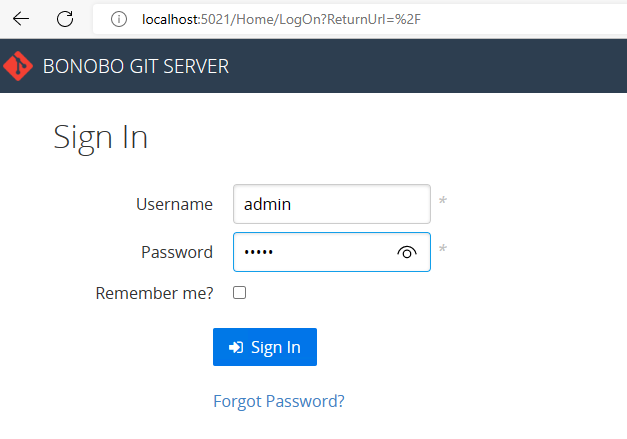  

> 如果打开报错500相关错误，确认在“启用或关闭 Windows 功能”中，IIS下的 万维网服务 中 应用程序开发功能 下，是否勾选安装了“ASP.NET 4.8”、是否安装了WebDAV（IIS7.5默认安装）。

## Bonobo.Git.Server 的更新

如果想要更新 Bonobo.Git.Server，最好从 [changelog](https://github.com/jakubgarfield/Bonobo-Git-Server/blob/master/changelog.md) 提前确认兼容问题。

将下载的 Bonobo.Git.Server 中 **除`App_Data`、`Web.config`之外的文件全部替换现有的 Bonobo.Git.Server 站点中的文件**。

> **官方介绍**：
> 
> - 删除安装文件夹下 **除`App_Data`、`Web.config`之外的** 所有文件。
> - 复制下载的 Bonobo.Git.Server 中 **除`App_Data`、`Web.config`之外的文件** 到安装文件夹的位置。


> **注意站点根目录下的 Web.config，不要删除或做好备份。**

## 单独部署为一个网站

当然，推荐的做法是，将 Bonobo.Git.Server 单独部署为一个网站，而不是作为 默认网站 下的一个 站点应用程序。

不在赘述。

# Bonobo Git Server的配置

## 全局设置

打开并登陆部署好的 Bonobo Git Server，在 右上角 的 设置 中，进行简单的修改：

- 可以根据需要指定仓库的根目录，默认为`App_Data\Repositories`，注意，要有写入和修改权限。
- git服务器的标题、Logo、页脚信息，还可以指定自定义CSS。
- 修改语言为“中文简体”。
- 勾选“允许用户仓库创建”、“允许推送创建仓库”等，其它如 “允许匿名推送”(不推荐) 等，可根据需要勾选。

点击“Save”保存。

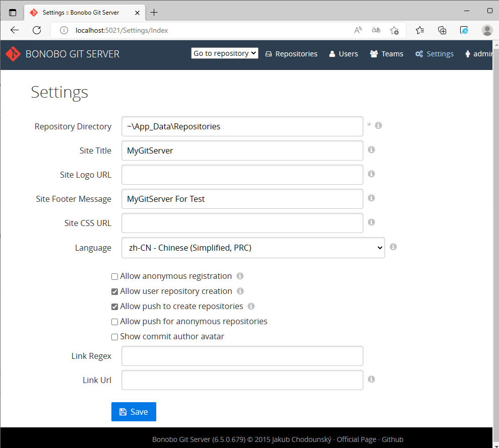  

用于可以引入CSS，所以可以很方便的隐藏一些不相关信息（根据需要）。

## 关于引用`~\App_Data\.css`报错 404.5 

我们设置站点CSS的地址，却发现无法访问，报错：`HTTP 错误 404.5 - Not Found   请求筛选模块被配置为拒绝该 URL 序列。`

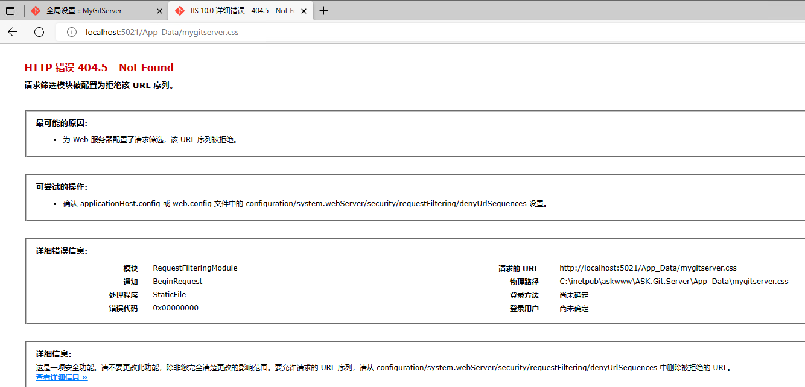  

测试，css放在根目录下，是可以正常访问的。

猜测估计是，请求路径 `App_Data\` 默认是交由`ASP.NET`处理的动态程序数据所在的路径，不应该直接访问，导致了`404.5 `无法访问的问题。

根据报错提示，`请求筛选模块`的配置，可以实现允许访问该url。

在 Bonobo Git Server 网站下，点击右侧的“请求筛选”，进入，在 URL 页中，添加允许访问的css地址。

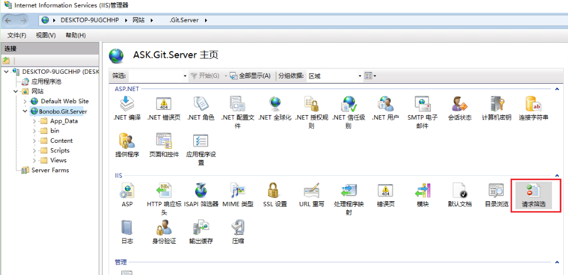  

操作 “允许 URL”，将报错的url填入，点击确定

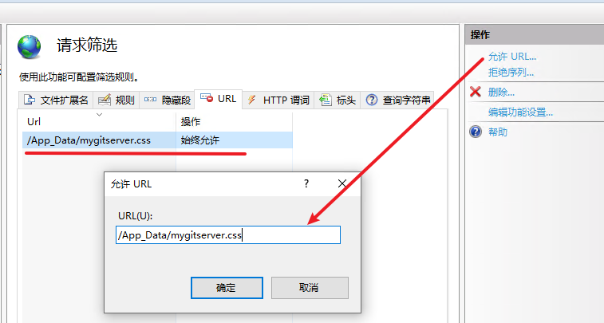  

再次访问即正常。

> 该修改对应的是站点目录下`Web.config`配置文件中的：
> 
> 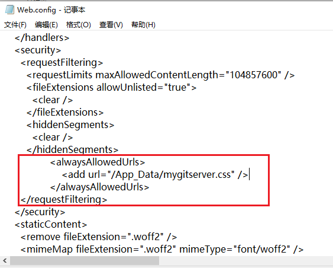  

这是针对当前网站设置的请求筛选，也可以设置当前服务器级别的“请求删选”，即错误提示中的`applicationHost.config`文件。

> 通常不应该修改`%windir%\system32\inetsrv\config\applicationhost.config`

## 修改(管理员)账户密码

修改默认的admin密码，登陆后，在右上角的“账户设置”(`account settings`)。

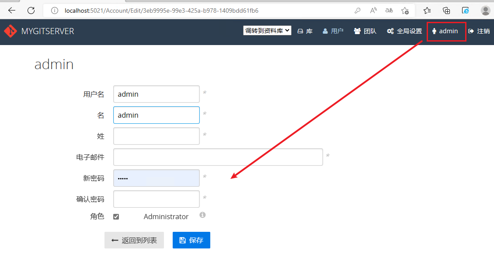  

## 创建用户、库，测试使用

在顶部菜单的 用户 中，新建用户。

在顶部菜单的 团队 中，新建团队。

在顶部菜单的 库 中，创建新库。

如下，创建`FirstRepo`库，贡献者`contributor`表示可以使用当前库（更新、提交）的成员。

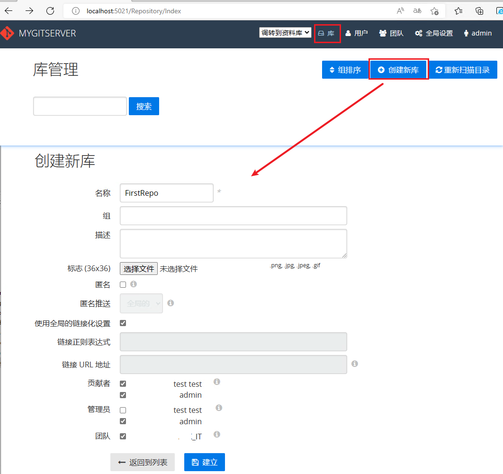  

## 使用ip或域名访问，获取正确的仓库地址

之前登陆及创建仓库，都使用的 localhost 地址。

则，在仓库中显示的 Git库的地址、个人URL等，也都是 localhost 地址。

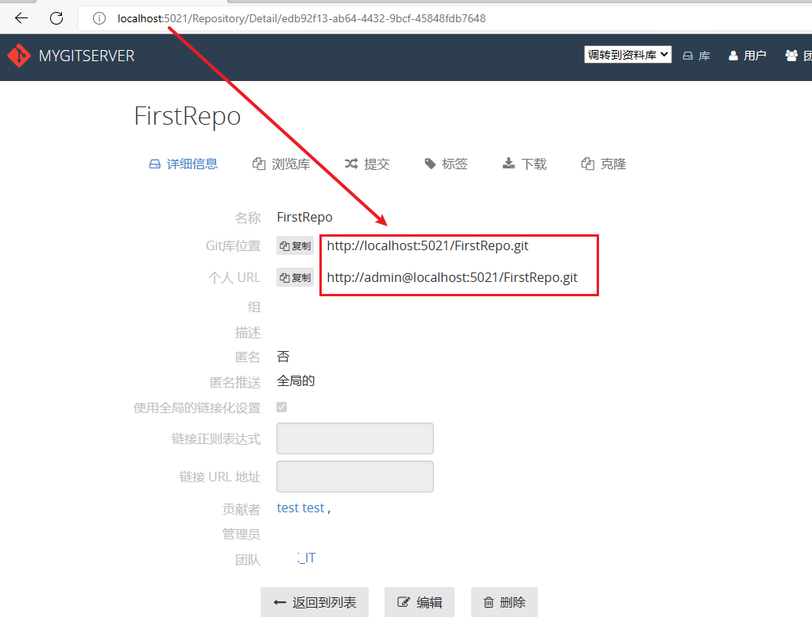  

对于，局域网的ip地址路径，为了便于其它电脑下访问，则 应该使用该Bonobo Git Server的ip访问，获取可访问的git库地址。如下：

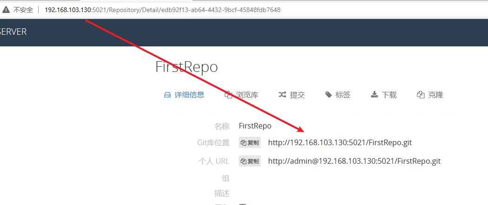  

## 使用git库

现在版本的Git，即使在http(s)通信下，**基本也只需在第一次clone或push时输入用户名密码，后续都不需要每次都输入**。

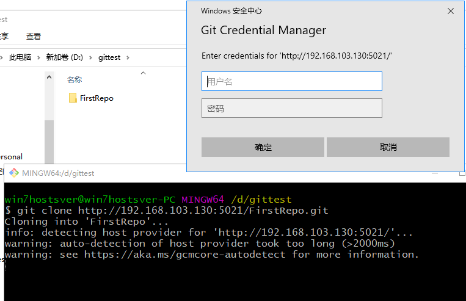  

> 密码的管理使用的是 git-credential-manager（`Git Credential Manager`）

# 使用Hook对仓库进行的一些管控


# Bonobo 的 Web.config 配置 SMTP 实现邮件发送

Bonobo 提供了找回密码功能，需要用到邮件发送。

关于 SMTP 的配置，只需要在站点的 Web.config 中添加如下正确的信息，即可实现发送邮件。

```xml
<!--父元素：configuration(提供所有名称空间的配置）-->
 <system.net>
  <mailSettings>
   <smtp from="xxx@yyy.com" deliveryMethod="Network">
    <network
                host="SMTP Server"
                userName="userName"
                password="password"
                defaultCredentials="true"/>
   </smtp>
  </mailSettings>
 </system.net>
```

> `defaultCredentials`属性指定`true`、`false`，或者取消该属性均不影响邮件发送。

如果需要指定 port，或者 启用了ssl，可以按如下指定：

```xml
<network host="smtp.yyy.com" userName="xxx@yyy.com" password="zzzzzzz" port="587" enableSsl="true" />
```

# 其他

<span style="display:none">

隐藏部分 `Bonobo Git Server` 信息和admin用户的，简单css样式代码：

```css
.footer>p {
    display: none;
}

.footer::after {
    content: "My Git Server For Test";
    display: block;
    margin: 1em 0;
}

label[for='Administrators'],
a[title='admin'],
a[href*='/3eb9995e-99e3-425a-b978-1409bdd61fb6'],
body.Repository input[value='3eb9995e-99e3-425a-b978-1409bdd61fb6'],
body.Repository input[value='3eb9995e-99e3-425a-b978-1409bdd61fb6']+label,
body.Team input[value='3eb9995e-99e3-425a-b978-1409bdd61fb6'],
body.Team input[value='3eb9995e-99e3-425a-b978-1409bdd61fb6']+label,
form[action="/Account/Edit/3eb9995e-99e3-425a-b978-1409bdd61fb6"] input[value="Administrator"],
form[action="/Account/Edit/3eb9995e-99e3-425a-b978-1409bdd61fb6"] input[value="Administrator"]+label {
    display: none;
}

/* 3eb9995e-99e3-425a-b978-1409bdd61fb6  为初始化时，admin用户的id，可通过开发者工具查找确定。应该避免对它的删除、编辑等相关危险操作 */
```

</span>