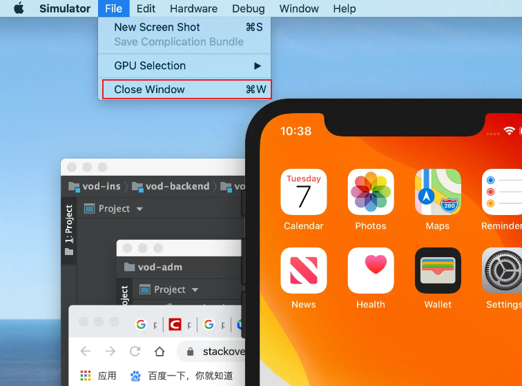
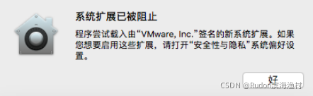
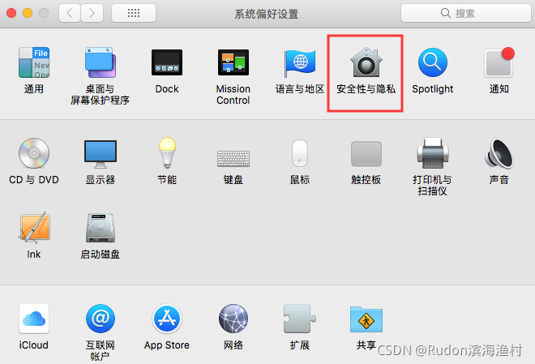
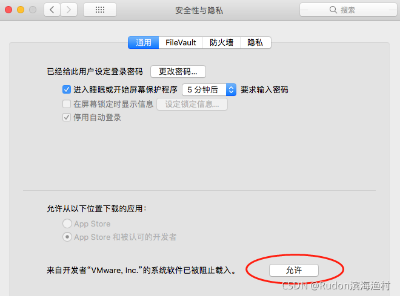
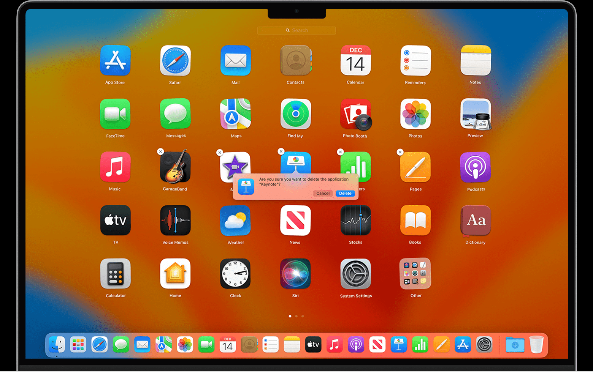
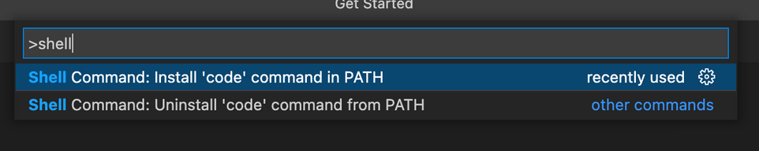
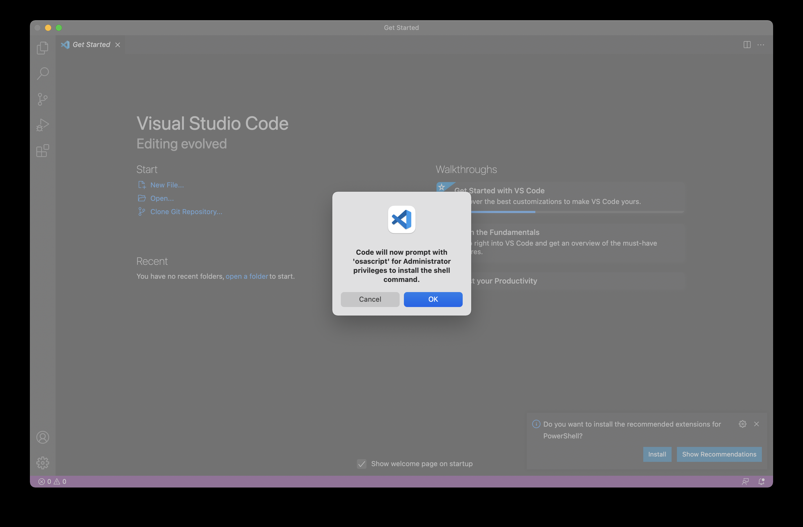
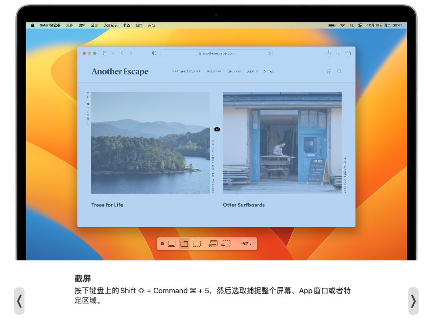

**Xcode的IOS模拟器等一些记录**


1. 如何关闭ios模拟器 

文件菜单->选择“关闭窗口”，或者按住[Command + W ]。它就会关闭在顶层的模拟器。



2. 将 iPhone 关机

- 配备面容 ID 的 iPhone：同时按住侧边按钮及任一音量按钮直到滑块出现，然后拖移关机滑块。

- 配备主屏幕按钮的 iPhone：按住侧边按钮，然后拖移滑块。

- 所有机型：前往“设置” >“通用”>“关机”，然后拖移滑块。

3. mac虚拟机安装VMware Tools

1）mac虚拟机开机后，点击VMware菜单“虚拟机”，点击“安装VMware Tools”
2）打开mac系统左下角的Finder，看到左边的“VMware Tools”，打开
3）双击“安装VMware Tools”，一步一步安装，当提示“系统扩展已被阻止”，点击弹出的“系统偏好设置”，点开第一行的“安全性与隐私”，如下图点击“允许”按钮。







> **实际在安装VMware Tools时，可能不会有提示，也可以自己打开 设置 或 系统偏好设置，找到 安全性与隐私，可能需要下拉，找到 `来自开发者"VMware, Inc."的系统软件已被阻止载入。` 的信息，点击“允许”**

然后重启mac系统。

4. App Store安装软件时 在 Mac 上要求输入密码 的设置修改

在 Mac 上，选取屏幕顶部的苹果菜单 ()，然后选取“系统偏好设置”或“系统设置”。

点按 Apple ID 或你的姓名。

点按“媒体与购买项目”。

选择你想要用于免费下载和购买的设置。如果你已针对购买项目打开了触控 ID，则你不会看到此菜单。

如果是旧版 macOS，请打开 iTunes，选取“iTunes”>“偏好设置”，然后点按“商店”标签。

5. MacOS 卸载应用程序

在Finder中查找Application，
找到要卸载的app，
将其拖拽到垃圾桶中。

6. MacOS 使用“启动台”删除从 App Store 下载的应用程序

在“程序坞”中点击“启动台”打开它，或从“应用程序”文件夹中打开它。

按住 Option (⌥) 键，或者长按住任意 App，直到 App 开始晃动。

点按要删除的 App 旁边的“删除”按钮 ，然后点按“删除”进行确认。这个 App 将立即被删除。



如上图所示，在 启动台 顶部可以搜索App

7. Mac 上显示或隐藏文件扩展名


**对于一个文件**

    在 Mac 上，右键文件，选取“文件”>“显示简介”，或按下 Command-I。

    点按“名称与扩展名”旁边的箭头 来展开下面的部分。

    若要显示或隐藏文件扩展名，请选择或取消选择“隐藏扩展名”


**对于所有文件**

    在 Mac 上的“访达” 中，选取“访达”>“设置”，然后点按“高级”。

    选择或取消“显示所有文件扩展名”。


8. macOS 安装 VSCode、配置PATH环境变量

在 Finder 中双击下载好的压缩包，会看到一个.app文件。

拖动该文件到 Applications下。

启动 VSCode 后，通过 `ps aux | grep code` 命令查看相关进程信息。

插件目录 位于 `/Users/leung/.vscode/extensions`

**添加启动命令到环境变量**

command shift p 打开命令窗口 输入 shell，选择 `Install ‘code' command in PATH`





会在 `/usr/local/bin` 下 添加 `code` 软链接，指向 `/Applications/Visual Studio Code.app/Contents/Resources/app/bin/code`

```sh
xxx bin % pwd
/usr/local/bin
xxx bin % ll | grep code
lrwxr-xr-x   1 root  wheel    68B  2 12 17:18 code -> /Applications/Visual Studio Code.app/Contents/Resources/app/bin/code
xxx bin % 
```

9. macOS添加PATH环境变量

```sh
vi ~/.zshrc

export PATH="$PATH:需要添加的路径"

source ~/.zshrc
```

> `source` 使配置生效。


10. 截屏

shift command 5



11 选中文件 按下空格，实现不打开文件快速预览

# 参考

- [解决VMware里面MacOS巨卡的问题 - 不能全屏的问题](https://blog.csdn.net/qq285744011/article/details/120704157)
- [macOS 安装 VSCode 相关目录及配置](https://blog.csdn.net/wuyujin1997/article/details/122898858?spm=1001.2014.3001.5501)

# 其他

[【整理】Xcode中的iOS模拟器(iOS Simulator)的介绍和使用心得](https://www.cnblogs.com/yesihoang/p/4595647.html)

[如何彻底卸载在 Mac 上安装的一个软件？](https://www.zhihu.com/question/19551885)