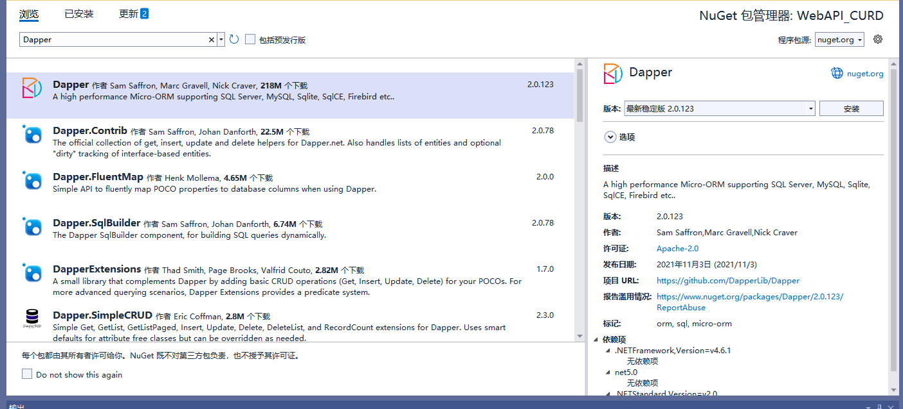

**[.NET6+]基于 Dapper SQLite 的基础的 CURD ASP.NET Core API 项目**

[toc]


# 创建项目

- VS 中创建 .NET6 项目 WebAPI_CURD（后改名为`WebAPI_CURD_Dapper_SQLite`）


## Dapper、Microsoft.Data.Sqlite

- 安装Nuget包 Dapper、Microsoft.Data.Sqlite (非.Core，其为依赖项。仅安装.Core执行时报错)




> Dapper is a micro ORM that supports executing raw SQL queries and mapping results to C# objects and collections, it's implemented as a collection of extension methods on top of the ADO.NET `IDbConnection` interface.

## AutoMapper

- 安装 Nuget 包 AutoMapper，用于不同C#类型的映射


## BCrypt.Net-Next

- 安装 Nuget 包 BCrypt.Net-Next，用于密码的哈希和验证 [.NET 6.0 - Hash and Verify Passwords with BCrypt](https://jasonwatmore.com/post/2022/01/16/net-6-hash-and-verify-passwords-with-bcrypt)


> `dotnet add package BCrypt.Net-Next`
>
> 或
>
> `Install-Package BCrypt.Net-Next`

## AutoMapper.Extensions.Microsoft.DependencyInjection

- 安装 Nuget 包 AutoMapper.Extensions.Microsoft.DependencyInjection，用于 `services.AddAutoMapper()`

- .proj 项目文件中添加 `<LangVersion>11.0</LangVersion>` 使用 C# 11，用到原始字符创`"""`。

## .cs 文件头部指定 namespace

- .cs 文件头部指定 `namespace` 与 之前形式的命名空间 的区别。`UserService.cs`中

## UseSwagger

- **使用了 WebAPI 项目默认的 app.UseSwagger(); app.UseSwaggerUI(); 【Swashbuckle】  【通过 /Swagger 访问】**

## 统一的正则

- **RegValidate 统一管理和使用正则表达式！**

```C#
/// <summary>
/// 正则验证的静态字段。形式为 Reg[N]\Reg[N]ErrMsg 成对出现，分别表示正则及该正则的错误消息
/// </summary>
public static class RegValidate
{
    /// <summary>
    /// 必须包含字母数组和特殊字符，长度8~16 的正则
    /// </summary>
    public const string Reg = "^(?=.*[0-9])((?=.*[A-Z])|(?=.*[a-z]))(?=.*[!@#$%^&*,\\._])[0-9a-zA-Z!@#$%^&*,\\\\._]{8,16}$";
    /// <summary>
    /// 必须包含字母数组和特殊字符，长度8~16 的正则错误消息
    /// </summary>
    public const string RegErrMsg = "必须包含字母数组和特殊字符，长度8~16";

    /// <summary>
    /// 必须包含大写、小写字母、数组和特殊字符，长度8~16 的正则
    /// </summary>
    public const string Reg1 = "^(?=.*[0-9])(?=.*[A-Z])(?=.*[a-z])(?=.*[!@#$%^&*,\\._])[0-9a-zA-Z!@#$%^&*,\\\\._]{8,16}$";
    /// <summary>
    /// 必须包含大写、小写字母、数组和特殊字符，长度8~16 的正则错误消息
    /// </summary>
    public const string Reg2ErrMsg = "必须包含大小字母数组和特殊字符，长度8~16";

}
```

## Program.cs 自定义处理和初始化设置

- Program.cs 中一些自定义处理的实现和介绍：

```C#
 #region 配置、添加自定义配置文件（JsonFile）
 // 添加自定义配置文件
 //builder.Configuration.AddJsonFile("custom_settings.json", optional: false, reloadOnChange: true);
 #endregion

 #region 配置 Kestrel 服务器
 builder.WebHost.UseKestrel(options =>
     {
         var configuration = (IConfiguration)options.ApplicationServices.GetService(typeof(IConfiguration))!;

         var httpPort = configuration.GetValue("WebHost:HttpPort", 5061);

         options.Listen(IPAddress.Any, httpPort);

         //// https
         //options.Listen(IPAddress.Any, 5001,
         // listenOptions =>
         // {
         //     listenOptions.UseHttps("certificate.pfx", "topsecret");
         // });
     }); 
 #endregion
```

```C#
#region 自定义的服务注入处理
// 初始化添加/注入当前的 Services
builder.Services.InitServices(); 
#endregion
```

```C#
#region 自定义配置和一些初始化
// 启动时需要执行的初始化操作
//await app.InitAppExecAsync();
app.InitAppExecAsync().Wait();
// 添加配置中间件
app.Configure(app.Environment); 
#endregion
```

## 项目结构

- **Controllers**  

Define the end points / routes for the web api, controllers are the entry point into the web api from client applications via http requests.

- **Models**  

Represent request and response models for controller methods, request models define parameters for incoming requests and response models define custom data returned in responses when required. The example only contains _request_ models because it doesn't contain any routes that require custom response models, entities are returned directly by the user `GET` routes.

- **Services**  

Contain business logic and validation code, services are the interface between controllers and repositories for performing actions or retrieving data.

- **Repositories**  

Contain database access code and SQL queries.

- **Entities**  

Represent the application data that is stored in the database.  
Dapper maps relational data from the database to instances of C# entity objects to be used within the application for data management and CRUD operations.

- **Helpers**  

Anything that doesn't fit into the above folders.

## 具体代码

参见项目

# 参考

[.NET 7.0 + Dapper + SQLite - CRUD API Tutorial in ASP.NET Core](https://jasonwatmore.com/net-7-dapper-sqlite-crud-api-tutorial-in-aspnet-core)