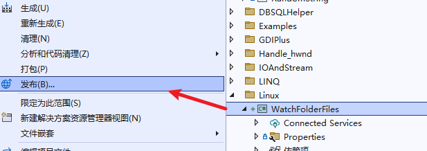

**创建.NET/.NET Core应用程序作为Linux服务部署和运行【以实现RHEL/Centos下的文件监视系统为例】**

[toc]

以实现RHEL/Centos下的文件监视系统为例，以Linux服务的形式运行.NET 6程序，查看具体的效果实现。

# .NET 对 Linux Service 的支持

Linux下有一个叫做 Systemd 的服务管理器，`Systemd`会在Linux系统初始化时启动，并控制系统内程序和服务的运行。

因此，在Linux下可以使用 Systemd 管理我们的服务。

.NET 支持使用 `Microsoft.Extensions.Hosting.Systemd` Nuget 包托管(host)为`Systemd`服务，Systemd 可以响应程序的启动、停止等程序事件。同时，程序日志也会被发送到`Journald`，它是Systemd的日志管理单元，并可以处理日志的优先级。

也就是，我们要在.NET下实现一个Systemd服务。

# 创建 Worker Service 项目

如下，创建 Worker Service 项目，项目名为 `WatchFolderFiles` (记：位于`linux/`目录下)


> 也可以通过命令行创建`dotnet new worker --name <project name>`。

使用的 worker template 会创建两个文件 Program 类 和 Worker 类，其包含 Worker Service 的部分代码。

`Program` 类中会添加`Worker`类作为 hosted service 并启动。

# 配置项目

通过 Nuget包管理器 添加`Microsoft.Extensions.Hosting.Systemd`包。也可以通过如下命令行添加。

```sh
dotnet add package Microsoft.Extensions.Hosting.Systemd
```

然后在 `Program` 类中调用 `UseSystemd()`：

```C#
public static void Main(string[] args)
{
    IHost host = Host.CreateDefaultBuilder(args)
        .UseSystemd()
        .ConfigureServices(services =>
        {
            services.AddHostedService<Worker>();
        })
        .Build();

    host.Run();
}
```

`UseSystemd()`实现如下几项功能，使 worker service 作为 Linux Systemd 服务运行：

- 设置`SystemdLifetime`托管(host)的生命周期。
- 向`Systemd`提供如程序启动、停止之类的通知消息。
- 以`Systemd`格式配置控制台日志。

**这些设置都是上下为感知的（context-aware，不需要额外设置），并仅在检测到进程作为Systemd服务运行时才会激活。**

# 一个最简单的日志记录示例

此处先实现一个最简单的日志记录示例程序。

在 `Service` 类的 `ExecuteAsync()` 方法中添加记录 Information、Waring 和 Error 的日志：

```C#
protected override async Task ExecuteAsync(CancellationToken stoppingToken)
{
    while (!stoppingToken.IsCancellationRequested)
    {
        _logger.LogInformation("Worker running at: {time}", DateTimeOffset.Now);
        _logger.LogWarning("A warning from from Worker running at: {time}", DateTimeOffset.Now);
        _logger.LogError("A error from Worker running at: {time}", DateTimeOffset.Now);
        await Task.Delay(1000, stoppingToken);
    }
}
```

后续我们可以查看Systemd服务被linux系统捕获的日志，并查看不同类型的区别。

> **`ExecuteAsync()` 会在服务启动时运行，并返回一个`Task`表示产时间运行操作的生命周期。**
> 
> 默认生成的 Work 代码就是一个每秒记录一条log的循环。

# 发布为 Systemd 服务

## 通过 Visual Studio 发布

右键解决方案资源管理器中的项目，并点击“发布”。



目标选择为文件夹：


下一步点击完成，这会创建一个Publish Profile（发布配置文件）。

然后点击“显示所有设置”或“更多-编辑”，修改配置：


- Configuration 选择`Release|Any CPU`
- Target Framework 选择合适的 .NET 版本，此处为 .NET 6
- Deployment Mode 推荐选择 “独立”（自包含`Self-Contained`）
- `Target Runtime`选择 `linux-x64`
- Target Location 选择发布的位置

File Publish Options 可以设置 是否生成单个文件 或 剪裁未使用的代码（在使用自包含部署时可以启用的设置）。

保存后，点击发布按钮，生成目标程序。


## 通过命令行直接发布

直接下项目目录下打开 powershell 或 cmd 命令行工具。

```sh
dotnet publish -p:PublishSingleFile=true --runtime linux-x64 -c Release --self-contained true -o ./bin/Release/net6.0/linux-x64/publish
```

> **启用单文件压缩，可以压缩生成的单文件大小 `-p:EnableCompressionInSingleFile=true`**
> 
> 压缩单个文件应用程序会产生启动成本，应用程序的加载速度可能会变慢。

> 指定 `-p:PublishTrimmed=true` 修剪代码。`IL Trimming`

> 关于 `PublishSingleFile`、`PublishTrimmed`，官方推荐在项目文件中指定，而不是命令行中。

## 命令行指定 .pubxml 文件发布【很好的方式】

这也是一个比较不错的方式。

```sh
dotnet publish -p:PublishProfile=FolderProfile
```

上面的命令将使用 `<project_folder>/Properties/PublishProfiles` 下的 `FolderProfile.pubxml` 文件构建项目。这也是 Visual Studio 创建发布配置文件的默认文件名。

# 创建Linux服务

为了创建 Linux Service，需要创建 Systemd unit 文件配置。Systemd 单元文件包含该单元的信息。本示例需要创建服务，所以需要添加 `[Service]` 区块。文件扩展名为`.service`。

创建 `my-test-worker.service` 文本文件，并添加如下内容：

```C#
[Unit]
Description=my-test-worker

[Service]
Type=notify
ExecStart=/usr/sbin/MyTestLinuxWorker/WatchFolderFiles

[Install]
WantedBy=multi-user.target
```

`[Unit]`定义service的元数据。此处使用`Description`提供一个服务名。

`[Service]`区块提供关于服务的配置；`Type=notify`表示在服务启动、停止等操作时会提供通知。`ExecStart`指定要执行的启动进程的命令的完整路径和参数。此处指向项目发布后上传到Linux位置的文件路径。

> 由于我的项目为`WatchFolderFiles`，发布后会看到名为`WatchFolderFiles`的文件。

`[Install]`区块定义 unit单元 是否启用或禁用的行为。`WantedBy`指定一个unit应该如何被启用。此处指定 Systemd 服务在一个多用户环境中启动，这是最常见的场景。

创建 Systemd unit 文件后，我们需要将其放至 Linux 系统的 `/etc/systemd/system` 路径（或者`/usr/lib/systemd/system/`路径）

以上设置完成后，将发布的文件放到`ExecStart`指定的路径，就可以使用 `systemctl daemon-reload` 命令重新加载 `Systemd` 服务。

```sh
sudo systemctl daemon-reload
```

这样，我们创建的服务就启动并运行了。

LimitCORE=infinity
LimitNOFILE=65536
LimitNPROC=65536
ExecReload=/bin/kill -HUP $MAINPID
killMode=process
Restart=always


# 参考

https://www.hanselman.com/blog/dotnet-new-worker-windows-services-or-linux-systemd-services-in-net-core

https://devblogs.microsoft.com/dotnet/net-core-and-systemd/

https://www.telerik.com/blogs/dotnet-worker-service-working-hard-so-you-dont-have-to


https://askubuntu.com/questions/1357607/mongodb-failed-result-core-dump

https://bbs.archlinux.org/viewtopic.php?id=236562

https://jira.mongodb.org/browse/SERVER-37419

https://forums.centos.org/viewtopic.php?t=70366&p=296102

https://unix.stackexchange.com/questions/415712/samba-smb-daemon-fails-to-start-installation-incomplete

https://unix.stackexchange.com/questions/303293/ubuntu-service-samba-is-masked-and-cant-start


