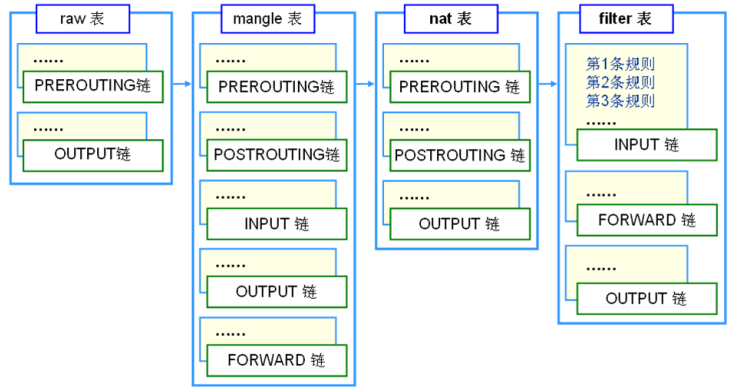
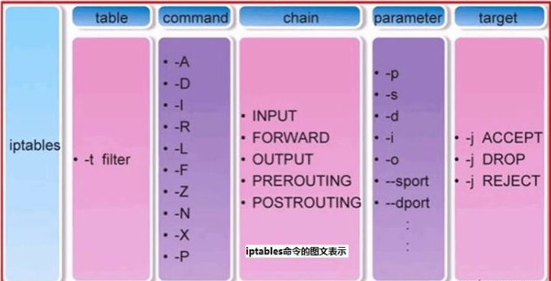
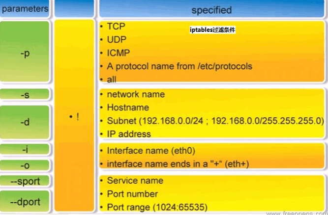
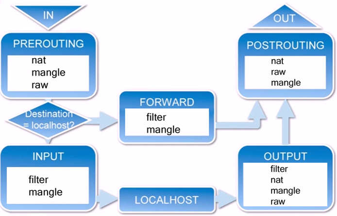
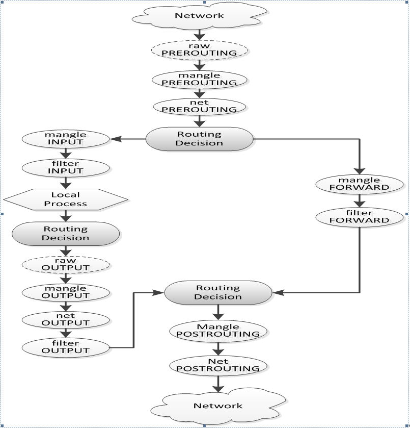

**centos下iptables防火墙规则用法和概述【转】**

[toc]

> 原文 [centos下iptables防火墙规则用法和概述](https://blog.csdn.net/qq_39565646/article/details/104913530)

iptables 是组成Linux平台下的包过滤防火墙，与大多数的Linux软件一样，这个包过滤防火墙是免费的，它可以代替昂贵的商业防火墙解决方案，完成 **封包过滤、封包重定向和网络地址转换(NAT)** 等功能。

在日常Linux运维工作中，经常会设置iptables防火墙规则，用来加固服务安全。

# iptables

以下对iptables的规则使用做了总结性梳理：

iptables首先需要了解的：

## **1）规则概念**

规则（rules）其实就是网络管理员预定义的条件，规则一般的定义为“如果数据包头符合这样的条件，就这样处理这个数据包”。

规则存储在内核空间的信息 包过滤表 中，这些规则分别指定了源地址、目的地址、传输协议（如TCP、UDP、ICMP）和服务类型（如HTTP、FTP和SMTP）等。

当数据包与规则匹配时，iptables就根据规则所定义的方法来处理这些数据包，如放行(accept)、拒绝(reject)和丢弃(drop)等。

配置防火墙的主要工作是添加、修改和删除规则等。

其中：

- 匹配（match）：符合指定的条件，比如指定的 IP 地址和端口。
- 丢弃（drop）：当一个包到达时，简单地丢弃，不做其它任何处理。
- 接受（accept）：和丢弃相反，接受这个包，让这个包通过。
- 拒绝（reject）：和丢弃相似，但它还会向发送这个包的源主机发送错误消息。这个错误消息可以指定，也可以自动产生。
- 目标（target）：指定的动作，说明如何处理一个包，比如：丢弃，接受，或拒绝。
- 跳转（jump）：和目标类似，不过它指定的不是一个具体的动作，而是另一个链，表示要跳转到那个链上。
- 规则（rule）：一个或多个匹配及其对应的目标。

## **2）iptables和netfilter的关系**

Iptables和netfilter的关系是一个很容易让人搞不清的问题。很多的知道iptables却不知道 netfilter。

其实，**iptables只是Linux防火墙的管理工具而已，位于`/sbin/iptables`。真正实现防火墙功能的是 netfilter，它是Linux内核中实现包过滤的内部结构**。

## **3）iptables的规则表和链**

- 表（tables）：提供特定的功能，iptables内置了4个表，即 filter表、nat表、mangle表和raw表，分别用于实现包过滤，网络地址转换、包重构(修改)和数据跟踪处理。

- 链（chains）：是数据包传播的路径，每一条链其实就是众多规则中的一个检查清单，每一条链中可以有一条或数条规则。当一个数据包到达一个链时，iptables就会从链中第一条规则开始检查，看该数据包是否满足规则所定义的条件。如果满足，系统就会根据 该条规则所定义的方法处理该数据包；否则iptables将继续检查下一条规则，如果该数据包不符合链中任一条规则，iptables就会根据该链预先定义的默认策略来处理数据包。

Iptables采用“表”和“链”的分层结构，在Linux中现在是四张表五个链。下面罗列一下这四张表和五个链（注意，一定要明白这些表和链的关系及作用）。




**规则表：**

    1）filter表 —— 三个链：INPUT、FORWARD、OUTPUT
作用：过滤数据包； 内核模块：iptables_filter.
    
    2）Nat表 —— 三个链：PREROUTING、POSTROUTING、OUTPUT
作用：用于网络地址转换（IP、端口）； 内核模块：iptable_nat
    
    3）Mangle表 —— 五个链：PREROUTING、POSTROUTING、INPUT、OUTPUT、FORWARD
作用：修改数据包的服务类型、TTL、并且可以配置路由实现QOS； 内核模块：iptable_mangle(别看这个表这么麻烦，咱们设置策略时几乎都不会用到它)
    
    4）Raw表——两个链：OUTPUT、PREROUTING
作用：决定数据包是否被状态跟踪机制处理； 内核模块：iptable_raw

**规则链：**

   1）INPUT——进来的数据包应用此规则链中的策略
   
   2）OUTPUT——外出的数据包应用此规则链中的策略
   
   3）FORWARD——转发数据包时应用此规则链中的策略
   
   4）PREROUTING——对数据包作路由选择前应用此链中的规则
（记住！所有的数据包进来的时侯都先由这个链处理）
   
   5）POSTROUTING——对数据包作路由选择后应用此链中的规则
（所有的数据包出来的时侯都先由这个链处理）

管理和设置iptables规则：





## **4）iptables传输数据包的过程**



 1）当一个数据包进入网卡时，它首先进入PREROUTING链，内核根据数据包目的IP判断是否需要转送出去。   

 2）如果数据包就是进入本机的，它就会沿着图向下移动，到达INPUT链。数据包到了INPUT链后，任何进程都会收到它。本机上运行的程序可以发送数据包，这些数据包会经过OUTPUT链，然后到达POSTROUTING链输出。   

 3）如果数据包是要转发出去的，且内核允许转发，数据包就会如图所示向右移动，经过FORWARD链，然后到达POSTROUTING链输出。


如果还是不清楚数据包经过iptables的基本流程，再看下面更具体的流程图：



从图中可将iptables数据包报文的处理过程分为三种类型：

- **1）目的为本机的报文**

报文以本机为目的地址时，其经过iptables的过程为：

  1. 数据包从network到网卡
  
  2. 网卡接收到数据包后，进入raw表的PREROUTING链。这个链的作用是在连接跟踪之前处理报文，能够设置一条连接不被连接跟踪处理。(注：不要在raw表上添加其他规则)

  3. 如果设置了连接跟踪，则在这条连接上处理。

  4. 经过raw处理后，进入mangle表的PREROUTING链。这个链主要是用来修改报文的TOS、TTL以及给报文设置特殊的MARK。(注：通常mangle表以给报文设置MARK为主，在这个表里面，千万不要做过滤/NAT/伪装这类的事情)

  5. 进入nat表的PREROUTING链。这个链主要用来处理 DNAT，应该避免在这条链里面做过滤，否则可能造成有些报文会漏掉。(注：它只用来完成源/目的地址的转换)

  6. 进入路由决定数据包的处理。例如决定报文是上本机还是转发或者其他地方。(注：此处假设报文交给本机处理)

  7. 进入mangle表的 INPUT 链。在把报文实际送给本机前，路由之后，我们可以再次修改报文。

  8. 进入filter表的 INPUT 链。在这儿我们对所有送往本机的报文进行过滤，要注意所有收到的并且目的地址为本机的报文都会经过这个链，而不管哪个接口进来的或者它往哪儿去。

  9. 经过规则过滤，报文交由本地进程或者应用程序处理，例如服务器或者客户端程序。


- **2）本地主机发出报文**

数据包由本机发出时，其经过iptables的过程为：

  1. 本地进程或者应用程序（例如服务器或者客户端程序）发出数据包。

  2. 路由选择，用哪个源地址以及从哪个接口上出去，当然还有其他一些必要的信息。

  3. 进入raw表的OUTPUT链。这里是能够在连接跟踪生效前处理报文的点，在这可以标记某个连接不被连接跟踪处理。

  4. 连接跟踪对本地的数据包进行处理。

  5. 进入 mangle 表的 OUTPUT 链，在这里我们可以修改数据包，但不要做过滤(以避免副作用)。

  6. 进入 nat 表的 OUTPUT 链，可以对防火墙自己发出的数据做目的NAT(DNAT) 。

  7. 进入 filter 表的 OUTPUT 链，可以对本地出去的数据包进行过滤。

  8. 再次进行路由决定，因为前面的 mangle 和 nat 表可能修改了报文的路由信息。

  9. 进入 mangle 表的 POSTROUTING 链。这条链可能被两种报文遍历，一种是转发的报文，另外就是本机产生的报文。

  10. 进入 nat 表的 POSTROUTING 链。在这我们做源 NAT（SNAT），建议你不要在这做报文过滤，因为有副作用。即使你设置了默认策略，一些报文也有可能溜过去。

  11. 进入出去的网络接口


- **3）转发报文**

报文经过iptables进入转发的过程为：

  1. 数据包从network到网卡
  
  2. 网卡接收到数据包后，进入raw表的PREROUTING链。这个链的作用是在连接跟踪之前处理报文，能够设置一条连接不被连接跟踪处理。(注：不要在raw表上添加其他规则)
  
  3. 如果设置了连接跟踪，则在这条连接上处理。
  
  4. 经过raw处理后，进入mangle表的PREROUTING链。这个链主要是用来修改报文的TOS、TTL以及给报文设置特殊的MARK。(注：通常mangle表以给报文设置MARK为主，在这个表里面，千万不要做过滤/NAT/伪装这类的事情)
  
  5. 进入nat表的PREROUTING链。这个链主要用来处理 DNAT，应该避免在这条链里面做过滤，否则可能造成有些报文会漏掉。(注：它只用来完成源/目的地址的转换)
  
  6. 进入路由决定数据包的处理。例如决定报文是上本机还是转发或者其他地方。(注：此处假设报文进行转发)
  
  7. 进入 mangle 表的 FORWARD 链，这里也比较特殊，这是在第一次路由决定之后，在进行最后的路由决定之前，我们仍然可以对数据包进行某些修改。
  
  8. 进入 filter 表的 FORWARD 链，在这里我们可以对所有转发的数据包进行过滤。需要注意的是：经过这里的数据包是转发的，方向是双向的。
  
  9. 进入 mangle 表的 POSTROUTING 链，到这里已经做完了所有的路由决定，但数据包仍然在本地主机，我们还可以进行某些修改。
  
  10. 进入 nat 表的 POSTROUTING 链，在这里一般都是用来做 SNAT ，不要在这里进行过滤。
  
  11. 进入出去的网络接口。


## iptables规则设置

- **1）iptables的基本语法格式**

`iptables [-t 表名] 命令选项 ［链名］ ［条件匹配］ ［-j 目标动作或跳转］`

说明：

表名、链名：用于指定iptables命令所操作的表和链；

命令选项：用于指定管理iptables规则的方式（比如：插入、增加、删除、查看等；

条件匹配：用于指定对符合什么样条件的数据包进行处理；

目标动作或跳转：用于指定数据包的处理方式（比如允许通过、拒绝、丢弃、跳转（Jump）给其它链处理。


- **2）iptables命令的管理控制选项**

`-A` 在指定链的末尾添加（append）一条新的规则 
`-D` 删除（delete）指定链中的某一条规则，可以按规则序号和内容删除 
`-I` 在指定链中插入（insert）一条新的规则，默认在第一行添加 
`-R` 修改、替换（replace）指定链中的某一条规则，可以按规则序号和内容替换 
`-L` 列出（list）指定链中所有的规则进行查看（默认是filter表，如果列出nat表的规则需要添加-t，即iptables -t nat -L）
`-E` 重命名用户定义的链，不改变链本身 
`-F` 清空（flush） 
`-N` 新建（new-chain）一条用户自己定义的规则链 
`-X` 删除指定表中用户自定义的规则链（delete-chain） 
`-P` 设置指定链的默认策略（policy）
`-Z` 将所有表的所有链的字节和数据包计数器清零 
`-n` 使用数字形式（numeric）显示输出结果 
`-v` 查看规则表详细信息（verbose）的信息 
`-V` 查看版本(version) 
`-h` 获取帮助（help）

- **3）防火墙处理数据包的四种方式**

ACCEPT 允许数据包通过
DROP 直接丢弃数据包，不给任何回应信息
REJECT 拒绝数据包通过，必要时会给数据发送端一个响应的信息。

LOG在/var/log/messages文件中记录日志信息，然后将数据包传递给下一条规则

- **4）iptables防火墙规则的保存与恢复**

iptables-save 把规则保存到文件中，再由目录`rc.d`下的脚本（/etc/rc.d/init.d/iptables）自动装载

使用命令 iptables-save 来保存规则。

```
一般用：
iptables-save > /etc/sysconfig/iptables
生成保存规则的文件/etc/sysconfig/iptables

也可以用：
service iptables save
它能把规则自动保存在/etc/sysconfig/iptables中
```

当计算机启动时，`rc.d`下的脚本将用命令 iptables-restore 调用这个文件，从而就自动恢复了规则。

- **5）iptables防火墙常用的策略梳理**

设置默认链策略

iptables 的 filter 表中有三种链：INPUT, FORWARD和OUTPUT。

默认的链策略是ACCEPT，可以将它们设置成DROP，如下命令就将所有包都拒绝了：

```sh
iptables -P INPUT DROP 
iptables -P FORWARD DROP 
iptables -P OUTPUT DROP
```

# 白名单规则和NAT转发规则

其实，在运维工作中最常用的两个规则就是白名单规则和NAT转发规则：

## 1）白名单规则

在linux终端命令行里操作时，如果不是默认的filter表时，需要指定表；  

如果在`/etc/sysconfig/iptables`文件里设置，就在对应表的配置区域内设置；  

上面两种方式设置效果是一样的！

比如开通本机的22端口，允许 192.168.1.0 网段的服务器访问（`-t filter`表配置可以省略，默认就是这种表的配置）

```sh
iptables -A INPUT -s 192.168.1.0/24 -p tcp -m state --state NEW -m tcp --dport 22 -j ACCEPT
或者
iptables -t filter -A INPUT -s 192.168.1.0/24 -p tcp -m state --state NEW -m tcp --dport 22 -j ACCEPT
```

开通本机的80端口，只允许192.168.1.150机器访问（32位掩码表示单机，单机指定时可以不加掩码）

```sh
iptables -t filter -A INPUT -s 192.168.1.150/32 -p tcp -m state --state NEW -m tcp --dport 80 -j ACCEPT
```

然后保存规则，重启iptables

```sh
service iptables save
service iptables restart
```

或者，在 `/etc/sysconfig/iptables` 文件里设置如下（其实上面在终端命令行里设置并save和restart防火墙后，就会自动保存规则到`/etc/sysconfig/iptables`这个文件中的）：

```sh
[root@bastion-IDC ~]# cat /etc/sysconfig/iptables
......
*filter
:INPUT ACCEPT [442620:173026884]
:FORWARD ACCEPT [118911:23993940]
:OUTPUT ACCEPT [8215384:539509656]
-A INPUT -m state --state RELATED,ESTABLISHED -j ACCEPT 
-A INPUT -p icmp -j ACCEPT 
-A INPUT -i lo -j ACCEPT 
-A INPUT -s 192.168.1.0/24 -p tcp -m state --state NEW -m tcp --dport 22 -j ACCEPT
-A INPUT -s 192.168.1.150/32 -p tcp -m state --state NEW -m tcp --dport 80 -j ACCEPT
 
[root@bastion-IDC ~]# service iptables restart
```

## 2）NAT转发设置

比如访问本机（192.168.1.7）的8088端口转发到192.168.1.160的80端口；访问本机的33066端口转发到192.168.1.161的3306端口。
准备工作：
本机打开ip_forword路由转发功能；192.168.1.160/161的内网网关要和本机网关一致！如果没有内网网关，就将网关设置成本机内网ip，并且关闭防火墙（防火墙要是打开了，就设置对应端口允许本机访问）

```sh
iptables -t nat -A PREROUTING -p tcp -m tcp --dport 8088 -j DNAT --to-destination 192.168.1.160:80iptables -t nat -A POSTROUTING -d 192.168.1.160/32 -p tcp -m tcp --sport 80 -j SNAT --to-source 192.168.1.7iptables -t filter -A INPUT -p tcp -m state --state NEW -m tcp --dport 8088 -j ACCEPT
 
iptables -t nat -A PREROUTING -p tcp -m tcp --dport 33066 -j DNAT --to-destination 192.168.1.161:3306iptables -t nat -A POSTROUTING -d 192.168.1.161/32 -p tcp -m tcp --sport 3306 -j SNAT --to-source 192.168.1.7iptables -t filter -A INPUT -p tcp -m state --state NEW -m tcp --dport 33066 -j ACCEPT
 
service iptables save
service iptables restart
```

或者，在/etc/sysconfig/iptables文件里设置如下

```sh
[root@bastion-IDC ~]# cat /etc/sysconfig/iptables
......
*nat
:PREROUTING ACCEPT [60:4250]
:INPUT ACCEPT [31:1973]
:OUTPUT ACCEPT [3:220]
:POSTROUTING ACCEPT [3:220]
-A PREROUTING -p tcp -m tcp --dport 8088 -j DNAT --to-destination 192.168.1.160:80    //PREROUTING规则都放在上面
-A PREROUTING -p tcp -m tcp --dport 33066 -j DNAT --to-destination 192.168.1.161:3306
-A POSTROUTING -d 192.168.1.160/32 -p tcp -m tcp --sport 80 -j SNAT --to-source 192.168.1.7   //POSTROUTING规则都放在下面
-A POSTROUTING -d 192.168.1.161/32 -p tcp -m tcp --sport 3306 -j SNAT --to-source 192.168.1.7
.....
*filter
:INPUT ACCEPT [16:7159]
:FORWARD ACCEPT [0:0]
:OUTPUT ACCEPT [715:147195]
-A INPUT -m state --state RELATED,ESTABLISHED -j ACCEPT
-A INPUT -p icmp -j ACCEPT
-A INPUT -i lo -j ACCEPT
-A INPUT -p tcp -m state --state NEW -m tcp --dport 8088 -j ACCEPT
-A INPUT -p tcp -m state --state NEW -m tcp --dport 33066 -j ACCEPT
.....
[root@bastion-IDC ~]# service iptables restart
```

- `iptables -L`  列出设置的规则，默认列出的是filter表下的规则

- `iptables -L -t nat`  如果列出nat表下规则，通过加-t参数


# 实例操作

## 删除INPUT链的第一条规则

```sh
iptables -D INPUT 1
```

## 拒绝进入防火墙的所有ICMP协议数据包

```sh
iptables -I INPUT -p icmp -j REJECT
```

## 允许防火墙转发除ICMP协议以外的所有数据包

```sh
iptables -A FORWARD -p ! icmp -j ACCEPT
```

说明：使用“!”可以将条件取反

## 拒绝转发来自192.168.1.10主机的数据，允许转发来自192.168.0.0/24网段的数据

```sh
iptables -A FORWARD -s 192.168.1.11 -j REJECT 
iptables -A FORWARD -s 192.168.0.0/24 -j ACCEPT
```

说明：注意一定要把拒绝的放在前面不然就不起作用了！

## 丢弃从外网接口（eth1）进入防火墙本机的源地址为私网地址的数据包

```sh
iptables -A INPUT -i eth1 -s 192.168.0.0/16 -j DROP 
iptables -A INPUT -i eth1 -s 172.16.0.0/12 -j DROP 
iptables -A INPUT -i eth1 -s 10.0.0.0/8 -j DROP
```

## 封堵网段（192.168.1.0/24），两小时后解封

```sh
# iptables -I INPUT -s 10.20.30.0/24 -j DROP 
# iptables -I FORWARD -s 10.20.30.0/24 -j DROP 
# at now 2 hours at> iptables -D INPUT 1 at> iptables -D FORWARD 1
```

说明：这个策略可以借助crond计划任务来完成，就再好不过了

## 只允许管理员从202.13.0.0/16网段使用SSH远程登录防火墙主机

```sh
iptables -A INPUT -s 202.13.0.0/16 -p tcp -m tcp -m state --state NEW --dport 22  -j ACCEPT 
```

说明：这个用法比较适合对设备进行远程管理时使用，比如位于分公司中的SQL服务器需要被总公司的管理员管理时

## 本机端口设置白名单

通常在服务器上会对某一服务 **端口的访问做白名单限制**，比如（其他端口设置和下面一致）：

运行本机的3306端口（mysql服务）被访问

```sh
iptables -A INPUT -p tcp -m tcp -m state --state NEW --dport 3306 -j ACCEPT 
```

或者，只允许本机的3306端口被192.168.1.0/24网段机器访问

```sh
iptables -A INPUT -s 192.168.1.0/24 -p tcp -m tcp -m state --state NEW --dport 3306 -j ACCEPT
```

## 允许本机开放从TCP端口20-1024提供的应用服务

```sh
iptables -A INPUT -p tcp -m tcp -m state --state NEW --dport 20:1024 -j ACCEPT
```

## 允许转发来自192.168.0.0/24局域网段的DNS解析请求数据包

```sh
iptables -A FORWARD -s 192.168.0.0/24 -p udp --dport 53 -j ACCEPT 
iptables -A FORWARD -d 192.168.0.0/24 -p udp --sport 53 -j ACCEPT
```

## 屏蔽指定的IP地址

以下规则将屏蔽 BLOCK_THIS_IP 所指定的IP地址访问本地主机：

```sh
BLOCK_THIS_IP="x.x.x.x"
iptables -A INPUT -i eth0 -s "$BLOCK_THIS_IP" -j DROP
```

(或者仅屏蔽来自该IP的TCP数据包）：

```sh
iptables -A INPUT -i eth0 -p tcp -s "$BLOCK_THIS_IP" -j DROP
```

## 屏蔽环回(loopback)访问

```sh
iptables -A INPUT -i lo -j DROP
iptables -A OUTPUT -o lo -j DROP
```

## 屏蔽来自外部的ping，即 禁止外部机器ping本机

```sh
iptables -A INPUT -p icmp --icmp-type echo-request -j DROP
iptables -A OUTPUT -p icmp --icmp-type echo-reply -j DROP
```

## 屏蔽从本机ping外部主机，禁止本机ping外部机器

```sh
iptables -A OUTPUT -p icmp --icmp-type echo-request -j DROP
iptables -A INPUT -p icmp --icmp-type echo-reply -j DROP
```

禁止其他主机ping本机，但是允许本机ping其他主机（禁止别人ping本机，也可以使用`echo 1 > /proc/sys/net/ipv4/icmp_echo_ignore_all`）

```sh
iptables -I INPUT -p icmp --icmp-type echo-request -j DROP 
iptables -I INPUT -p icmp --icmp-type echo-reply -j ACCEPT 
iptables -I INPUT -p icmp --icmp-type destination-Unreachable -j ACCEPT
```

## 禁止转发来自指定MAC的数据包

禁止转发来自MAC地址为00：0C：29：27：55：3F的和主机的数据包

```sh
iptables -A FORWARD -m mac --mac-source 00:0c:29:27:55:3F -j DROP
说明：iptables中使用“-m 模块关键字”的形式调用显示匹配。咱们这里用“-m mac –mac-source”来表示数据包的源MAC地址
```

## 允许防火墙本机对外开放TCP端口20、21、25、110以及被动模式FTP端口1250-1280

```sh
iptables -A INPUT -p tcp -m multiport --dport 20,21,25,110,1250:1280 -j ACCEPT
注意：这里用“-m multiport --dport”来指定多个目的端口
iptables -A INPUT -p tcp -m tcp -m multiport --dports 22,80,443,1250-1280 -m state --state NEW -j ACCEPT

也可以将这几个端口分开设置多行：
iptables -A INPUT -p tcp -m tcp -m state --state NEW --dport 22 -j ACCEPT
iptables -A INPUT -p tcp -m tcp -m state --state NEW --dport 80 -j ACCEPT
iptables -A INPUT -p tcp -m tcp -m state --state NEW --dport 443 -j ACCEPT
iptables -A INPUT -p tcp -m tcp -m state --state NEW --dport 1250:1280 -j ACCEPT
```

## 禁止转发指定源IP的TCP数据包

禁止转发源IP地址为192.168.1.20-192.168.1.99的TCP数据包

```sh
iptables -A FORWARD -p tcp -m iprange --src-range 192.168.1.20-192.168.1.99 -j DROP
说明：
此处用“-m iprange --src-range”指定IP范围
1）过滤源地址范围：
iptables -A INPUT -m iprange --src-range 192.168.1.2-192.168.1.7 -j DROP
2）过滤目标地址范围：
iptables -A INPUT -m iprange --dst-range 192.168.1.2-192.168.1.7 -j DROP
3）针对端口访问的过滤。下面表示除了192.168.1.5-192.168.1.10之间的ip能访问192.168.1.67机器的80端口以外，其他ip都不可以访问！
iptables -A INPUT -d 192.168.1.67 -p tcp --dport 80 -m iprange --src-range 192.168.1.5-192.168.1.10 -j ACCEPT
```

## 禁止转发与正常TCP连接无关的非--syn请求数据包

```sh
iptables -A FORWARD -m state --state NEW -p tcp ! --syn -j DROP
说明：“-m state”表示数据包的连接状态，“NEW”表示与任何连接无关的
```

## 拒绝访问防火墙的新数据包，但允许响应连接或与已有连接相关的数据包

```sh
iptables -A INPUT -p tcp -m state --state NEW -j DROP 
iptables -A INPUT -p tcp -m state --state ESTABLISHED,RELATED -j ACCEPT
```

说明：“ESTABLISHED”表示已经响应请求或者已经建立连接的数据包，“RELATED”表示与已建立的连接有相关性的，比如FTP数据连接等

## 防止DoS攻击

```sh
iptables -A INPUT -p tcp --dport 80 -m limit --limit 25/minute --limit-burst 100 -j ACCEPT
-m limit: 启用limit扩展，限制速度。
--limit 25/minute: 允许最多每分钟25个连接
--limit-burst 100: 当达到100个连接后，才启用上述25/minute限制
 
--icmp-type 8 表示 Echo request——回显请求（Ping请求）。下面表示本机ping主机192.168.1.109时候的限速设置：
iptables -I INPUT -d 192.168.1.109 -p icmp --icmp-type 8 -m limit --limit 3/minute --limit-burst 5 -j ACCEPT
```

## 允许路由

如果本地主机有两块网卡，一块连接内网(eth0)，一块连接外网(eth1)，那么可以使用下面的规则将eth0的数据路由到eht1：

```sh
iptables -A FORWARD -i eth0 -o eth1 -j ACCEPT
```

# 网络地址转换（NAT）

IPtables中可以灵活的做各种网络地址转换（NAT）

**网络地址转换主要有两种：SNAT和DNAT**

1）SNAT是`source network address translation`的缩写，即源地址目标转换。

比如，多个PC机使用ADSL路由器共享上网，每个PC机都配置了内网IP。PC机访问外部网络的时候，路由器将数据包的报头中的源地址替换成路由器的ip，当外部网络的服务器比如网站web服务器接到访问请求的时候，它的日志记录下来的是路由器的ip地址，而不是pc机的内网ip，这是因为，这个服务器收到的数据包的报头里边的“源地址”，已经被替换了。所以叫做SNAT，基于源地址的地址转换

2）DNAT是`destination network address translation`的缩写，即目标网络地址转换。

典型的应用是，有个web服务器放在内网中，配置了内网ip，前端有个防火墙配置公网ip，互联网上的访问者使用公网ip来访问这个网站。
当访问的时候，客户端发出一个数据包，这个数据包的报头里边，目标地址写的是防火墙的公网ip，防火墙会把这个数据包的报头改写一次，将目标地址改写成web服务器的内网ip，然后再把这个数据包发送到内网的web服务器上。这样，数据包就穿透了防火墙，并从公网ip变成了一个对内网地址的访问了。即DNAT，基于目标的网络地址转换

以下规则将会把本机192.168.1.17来自422端口的流量转发到22端口，这意味着来自422端口的SSH连接请求与来自22端口的请求等效。


