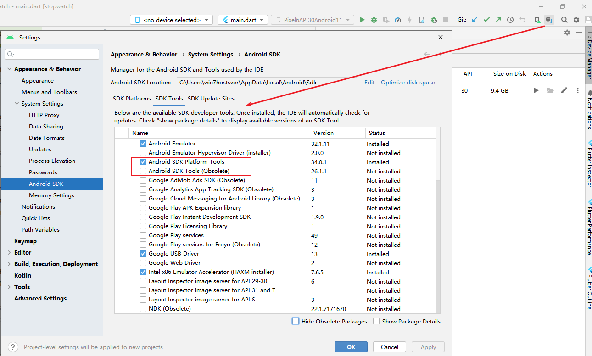

**flutter doctor --android-licenses 接受 Android license，及安装 Java 11 版本的 OpenJDK（Try re-installing or updating your Android SDK）**

[toc]

# Android license status unknown.

运行 `flutter doctor` 发现 安卓License 的状态不知道，需要运行 `flutter doctor --android-licenses` 接受 licenses。

```sh
> flutter doctor
Flutter assets will be downloaded from https://storage.flutter-io.cn. Make sure you trust this source!
Doctor summary (to see all details, run flutter doctor -v):
[√] Flutter (Channel master, 3.9.0-1.0.pre.161, on Microsoft Windows [版本 10.0.19045.2604], locale zh-CN)
[√] Windows Version (Installed version of Windows is version 10 or higher)
[!] Android toolchain - develop for Android devices (Android SDK version 33.0.0)
    X Android license status unknown.
      Run `flutter doctor --android-licenses` to accept the SDK licenses.
      See https://flutter.dev/docs/get-started/install/windows#android-setup for more details.
[√] Chrome - develop for the web
[√] Visual Studio - develop for Windows (Visual Studio Community 2022 17.5.1)
[√] Android Studio (version 2022.1)
[√] Connected device (3 available)
[!] Network resources
    X A network error occurred while checking "https://github.com/": 信号灯超时时间已到


! Doctor found issues in 2 categories.
```

# 报错 Try re-installing or updating your Android SDK 

如下，运行接受 License 时报错需要升级或重新安装 Android SDK。

```sh
> flutter doctor --android-licenses
Flutter assets will be downloaded from https://storage.flutter-io.cn. Make sure you trust this source!
java.lang.UnsupportedClassVersionError: com/android/prefs/AndroidLocationsProvider has been compiled by a more recent version of the Java Runtime (class file version 55.0), this version of the Java Runtime only recognizes class file versions up to 52.0
        at java.lang.ClassLoader.defineClass1(Native Method)
        at java.lang.ClassLoader.defineClass(ClassLoader.java:763)
        at java.security.SecureClassLoader.defineClass(SecureClassLoader.java:142)
        at java.net.URLClassLoader.defineClass(URLClassLoader.java:468)
        at java.net.URLClassLoader.access$100(URLClassLoader.java:74)
        at java.net.URLClassLoader$1.run(URLClassLoader.java:369)
        at java.net.URLClassLoader$1.run(URLClassLoader.java:363)
        at java.security.AccessController.doPrivileged(Native Method)
        at java.net.URLClassLoader.findClass(URLClassLoader.java:362)
        at java.lang.ClassLoader.loadClass(ClassLoader.java:424)
        at sun.misc.Launcher$AppClassLoader.loadClass(Launcher.java:349)
        at java.lang.ClassLoader.loadClass(ClassLoader.java:357)
        at java.lang.Class.getDeclaredMethods0(Native Method)
        at java.lang.Class.privateGetDeclaredMethods(Class.java:2701)
        at java.lang.Class.privateGetMethodRecursive(Class.java:3048)
        at java.lang.Class.getMethod0(Class.java:3018)
        at java.lang.Class.getMethod(Class.java:1784)
        at sun.launcher.LauncherHelper.validateMainClass(LauncherHelper.java:544)
        at sun.launcher.LauncherHelper.checkAndLoadMain(LauncherHelper.java:526)
Error: A JNI error has occurred, please check your installation and try again
Exception in thread "main" Android sdkmanager tool was found, but failed to run
(C:\Users\win7hostsver\AppData\Local\Android\sdk\cmdline-tools\latest\bin\sdkmanager.bat): "exited code 1".
Try re-installing or updating your Android SDK,
visit https://flutter.dev/docs/get-started/install/windows#android-setup for detailed instructions.
```

提示虽然是这样提示，但是在 Android Studio 的 SDK Manager 中 Android SDK Tools 和 Android SDK Platform-Tools 均安装了。

> 由于 Android SDK Tools 已废弃，后将其卸载。 【show hide】



几乎可以判断和 Android SDK 无关（实际是和Java版本有关，需要Java 11）

# 安装 Java 11

错误提示查看 https://flutter.dev/docs/get-started/install/windows#android-setup 接受安卓License中提到，必须安装 Java 11，及 `JAVA_HOME` 的 JDK 环境变量。


## 查看 Java 版本

- `java -version`

```sh
> java -version
java version "1.8.0_191"
Java(TM) SE Runtime Environment (build 1.8.0_191-b12)
Java HotSpot(TM) Client VM (build 25.191-b12, mixed mode)
```

Java 1.8 表示的是 Java 8。需要升级或修改为 Java 11

## 安装 Java 11 Open JDK

由于众所周知的 Java 11 的 License 授权原因。此处 **安装 Open JDK 版本的 Java 11**。

Java 11 Open JDK 的下载地址：https://jdk.java.net/java-se-ri/11

如下，Windows版本的 Java 11 二进制下载（推荐下载 Open JDK 11.0.2 见后续地址）：


> **RI 表示的 `Reference Implementations`。**

下载后解压，将解压的文件复制到要安装的问题。

比如，之前的 jdk1.8.0_192 安装在了 `C:\Program Files (x86)\Java`，将 `jdk-11` 也放在此处。


在电脑属性，环境变量中，修改 `JAVA_HOME` 为 jdk 的路径 `C:\Program Files (x86)\Java\jdk-11`


环境变量 的 `PATH` 中，添加 `C:\Program Files (x86)\Java\jdk-11\bin` 可执行路径。（删除 Java 8 的 Path）

保存后，查看版本：

```sh
> java -version
openjdk version "11" 2018-09-25
OpenJDK Runtime Environment 18.9 (build 11+28)
OpenJDK 64-Bit Server VM 18.9 (build 11+28, mixed mode)
```

# 执行 flutter doctor --android-licenses 成功

```sh
> flutter doctor --android-licenses
Flutter assets will be downloaded from https://storage.flutter-io.cn. Make sure you trust this source!
[=======================================] 100% Computing updates...
All SDK package licenses accepted.

```

再次检查如下：

```sh
> flutter doctor
Flutter assets will be downloaded from https://storage.flutter-io.cn. Make sure you trust this source!
Doctor summary (to see all details, run flutter doctor -v):
[√] Flutter (Channel master, 3.9.0-1.0.pre.161, on Microsoft Windows [版本 10.0.19045.2604], locale zh-CN)
[√] Windows Version (Installed version of Windows is version 10 or higher)
[√] Android toolchain - develop for Android devices (Android SDK version 33.0.0)
[√] Chrome - develop for the web
[√] Visual Studio - develop for Windows (Visual Studio Community 2022 17.5.1)
[√] Android Studio (version 2022.1)
[√] Connected device (3 available)
[√] Network resources

• No issues found!
```

# 附：open jdk 所有版本的下载地址

https://jdk.java.net/archive/  包含所有版本的 Open JDK。比如，想下载更新版本的 Open JDK 11：


# 附：Java SE、Java EE、Java ME 版本简要介绍

标准版的Java平台是一个Java2的平台，为用户提供一个程序开发环境。这个程序开发环境提供了开发与运行Java软件的编译器等开发工具、软件库及Java虚拟机。

Java2平台有3个版本：

- Java ME：适用于小型设备和智能卡的Java2平台Micro版（Java2 Platform Micro Edition，JavaME），J2ME、
- Java SE：适用于桌面系统的Java 2平台标准版（Java2 Platform Standard Edition，Java SE），J2SE、
- Java EE：适用于创建服务器应用程序和服务的Java 2平台企业版（Java2 Platform Enterprise Edition，Java EE），所以，有时也会看见 **J2EE技术** 的字样。

# 附：Java 11 的 Open JDK 和 Oracle JDK 基本相同

Java 11 的 Open JDK 和 Oracle JDK 可以看做是等价的，两者在功能或使用上基本没有区别（除了授权License外、是否会进行长期的维护支持、以及 极小差异）。

另外，AdoptOpenJDK 似乎也是推荐的开源版本。

> 从Java 11开始，甲骨文将不会为Java提供免费的长期支持(Lts)，比如，安全补丁和重要bug修复等。

> 自Oracle下載的JDK和JRE包含免費授權和商業授權的程式碼, 這兩種程式碼是一體的, 關鍵在於您會不會"誤用"到需要Oracle商業授權的商用程式碼, 因此Oracle會發函要求審計(audit)是否有使用到商業授權程式碼, 也就是在啟動Oracle Java時使用參數-XX:+UnlockCommercialFeatures. 如果您沒有啟用商業授權程式碼, 不需付錢, 無須擔心被告.
> 
> 出自：https://www.zhihu.com/question/296240718/answer/499774983

# 推荐：Java11时代，Oracle JDK与Open JDK

> [Java11时代Oracle JDK与Open JDK区别](https://www.cnblogs.com/guanghe/p/13023565.html)

1. 授权协议的不同： openjdk采用GPL V2协议放出，而Oracle JDK则采用JRL放出。两者协议虽然都是开放源代码的，但是在使用上的不同在于GPL V2允许在商业上使用，而JRL只允许个人研究使用。 Oracle JDK源代码包括“ORACLE PROPRIETARY / CONFIDENTIAL。使用受许可条款约束。

> JRL(JavaResearch License，Java研究授权协议

2. OpenJDK不包含Deployment（部署）功能： 部署的功能包括：Browser Plugin、Java Web Start、以及Java控制面板，这些功能在Openjdk中是找不到的。 

3. openjdk只包含最精简的JDK：Oracle JDK提供“JDK”和“JRE”， OpenJDK仅提供 ”JDK“。Oracle JDK提供“安装程序”（msi，rpm，deb等），将JDK二进制文件放在系统中，还包含更新规则，在某些情况下还处理一些常见配置，如设置公共环境变量（例如，JAVA_HOME in Windows）并建立文件关联（例如，使用java来启动.jar文件）。 OpenJDK仅作为压缩存档（tar.gz或.zip）提供。 OpenJDK不包含其他的软件包，比如Rhino Java DB JAXP……，并且可以分离的软件包也都是尽量的分离，但是这大多数都是自由软件，你可以自己下载加入。 

4. OpenJDK源代码不完整：Oracle JDK二进制文件包括未添加到OpenJDK二进制文件的API，如javafx，资源管理和（JDK 11之前的更改）JFR API。在采用GPL协议的Openjdk中，sun jdk的一部分源代码因为产权的问题无法开放openjdk使用，其中最主要的部份就是JMX中的可选元件SNMP部份的代码。因此这些不能开放的源代码将它作成plug，以供OpenJDK编译时使用，你也可以选择不要使用plug。而Icedtea则为这些不完整的部分开发了相同功能的源代码(OpenJDK6)，促使OpenJDK更加完整。 

5. 部分源代码用开源代码替换： 由于产权的问题，很多产权不是SUN的源代码被替换成一些功能相同的开源代码，比如说字体栅格化引擎，使用Free Type代替。 

6. OpenJDK不支持启动参数：如果使用-XX：+ UnlockCommercialFeatures标志，OpenJDK将（继续）抛出错误并停止。 Oracle JDK不再需要该标志，并将打印警告，但如果使用则继续执行。

7. 不能使用Java商标：Oracle JDK有Java杯和蒸汽图标，OpenJDK有Duke图标。java -version的输出会有所不同。 Oracle JDK包含LTS。 OpenJDK（由Oracle生成）不包括Oracle特定的LTS标识符。


> 另，推荐参考 [用jdk1.8还是用jdk11](https://blog.csdn.net/ranjio_z/article/details/111058111)。
> 
> 各大厂基本都已开源各自的jdk11版本：腾讯开源依旧Kona8，华为已有毕昇11，阿里已有Dragonwell 11，亚马逊已有Corretto11和15，Eclipse基金会已有AdoptOpenJDK11和15，Redhat也已有自己的jdk11版本。
> 
> **如果要使用 rocketmq ，可能需要考虑其他厂商开源的 jdk11 版本。**


# 推荐：JRE(Java Runtime Enviroment) - Java运行时环境

**JRE(Java Runtime Enviroment)** 是 Java 的运行环境。面向 Java 程序的使用者，而不是开发者。如果你仅下载并安装了 JRE，那么你的系统只能运行 Java 程序。JRE 是运行 Java 程序所必须环境的集合，包含 JVM 标准实现及 Java 核心类库。它包括 Java 虚拟机、Java 平台核心类和支持文件。它不包含开发工具(编译器、调试器等)。

**JDK(Java Development Kit)** 又称 J2SDK(Java2 Software Development Kit)，是 Java 开发工具包，它提供了 Java 的开发环境(提供了编译器 javac 等工具，用于将 java 文件编译为 class 文件)和运行环境(提 供了 JVM 和 Runtime 辅助包，用于解析 class 文件使其得到运行)。如果你下载并安装了 JDK，那么你不仅可以开发 Java 程序，也同时拥有了运行 Java 程序的平台。JDK 是整个 Java 的核心，包括了 Java 运行环境(JRE)，一堆 Java 工具 tools.jar 和 Java 标准类库 (rt.jar)。

> 参考自 [JRE 与 JDK的区别](https://www.runoob.com/w3cnote/the-different-of-jre-and-jdk.html)

