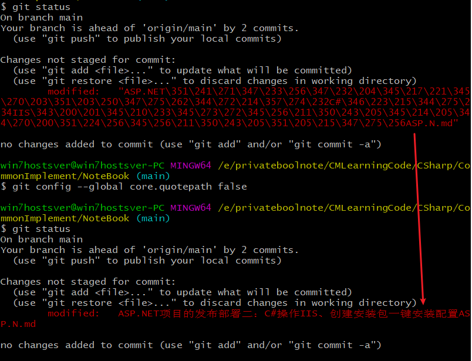

**git命令行界面下显示中文乱码的问题**

[toc]

查找资料时，看到有git下中文乱码的问题。

在操作的commit提交修改时，也看见过多次类似`\\211`的乱码，因为不影响实际使用也就没单独处理过。现象和下面的介绍一样，因此做个小记录。

> 参考自[git 和 jupyter 使用小技巧](https://todebug.com/tips/)中的部分

# 原文

git add 使用 tab 键自动补全的中文文件名乱码

文件名乱码如下所示：

 

**解决方法为：**

`git config --global core.quotepath false`

效果如下：

 

可以看出中文已经正确显示了。

# 设置效果

下图为 `git status` 查看文件变更时，中文乱码。解决后正确显示的效果：

  