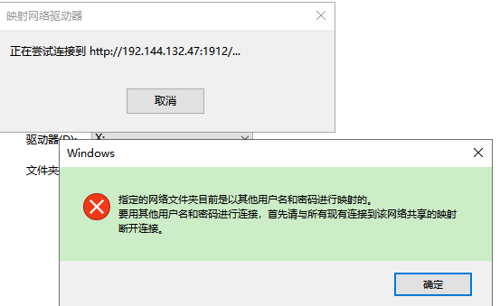
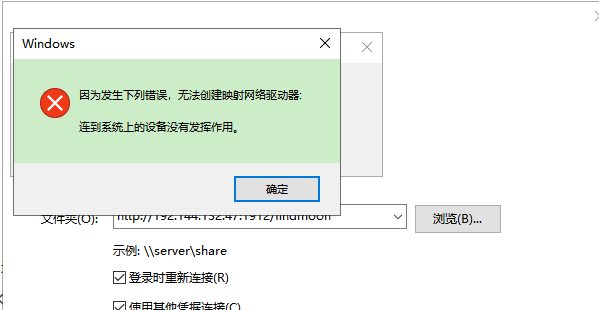
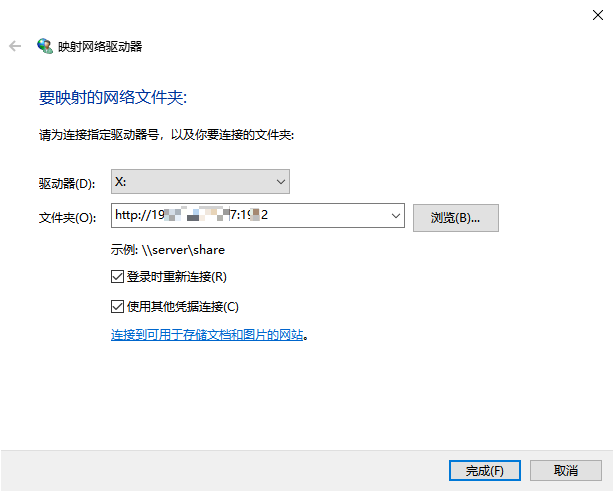
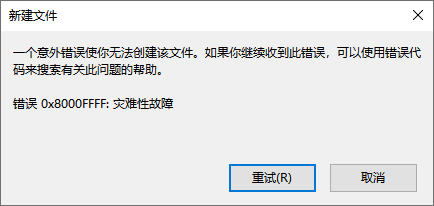

nginx搭建webdav服务器并使用Windows、Mac连接登陆

[tco]

# Windows下映射网络驱动器连接WebDAV

  

> 指定的网络文件夹目前是以其他用户名和密码进行映射的。要用其他用户名和密码进行连接，首先请与所有现有连接到该网络共享的映射
断开连接。

这是因为已经存在一个连接到当前webdav的映射连接，在WebDAV使用用户密码验证的情况下，不能再连接，关闭已有的映射，或者使用旧有的连接即可

  

> 因为发生下列错误，无法创建映射网络驱动器:连到系统上的设备没有发挥作用

映射驱动的连接WebDAV的url不要填写路径，就填写到port即可，比如 `http://ip:port`

如下：

  

映射网络驱动器登陆WebDAV后，在目录中创建文件报错如下：`无法创建该文件，错误: 0x8000FFFF: 灾难性故障`

  