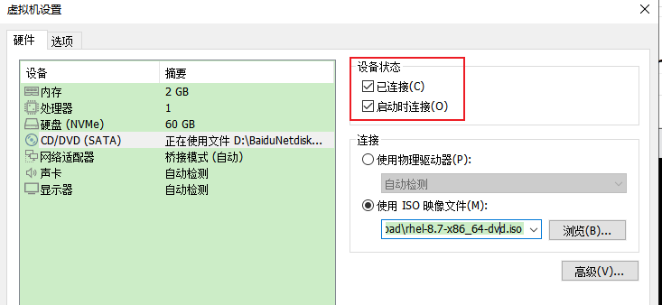

**redhat8搭建本地yum源，加载系统光盘作为rpm软件包仓库**

[toc]

redhat8和redhat7的iso镜像目录结构发生了变化，所以搭建本地yum源有所不同。

# 挂载iso系统镜像到本地目录

## 上传RHEL8系统的iso文件到服务器并挂载

```sh
mkdir /mnt/cdrom
mount -t iso9660 -o loop rhel-8.2-x86_64-dvd.iso /mnt/cdrom
```

> -t, --types fstype 表示要挂载的文件系统类型，通常不必指定。mount 会自动选择正确的类型。`iso9660` 表示光盘或光盘镜像。
> 
> `-o loop`选项，将指定 ISO 文件映射成一个回环设备，并且将这个设备挂载到指定的挂载点。

## 虚拟机连接iso镜像，然后直接挂载到linux目录。



和物理机上插入光驱是一样的。加载后的光盘镜像位于 `/dev/sr0` 。

```sh
# ls -al /dev/sr0
brw-rw---- 1 root cdrom 11, 0 Apr 12 22:07 /dev/sr0
```

`/dev/sr0` 是一个b（块）设备。block设备是没法直接使用cat、cp等命令操作的，需要通过mount挂载为字符设备。

```sh
mkdir /mnt/cdrom
mount -t iso9660 -o loop /dev/sr0 /mnt/cdrom
```

> 直接 `mount /dev/sr0 /mnt/cdrom` 也可。

## 设置开机自动挂载

`vim /etc/fstab` 打开 `/etc/fstab` 文件，添加如下一行（tab分割）：

```sh
/dev/sr0    /mnt/cdrom  iso9660 loop,nofail 0   0
```

外部设备在插入时挂载，在未插入时忽略。`nofail` 选项，可以在启动时若设备不存在直接忽略它而不报错.

> **推荐** 直接使用 `echo "/dev/sr0  /mnt/cdrom  iso9660 defaults,nofail 0   0" >> /etc/fstab` 添加。

> 有的介绍，开机挂载通过添加到 `/etc/rc.d/rc.local` 实现。
>
> **关于 `etc/fstab` 与 `/etc/rc.d/rc.local` 的区别：**
> 
> fstab里面会在程序启动前加载上NFS文件系统，放到`rc.local`里往往造成程序启动加载时找不到路径。
> 
> 如果有程序依赖于NFS的话还是的放到fstab比较好。
>
> `网络文件系统 - Network File System(NFS)`

## 查看挂载的内容

```sh
# cd /mnt/cdrom/
# ls
AppStream  EULA              images      RPM-GPG-KEY-redhat-beta
BaseOS     extra_files.json  isolinux    RPM-GPG-KEY-redhat-release
EFI        GPL               media.repo  TRANS.TBL
```

RHEL 8 将所有的 rpm 包分别放在了 `AppStream` 、`BaseOS` 两个目录。BaseOS里面存放一些基础应用，AppStream里面存放其他的应用。两个目录分别具有 Packages 目录。

- BaseOS存储库旨在提供一套核心的底层操作系统的功能，为基础软件安装库

- AppStream存储库中包括额外的用户空间应用程序、运行时语言和数据库，以支持不同的工作负载和用例。AppStream中的内容有两种格式——熟悉的RPM格式和称为模块的RPM格式扩展。

> 如果是 CentOS 镜像，rpm包通常直接位于 `Packages` 下。

# 创建repo文件

`vi /etc/yum.repos.d/local.repo`

填入下列内容，保存

```ini
[LocalBaseOS]
name=LocalBaseOS
baseurl=file:///mnt/cdrom/BaseOS
gpgcheck=0
enabled=1

[LocalAppStream]
name=LocalAppStream
baseurl=file:///mnt/cdrom/AppStream
gpgcheck=0
enabled=1
```

redhat8 系统镜像中的所有rpm包被拆分为BaseOS和AppStream两个目录。所以两个都要配置，才能安装或使用到全部的iso里的软件。

# 验证是否可用

> 可以考虑移动已有的网络源的repo再进行验证。

执行 `yum makecache` 清理缓存。或者，执行 `yum clean all` 清理所有。

> **在修改或添加新的yum源repo仓库文件后，通常只执行 `yum makecache` 重新生成缓存即可。**
> 
> 可以先执行 `yum clean all` 清理；再行 `yum makecache` 生成。

清理 yum缓存 后，执行 `yum repolist` 查看仓库列表：

```sh
# yum repolist
repo id                                 repo name
LocalAppStream                          LocalAppStream
LocalBaseOS                             LocalBaseOS
```

测试软件安装，以 `vim-enhanced` 为例：

```sh
# yum install vim-enhanced
Last metadata expiration check: 0:00:57 ago on Wed 12 Apr 2023 11:09:35 PM CST.
Dependencies resolved.
================================================================================
 Package           Arch        Version                     Repository      Size
================================================================================
Installing:
 vim-enhanced      x86_64      2:8.0.1763-19.el8_6.4       LocalAppStream      1.4 M
Installing dependencies:
 gpm-libs          x86_64      1.20.7-17.el8               LocalAppStream       39 k
 vim-common        x86_64      2:8.0.1763-19.el8_6.4       LocalAppStream      6.3 M

Transaction Summary
================================================================================
Install  3 Packages

Total size: 7.7 M
Installed size: 30 M
Is this ok [y/N]: y
Downloading Packages:
Running transaction check
....
....
....
  Verifying        : vim-enhanced-2:8.0.1763-19.el8_6.4.x86_64              3/3
Installed products updated.

Installed:
  gpm-libs-1.20.7-17.el8.x86_64
  vim-common-2:8.0.1763-19.el8_6.4.x86_64
  vim-enhanced-2:8.0.1763-19.el8_6.4.x86_64

Complete!
```

# 附：将一个光盘制作为光盘镜像

可以将 `/dev/sr0` 光盘文件制作为光盘映像iso：

```sh
dd if=/dev/sr0 of=/xxx/xxx.iso
```

> of 表示要制作的iso路径。

# 附：rhel8中，yum是dnf的一个软连接，所以yum和dnf都可以使用

dnf是新一代的rpm包管理器，取代了Yum包管理器，原来的Yum命令依旧可用。

# 系统ISO镜像提供 nginx 安装包

RHEL8系统集成了nginx服务，可以使用本地源安装 nginx `dnf -y install nginx`。

RHEL7是没有nginx服务的。

# 参考

- 仅仅是参考 [redhat8搭建本地yum源](https://blog.csdn.net/qq_39853326/article/details/117195701)，评论中有一条很有价值。

- [RHEL8配置本地yum源](https://www.cnblogs.com/hahaha111122222/p/11635447.html)