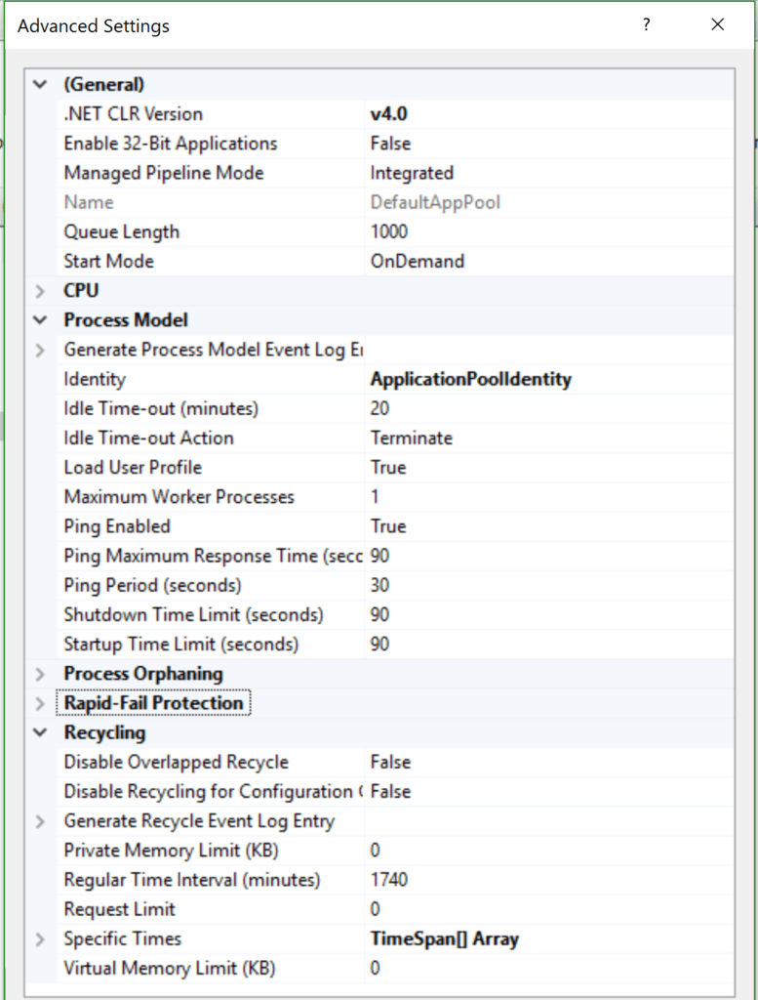

**什么是w3wp.exe？学习IIS Worker进程的基本内容**

[toc]

在 Microsoft 的 Internet Information Services （IIS）中运行的 Web 应用程序会使用所谓的 IIS 工作进程。这些工作进程以 w3wp.exe 的形式运行，每台计算机可以有多个工作进程。可以在Windows桌面或Windows服务器上运行IIS，尽管它通常只在配置为Web服务器的Microsoft Windows服务器上看到。

# 什么是 w3wp.exe / IIS工作进程？

Windows 服务器上的 Web 应用程序通过命令行或 Internet Information Systems （IIS） Manager 进行配置。在 IIS 中，你可以设置网站，以及为这些站点分配的应用程序池。**多个站点可以分配给单个 IIS 应用程序池**。（更多介绍可以参考官方文档）

  

当应用程序作为 IIS 工作进程启动时，定义的 IIS 应用程序池会成为 w3wp.exe 进程。它们有两个与正在使用的 .NET 版本相关的基本设置。

**IIS 工作进程（w3wp.exe）处理发送到已配置IIS应用程序池的IIS Web服务器的web请求。**

IIS 应用程序池还提供了一堆[高级设置](https://msdn.microsoft.com/en-us/library/aa720391(v=vs.71).aspx)。这些会影响 w3wp 和 IIS 工作进程的行为。包括运行它的 Windows 用户帐户、进程自动重启、自动关闭等。

**一个 IIS 应用程序池也可以在所谓的 [web garden](https://social.technet.microsoft.com/wiki/contents/articles/33647.web-gardening-in-iis-7-configure-step-by-step.aspx) 中创建多个 IIS 工作进程。**

  

# 如何查看运行的IIS工作进程（w3wp.exe）

通过 Windows任务管理器（Windows Task Manager），你可以看见名为w3wp.exe的进程。在 IIS管理控制台 中，可以查看更详细的信息。

打开IIS管理器，在左边点击计算机名，将会看到下图右边所示的类似图标列表。双击“Worker Processes”（工作进程），将会看到当前运行的进程列表。

  

在工作进程界面，你可以看到比Windows任务管理器更详细的内容。比如很容易的看到IIS应用程序池的名称、正在运行的 w3wp.exe 进程的进程ID。

  

如果想要进一步探究，可以双击工作进程，查看IIS工作进程中当前正在执行哪个web请求。

# 关于运行IIS应用程序池的警告

有一个需要了解的 IIS 应用程序池的关键事项有点令人困惑。

在 IIS 管理控制台中，可以停止和启动应用程序池。但是，**仅仅因为启动了 IIS 应用程序池，可能没有运行的 IIS 工作进程 （w3wp），在收到第一个 Web 请求之前，IIS 不会启动工作进程。**

# 如何停止或禁用 IIS工作进程

如果要停止运行的 w3wp.exe，则需要停止 IIS 应用程序池或完全禁用 IIS。

如果要完全关闭 IIS Web 服务器，则需要停止名为“World Wide Web Publish Service（万维网发布服务）”的 Windows 服务。确保停止它，然后将“启动类型”修改为“已禁用”。如果不禁用它，它将在重新启动 Windows 时在后台启动。

  

除了完全禁用IIS，还可以在IIS管理控制台中 单独停止 IIS应用程序池。

  

> 关于停止或关闭 w3wp.exe 进程，还可以考虑“空闲超时”：
> 
> 在应用程序池的配置中，"空闲超时"设定合适的时间，系统默认的是20分钟
> 
> 设定好指定的时间，在这个时间范围内没有新的web访问，系统就会自动的关闭 W3WP.EXE 进程。

# 监视 IIS工作进程 和 ASP.NET 应用程序

如果 Web 服务器上运行了 极其重要的 ASP.NET Web 应用程序，则，监视 服务器、IIS 和应用程序 非常重要。知道 w3wp.exe 是否停止运行、服务器是否出现故障或应用程序是否运行缓慢 也显得非常重要。

# 参考

基本翻译自 [What is w3wp.exe? Learn the Basics About IIS Worker Processes](https://stackify.com/w3wp-exe-iis-worker-process/)
