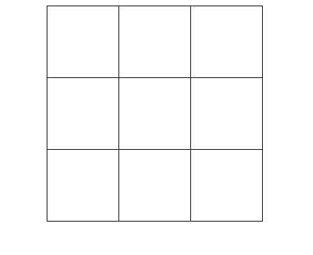
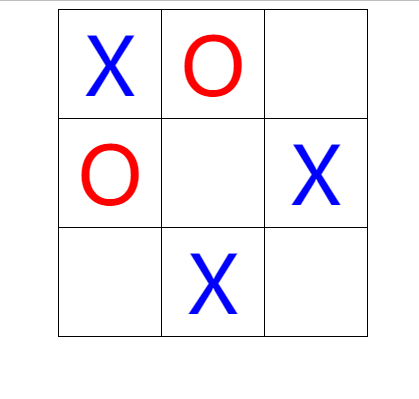
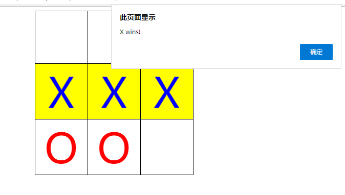
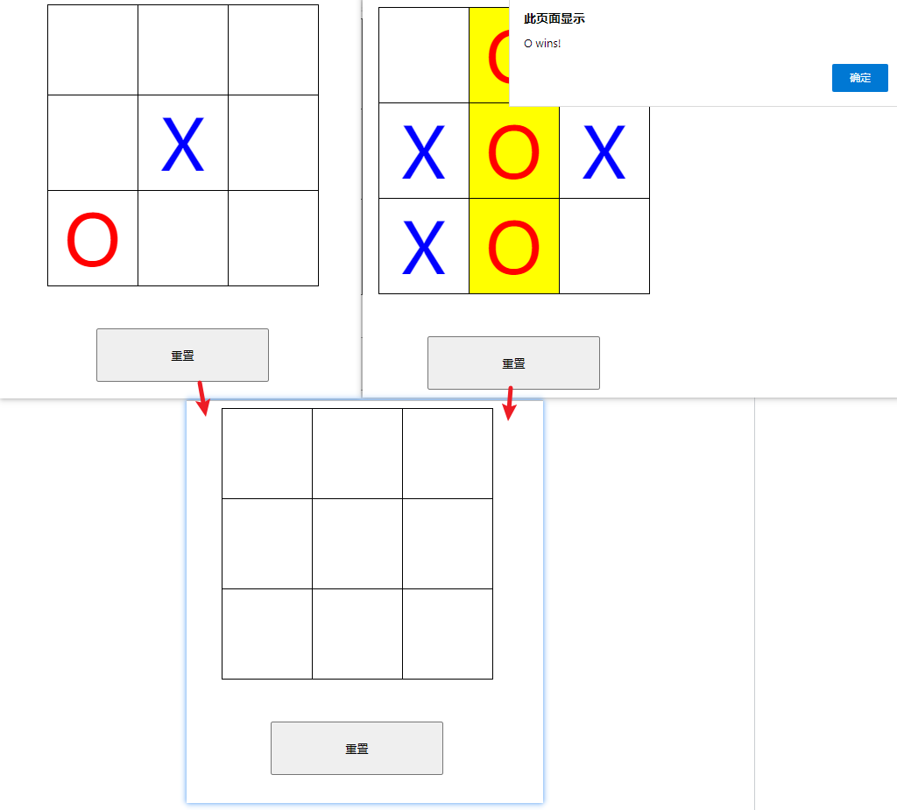

**使用 JavaScript、HTML 和 CSS 创建双人井字游戏【译】**

[toc]

随时可以在 Web 浏览器中启动并运行这个简单的小游戏。


Tic-tac-toe(井字游戏) 是一种流行的游戏，使用 3×3 网格。游戏的目标是成为第一个将三个符号放置在直线水平、垂直或对角线上的玩家。

你可以创建一个使用 HTML、CSS 和 JavaScript 在 Web 浏览器中运行的井字游戏，使用 HTML 添加包含 3×3 网格的内容，并使用 CSS 为游戏设计添加一些样式。

然后，使用 JavaScript 来实现游戏的功能，包括放置符号、在玩家之间轮流以及决定谁获胜。

# 创建 Tic-Tac-Toe 游戏的UI

> 注意：You can read and download the full source code for this game from its [GitHub repository](https://github.com/makeuseofcode/JavaScript-Tic-Tac-Toe-Game).

井字游戏是学习如何编程时可以制作的众多游戏之一，它是练习一种新的语言或环境时很好的选择。

1. 创建新的文件`Tic-Tac-Toe.html`。

2. 文件内添加如下 HTML 结构，其中包括三行三列的table。

```html
<!DOCTYPE html>
<html lang="en">
<head>
    <title></title>
    <meta charset="UTF-8">
    <meta name="viewport" content="width=device-width, initial-scale=1">
    <style>
    /* css */
    </style>
</head>
<body>
    <div class="container">
        <table>
            <tr>
                <td id="1"></td>
                <td id="2"></td>
                <td id="3"></td>
            </tr>
            <tr>
                <td id="4"></td>
                <td id="5"></td>
                <td id="6"></td>
            </tr>
            <tr>
                <td id="7"></td>
                <td id="8"></td>
                <td id="9"></td>
            </tr>
        </table>
    </div>
</body>
</html>
```

3. 添加如下 CSS 样式，对 三行三列的 table 布局。

```css
table {
  border-collapse: collapse;
  margin: 0 auto;
}

td {
  width: 100px;
  height: 100px;
  text-align: center;
  vertical-align: middle;
  border: 1px solid black;
}
```



# 如何轮流向游戏板添加符号

（How to Take Turns Adding Symbols to the Game Board）

游戏有两个玩家，分别使用“X”或“O”符号，通过点击单元格依次添加，游戏直到你们创建了一个横向、竖向或对角线的直线。

使用 JavaScript 添加该功能：

1. 添加一个字符串表示玩家的符号，可以是“X”或“O”。默认第一个玩家将使用“X”：

```js
let playerSymbol = "X";
```

2. 添加另外的变量保持跟踪游戏是否结束：

```js
let gameEnded = false;
```

3. 每一个 HTML table 的单元格都有一个 1~9 的Id。对table的每个单元格添加一个事件监听器，处理用户点击单元格的操作：

```js
for (let i = 1; i <= 9; i++) {
  document.getElementById(i.toString()).addEventListener(
    "click", 
    function() {
            
    }
  );
}
```

4. 在事件监听器内部，改变内部的HTML显示当前的符号。确保首先使用条件语句判断单元格为空，或游戏还没有结束：

```js
if (this.innerHTML === "" && !gameEnded) {
  this.innerHTML = playerSymbol;
}
```

5. 向 HTML 元素添加一个class，设置在网格中显示的符号的样式。class名为“X”或“O”，取决于符号内容：

```js
this.classList.add(playerSymbol.toLowerCase());
```

6. 在 css 样式中，添加对于 “X”或“O” 符号的新class，两个符号会显示不同的颜色：

```css
.x {
  color: blue;
  font-size: 80px;
}

.o {
  color: red;
  font-size: 80px;
}
```

7. 在 js 中，在修改 innerHTML 的显示符号之后，交换符号。例如，如果玩家刚刚放置了“X”，变更下一次的符号为“O”：

```js
if (playerSymbol === "X")
  playerSymbol = "O"
else
  playerSymbol = "X"
```

8. 在浏览器中打开 html 运行游戏，通过在网格的单元格中点击放置符号，游戏将会交替使用 “X”和“O” 符号。



# 如何决定赢家？

到目前为止，即使玩家已经放置了三个连续的符号，游戏仍然继续。我们需要在每次轮流放置符号后，添加一个结束条件的检查。

1. 在 js 中，添加一个新的变量存储在 3x3 的网格中所有可能的“赢”的位置。例如，“[1,2,3]”是第一行、“[1,4,7]”是一个对角线行。

```js
let winPos = [
  [1, 2, 3], [4, 5, 6], 
  [7, 8, 9], [1, 4, 7], 
  [2, 5, 8], [3, 6, 9], 
  [1, 5, 9], [3, 5, 7]
];
```

2. 添加一个名为 `checkWin()` 的新函数，函数内部循环每一个可能“赢”的位置。

```js
function checkWin() {
   for (let i = 0; i < winPos.length; i++) {

   }
}
```

3. 在循环内部，检查所有的单元格是否包含玩家的符号；如果条件为 true，表示所有的当前符号位于一条直线，在if语句内，可以向用户显示消息。还可以通过向 HTML 元素添加 “win” CSS 类改变样式！

```js
if (
  document.getElementById(winPos[i][0]).innerHTML === playerSymbol &&
  document.getElementById(winPos[i][1]).innerHTML === playerSymbol &&
  document.getElementById(winPos[i][2]).innerHTML === playerSymbol
) {
    document.getElementById(winPos[i][0]).classList.add("win");
    document.getElementById(winPos[i][1]).classList.add("win");
    document.getElementById(winPos[i][2]).classList.add("win"); 
    gameEnded = true;

    setTimeout(function() {
      alert(playerSymbol + " wins!");
    }, 500);
}
```

4. 添加 “win” CSS class 的样式。当玩家赢了后，它将变更赢了的单元格的背景颜色为黄色：

```css
.win {
  background-color: yellow;
}
```

5. 在之前步骤中添加的事件处理内，每次玩家轮流放置符号后调用 `checkWin()` 函数。


```js
for (let i = 1; i <= 9; i++) {
  // Whenever a player clicks on a cell
  document.getElementById(i.toString()).addEventListener(
    "click", 
    function() {
      if (this.innerHTML === "" && !gameEnded) {
        // Display either "X" or "O" in the cell, and style it
        this.innerHTML = playerSymbol;
        this.classList.add(playerSymbol.toLowerCase());
                
        // Check if a player has won
        checkWin();
                
        // Swap the symbol to the other one for the next turn
        if(!gameEnded){
             if (playerSymbol === "X")
                 playerSymbol = "O"
             else
                 playerSymbol = "X"
         }
      }
    }
  );
}
```




# 如何重置游戏面板？

一旦玩家赢了游戏，应该可以重置游戏面板。如下，通过添加点击按钮实现。

1. 在 HTML 中，table 后面添加一个 重置 按钮：

```html
<button id="reset">重置</button>
```

2. 添加重置按钮的样式：

```css
.container {
  display: flex;
  flex-direction: column;
}

#reset {
  margin: 48px 40%;
  padding: 20px;
}
```

3. 在 js 中，添加一个无论何时用户点击“重置”按钮，都会运行的事件处理器。对于网格中每一单元格，通过 `getElementById()` 获取HTML元素，移除“O”和“X”符号重置 innerHTML，并移除所有其他CSS样式：

```js
document.getElementById("reset").addEventListener(
  "click", 
  function() {
    for (let i = 1; i <= 9; i++) {
      document.getElementById(i.toString()).innerHTML = "";
      document.getElementById(i.toString()).classList.remove("x");
      document.getElementById(i.toString()).classList.remove("o");
      document.getElementById(i.toString()).classList.remove("win");
      gameEnded = false;
    }
  }
);
```

4. 浏览器中再次打开 html 文件，运行游戏。

5. 开始放置“O”和“X”符号，测试游戏的输赢、按钮重置。



# 通过制作游戏学习 JavaScript 

通过使用 JavaScript 创建更多的的项目来不断提升你的编程技巧。在web环境中，使用像 JavaScript 和 HTML 这样的跨平台、开源的技术构建简单的游戏和工具是很容易的。

没有比实际编写程序能够提升你的编程能力更好的方式了！

