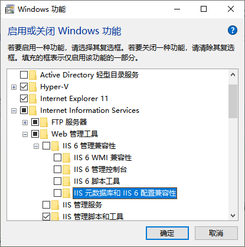

**使用DirectoryServices操作IIS服务器站点【IIS6】**

[toc]

> 更多的使用介绍参见 [Creating Sites and Virtual Directories Using System.DirectoryServices](https://learn.microsoft.com/en-us/previous-versions/iis/6.0-sdk/ms524896(v=vs.90)) 及与之相关的一系列介绍。

`System.DirectoryServices`主要是 IIS6中 用于配置服务器站点、虚拟目录的API，通过`DirectoryEntry`完成创建站点、应用程序和虚拟目录、操作应用程序池、修改获取各种属性等。

> 需要引用`System.DirectoryServices.dll`。

# IIS7+ 使用报错`System.Runtime.InteropServices.COMException:“未知错误(0x80005000)”`

如果在 IIS7+ 中使用`DirectoryServices`的`DirectoryEntry`，会发生异常报错：

`[System.Runtime.InteropServices.COMException] {"Unknown error (0x80005000)"} `

这是因为该操作的API主要用于 IIS6 ，错误原因在于缺少 ADSI provider 支持。

IIS7+ 默认并没有安装ADSI provider。

如果想在 IIS7及以上版本中 使用，解决这个问题，需要安装“IIS 元数据库和IIS 6配置兼容性”。

“控制面板”->“程序和功能”->面板左侧“启用或关闭 Windows 功能”->“Internet信息服务”->“Web管理工具”->“IIS 6管理兼容性”->“IIS 元数据库和IIS 6 配置兼容性”：

  

# 具体

string[] serverBind = ppC["ServerBindings"][0].ToString().Split(':');//获取网站绑定的IP，端口，主机头
                string EnableDeDoc = ppC["EnableDefaultDoc"][0].ToString();
                string DefaultDoc = ppC["DefaultDoc"][0].ToString();//默认文档
                string MaxConnections = ppC["MaxConnections"][0].ToString();//iis连接数,-1为不限制
                string ConnectionTimeout = ppC["ConnectionTimeout"][0].ToString();//连接超时时间
                string MaxBandwidth = ppC["MaxBandwidth"][0].ToString();//最大绑定数
                string ServerState = ppC["ServerState"][0].ToString();//运行状态    

# 参考

- [DirectoryEntry配置IIS7出现ADSI Error：未知错误(0x80005000)](https://blog.csdn.net/ts1030746080/article/details/8741399)

- [C#获取IIS所有站点及虚拟目录和应用程序(包含名称及详细信息)](https://www.cnblogs.com/nanfei/p/6296825.html)