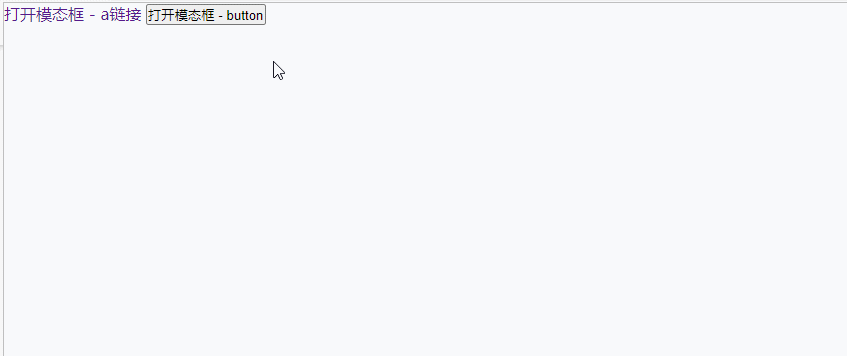

**使用HTML、CSS (JavaScript)创建一个极其简单的Modal模态框**

[toc]

> 主要参考自 [使用HTML5和CSS3制作一个模态框](https://juejin.cn/post/6844903570458804232)
> 
> 略有修改，添加了按钮点击、把模态框内容拆分为 header body footer 三部分、添加关闭的class、js操作显示和关闭。

效果如下：



全部代码如下，均有详细注释，不再赘述！

在 `cm-modal-wrap` 上 添加 class `cm-click-mask-close`，实现点击遮罩层关闭modal。

> 纯CSS的模态框，原理是借助 `:target` 伪类实现，通过`a`的`href`链接指向模态框的元素id，点击会增加`:target`实现。

> **`pointer-events: none;` --- 不响应鼠标事件**；注意显示后设置为 `pointer-events: auto;`。

> 关于遮罩层的透明效果，示例中使用的是 `opacity: .8;`，由于其作用到子元素效果。
> 
> 因此，**推荐使用 `background-color: rgba(0,0,0,0.5);` 半透明背景实现！**
> 
> ```css
> /* 设置半透明背景，通过 --bg-alpha 指定透明度，默认值0.5 */
> background-color: rgba(0,0,0,var(--bg-alpha,.5));
> ```

> 遮罩层的显示与隐藏，除了使用`opacity: 0;`，还可以通过指定 `display:none/block/flex`、`visibility:hidden;`/`visibility:visible;` 实现。

```html
<!DOCTYPE html>
<html lang="en">
<head>
    <title></title>
    <meta charset="UTF-8">
    <meta name="viewport" content="width=device-width, initial-scale=1">
    <!-- 
        1. 有一个按钮或者链接，用户点击它来触发模态框的显示；
        2. 模态框显示时，会有一个透明的遮罩层，遮挡住当前整个视口；
        3. 模态框内容会以非透明色（通常是白色）出现在视口某个位置（通常是中间）；
        4. 模态框内容（通常在右上角）会有一个“关闭”标志，点击它会让模态框隐藏；
        5. 模态框内容应该是根据实际业务场景所指定的，因此可以为任意结构。
      -->
    <style>
        * {
            margin: 0;
            padding: 0;
            box-sizing: border-box;
        }
        a {
            text-decoration: none;
        }


        /* 模态框初始状态 */
        .cm-modal-wrap {
            font-family: Arial, Helvetica, sans-serif;
            /* 通过 position 让遮罩层撑满整个屏幕 */
            position: fixed;
            top: 0;
            right: 0;
            bottom: 0;
            left: 0;
            /* 遮罩层背景色为黑色 */
            background: #000;
            /* 给 z-index 一个过大的值，确保遮罩层”真的遮盖住了“模态框背后的元素 */
            z-index: 99999;
            /* 设置 opacity 为 0，用于隐藏模态框 */
            opacity: 0;
            /* 一些过渡效果 */
            -webkit-transition: opacity 400ms ease-in;
            -moz-transition: opacity 400ms ease-in;
            transition: opacity 400ms ease-in;
            /* pointer-events: none 【不响应鼠标事件】鼠标事件“穿透”该元素并且指定该元素“下面”的任何东西，在元素透明时不影响对其底部元素的操作 */
            /* 请参阅：https://developer.mozilla.org/zh-CN/docs/Web/CSS/pointer-events */
            pointer-events: none;
        }

        /* 模态框显示状态 */
        .cm-modal-wrap:target, .cm-modal-wrap.cm-modal-show {
            /* 不透明为 0.8，不要太低，它影响内部元素的透明度，且内部元素无法调整opacity（因为是以父元素为基础的） */
            opacity: .8;
            /* 与 pointer-events 属性未指定时的表现效果相同 */
            /* 请参阅：https://developer.mozilla.org/zh-CN/docs/Web/CSS/pointer-events */
            pointer-events: auto;
        }

        /* 模态框内容，你也可以自定义 */
        .cm-modal-content {
            width: 400px;
            position: relative;
            margin: 10% auto;
            padding: 26px 20px 13px 20px;
            border-radius: 10px;
            background: #fff;
            opacity: 1;
        }

        /* 关闭 */
        .cm-modal-close {
            position: absolute;
            right: 15px;
            top: 10px;
            cursor: pointer;
        }

        .cm-modal-header {
            text-align: center;
        }

        .cm-modal-footer {
            text-align: right;
        }

        .cm-modal-body {
            margin: 16px 0;
        }
    </style>
</head>
<body>
    <!-- 显示模态框的两种方式：
            1. 通过 a 链接 href 指向模态框的id
            2. 通过 click 事件，点击处理中向模态框添加 cm-modal-show class显示
     -->
    <a href="#my-modal-dialog">打开模态框 - a链接</a>
    <button type="button" id="open-modal">打开模态框 - button</button>

    <!-- 模态框结构 -->
    <!-- 1. 模态框容器的根节点，通常显示为一个半透明/透明的遮罩覆盖全屏 -->
    <!-- .cm-modal-wrap 上 添加 .cm-click-mask-close class 实现点击遮罩层关闭Modal-->
    <div id="my-modal-dialog" class="cm-modal-wrap">
        <!-- 2. 自义定的模态框内容 -->
        <div class="cm-modal-content">
            <!-- 3. 模态框关闭按钮 通常包含header(标题)、body(内容)、footer(额外信息、确定/取消 按钮) -->
            <a href="#close" title="关闭" class="cm-modal-close">❌</a>
            <h2 class="cm-modal-header">
                模态框的Header，Title标题
            </h2>
            <div class="cm-modal-body">
                模态框的Body，将具体要显示的信息放在这里，比如表单信息、提示警告、交互反馈等，添加 确定/取消/提交/重置 等按钮。
            </div>
            <h6 class="cm-modal-footer">
                <!-- 模态框的Footer，可以放入一些额外信息。 -->
            </h6>
        </div>
    </div>
    <script>
        // 显示模态框，需要自定义点击哪个元素显示
        document.querySelector('#open-modal').addEventListener('click', function () {
            document.querySelector('#my-modal-dialog').classList.add('cm-modal-show')
        })

        // 关闭模态框
        document.querySelector('.cm-modal-close').addEventListener('click', function () {
            document.querySelector('#my-modal-dialog').classList.remove('cm-modal-show')
        });
        // 点击遮罩层关闭，如果有.cm-click-mask-close
        let maskEle= document.querySelector('.cm-modal-wrap.cm-click-mask-close');
        if(maskEle){
            maskEle.addEventListener('click', function (e) {
                if (e.target === maskEle) {
                    document.querySelector('.cm-modal-close').click();
                }
            });
        }
    </script>
</body>
</html>
```
