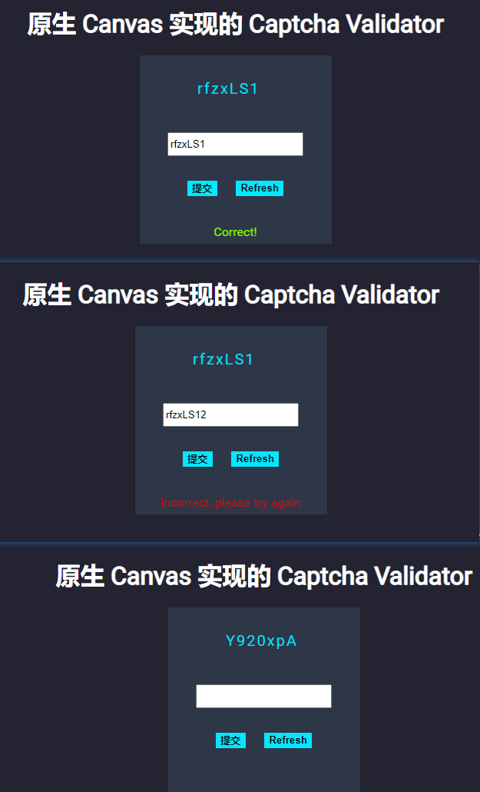

**使用HTML、JavaScript、CSS创建一个CAPTCHA验证表单**

> 原文 [Create a CAPTCHA Validation Form Using HTML, CSS, and JavaScript](https://www.makeuseof.com/captcha-validation-html-css-javascript/)
>
> Secure your websites with CAPTCHA validation.

验证码（CAPTCHA）是网站安全不可或缺的一部分。人们每天在线完成数百万次验证码测试。

如果你尚未在你的网站上实施 CAPTCHA 验证，则可能会带来大问题，比如垃圾邮件发送者将你设置为目标。

以下是你需要了解的有关CAPTCHA的所有信息，以及如何使用HTML，CSS和JavaScript轻松实现它。

# 什么是 CAPTCHA

CAPTCHA代表“用以区分计算机和人类的完全自动化的公共图灵测试”。这个词是由Luis von Ahn、Manuel Blum、Nicholas J.Hopper和John Langford于2003年创造的，是一种质询-响应测试，网站用它来确定用户是否是人类。

> challenge-response test --- 质询-响应测试
> 
> Completely Automated Public Turing test to tell Computers and Humans Apart.

CAPTCHA 通过提供机器人难以执行但对人类相对容易的挑战来增加网站的安全性。例如，从一组多个图像中识别汽车的所有图像，对于机器人来说很困难，但对人眼来说足够简单。

CAPTCHA的想法起源于图灵测试。图灵测试是一种测试机器是否可以像人类一样思考的方法。你可以将CAPTCHA测试视为“反向图灵测试”，因为它挑战人类证明他们不是计算机。

# 为什么你的网站需要 CAPTCHA 验证

CAPTCHA 用于防止机器人自动提交包含垃圾邮件和其他有害内容的表单。甚至像谷歌这样的公司也使用它来防止他们的系统受到垃圾邮件攻击。

以下是你的网站受益于验证码验证的一些原因：

- 验证码有助于防止黑客和机器人通过创建虚假帐户向注册系统发送垃圾邮件。如果不加以阻止，他们可以将这些帐户用于邪恶目的。

- CAPTCHA 可以禁止对网站的暴力登录攻击，黑客使用这些攻击尝试使用数千个密码登录。

- CAPTCHA 可以限制机器人向评论部分发送垃圾邮件（比如提供虚假评论）。

- 验证码有助于防止门票的通货膨胀，因为有些人购买了许多门票进行转售。验证码甚至可以防止免费事件的虚假注册。

- 验证码可以限制来自狡猾评论和指向有害网站的链接的博客的网络骗子发送的垃圾邮件。

> - CAPTCHAs help to prevent hackers and bots from spamming the registration systems by creating fake accounts. If they aren't prevented, they can use those accounts for nefarious purposes.
> - CAPTCHAs can forbid brute force log-in attacks from your website which hackers use to try logging in using thousands of passwords.
> - CAPTCHAs can restrict bots from spamming the review section by providing false comments.
> - CAPTCHAs aid in preventing ticket inflation as some people purchase many tickets for reselling. CAPTCHAs can even prevent false registrations to free events.
> - CAPTCHAs can restrict cyber crooks from spamming blogs with dodgy comments and links to harmful websites.

还有更多的原因来支持你的网站集成 CAPTCHA 验证。你可以使用下面的代码实现。

> If you want to have a look at a live version of this project, you can check out this [demo](https://makeuseofcode.github.io/CAPTCHA-Validator/).

# 代码实现

## HTML CAPTCHA 代码

> **【注：实际中必须由后端实现验证，而不仅仅“表面上”的前端】**

使用后面的代码实现向 HTML 表单中添加 CAPTCHA 验证码。

```html
<!DOCTYPE html>
<html>

<head>
    <link rel="stylesheet" type="text/css" href="styles.css">
</head>

<body>
    <div class="center">
        <h1 id="captchaHeading">
            原生 Canvas 实现的 Captcha Validator
        </h1>
        <div id="captchaBackground">
            <canvas id="captcha">captcha text</canvas>
            <input id="textBox" type="text" name="text">
            <div id="buttons">
                <input id="submitButton" type="submit">
                <button id="refreshButton" type="submit">Refresh</button>
            </div>
            <span id="output"></span>
        </div>
    </div>
    <script src="script.js"></script>
</body>

</html>
```

该代码由7个元素组成：

- **`<h1 id="captchaHeading"> <h1>`**: 显示 CAPTCHA form 的标题.
- **`<canvas id="captcha"> </canvas>`**: 显示 CAPTCHA 内容.
- **`<input id="textBox" type="text" name="text">`**: 填写 CAPTCHA 的输入框.
- **`<input id="submitButton" type="submit">`**: 这个按钮提交表单，并验证 CAPTCHA 和输入的内容是否相等.
- **`<button id="refreshButton" type="submit"> </button>`**: 刷新 CAPTCHA 的按钮.
- **`<span id="output"> </span>`**: 根据填写的文本显示输出.
- **`<div class="center"> </div>`**: 包含其它元素的父元素.


此 HTML 页面分别通过 link 和 script 元素链接到 CSS 和 JavaScript 文件。

还可以将此代码与网站上的现有表单集成。

## CSS CAPTCHA 代码

使用 CSS（`Cascading Style Sheets`）来设置 HTML 元素的样式。

以下 CSS 代码用以设置验证码表单的样式：

```css
@import url('https://fonts.googleapis.com/css2?family=Roboto&display=swap');

body {
    background-color: #232331;
    font-family: 'Roboto', sans-serif;
}

#captchaBackground {
    width: 250px;
    background-color: #2d3748;
    display: flex;
    align-items: center;
    justify-content: center;
    flex-direction: column;
}

#captchaHeading {
    color: white;
}

#captcha {
    height: 80%;
    width: 80%;
    font-size: 30px;
    letter-spacing: 3px;
    margin: auto;
    display: block;
    top: 0;
    bottom: 0;
    left: 0;
    right: 0;
}

.center {
    display: flex;
    flex-direction: column;
    align-items: center;
}

#buttons{
    margin-top: 2em;
    margin-bottom: 2em;            
    display: flex;
    min-width: 150px;
    justify-content: space-around;
}
#buttons>* {
    background-color: #08e5ff;
    border: 0px;
    font-weight: bold;
    height: 20px;
}

#textBox {
    height: 25px;
}

.incorrectCaptcha {
    color: #FF0000;
}

.correctCaptcha {
    color: #7FFF00;
}
```

## JavaScript CAPTCHA 代码

使用 JavaScript 向网页中添加功能。

下面是实现 CAPTCHA 验证表单的完整功能的代码：

```js
        // document.querySelector() is used to select an element from the document using its ID
        let captchaCanvas = document.querySelector('#captcha');
        let ctx = captchaCanvas.getContext("2d");
        ctx.font = "30px Roboto";
        ctx.fillStyle = "#08e5ff";


        let userText = document.querySelector('#textBox');
        let submitButton = document.querySelector('#submitButton');
        let output = document.querySelector('#output');
        let refreshButton = document.querySelector('#refreshButton');


        // alphaNums contains the characters with which you want to create the CAPTCHA
        let alphaNums = ['A', 'B', 'C', 'D', 'E', 'F', 'G', 'H', 'I', 'J', 'K', 'L', 'M', 'N', 'O', 'P', 'Q', 'R', 'S', 'T', 'U', 'V', 'W', 'X', 'Y', 'Z', 'a', 'b', 'c', 'd', 'e', 'f', 'g', 'h', 'i', 'j', 'k', 'l', 'm', 'n', 'o', 'p', 'q', 'r', 's', 't', 'u', 'v', 'w', 'x', 'y', 'z', '0', '1', '2', '3', '4', '5', '6', '7', '8', '9'];

        // 真正的验证码
        let CaptchaCode = '';

        // 填充 Canvas 验证码
        const fillCaptcha = function() {
            let emptyArr = [];
            // This loop generates a random string of 7 characters using alphaNums
            // Further this string is displayed as a CAPTCHA
            for (let i = 1; i <= 7; i++) {
                emptyArr.push(alphaNums[Math.floor(Math.random() * alphaNums.length)]);
            }
            CaptchaCode = emptyArr.join('');
            ctx.clearRect(0, 0, captchaCanvas.width, captchaCanvas.height);
            ctx.fillText(emptyArr.join(''), captchaCanvas.width / 4, captchaCanvas.height / 2);
        }
        fillCaptcha();

        // This event listener is stimulated whenever the user press the "Enter" button
        // "Correct!" or "Incorrect, please try again" message is
        // displayed after validating the input text with CAPTCHA
        userText.addEventListener('keyup', function (e) {
            // Key Code Value of "Enter" Button is 13
            if (e.keyCode === 13) {
                if (userText.value === CaptchaCode) {
                    output.classList.remove("incorrectCaptcha");
                    output.classList.add("correctCaptcha");
                    output.innerHTML = "Correct!";
                } else {
                    output.classList.remove("correctCaptcha");
                    output.classList.add("incorrectCaptcha");
                    output.innerHTML = "Incorrect, please try again";
                }
            }
        });

        // This event listener is stimulated whenever the user clicks the "Submit" button
        // "Correct!" or "Incorrect, please try again" message is
        // displayed after validating the input text with CAPTCHA
        submitButton.addEventListener('click', function () {
            if (userText.value === CaptchaCode) {
                output.classList.remove("incorrectCaptcha");
                output.classList.add("correctCaptcha");
                output.innerHTML = "Correct!";
            } else {
                output.classList.remove("correctCaptcha");
                output.classList.add("incorrectCaptcha");
                output.innerHTML = "Incorrect, please try again";
                return false;
            }
        });

        // This event listener is stimulated whenever the user press the "Refresh" button
        // A new random CAPTCHA is generated and displayed after the user clicks the "Refresh" button
        refreshButton.addEventListener('click', function () {
            userText.value = "";
            fillCaptcha();
            output.innerHTML = "";

            return false;
        });
```

查看效果：正确、错误和刷新。



# 使用 CAPTCHA 保护网站的安全

过去，许多组织和企业遭受了重大损失，例如数据泄露，垃圾邮件攻击等。由于他们的网站上没有验证码表单。强烈建议将CAPTCHA添加到您的网站，因为它增加了一个安全层以防止网站受到网络犯罪分子的攻击。

谷歌还推出了一项名为“reCAPTCHA”的免费服务，有助于保护网站免受垃圾邮件和滥用。CAPTCHA和reCAPTCHA看起来很相似，但它们并不完全相同。有时，对于许多用户来说，验证码会感到沮丧且难以理解。虽然，为什么它们变得困难有一个重要的原因。
