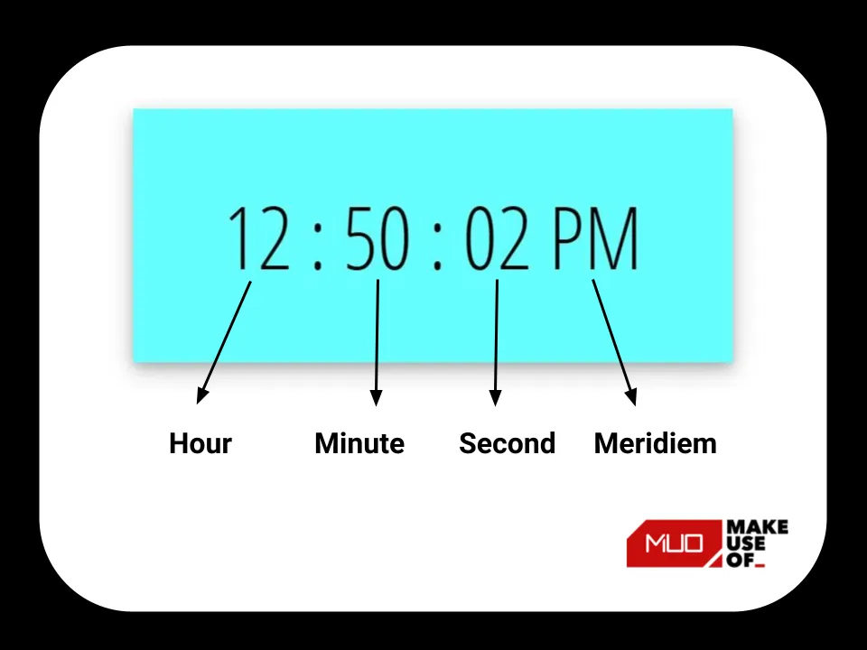
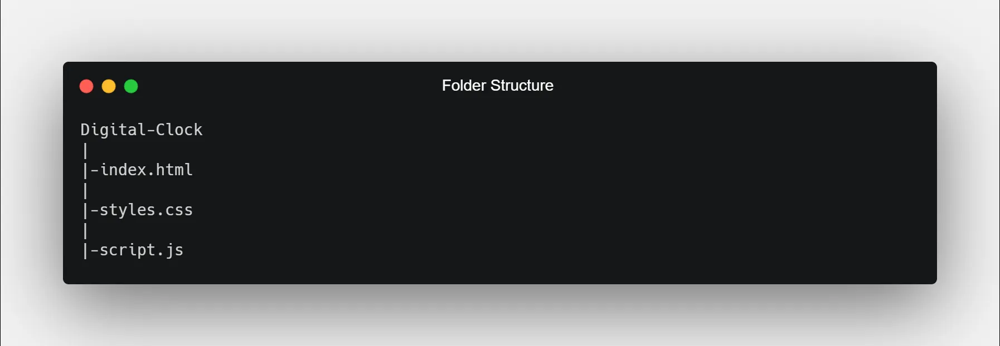

**使用HTML、JavaScript、CSS构建一个数字时钟**

> [How to Create a Digital Clock Using HTML, CSS, and JavaScript](https://www.makeuseof.com/create-a-digital-clock-html-css-javascript/)

你会一直编码直到叽叽喳喳的鸟儿告诉你现在是早上吗？使用自己创建的自定义时钟追踪你的时间！

数字时钟是JavaScript中最好的初学者项目之一。对于任何技能水平的人来说，学习都很容易。

在本文中，你将学习如何使用 HTML、CSS 和 JavaScript 构建自己的数字时钟。获得各种 JavaScript 概念的实践经验，例如创建变量、使用函数、使用日期、访问和向 DOM 添加属性等。

让我们开始吧！

# 介绍

## 数字时钟的组成 - Components of the Digital Clock

数字始终有四部分: hour、minute、second 和 meridiem。

## 数字时钟项目的文件结构

创建一个包含 HTML、CSS 和 JavaScript 文件的根文件夹。可以将文件命名为任何你想要的名称。

这里的根文件夹名为`Digital-Clock`，根据标准命名约定，HTML、CSS 和 JavaScript 文件分别命名为 `index.html`、`styles.css` 和 `script.js`。

