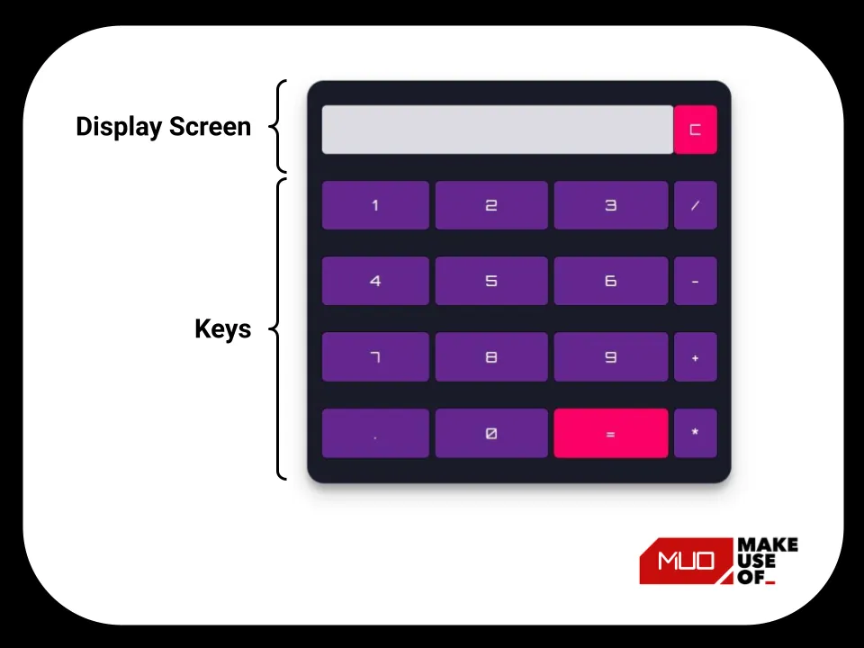
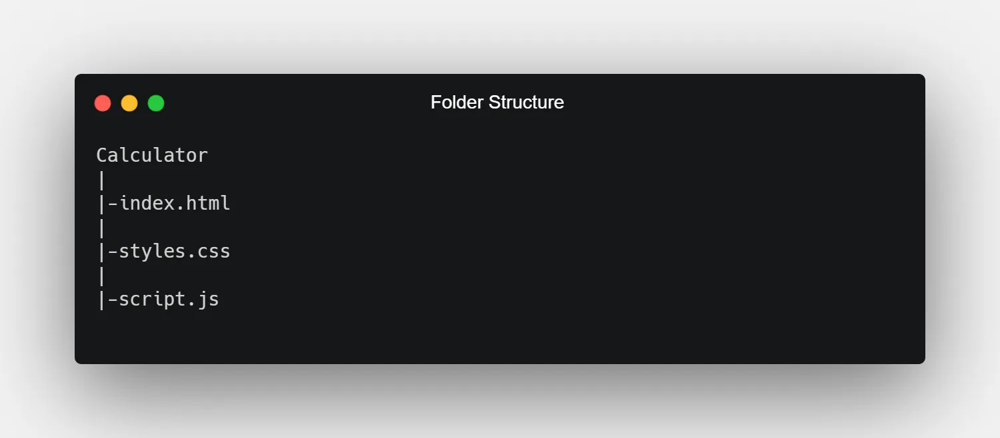
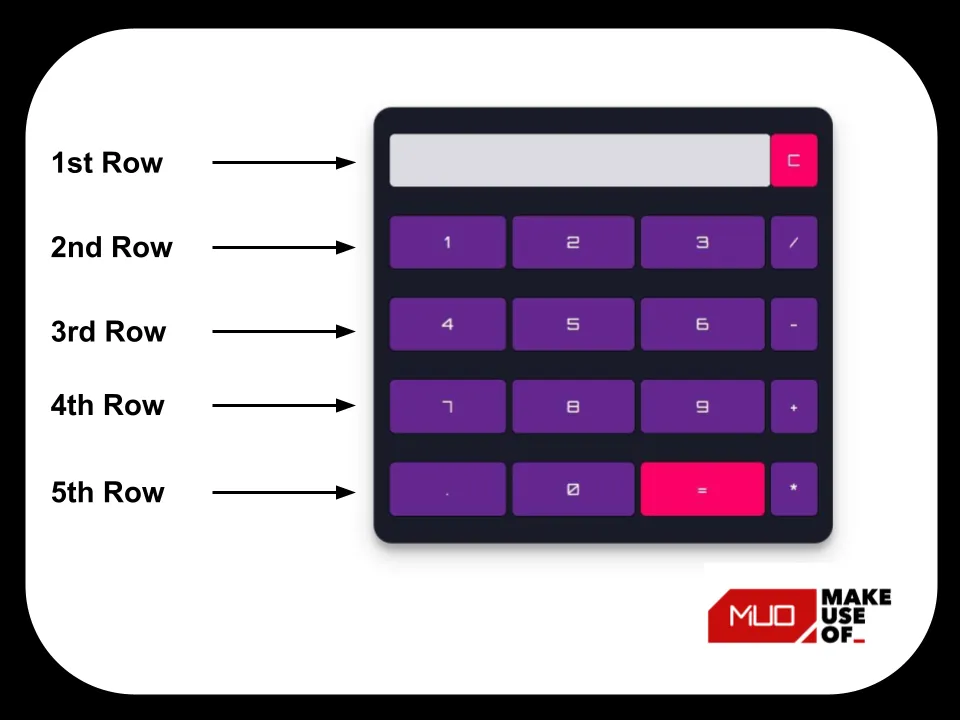

**使用HTML、JavaScript、CSS构建一个简单的计算器**

> 基本翻译自原文 [How to Build a Simple Calculator Using HTML, CSS, and JavaScript](https://www.makeuseof.com/build-a-simple-calculator-using-html-css-javascript/)
>
> 由于原文使用的是“恶名昭著”的 eval 执行的数学计算代码，因此，后面进行优化调整，改为使用[window.Function](https://developer.mozilla.org/zh-CN/docs/Web/JavaScript/Reference/Global_Objects/Function)。
> 
> 后续添加了HTML5 最新的 dialog 模态框显示错误提示。

> 简单的计算代码是编程时都要做的内容。检验一下，如何在 HTML、CSS 和 JS 中构建自己的计算器。

学习 JavaScript 的最好方法是构建项目。如果你想成为一名优秀的Web开发人员，你需要尽快开始创建项目。你可以从构建初学者级别的项目开始，例如简单的计算器、数字时钟或秒表(`stopwatch`)。

你可以只使用核心的Web技术 HTML、CSS和JavaScript 制作一个简单的计算器，可以执行基本的数学运算，如加法、减法、乘法和除法（`addition, subtraction, multiplication, and division`）。

# 计算机的功能

本项目，你将会开发一个计算器，主要有以下功能：

1. 执行基本的数学操作，比如加、减、乘、除。
2. 执行十进制运算。
3. 如果尝试将任何数字除以零，计算器将会显示`Infinity`(无限/无穷大)。
4. 无效的表达式将不会显示任何结果。比如 `5++9`不会显示任何内容。
5. 任何时候都都可以清除屏幕显示的清除功能。

> The code used in this project is available in a [GitHub repository](https://github.com/Yuvrajchandra/Simple-Calculator) and is free for you to use under the MIT license. If you want to have a look at a live version of this project, you can check out [this demo](https://yuvrajchandra.github.io/Simple-Calculator/).

# 计算器项目

## 计算器的组件

计算器由以下组件组成：

- **Mathematical Operators**: Addition (+), Subtraction (-), Multiplication (*), and Division (/).
- **Digits and Decimal Button**: 0, 1, 2, 3, 4, 5, 6, 7, 8, 9, ., .
- **Display Screen**: It displays the mathematical expression and the result.
- **Clear Screen Button**: It clears all mathematical values.
- **Calculate button (=)**: It evaluates the mathematical expression and returns the result.



## 计算器项目的文件结构

创建一个包含 HTML、CSS 和 JavaScript 文件的文件夹，并进行命名。

此处的根文件夹命名为`Calculator`，依据标准的命名约定，HTML、CSS 和 JavaScript 文件分别命名为 `index.html`、`styles.css` 和 `script.js`。



## HTML Code

打开`index.html`文件，粘贴用于计算器的如下代码：

```html
<!DOCTYPE html>
<html lang="en" dir="ltr">
 
<head>
  <meta charset="utf-8">
  <title>Simple Calculator using HTML, CSS and JavaScript</title>
  <link rel="stylesheet" href="styles.css">
</head>
 
<body>
 
<table class="calculator" >
  <tr>
    <td colspan="3"> <input class="display-box" type="text" id="result" disabled /> </td>
 
    <!-- clearScreen() function clears all the values -->
    <td> <input type="button" value="C" onclick="clearScreen()" id="btn" /> </td>
  </tr>
  <tr>
    <!-- display() function displays the value of clicked button -->
    <td> <input type="button" value="1" onclick="display('1')" /> </td>
    <td> <input type="button" value="2" onclick="display('2')" /> </td>
    <td> <input type="button" value="3" onclick="display('3')" /> </td>
    <td> <input type="button" value="/" onclick="display('/')" /> </td>
  </tr>
  <tr>
    <td> <input type="button" value="4" onclick="display('4')" /> </td>
    <td> <input type="button" value="5" onclick="display('5')" /> </td>
    <td> <input type="button" value="6" onclick="display('6')" /> </td>
    <td> <input type="button" value="-" onclick="display('-')" /> </td>
  </tr>
  <tr>
    <td> <input type="button" value="7" onclick="display('7')" /> </td>
    <td> <input type="button" value="8" onclick="display('8')" /> </td>
    <td> <input type="button" value="9" onclick="display('9')" /> </td>
    <td> <input type="button" value="+" onclick="display('+')" /> </td>
  </tr>
  <tr>
    <td> <input type="button" value="." onclick="display('.')" /> </td>
    <td> <input type="button" value="0" onclick="display('0')" /> </td>
 
    <!-- calculate() function evaluates the mathematical expression -->
    <td> <input type="button" value="=" onclick="calculate()" id="btn" /> </td>
    <td> <input type="button" value="*" onclick="display('*')" /> </td>
  </tr>
</table>
 
<script type="text/javascript" src="script.js"></script>
</body>
</html>
```

此项目使用`<table>`标签来创建计算器的整体结构。`<table>` 标签包含五行，代表计算器的五个水平部分。每行都有一个对应的<tr>标记。每个标签<tr>都包含<td>用于保存计算器的显示屏幕和按钮的标签。




## CSS 代码

打开`styles.css`文件，粘贴用于计算器的如下CSS代码：

```css
@import url('https://fonts.googleapis.com/css2?family=Orbitron&display=swap');

.calculator {
    padding: 10px;
    border-radius: 1em;
    height: 380px;
    width: 400px;
    margin: auto;
    background-color: #191b28;
    box-shadow: rgba(0, 0, 0, 0.19) 0px 10px 20px, rgba(0, 0, 0, 0.23) 0px 6px 6px;
}

.display-box {
    font-family: 'Orbitron', sans-serif;
    background-color: #dcdbe1;
    border: solid black 0.5px;
    color: black;
    border-radius: 5px;
    width: 100%;
    height: 65%;
    text-align: right;
}

#btn {
    background-color: #fb0066;
}

input[type=button] {
    font-family: 'Orbitron', sans-serif;
    background-color: #64278f;
    color: white;
    border: solid black 0.5px;
    width: 100%;
    border-radius: 5px;
    height: 70%;
    outline: none;
}

input:active[type=button] {
    background: #e5e5e5;
    -webkit-box-shadow: inset 0px 0px 5px #c1c1c1;
    -moz-box-shadow: inset 0px 0px 5px #c1c1c1;
    box-shadow: inset 0px 0px 5px #c1c1c1;
}
```

> 此处的谷歌字体API是可以访问使用的。

上面的 CSS 设置了计算器的样式。CSS 中的`.class`选择器选择具有特定类属性的元素。`.calculator` 和 `.display-box` 类选择器分别设置计算器的 table 结构和显示屏的样式。`@import`从Google字体导入`Orbitron`字体系列(`font-family`)。

## JavaScript 代码

### 原文代码

打开 `script.js` 文件，使用下面的代码添加功能到这个简单的计算器：

```js
// This function clear all the values
function clearScreen() {
    document.getElementById("result").value = "";
}
 
// This function display values
function display(value) {
    document.getElementById("result").value += value;
}
 
// This function evaluates the expression and returns result
function calculate() {
    var p = document.getElementById("result").value;
    var q = eval(p);
    document.getElementById("result").value = q;
}
```

### 使用 Function 代替 eval

只需修改最后的计算方法`calculate()`，将`eval(p)`替换掉：

```js
function calculate() {
    var p = document.getElementById("result").value;
    var q = Function('"use strict";return (' + p + ')')();
    document.getElementById("result").value = q;
}
```

### 简单完善下 js 代码

```js
const result= document.getElementById("result");
let hasCalced=false;
// This function clear all the values
function clearScreen() {
    result.value = "";
    hasCalced = false;
}

// This function display values
function display(value) {            
    if (!hasCalced || ['+', '-', '*', '/'].includes(value)) {
        result.value += value;
    }
    else{
        result.value = value;
    }
    hasCalced = false;
}

// This function evaluates the expression and returns result
function calculate() {
    var q = Function('"use strict";return (' + result.value + ')')();
    result.value = q;
    hasCalced=true;
}
```

# 添加错误处理

如果计算的公式不正确，给出相关提示。此处使用 HTML5 的 dialog 元素显示提示。

```html
    <dialog id="msg-dialog">
        <p>请确保计算的公式正确！</p>
        <button>确定</button>
    </dialog>
```


```js
const msgDialog=document.querySelector('#msg-dialog');
document.querySelector('#msg-dialog>button').addEventListener('click',()=>{
    msgDialog.close();
})


function calculate() {
    try {
        result.value = Function('"use strict";return (' + result.value + ')')();
        hasCalced = true;
    } catch (error) {
        msgDialog.showModal();
    }
}
```
