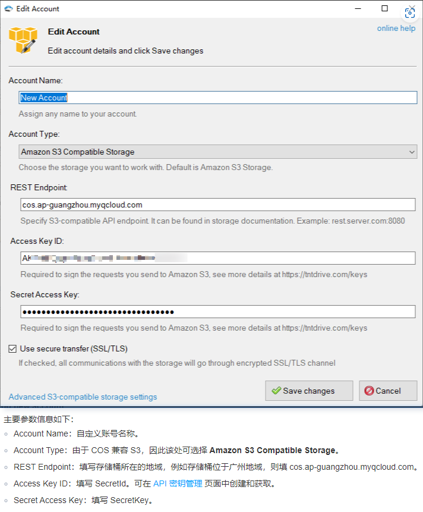

**使用 Rclone 将腾讯云 COS （类 AWS S3存储）作为本地磁盘或网络共享驱动器挂载到 Windows**

[toc]

> 本篇主要参考或转载自 腾讯云COS官方文档的 [将 COS 作为本地磁盘挂载到 Windows 服务器](https://cloud.tencent.com/document/product/436/55241)，只有很少的出入。
> 
> 此外，添加了存储桶访问权限的设置、子账号访问密钥的策略配置
> 
> 主要增加了 **rclone mount挂载时，指定具体的 存储桶、特定路径文件夹 作为映射的磁盘**
> 
> rclone 可以配置多个远程云存储对象，通过 remote name 进行区分。
>
> 后面增加了使用 RaiDrive 连接 Amazon S3 Compatible Storage （COS）的简单介绍【RaiDrive提供的S3存储的写入功能是收费的，免费版本只读，只能查看】
> 
> 以及，除了使用 git bash（vi/vim）将 Rclone 挂载命令，通过 `&` 符号使其在后台运行之外，还可以尝试在原生Windows下的Powershell实现后台运行命令行【见推荐】。
> 
> Windows 下查找运行的进程、并终止进程的命令(`tasklist`/`taskkill`)，查找包含指定名称内容的进程，进程id、名称、路径等！
> 
> **同时，好像知道了在 Windows 下执行的程序进程，在 任务管理 中隐藏的办法！！！`git bash`中`&`后台运行的命令进程在任务管理中找不到，不会显示在进程列表中（但可以通过`tasklist`命令列出！）**
>
> 额外的，**vbs的注释为单引号`'`；bat的注释为双冒号`::`**（严格上不算注释，且有很多种其他注释形式）

> 另，挂载到Windows本地硬盘后，实际上传内容后，要很久才会在其他入口下看到，比如在 COS控制台存储桶的文件列表 中，几乎到了第二天，10几个小时后才看到。
> 
> 暂时原因不知道是什么！

> 另，**COS对象存储 外网下行流量 是需要收费的**，这点要注意，具体参见官方文档！

# 配置存储桶访问和子用户权限

实际对 COS 的访问，都是通过 `AppId、SecretId、SecretKey` 等密钥信息进行管理的。

其中 **`AppId` 只在 主账号 下存在，AppId 是不变的**。如果使用 子账号，则只生成 `SecretId、SecretKey` 密钥。

如下，我们使用 子用户 来管理访问 COS 存储，其访问方式只需为 编程访问 即可，指定 COS 相关的权限策略。


API 密钥：


关于存储桶访问权限的设置，可以直接在存储桶列表中找到相关介绍：


在存储桶的 权限管理 中，设置 **存储桶访问权限 和 存储桶访问权限**（如果为公共访问、公共写入则不需要设置）：


# Winfsp、Rclone 和 Git

## Rclone 介绍

Rclone 是一个管理云存储中的文件的命令行程序。它是云供应商 Web 存储接口的功能丰富的替代方案。支持国内外常见的各种云存储产品。

官网：https://rclone.org/

rclone 被称为“云存储的瑞士军刀”和“与魔法无异的技术”。

> "The Swiss army knife of cloud storage" 和 "Technology indistinguishable from magic".

## Winfsp

Winfsp 是 Windows下的用户态文件系统助手，借助它可以开发自己的文件系统（无需任何Windows内核编程的知识）

它可以将任何 信息和存储 组织为Windows下的类似磁盘驱动形式的文件系统。

rclone 在Windows下挂载远程存储为 本地磁盘 或 网络驱动器 就是依赖的 Winfsp。

如下很多知名软件都是基于 Winfsp 实现的：

- nfs-win：NFS的Windows版；
- rclone：挂载云存储到Windows；
- sshfs：SSHFS的Windows版；
- KS2.Drive：挂载webDAV/AOS服务器为Windows驱动器；
- ... 

## Git

git 不再过多介绍，此处主要用到它 linux shell 中 `&` 让命令行后台运行的功能。

## 软件的下载安装

1. 前往 [Github](https://github.com/billziss-gh/winfsp/releases) 下载 Winfsp。  


    目前最新版本为 winfsp-2.0.23075，下载完成后，按步骤默认安装即可。

    
2. 前往 [Git 官网](https://gitforwindows.org/) 或者 [Github](https://github.com/git-for-windows/git/releases/) 下载 Git 工具。  
    
    下载完成后，通常按步骤默认安装即可。

3. 前往 [Rclone 官网](https://rclone.org/downloads/) 或者 [Github](https://github.com/rclone/rclone/releases) 下载 Rclone 工具。  
    
    目前使用的 rclone-v1.62.2-windows-amd64.zip，该软件无需安装，下载后，只需解压到任意一个英文目录下即可（如果解压到的路径含有中文将有可能会报错）。比如 `C:\PportableSoft\rclone1.62.2` 路径下。

以上软件安装完成后进行后续的配置。

# 配置 Rclone

## 将 rclone 所在路径添加到 Path 环境变量

打开任意文件夹，并在左侧导航目录下找到 **此电脑**，单击右键选择 **属性 > 高级系统设置 > 环境变量 > 用户变量或者系统变量 > Path**，单击 **新建**。

在弹出的窗口中，填写 Rclone 所在的路径（`C:\PportableSoft\rclone1.62.2`），单击 **确定**。

打开 Windows Powershell，输入 `rclone --version` 命令，按 Enter，查看 Rclone 是否成功安装：

```sh
> rclone --version
rclone v1.62.2
- os/version: Microsoft Windows 10 Pro 22H2 (64 bit)
- os/kernel: 10.0.19045.2604 Build 19045.2604.2604 (x86_64)
- os/type: windows
- os/arch: amd64
- go/version: go1.20.2
- go/linking: static
- go/tags: cmount
```


## 配置 rclone 的云存储

1. 在 Windows Powershell 中，输入 `rclone config` 命令，按 Enter。

2. 然后，输入 **n**，再次按回车，新建一个 New remote，输入新远程的名字`TencentCOS`（当前配置的远程存储的对应名称，可任意，最终会显示在磁盘名称上。区分多个远程的方式！）：

```sh
> rclone config
2023/03/22 17:37:46 NOTICE: Config file "C:\\Users\\win7hostsver\\AppData\\Roaming\\rclone\\rclone.conf" not found - using defaults
No remotes found, make a new one?
n) New remote
s) Set configuration password
q) Quit config
n/s/q> n

Enter name for new remote.
name> TencentCOS
```

然后回车，会列出可选的存储云厂商设备：

```sh
Option Storage.
Type of storage to configure.
Choose a number from below, or type in your own value.
 1 / 1Fichier
   \ (fichier)
 2 / Akamai NetStorage
   \ (netstorage)
 3 / Alias for an existing remote
   \ (alias)
 4 / Amazon Drive
   \ (amazon cloud drive)
 5 / Amazon S3 Compliant Storage Providers including AWS, Alibaba, Ceph, China Mobile, Cloudflare, ArvanCloud, DigitalOcean, Dreamhost, Huawei OBS, IBM COS, IDrive e2, IONOS Cloud, Liara, Lyve Cloud, Minio, Netease, RackCorp, Scaleway, SeaweedFS, StackPath, Storj, Tencent COS, Qiniu and Wasabi
   \ (s3) 
 6 / Backblaze B2
   \ (b2)
......
......
......
```

3. `Tencent COS`位于第 **5** 中，此处的存储输入 **5** 并回车：

```sh
Storage> 5
```

之后会列出可选的提供器：

```sh
Option provider.
Choose your S3 provider.
Choose a number from below, or type in your own value.
Press Enter to leave empty.
 1 / Amazon Web Services (AWS) S3
   \ (AWS)
 2 / Alibaba Cloud Object Storage System (OSS) formerly Aliyun
   \ (Alibaba)
......
......
......
22 / Tencent Cloud Object Storage (COS)
   \ (TencentCOS)
23 / Wasabi Object Storage
   \ (Wasabi)
24 / Qiniu Object Storage (Kodo)
   \ (Qiniu)
25 / Any other S3 compatible provider
   \ (Other)
```

4. `TencentCOS` 位于 **22**，此处输入 **22** 并回车：

```sh
provider> 22
```

之后列出可选的 `env_auth`。

5. 在 `env_auth>` 直接按回车。

6. 在 `access_key_id>` 处，输入 腾讯云 COS 的访问密钥 SecretId，并回车

7. 在 `secret_access_key>` 处，输入 腾讯云 COS 的访问密钥 SecretKey，并回车

8. 根据显示，选择腾讯云各地域的网关地址。需要查看存储桶的所属地域，选择对应的地域。

在 COS控制台的 存储桶列表中查看 https://console.cloud.tencent.com/cos/bucket：


创建存储桶时，是需要指定存储桶的地域的：


```sh
Option endpoint.
Endpoint for Tencent COS API.
Choose a number from below, or type in your own value.
Press Enter to leave empty.
 1 / Beijing Region
   \ (cos.ap-beijing.myqcloud.com)
...
...
...
```

如上所示，北京区域选择 **1** ，并回车：

```sh
endpoint> 1
```

9. 在显示的腾讯云 COS 的权限类型中，根据实际需求选择 default、public-read 等。

**此处选择的权限类型为对象权限类型，即上传的文件/文件夹权限。仅针对新上传的文件有效。**

根据需要选择第 **6** 项，并回车。

```sh
acl> 6
```

10. **选择以何种存储类型将文件上传到 COS。**  此处选择 Default，输入 **1** 并回车。

```sh
Option storage_class.
The storage class to use when storing new objects in Tencent COS.
Choose a number from below, or type in your own value.
Press Enter to leave empty.
 1 / Default
   \ ()
 2 / Standard storage class
   \ (STANDARD)
 3 / Archive storage mode
   \ (ARCHIVE)
 4 / Infrequent access storage mode
   \ (STANDARD_IA)
storage_class> 1
```

> - Default 表示默认
> - Standard storage class 表示标准存储（STANDARD）
> - Archive storage mode 表示归档存储（ARCHIVE）
> - Infrequent access storage mode 表示低频存储（STANDARD\_IA）
> 
> 
> 如需设置智能分层存储或者深度归档存储类型，请采用 修改配置文件 的方式，在配置文件中，将 storage_class 的值设置为 INTELLIGENT_TIERING 或 DEEP_ARCHIVE 即可。参见 [存储类型概述](https://cloud.tencent.com/document/product/436/33417)。

11. 执行到 `Edit advanced config? (y/n)` 时，按 **Enter**。

12. 配置完成 `Configuration complete.`，确认信息无误后，直接回车。

13. 最后输入 **q**，退出配置！


## 修改 rclone 配置文件

以上配置完成后，将会生成一个名称为 `rclone.conf` 的配置文件，一般位于 `C:\Users\用户名\AppData\Roaming\rclone` 文件夹下。

也可在命令行下执行 `rclone config file` 命令查看配置文件。

如果想要修改 rclone 的配置，可直接对其进行修改。如若未找到该配置文件。

# 挂载云存储

## 挂载 COS 为本地磁盘或网络驱动器

打开安装的 Git Bash，并输入执行以下命令。

- 映射为局域网共享驱动器(网络驱动器)（推荐），则执行命令如下：

```sh
rclone mount TencentCOS:/xxx-bucket-xxx X: --fuse-flag --VolumePrefix=\server\share --cache-dir D:\temp --vfs-cache-mode writes &
```

- 如果映射为本地磁盘，则执行命令如下：

```sh
rclone mount TencentCOS:/xxx-bucket-xxx X: --cache-dir D:\temp --vfs-cache-mode writes &
```

其中：

- `TencentCOS` 为刚才配置的云存储的远程名称。
- `xxx-bucket-xxx` 为存储桶的名称。
- `X` 为挂载后，硬盘的盘符名称，不要与本地的 C、D、E 盘等重复。
- `D:\temp` 为本地缓存目录，可自行设置。注意：需确保用户拥有目录权限。

当出现提示 “The service rclone has been started” 则说明挂载成功。

> 注意，之所以指定 `xxx-bucket-xxx` 存储桶名称，是因为要挂载存储桶下的根目录。
> 
> 如果只有远程名称，则会挂载到该云存储下，本地磁盘的根目录下会列出存储桶，然后才能进入访问存储桶内的对象。
> 
> 同理，可将指定路径以同样的方式，映射到本地磁盘。


之后可以输入 exit 或 直接点击关闭终端。

然后就可以在 我的电脑 中，看到新增的磁盘 `TencentCOS xxx-bucket-xxx(X:)`。

## 设置开机自启动挂载硬盘

如上操作在电脑重启后，映射的磁盘将会消失，需要再次手动操作。

可以设置自启动，让服务器每次重启后都自动挂载磁盘。

- 在 Rclone 安装目录 `C:\PportableSoft\rclone1.62.2` 下，分别新建 `startup_rclone.vbs` 和 `startup_rclone.bat` 文件。
    
> Powershell 创建文本文件时需要注意编码，否则生成的.bat、 .vbs 等文本文件无法执行。
    
- 在 `startup_rclone.bat` 中，写入如下挂载命令：
    
如果映射为局域网共享驱动器，命令为：

```sh
rclone mount TencentCOS:/xxx-bucket-xxx X: --fuse-flag --VolumePrefix=\server\share --cache-dir D:\temp --vfs-cache-mode writes &
```

如果映射为本地磁盘，则命令为：

```sh
rclone mount TencentCOS:/xxx-bucket-xxx X: --cache-dir D:\temp --vfs-cache-mode writes &
```

- 在 `startup_rclone.vbs` 中，写入如下代码：

```sh
CreateObject("WScript.Shell").Run "cmd /c C:\PportableSoft\rclone1.62.2\startup_rclone.bat",0
```

> 请将代码中的路径修改为您实际的路径。

- 将 `startup_rclone.vbs` 文件剪切到 `%USERPROFILE%\AppData\Roaming\Microsoft\Windows\Start Menu\Programs\Startup` 文件夹下。

- 重启服务器，查看挂载情况【重启后需要等待十几秒】。

# 其他工具连接COS

COS 兼容 S3，因此基本任何适用 Amazon S3 Compatible Storage 的工具，都可以连接。

如下，是官网示例给出的 使用收费工具TntDrive 连接 OCS 的设置。



如果使用 RaiDrive 可以看出，由于是北京地区，端点选择`https://cos.ap-beijing.myqcloud.com`，刷新可下拉选择Bucket，可以看到其设置为“只读”，无法修改【估计需要收费版本才能可写】。


# 查看后台运行的命令 并 取消rclone挂载

取消rclone挂载的方法，就是直接终止运行的 rclone.exe 进程即可。

> 这样直接终止的方式可能并不太安全，具体可参见 [Safe way to unmount](https://forum.rclone.org/t/safe-way-to-unmount/12084)

## tasklist 和 findstr 查看后台命令行运行的进程

上面 **在 git bash 中后台运行的rclone命令，在 Windows任务管理器 的 进程 中是找不到 `rclone.exe` 相关内容的。**

查询包含 "rclone" 字符串信息的 进程信息：

```sh
> tasklist | findstr "rclone"
rclone.exe                    7136 Console                    1     22,020 K
rclone.exe                   29228 Console                    1     20,768 K
```

查询 包含标题的 进程信息（**空格 表示 或，搜索多个字符串**）：

```sh
> tasklist | findstr "rclone PID"
映像名称                       PID 会话名              会话#       内存使用
rclone.exe                   14056 Console                    1     20,372 K

```

> powershell 下 中文可能会显示乱码。

## taskkill 终止进程

如下，终止 `rclone.exe` 进程：

```sh
taskkill /im rclone.exe
```

如果无法终止，则考虑强制终止：

```sh
taskkill /im rclone.exe /F
```

终止指定 pid 的进程：

```sh
taskkill /pid 7136
```

## 更好的方式 [SignalSend]

使用 `--rc` 挂载：

```sh
rclone mount .... --rc
``

运行如下取消挂载：

```sh
rclone rc core/quit
```

如果使用批处理脚本，则需要为 每个rc 指定不同的端口，比如 `--rc-addr localhost:12345`。

具体参见 [Unmount in Windows](https://forum.rclone.org/t/unmount-in-windows/9057)

# 附：考虑使用 nssm 将 rclone 作为 Windows 服务运行

具体参考 [Installing and Running Rclone Mount As a Windows Service](https://devsrealm.com/posts/34300bb14ba25fd2/installing-and-running-rclone-mount-as-a-windows-service)

# 附：推荐

- [如何在 macOS 使用 AList + RCLONE 把网盘挂载到本地](https://zhuanlan.zhihu.com/p/612368639)

- [Mounting and Unmounting Cloud Storage With (Rclone) in GNU/Linux](https://devsrealm.com/posts/37205b2356a4c74e/mounting-and-unmounting-cloud-storage-with-rclone-in-linux)

- [如何让 Windows 命令行程序像 Linux & 命令那样在后台运行](https://blog.csdn.net/surfirst/article/details/113123446)
