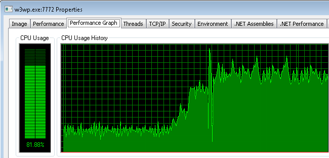

**修复 IIS / ASP.NET 应用程序的3个静默性能杀手【译】**

[toc]

  

如果只需进行一些小的调整即可使 IIS/ASP.NET 应用程序的性能翻倍，你会这样做吗？

你当然会！

这不可能那么容易，不是吗？如果你曾经在生产环境中进行过性能调查，您就会知道这种困难。

尝试在生产中捕获高 CPU 占用的问题，需要登录到服务器以捕获 CPU profile（如果安装了 VS 或 ANTS profiler），并进行分析，希望能捕捉到相关的问题。然后进行代码更改、部署、等待、冲洗、重复。

值得庆幸的是，这不是我这次要说的。

在过去的5年中，我们已经帮助数百家公司解决了其IIS和 ASP.NET 应用程序中的性能问题。当涉及到高 CPU 使用率时，他们中的许多人都有相同的常见问题。

好消息是，其中一些问题很容易解决。也许更严谨的说，是它们很容易找到。

# 1. 处理异常 和 Response.Redirect

你以前应该听过这个明智的建议：“不要在应用程序中使用异常作为流控制”。

> don’t use exceptions as flow control in your application

事实证明，大多数应用程序最终都会在这里或那里打破这个建议。这经常发生在处理可能容易出错的代码时，这些代码有时首先就会包装在 try/catch 中，而不是弄清楚为什么它抛出异常。由于许多原因，这可能是一个坏主意，其中之一是，**由于异常处理而导致的 CPU 使用率过高**。

- 检测

若要确定应用程序是否引发过多异常，请监视 性能计数器中的“超过引发的每秒 .NET CLR 异常#”（`.NET CLR Exceptions# of Exceps Thrown / sec`）。如果该值始终较高（50+），则可能有问题。

- 修复

以下是一些可能导致过度异常的常见区域：