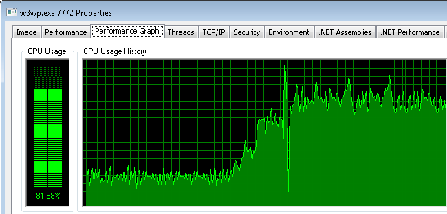
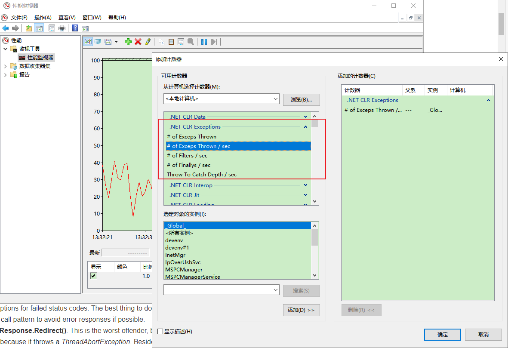

**修复 IIS / ASP.NET 应用程序的3个静默性能杀手【译】**

[toc]

> [翻译自 Fix the 3 silent performance killers for IIS / ASP.NET apps](https://mvolo.com/fix-the-3-high-cpu-performance-problems-for-iis-aspnet-apps/)

  

如果只需进行一些小的调整即可使 IIS/ASP.NET 应用程序的性能翻倍，你会这样做吗？

你当然会！

这不可能那么容易，不是吗？如果你曾经在生产环境中进行过性能调查，您就会知道这种困难。

尝试在生产中捕获高 CPU 占用的问题，需要登录到服务器以捕获 CPU profile（如果安装了 VS 或 ANTS profiler），并进行分析，希望能捕捉到相关的问题。然后进行代码更改、部署、等待、冲洗、重复。

值得庆幸的是，这不是我这次要说的。

在过去的5年中，我们已经帮助数百家公司解决了其IIS和 ASP.NET 应用程序中的性能问题。当涉及到高 CPU 使用率时，他们中的许多人都有相同的常见问题。

好消息是，其中一些问题很容易解决。也许更严谨的说，是它们很容易找到。

# 1. 处理异常 和 Response.Redirect

## 问题

你以前应该听过这个明智的建议：“不要在应用程序中使用异常作为流控制”。

> don’t use exceptions as flow control in your application

事实证明，大多数应用程序最终都会在这里或那里打破这个建议。这经常发生在处理可能容易出错的代码时，这些代码有时首先就会包装在 try/catch 中，而不是弄清楚为什么它抛出异常。由于许多原因，这可能是一个坏主意，其中之一是，**由于异常处理而导致的 CPU 使用率过高**。

## 检测

若要确定应用程序是否引发过多异常，请监视 性能计数器中的“超过引发的每秒 .NET CLR 异常#”（`.NET CLR Exceptions# of Exceps Thrown / sec`）。如果该值始终较高（50+），则可能就有该问题。

> 比如 Windows 自带的性能监视器 中：
> 
>   

## 修复

以下是一些可能导致过度异常的比较常见区域：

1. 使用`[HandleError]`特性或返回错误的 `ASP.NET MVC` 控制器的Action中，在处理异常之前多次重新抛出异常。当使用分部视图名称(`partial view name`)时，在视图编译和视图解析期间，也会引发重新抛出异常。比如：

```C#
return View("MyView");
```

修复方法：

不要将 `HandleError` 用于 control，仅用于合法的错误报告。

`View()`中使用完全限定视图路径。

```C#
return View("~/Views/MyView.cshtml");
```

如果频繁地遇到URL的错误，请通过使用`HttpResponse.StatusCode`而不是异常，重新构建你的应用。

2. HttpWebRequest 在代码中正确处理并抛出 404、401和其他非200响应，会引发 WebException 异常，Windows Azure StorageClient 库同样如此。

这个问题比较难修复，因为不能关闭失败状态码的异常。最好的办法是意识到这一点，并尽可能重组调用模式，以避免错误响应。

3. `HttpResponse.Redirect()` 这是最严重的违规处理，因为它非常普遍，并且它还会抛出`ThreadAbortException`异常，除了通常的异常开销外，它还会导致抛出该异常的线程退出，从而需要CLR线程池稍后分配另一个线程。仅此一项，就可能导致繁忙的应用程序对CPU产生巨大的性能影响。

要修复它，只需使用`Response.Redirect(newUrl, FALSE)`重载方法，确保之后的代码优雅的退出，因为调用该方法不会中断线程。

注意：**`ASP.NET MVC`中通过在 MVC action 中使用内置的`RedirectResult`，已经正确处理`Response.Redirect`。**

```C#
return Redirect(newUrl);
```

# 2. LINQ to SQL 和非编译查询(non-compiled queries)

## 问题

对于使用 LINQ to SQL 或 Entity Framework 作为数据后端的Web应用，编译每个请求的LINQ查询通常会有最高的CPU开销。每次执行LINQ查询时，都会由 LINQ to SQL 提供程序编译为 SQL 查询，这非常占用CPU，并且随着更复杂的LINQ表达式的使用，情况会更加恶化。

## 检测

目前没有简单的方法可以在外部监视此问题，但如果应用程序使用 LINQ to SQL 或 EF，并且没有为每个请求查询显式实现查询编译（请询问您的开发人员），则可以假定有此问题。

## 修复

要修复它，需要编译你的 LINQ to SQL 查询：

```C#
// create compiled query
public static Func<northwnd, string,="" iqueryable<customer="">> CustomersByCity =
    CompiledQuery.Compile(
    (Northwnd db, string city) =>
        from c in db.Customers where c.City == city select c
 );

// invoke compiled query
var myDb = GetNorthwind();
return Queries.CustomersByCity(myDb, city);
```

你也可以编译 Entity Framework 查询，从 Entity Framework 4.5 开始，查询可以被框架自动编译。

关于编译查询的负面性能的讨论很多。基本要求是，如果要在请求的上下文中调用查询，应该编译一次，然后后面重用它，应该是最正确的做法。特别是当您考虑每个请求查询编译对应用程序 CPU 使用率的开销时，而不仅仅是查询本身的执行速度。

# 3. 内存分配和“% Time In GC”（Memory allocation & “% Time In GC”）

## 问题

最后一个问题，也可能是最重要的原因是 **.NET垃圾回收**，它导致 ASP.NET 应用程序的 CPU 周期浪费/性能不佳。

CLR 垃圾回收器 （GC） 在后台自动清理应用程序分配的不使用的对象。对于经过良好调整的应用程序，此过程可能非常有效，但对于许多应用程序，它可能会占用 10% 到 50% 或更多百分比的 CPU 时间。这个问题很容易检测，虽然可能比较难解决，但这总是值得的。

## 检测

若要确定应用程序是否由于垃圾回收而受到高 CPU 开销的影响，请监视“.NET Memory% Time in GC”性能计数器。如果此计数器显示超过 5% – 10%，则存在垃圾回收问题，应进行相关检查。

**此计数器对于在应用程序的每次主要部署后进行监视尤其重要，因为它有助于发现由内存分配改变而导致的主要性能回归**。根据我的经验，当部署后立即（或及时）检测到内存问题时，修复它们总是更容易，而不是在以后检测到，会进行许多代码的更改。

## 修复

修复导致“% Time in GC”较高的内存分配问题可能很棘手。它几乎总是归结为 a-减少分配，或 b-确保释放对象的引用使其短暂存在。

**GC 在收集生存期较短的对象（称为 `Gen0`）方面比收集存活几秒钟或更长时间的对象（`Gen1` 和 `Gen2`）的效率要高得多。** 开发人员需要分析应用程序中的内存分配，并为应用程序确定正确的内存策略。

我将在以后的文章中介绍有效的生产内存分析技术（提示：不使用内存分析器`memory profiler`）。

# 总结

监视并修复这 3 个悬而未决的问题可以对 ASP.NET 应用程序的性能产生重大影响，并且工作量很少。提高 IIS/ASP.NET 性能还有许多其他常见的优势，我稍后一定会在博客上介绍这些优点。

话虽如此，提高性能的最直接方法是主动监视它并定期对其进行负载测试/分析，以解决代码中的实际瓶颈。
