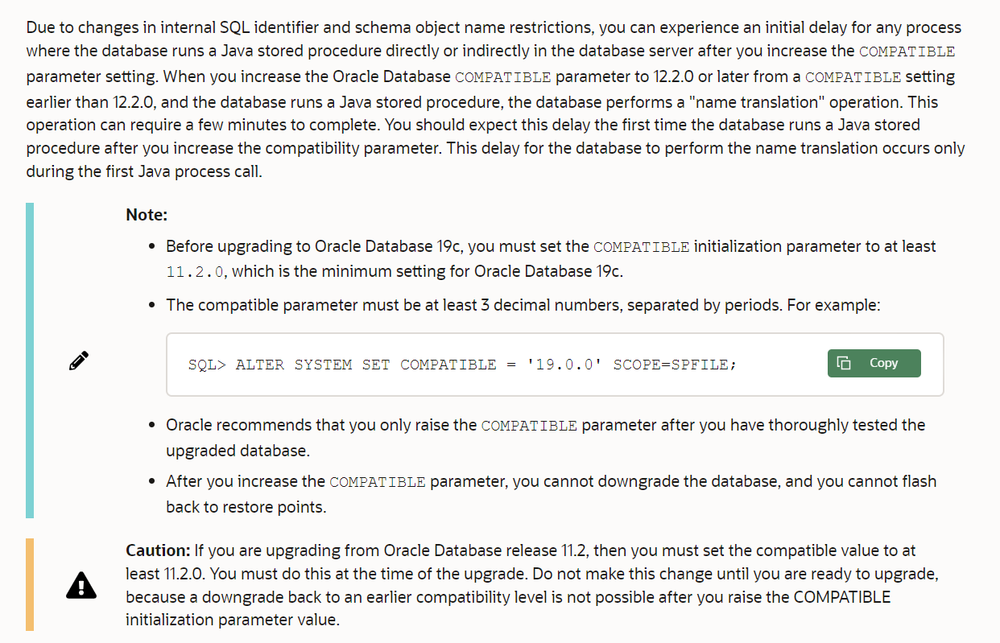

**关于Oracle继续查询通知**

# 权限不足

授予更改通知的权限：

```sql
GRANT CHANGE NOTIFICATION TO UserName;

-- REVOKE CHANGE NOTIFICATION FROM UserName;
```

# 报错 ORA-29983 

错误代码: ORA-29983
描述: 查询对于连续查询通知不受支持
原因: 无法为连续查询通知注册查询。
动作: 该查询具有一些使其与连续查询通知不兼容的构造，例如同义词或视图。请检查文档以获取完整列表。

Error code: ORA-29983
Description: Unsupported query for Continuous Query Notification
Cause: The query cannot be registered for Continuous Query Notification.
Action: The query has some constructs that make it incompatible with Continous Query Notification like synonyms or views. Please check the documentation for complete list.

# ORA-29979

Error code: ORA-29979
Description: Query registration not supported at current compatible setting
Cause: An attempt was made to register a query with the database compatible setting lower than 11.
Action: Increase the database compatible setting to 11.0.0.0.0

(Solution)解决方案就是 Action动作：升级数据库兼容设置到11。

# Oracle查询与修改数据库版本兼容性

查询数据库版本兼容性：

```sql
show parameter COMPATIBLE;

-- 或：
col NAME for a20
col VALUE for a15
col DESCRIPTION for a80
select name,value,description from v$parameter where name = 'compatible';
```

修改数据库版本兼容性：

```sql
alter system set compatible = '12.1.0' scope = spfile;

SHUTDOWN IMMEDIATE;
STARTUP;
```

> Before upgrading to Oracle Database 19c, you must set the COMPATIBLE initialization parameter to at least 11.2.0, which is the minimum setting for Oracle Database 19c.
> 
> The compatible parameter must be at least 3 decimal numbers, separated by periods. For example:
>
> ```sql
> SQL> ALTER SYSTEM SET COMPATIBLE = '19.0.0' SCOPE=SPFILE;
> ```
> 
> Oracle recommends that you only raise the COMPATIBLE parameter after you have thoroughly tested the upgraded database.
> 
> After you increase the COMPATIBLE parameter, you cannot downgrade the database, and you cannot flash back to restore points.

# 修改数据库版本兼容性 报错 ORA-02095: 无法修改指定的初始化参数

在 11.2 上执行 `alter system set compatible = "11.2.0" scope = spfile;`  或 改为  "11.0.0" 均报错 ORA-02095。

暂时不知如何解决。已经以系统管理员sysdba身份登陆。

> 一直不知道如何解决！！！

原因在于，要 **使用单引号，单引号，单引号！！！** **数据库SQL中单引号表示字符串。**

【更新，原因不在于使用双引号，实际后面测试使用双引号也没问题，但依照官方文档，还是推荐使用 `''`单引号。实际真横的问题在于，修改兼容性参数时直接从参考文章中复制的，而其写的`scope`少了c，拼写错误，坑死个人，参考文未列出，坑人不浅。拼写正确即可】

> [Category Archives: ORA-02095: specified initialization parameter cannot be modified](https://stepintooracledba.wordpress.com/category/ora-02095-specified-initialization-parameter-cannot-be-modified/) 介绍了使用 括号`Brackets` 导致的问题。应该使用 单引号，然后 逗号 分隔多个参数。

> 其他还有提到过 `CREATE PFILE='path to pfile' FROM SPFILE;` 或 `CREATE SPFILE FROM PFILE='path to file';` 这些就不太懂了 
> 
> [ORA-02095: specified initialization parameter cannot be modified](http://oraclequirks.blogspot.com/2008/05/ora-02095-specified-initialization.html)

# ORA-02095: Specified Initialization Parameter Cannot Be Modified

原文 [ORA-02095: Specified Initialization Parameter Cannot Be Modified](https://dbaclass.com/article/ora-02095-specified-initialization-parameter-cannot-modified/)

该文说明的是修改进程数：`alter system set processes=1000 scope=both;` 报错 ORA-02095

解决方案：

首先，check whether the parameter is system modifiable or not：

```sql
SQL> select name,VALUE,ISSYS_MODIFIABLE from SYS.V$PARAMETER where name='processes';

NAME VALUE ISSYS_MODIFIABLE
------------- ----------------------- ---------
processes 7680 FALSE
```

`ISSYS_MODIFIABLE is FALSE` 表示不能使用`scope=both`，需要使用`SCOPE=SPFILE`

> SCOPE=BOTH, PARAMETER WILL BE CHANGED DYNAMICALLY, No NEED TO RESTART THE INSTANCE/DATABASE.
> SCOPE=SPFILE, WE NEED TO RESTART THE INSTANCE/DATABASE, FOR THE PARAMETER TO REFLECT.

```sql
alter system set processes=1000 scope=SPFILE;


SHUTDOWN IMMEDIATE;
STARTUP;
```

# ORA-32001: 已请求写入 SPFILE, 但是在启动时未指定 SPFILE

> [ORA-32001: 已请求写入 SPFILE, 但是在启动时未指定 SPFILE](https://blog.csdn.net/haiross/article/details/41696035)

- 确定数据库是以spfile启动还是pfile启动 - `show parameter spfile`

`show parameter spfile;`查看，如果value对应有值，表示是spfile启动的，否则就是pfile启动的。

```sql
SQL> set linesize 100;
SQL> show parameter spfile;

NAME                                 TYPE                   VALUE
------------------------------------ ---------------------- ------------------------------
spfile                               string
SQL>
```

spfile 值为空，表示数据库以pfile启动。

- 要动态修改一定要用spfile启动。如果现在是用pfile启动，通过创建spfile并重新启动：

```sql
create spfile from pfile;
shutdown immediate;
startup;
```

- 过程如下：

```sql
SQL> create spfile from pfile;

File created.

SQL> shutdown immediate;
Database closed.
Database dismounted.
ORACLE instance shut down.
SQL> startup;
ORACLE instance started.

Total System Global Area 1920831488 bytes
Fixed Size                  2282376 bytes
Variable Size             855641208 bytes
Database Buffers         1056964608 bytes
Redo Buffers                5943296 bytes
Database mounted.
Database opened.
SQL>
```

- 修改数据库版本兼容性为`11.2.0`：

```sql
SQL> alter system set compatible = '11.2.0' scope = spfile;

System altered.

SQL> SHUTDOWN IMMEDIATE;
Database closed.
Database dismounted.
ORACLE instance shut down.
SQL> STARTUP;
ORACLE instance started.

Total System Global Area 1920831488 bytes
Fixed Size                  2282376 bytes
Variable Size             855641208 bytes
Database Buffers         1056964608 bytes
Redo Buffers                5943296 bytes
Database mounted.
Database opened.
SQL>
```

- 查看修改后的兼容性版本

```sql
SQL> show parameter COMPATIBLE;

NAME                                 TYPE                   VALUE
------------------------------------ ---------------------- ------------------------------
compatible                           string                 11.2.0
```


# 参考

- [What Is Oracle Database Compatibility?](https://docs.oracle.com/en/database/oracle/oracle-database/19/upgrd/what-is-oracle-database-compatibility.html#GUID-4711E0D1-9FCF-4F35-85B5-52EBB437C00E)
- [What Is Oracle Database Compatibility? - 12c](https://docs.oracle.com/en/database/oracle/oracle-database/12.2/upgrd/what-is-oracle-database-compatibility.html#GUID-7FCE8614-8163-4393-AE66-2ADD1F73934F)
- [Compatible Parameter in Oracle](https://rajat1205sharma.wordpress.com/2015/02/16/compatible-parameter-in-oracle/)




- [Oracle列宽、行数设置](https://www.cnblogs.com/s1-myblog/p/10888403.html)

> -设置行数：set pagesize 300(根据个人要求设置);
>
> - 设置列宽：set linesize 200(根据个人要求设置);
