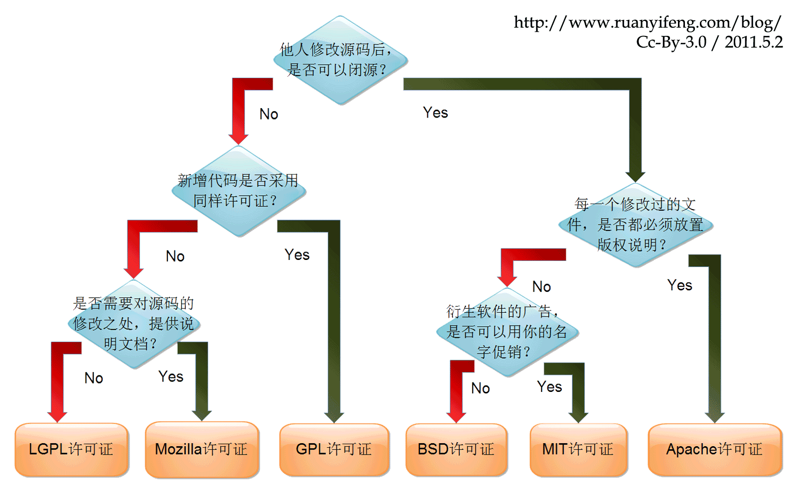

**关于Readme文件的一些记录**

[toc]

# Readme介绍及包含的主要内容

> README 是介绍和解释项目的文本文件，通常需要包含有关项目内容的信息。
> 
> 每个项目都应该至少包含一个 README

README应该是介绍项目整体的一个概览，用于帮助浏览者快速了解项目内容和要点，以及快速的上手使用。

README静态文件的格式一般为`.md`，也有`.txt`，有着约定俗成的规范，通常要包含以下内容：

1. 项目介绍（项目名称、软件定位）

2. 代码实现了什么功能?

3. 该如何使用? (系统环境参数，部署要素，操作说明，运行使用，使用示例，如何更新获取最新代码或版本等)

4. 代码组织架构是什么样的?（项目和所有子模块或库、目录结构说明等）

5. 版本更新内容摘要（相对重要，记录了开发更新的记录，有的也会将更新日志单独放到另一页中记录，而不是子啊readme中）

6. 常见问题说明

7. 作者列表或「Read AUTHORS」

8. 版权或许可信息，或开源协议说明，或法律声明

此外，还可以考虑添加联系信息、支持信息、公司或个人介绍等。

ReadMe文件的意义在于，说明 Source Code 做了什么? 运行在什么样环境下? 如何查看编辑代码? 其目的在于向使用者说明项目或者软件的基本情况，对源码有一个概览情况的介绍. 

# 为什么要写Readme文件？

让你的用户快速了解项目的作用，了解如何安装、使用项目，以及如何与你合作等。

README文件的作用：

- 可以让你过了很长时间后，仍然知道当初写了什么；

- 可以让其他人快速上手使用你的项目或代码，快速且轻松的了解项目代码内容；
  
- 可以让代码的质量提高；

- 可以让语言水平有所提高。

README应该简短精要，使阅读者快速的了解项目，快速的上手使用，节省自己和别人的时间。

> 有好的 README 文档的项目不一定是一个好开源项目，但一个好开源项目一定有一个好的 README。

# License选择

关于开源协议的选择，推荐参考如下几篇文章：

- [五分钟看懂开源协议](https://zhuanlan.zhihu.com/p/80075905)

- [如何选择开源许可证？](https://www.ruanyifeng.com/blog/2011/05/how_to_choose_free_software_licenses.html)

- [六种常见开源协议整理](https://blog.csdn.net/qq_28877125/article/details/116887370)

直接上一张 阮一峰大佬 制作的国外程序员Paul Bagwell的开源协议分析图中文版。简单明了的介绍了六种主流开源协议的主要区别：

  

另外，还可以使用[choosealicense](https://choosealicense.com/)网站来挑选一个开源协议。

> 推荐 [Pick a License, Any License](https://blog.codinghorror.com/pick-a-license-any-license/)

# 国际化问题

如果想要更多的人了解自己的项目，国际化是必不可少的，通常可以提供中英两种README文档。

在项目或README的头部注明，便于根据需要切换语言。

如下：

README：[中文](#) | [English](#)

其他....

# 关于markdown中实现代办实现的语法

一直没太注意markdown中「待办事项」的书写方式，在readme中这是一个非常常用的形式，用于列出项目的开发进度、项目需要列表、要实现和已实现的功能列表、或者bug问题等。

「待办事项」**To-do List**的md语法为：

```markdown
- [x] 已完成项目1
  - [x] 已完成事项1
  - [x] 已完成事项2

- [ ] 代办事项1
- [ ] 待办事项2
```

其效果如下：

- [x] 已完成项目1
  - [x] 已完成事项1
  - [x] 已完成事项2

- [ ] 代办事项1
- [ ] 待办事项2

比如，列出项目的主要功能：

- [x] 功能1

- [ ] 功能2
  - [x] 功能2-1
  - [ ] 功能2-2 待完成

- [ ] 功能3

# 附：其它一些名词

- 名称和说明 Name and description（介绍项目）

- 徽章 Badges 

基本在github等开源托管网站的项目的README中，都能看到醒目提示作用的Badges徽章，主要表现为用来表达项目的元数据的小图像，例如所有测试是否通过、代码覆盖率、要求的工具版本、讨论或联系等等。

如下是Shileds项目在github中的徽章效果：

  

[Shileds](https://link.zhihu.com/?target=http%3A//shields.io/)提供了方便制作badges的工具，可以添加到readme中。可以参考官网。

- 特性、特点、功能 Features
- 视觉效果 Visuals
- 要求 Requirements （一般为使用的前提条件）
- 安装 Installation
- 用法 Usage
- 支持 Support
- 作者和致谢(鸣谢) Authors and acknowledgment
- 更新日志 Changelog

# 参考

- [一个好的 README 的些许建议](https://zhuanlan.zhihu.com/p/29136209)
- [软件项目规范（1）：README文件的基本写作规范](https://blog.csdn.net/qq_25662827/article/details/124440992)
- [为开发项目编写README文件](https://www.cnblogs.com/wj-1314/p/8547763.html)

# 推荐 
 
- [随机项目名产生器](https://link.zhihu.com/?target=http%3A//mrsharpoblunto.github.io/foswig.js/)（适用于 Javascript 项目）
- [如何编写开源项目的 README 文档](https://zhuanlan.zhihu.com/p/23306218)
- [有哪些 GitHub 项目的 README 堪称教科书？](https://www.zhihu.com/question/299390628)
- [如何编写合格的项目说明[ReadMe]文档?](https://www.cnblogs.com/chenkai/archive/2012/06/20/2556047.html)
- [开源项目的README文档的最全最规范写法](https://www.jianshu.com/p/813b70d5b0de)
