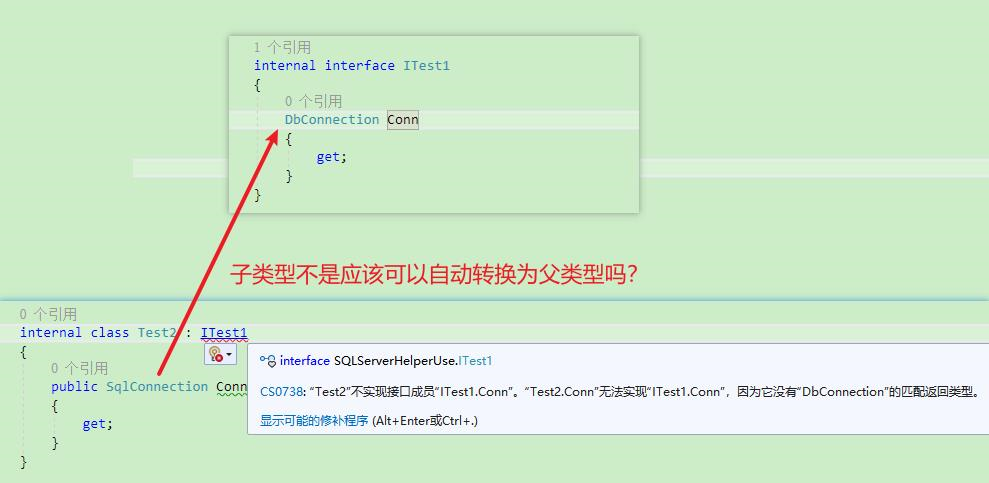

**关于子类实现中用到的数据类型的里式替换问题**

[toc]

在继承的子类中，进行实现或重写时，必须使用和父类中使用的相同的类型。

> 至于原因，个人猜测有两种：
> 
> 1. 一是有悖于里式替换原则，为了能够正确使用里式替换，子类实现中使用的数据类型必须和父类一致。
>
> 2. 里式替换针对的是对象，对象的里式替换原则，而不是类型，【类型也是对象？】，找一个类型也是对象的编程语言试一下？估计也是不行。因为确实有第一天的悖论


如下图所示，在接口中使用的是父类 `DbConnection`，在继承的实现中如果使用子类 `SqlConnection`，会提示无法实现接口或父类，因为类型不匹配。

  

```cs
internal interface ITest1
{
    DbConnection Conn
    {
        get;
    }

    void Test(DbConnection conn);
}

/// <summary>
/// 子类实现中使用的类型，必须和父类中的完全匹配（必须一致）
/// </summary>
internal class Test2 //: ITest1
{
    public SqlConnection Conn
    {
        get;
    }

    void Test(SqlConnection conn)
    {
        
    }
}
```


也就是，在继承实现中使用的类型，里式替换原则 是失效的，此时无法“实现” 隐式转换。即，在子类中不能使用作为父类中使用的类型的子类，借助隐式转换完成相关的继承或重写实现。

后面想了想，这个问题应该和 里式替换原则相悖 有关。

比如，父类 `Super` 使用的是一个基类型`A`，子类 `Derived` 继承中使用的是派生自基类型`A`的类型`A1`，如果允许这么使用，则，根据里式替换原则，可以创建一个隐式转换为父类型 `Super` 的子类 `Derived` 对象：

```cs
Super super_From_Derived = new Derived();
```

根据里式替换选择，父类 `super_From_Derived` 可以调用子类的方法或属性，但是由于子类中使用的类型`A1`，所以在使用方法或属性时，`Super` 对象 `super_From_Derived` 的签名是`A`，无法自动转换为派生类`A1`，即父类无法调用子类的方法或属性，与里式替换原则相悖。

同样的，反过来也不行，同样会有悖论，即，子类使用的基类型`A`可以隐式转换为父类使用的派生类`A1`。

```cs
internal interface ITest1
{
    SqlConnection Conn
    {
        get;
    }

    void Test(SqlConnection conn);
}

/// <summary>
/// 子类实现中使用的类型，必须和父类中的完全匹配（必须一致）
/// </summary>
internal class Test2 //: ITest1
{
    public DbConnection Conn
    {
        get;
    }

    void Test(DbConnection conn)
    {
        
    }
}
```
