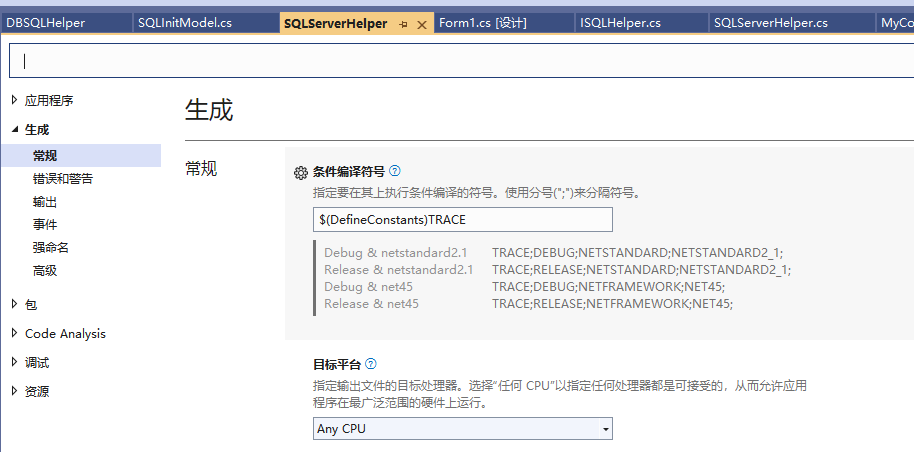

**创建一套同时支持.net Framework和.net Core的SQLHelper类库，不同框架添加不同引用，并发布到nuget**

从创建一个类库出发了解.NET6等多目标框架项目发布到nuget的完整流程（基于VS2022）

[toc]

在安装nuget上的类库时，通常会看到对应的依赖项分为`.NETFramework`、`.NETStandard`：

  

这样的类库支持用于`.net Framework`和`.net Core`两种类型的项目，并且只通过一个nuget包实现，兼顾了不同框架版本的需求，非常方便。

下面以一个自己的`SQLHelper`类库为例，实现生成同时支持多个目标框架的nuget包，同时也介绍下`SQLHelper`类。

# 创建支持多个目标框架的项目

## 创建项目

在Project工程层面，通过修改`.csproj`项目文件就可支持多个`.NET`平台。

首先，创建一个`.NET Standard`的类库项目(`Class Library Project`)，名为`DBSQLHelper`（图为vs2022）：

  

框架选择`.NET Standard 2.1`：

  

创建一个同样为`.NET Standard 2.1`框架的`SQLServerHelper`类库项目。

## `DBSQLHelper`中添加`ISQLHelper`接口

`ISQLHelper`接口要实现的功能：

1. `Initializer`初始化`SQLHelper`对象。
2. `ChangeDB`切换数据库的功能
3. `DisConn`断开连接
4. `ExistsDBOrTable`判断数据库或表是否存在
5. `ExecuteNonQuery`、`ExecuteQuery`、`ExecuteScalar`执行非查询和查询语句，均为参数化查询。
6. `ConnStatusOk`获取连接状态是否正确；`ConnStr`获取当前的连接字符串；`CheckOpen()`检查当前连接是否打开【通常用于open()操作或初始化之后的检查】（`CheckOpen()`其实没多大必要，不过可用于检测是否连接成功）

```cs
using System.Data.Common;
using System.Threading.Tasks;

namespace System.Data
{
    /// <summary>
    /// SQLHelper的接口
    /// </summary>
    public interface ISQLHelper
    {
        //DbCommand Cmd { get; set; }
        //DbDataReader Sqlrdr { get; set; }
        ///// <summary>
        ///// 获取当前连接对象 DbConnection(SqlConnection\MySqlConnection\...)
        ///// </summary>
        ///// <returns></returns>
        //DbConnection Conn
        //{
        //    get;
        //}

        /// <summary>
        /// 获取当前的连接字符串
        /// </summary>
        string ConnStr
        {
            get;
        }

        /// <summary>
        /// 获取连接状态是否OK
        /// </summary>
        bool ConnStatusOk
        {
            get;
        }


        /// <summary>
        /// SQLHelper初始化器，初始化一个新的SQLHelper
        /// </summary>
        /// <param name="initModel"></param>
        /// <returns></returns>
        bool Initializer(SQLInitModel initModel);
        bool Initializer(string ipInstance, string userName, string password, string dbName);
        //Task<bool> InitAsync(SQLInitModel initModel);

        /// <summary>
        /// 更换连接的数据库
        /// </summary>
        /// <param name="dbName"></param>
        /// <returns></returns>
        bool ChangeDB(string dbName);
        Task<bool> ChangeDBAsync(string dbName);
        
        /// <summary>
        /// 断开连接
        /// </summary>
        void DisConn();

        /// <summary>
        /// 检查当前连接是否打开，未打开将引发异常或返回false，已打开返回true【通常用于open()操作或初始化之后的检查】】
        /// </summary>
        bool CheckOpen();

        /// <summary>
        /// 是否存在某数据库及数据库中存在表
        /// </summary>
        /// <param name="dbName"></param>
        /// <param name="tableName"></param>
        /// <returns></returns>
        bool ExistsDBOrTable(string dbName, string tableName, string schema);
        /// <summary>
        /// 是否存在某数据库及数据库中存在表
        /// </summary>
        /// <param name="dbName"></param>
        /// <param name="tableName"></param>
        /// <returns></returns>
        Task<bool> ExistsDBOrTableAsync(string dbName, string tableName, string schema);

        /// <summary>
        /// 执行非查询SQL操作
        /// </summary>
        /// <param name="cmdText"></param>
        /// <param name="parameters"></param>
        /// <param name="cmdType"></param>
        /// <returns></returns>
        int ExecuteNonQuery(string cmdText, DbParameter[] parameters = null, CommandType cmdType = CommandType.Text);
        Task<int> ExecuteNonQueryAsync(string cmdText, DbParameter[] parameters = null, CommandType cmdType = CommandType.Text);
        /// <summary>
        /// 执行查询SQL，返回DataTable
        /// </summary>
        /// <param name="cmdText"></param>
        /// <param name="parameters"></param>
        /// <param name="cmdType"></param>
        /// <returns></returns>
        DataTable ExecuteQuery(string cmdText, DbParameter[] parameters = null, CommandType cmdType = CommandType.Text);
        Task<DataTable> ExecuteQueryAsync(string cmdText, DbParameter[] parameters = null, CommandType cmdType = CommandType.Text);
        /// <summary>
        /// 查询SQL返回第一个值
        /// </summary>
        /// <param name="cmdText"></param>
        /// <param name="parameters"></param>
        /// <param name="cmdType"></param>
        /// <returns></returns>
        string ExecuteScalar(string cmdText, DbParameter[] parameters = null, CommandType cmdType = CommandType.Text);
        Task<string> ExecuteScalarAsync(string cmdText, DbParameter[] parameters = null, CommandType cmdType = CommandType.Text);
    }
}
```

此外添加用于`SQLHelper`初始化的`SQLInitModel`类：

```cs
namespace System.Data
{
    /// <summary>
    /// SQLHelper初始化的对象类
    /// </summary>
    public class SQLInitModel
    {
        public SQLInitModel(string ipInstance, string userName, string password, string dbName)
        {
            IpInstance = ipInstance;
            UserName = userName;
            Password = password;
            DBName = dbName;
        }
        public string IpInstance { get; }
        public string UserName { get;  }
        public string Password { get;  }
        public string DBName { get;  }
    }
}
```

## `SQLServerHelper`项目中添加项目引用

添加对`ISQLHelper`接口所在项目`DBSQLHelper`的引用。

  

由于是`.NET Standard`项目，没有没有任何类库引用，所以`System.Data.SqlClient`、`SqlCommand`无法识别为正确的库或对象。

  

## 编辑项目文件，设置为多平台项目

双击`SQLServerHelper`项目（右键项目，选择“编辑项目文件”）打开`.csproj`项目文件，修改`TargetFramework`标签为`TargetFrameworks`，添加多个目标框架：

```cs
<PropertyGroup>
 <TargetFrameworks>netstandard2.1;net45;net6</TargetFrameworks>
 <Nullable>enable</Nullable>
</PropertyGroup>
```

也可以在项目属性的“目标框架”中设置多个框架。

  

即分别生成`.net standard2.1`、`.net framework4.5`、`.Net 6`的项目。如果是生成`.net framework4.5.1`框架则为`net451`。

保存后重载全部项目：

  

但是，由于引用的`DBSQLHelper`项目是`.net standard`类库，与设置的`net45`框架**不兼容**。所以上面截图中顶部提示“在上一操作期间遇到问题”，同时项目错误：

  

将`DBSQLHelper`项目也修改为多目标框架项目，添加`net45`框架。解决不兼容问题：

  

> 由于并未使用`net6`中任何特定特性，后续移除了`net6`的目标框架。

## 不同目标框架添加不同引用

如下可以看到，`SqlCommand`类仅在`.net framework4.5`的框架中可用，另外的目标框架需要添加相关的引用（不同目标框架安装不同nuget）

  

为`NET6`、`.net standard`目标添加新的 `Microsoft.Data.SqlClient` nuget包，用于SQL Server的`ADO.NET`访问。

  

## 使用条件编译的预处理指令使代码同时支持.NET Framework 和 .NET

此处先移除`net6`的目标框架，使用条件仅针对`netstandard2.1`和`net45`两个框架。

有net45提供的api与netstandard提供的api是有差异的，有的无法统一使用，因此，需要通过条件编译的形式，针对不同目标框架编写不同的代码，使两者能够通用。

比如刚刚添加的nuget包，为了在`netstandard2.1`下使用`SQLClient`相关的类和方法，安装了 `Microsoft.Data.SqlClient` nuget包，但是其引用仅能用于`netstandard2.1`框架中，`net45`是无法找到的，也就会发生错误：

  

同样的，`netstandard2.1`框架中找不到`System.Data.SqlClient`相关引用。

  

所以，要使用条件编译，不同的框架下使用引用不同的命名空间：

```cs
#if NETSTANDARD2_1_OR_GREATER
using Microsoft.Data.SqlClient;
#endif

#if NET45_OR_GREATER
using System.Data.SqlClient;
#endif
```

可以正确引用命名空间并使用相关类和方法。

> 关于不同框架版本的条件编译符号，在使用时的智能提示已经足够，也可以参考官网[#conditional-compilation](https://learn.microsoft.com/en-us/dotnet/csharp/language-reference/preprocessor-directives#conditional-compilation)
> 
>   

> 关于新增条件编译符号，可以从“项目属性”->“生成”中查看和添加新的符号：
> 
>   

## 关于可空上下文的错误（`Nullable contexts`）

在项目中，空引用导致的安全问题（`System.NullReferenceException`）非常常见，因此，现代C#提供了防止引发`System.NullReferenceException`异常的特性或功能，即可空类型和可空上下文。

所有显式类型定义的变量都解释为不可为null的引用类型。

这可以提高安全性，避免很多问题，但是，如果已有代码中启用了该功能，则有可能产生新的警告或错误。

如下，添加的代码中有用到将引用类型设置为null的地方，如`DbParameter[] parameters = null`，然后会有报错 `无效的 nullable 值: C# 7.3 的“Enable”。请使用语言版本 8.0 或更高版本`，需要升级版本，如下：

  

这是因为在 C# 的低版本中，不支持“可为Null的类型”特性。

最简单的解决办法办法是，**在“项目属性”->“生成”中，将“可为Null的类型”功能禁用**【解决】。

如果修改为警告等其它选项：

  

则依旧会报错 `无效的 nullable 值: C# 7.3 的“Warnings”。请使用语言版本 8.0 或更高版本`，也即升级版本。

想着还是保留警告信息，然后升级下C#版本。

## 升级或指定C#语言版本

在“项目属性”->“生成”->“高级”中，可以看到对应的语言版本（只读）：

  

`net45`中为`7.3`。

> **.NET Framework中所有项目的C#语言版本默认都是7.3。**

此处需要修改C#语言版本，在以前的VS中，修改C#语言版本很方便，项目属性->生成->高级中，可以直接修改，但是VS
2019开始不允许进行直接修改：

  

修改语言版本只能通过项目文件。如下，在项目文件中添加：

```cs
<PropertyGroup>
   <LangVersion>8.0</LangVersion>
</PropertyGroup>
```

重新(加载)生成一次，发现没有了上面提示升级到8.0的错误，查看语言版本：

  

> 也可以统一为子目录下的多个项目设置语言版本，具体参见参考中的官方文档。

## `SQLServerHelper`实现`ISQLHelper`接口 

经过以上调整后，`SQLServerHelper`对`ISQLHelper`接口的实现变为如下代码。其中在原接口功能基础上：

1. 定义 `GetQueryExistsDBOrTableSQLStr` 私有方法，生成检查数据库或表是否存在的SQL语言
2. 增加静态方法`Init`，作为工厂模式的`SQLServerHelper`对象初始化生成器，如果已有对应的数据库服务器连接，则直接返回已有的`SQLHelper`对象；没有则创建新对象并返回。
3. `Conn`属性获取当前连接对象SqlConnection，若获取时未连接，会在打开连接后再返回。用于直接使用当前连接。
4. `ConnState`属性获取连接状态（不是很必要）。

```cs
#if NETSTANDARD2_1_OR_GREATER
using Microsoft.Data.SqlClient;
#endif
using System.Collections.Generic;
using System.Data.Common;
#if NET45_OR_GREATER
using System.Data.SqlClient;
#endif
using System.Threading.Tasks;

namespace System.Data
{
    /// <summary>
    /// 推荐使用Init创建SQLHelper对象，若使用new单独创建，必须调用Initializer
    /// </summary>
    public class SQLServerHelper : ISQLHelper
    {
        private SqlCommand cmd = null;

        private string _ipInstance;
        private string _userName;
        private string _password;
        private string _dbName;

        private SqlConnection _conn;

        #region 属性
        /// <summary>
        /// 获取连接状态是否OK
        /// </summary>
        public bool ConnStatusOk
        {
            get
            {
                return Conn != null && Conn.State != ConnectionState.Closed && Conn.State != ConnectionState.Broken;
            }
        }
        /// <summary>
        /// 当前连接字符串
        /// </summary>
        public string ConnStr
        {
            get;
            private set;
        }

        /* 非接口属性 */

        /// <summary>
        /// 获取连接状态
        /// </summary>
        public ConnectionState? ConnState
        {
            get
            {
                return Conn?.State;
            }
        }
        /// <summary>
        /// 获取当前连接对象SqlConnection (若未连接，会在获取时打开连接)
        /// </summary>
        /// <returns></returns>
        public SqlConnection Conn
        {
            get
            {
                if (_conn.State == ConnectionState.Closed)
                {
                    _conn.Open();
                }
                return _conn;
            }
            private set
            {
                _conn = value;
            }
        }
        #endregion

        #region 初始化器
        static readonly Dictionary<string, SQLServerHelper> _sqlHelperCache = new Dictionary<string, SQLServerHelper>();

        /// <summary>
        /// 初始化一个新的SQLHelper对象
        /// </summary>
        /// <param name="ipInstance"></param>
        /// <param name="userName"></param>
        /// <param name="password"></param>
        /// <param name="dbName"></param>
        /// <returns></returns>
        public bool Initializer(string ipInstance, string userName, string password, string dbName)
        {
            _ipInstance = ipInstance;
            _userName = userName;
            _password = password;
            _dbName = dbName;
            ConnStr = $"Server={_ipInstance};Database={dbName};User Id={_userName};Password={_password};";
            Conn = new SqlConnection(ConnStr);
            // 验证连接是否正常
            return CheckOpen();
        }
        /// <summary>
        /// 初始化一个新的SQLHelper对象
        /// </summary>
        /// <param name="initModel"></param>
        /// <returns></returns>
        public bool Initializer(SQLInitModel initModel)
        {
            return Initializer(initModel.IpInstance, initModel.UserName,initModel.Password,initModel.DBName);
        }
        /// <summary>
        /// 初始化SQLHelper对象，如果已有对应的数据库服务器连接，则直接返回；没有则创建新的
        /// </summary>
        /// <param name="ipInstance"></param>
        /// <param name="userName"></param>
        /// <param name="password"></param>
        /// <param name="dbName"></param>
        /// <returns></returns>
        public static SQLServerHelper Init(string ipInstance, string userName, string password, string dbName)
        {
            var key = $"{ipInstance}-{userName}-{password}-{dbName}";
            if (!_sqlHelperCache.ContainsKey(key))
            {
                var sql = new SQLServerHelper();
                // 验证连接是否正常
                if (sql.Initializer(ipInstance, userName, password, dbName))
                {
                    _sqlHelperCache.Add(key, sql);
                    return sql;
                }
            }
            // “Conn.ServerVersion”引发了类型“System.InvalidOperationException”的异常
            // 强行打开将会报错
            // Conn.Open();

            return _sqlHelperCache[key];
        }
        /// <summary>
        /// 初始化SQLHelper对象，如果已有对应的数据库服务器连接，则直接返回；没有则创建新的
        /// </summary>
        /// <param name="initModel"></param>
        /// <returns></returns>
        public static SQLServerHelper Init(SQLInitModel initModel)
        {
            return Init(initModel.IpInstance, initModel.UserName, initModel.Password, initModel.DBName);
        }

        //public async Task<bool> InitAsync(SQLInitModel initModel)
        //{

        //    // “Conn.ServerVersion”引发了类型“System.InvalidOperationException”的异常
        //    // 强行打开将会报错
        //    // await Conn.OpenAsync();

        //    return ConnStatusOk;
        //}
        #endregion

        public bool ChangeDB(string dbName)
        {
            if (_dbName== dbName)
            {
                return true;
            }
            _conn?.Close();
            var connStr = $"Server={_ipInstance};Database={dbName};User Id={_userName};Password={_password};";
            _conn = new SqlConnection(connStr);
            _conn.Open();
            return CheckOpen();
        }
        public async Task<bool> ChangeDBAsync(string dbName)
        {
            if (_dbName == dbName)
            {
                return true;
            }
            _conn?.Close();
            var connStr = $"Server={_ipInstance};Database={dbName};User Id={_userName};Password={_password};";
            _conn = new SqlConnection(connStr);
            await _conn.OpenAsync();
            return CheckOpen();
        }
        /// <summary>
        /// 断开连接
        /// </summary>
        public void DisConn()
        {
            cmd?.Dispose();
            _conn?.Close();
        }
        /// <summary>
        /// 检查当前连接是否打开，未打开将引发异常，已打开返回true【通常用于open()操作或初始化之后的检查】】
        /// </summary>
        public bool CheckOpen()
        {
            if (Conn.State != ConnectionState.Open)
            {
                throw new Exception("当前SQL未连接，请确认设置是否正确，或稍后重试！");
            }
            return true;
        }
        /// <summary>
        /// 是否存在某数据库或数据库中存在某表【dbName tableName不能同时为空】
        /// </summary>
        /// <param name="dbName">数据库名，如果为空，将检查当前连接的数据库中是否存在某table</param>
        /// <param name="tableName">表名，如果为空，将仅检查是否存在某db</param>
        /// <param name="schema">不应该为空</param>
        /// <returns></returns>
        public bool ExistsDBOrTable(string dbName, string tableName, string schema = "dbo")
        {
            if (string.IsNullOrEmpty(dbName) && string.IsNullOrEmpty(tableName))
            {
                return false;
            }
            string sql = GetQueryExistsDBOrTableSQLStr(dbName, tableName, schema);
            var dbExists = ExecuteScalar(sql);

            return dbExists != "0";
        }

        /// <summary>
        /// 是否存在某数据库或数据库中存在某表(异步)【dbName tableName不能同时为空】
        /// </summary>
        /// <param name="dbName">数据库名，如果为空，将检查当前连接的数据库中是否存在某table</param>
        /// <param name="tableName">表名，如果为空，将仅检查是否存在某db</param>
        /// <param name="schema">不应该为空</param>
        /// <returns></returns>
        public async Task<bool> ExistsDBOrTableAsync(string dbName, string tableName, string schema = "dbo")
        {
            if (string.IsNullOrEmpty(dbName) && string.IsNullOrEmpty(tableName))
            {
                return false;
            }
            string sql = GetQueryExistsDBOrTableSQLStr(dbName, tableName, schema);
            var dbExists = await ExecuteScalarAsync(sql);

            return dbExists != "0";
        }
        /// <summary>
        /// 获取查询数据库或表是否存在的SQL语句
        /// </summary>
        /// <param name="dbName"></param>
        /// <param name="tableName"></param>
        /// <param name="schema"></param>
        /// <returns></returns>
        private static string GetQueryExistsDBOrTableSQLStr(string dbName, string tableName, string schema = "dbo")
        {
            if (string.IsNullOrWhiteSpace(dbName) && string.IsNullOrWhiteSpace(tableName))
            {
                throw new ArgumentNullException($"dbName and tableName");
            }
            var sql = string.Empty;
            if (!string.IsNullOrEmpty(dbName) && string.IsNullOrEmpty(tableName))
            {
                sql = $"SELECT case when DB_ID('{dbName}') IS NULL THEN 0 ELSE 1 END;";
            }
            else if (string.IsNullOrEmpty(dbName) && !string.IsNullOrEmpty(tableName))
            {
                sql = $"SELECT case when OBJECT_ID('{schema}.{tableName}') IS NULL THEN 0 ELSE 1 END;";
            }
            else
            {
                sql = $"SELECT case when (DB_ID('{dbName}') IS NULL OR OBJECT_ID('{dbName}.{schema}.{tableName}') IS NULL) THEN 0 ELSE 1 END;";
            }

            return sql;
        }

        /// <summary>
        /// 执行非查询语句
        /// </summary>
        /// <param name="cmdText"></param>
        /// <param name="parameters"></param>
        /// <param name="cmdType"></param>
        /// <returns></returns>
        public int ExecuteNonQuery(string cmdText, DbParameter[] parameters = null, CommandType cmdType = CommandType.Text)
        {
            using (cmd = new SqlCommand(cmdText, Conn))
            {
                if (parameters != null && parameters.Length > 0) cmd.Parameters.AddRange(parameters);
                cmd.CommandType = cmdType;
                return cmd.ExecuteNonQuery();
            }
        }
        /// <summary>
        /// 异步执行非查询语句
        /// </summary>
        /// <param name="cmdText"></param>
        /// <param name="parameters"></param>
        /// <param name="cmdType"></param>
        /// <returns></returns>
        public async Task<int> ExecuteNonQueryAsync(string cmdText, DbParameter[] parameters = null, CommandType cmdType = CommandType.Text)
        {
            using (cmd = new SqlCommand(cmdText, Conn))
            {
                if (parameters != null && parameters.Length > 0) cmd.Parameters.AddRange(parameters);
                cmd.CommandType = cmdType;
                return await cmd.ExecuteNonQueryAsync();
            }
        }

        /// <summary>
        /// 执行查询，返回结果的DataTable格式
        /// </summary>
        /// <param name="cmdText"></param>
        /// <param name="cmdType"></param>
        /// <param name="parameters"></param>
        /// <returns></returns>
        public DataTable ExecuteQuery(string cmdText, DbParameter[] parameters = null, CommandType cmdType = CommandType.Text)
        {
            using (cmd = new SqlCommand(cmdText, Conn))
            {
                cmd.CommandType = cmdType;
                if (parameters != null && parameters.Length > 0) cmd.Parameters.AddRange(parameters);
                using (var sqlrdr = cmd.ExecuteReader())
                {
                    DataTable dt = new DataTable();
                    dt.Load(sqlrdr);
                    return dt;
                }
            }
        }
        /// <summary>
        /// 执行异步查询，返回结果的DataTable格式
        /// </summary>
        /// <param name="cmdText"></param>
        /// <param name="parameters"></param>
        /// <param name="cmdType"></param>
        /// <returns></returns>
        public async Task<DataTable> ExecuteQueryAsync(string cmdText, DbParameter[] parameters = null, CommandType cmdType = CommandType.Text)
        {
            using (cmd = new SqlCommand(cmdText, Conn))
            {
                cmd.CommandType = cmdType;
                if (parameters != null && parameters.Length > 0) cmd.Parameters.AddRange(parameters);
                using (var sqlrdr = await cmd.ExecuteReaderAsync())
                {
                    DataTable dt = new DataTable();
                    dt.Load(sqlrdr);
                    return dt;
                }
            }
        }

        /// <summary>
        /// 返回第一行第一列的值，即返回单个值
        /// </summary>
        /// <param name="cmdText"></param>
        /// <param name="parameters"></param>
        /// <param name="cmdType"></param>
        /// <returns></returns>
        public string ExecuteScalar(string cmdText, DbParameter[] parameters = null, CommandType cmdType = CommandType.Text)
        {
            using (cmd = new SqlCommand(cmdText, Conn))
            {
                cmd.CommandType = cmdType;
                if (parameters != null && parameters.Length > 0) cmd.Parameters.AddRange(parameters);
                return cmd.ExecuteScalar().ToString();
            }
        }
        /// <summary>
        /// 异步查询，返回第一行第一列的值，即返回单个值
        /// </summary>
        /// <param name="cmdText"></param>
        /// <param name="parameters"></param>
        /// <param name="cmdType"></param>
        /// <returns></returns>
        public async Task<string> ExecuteScalarAsync(string cmdText, DbParameter[] parameters = null, CommandType cmdType = CommandType.Text)
        {
            using (cmd = new SqlCommand(cmdText, Conn))
            {
                cmd.CommandType = cmdType;
                if (parameters != null && parameters.Length > 0) cmd.Parameters.AddRange(parameters);
                var result = await cmd.ExecuteScalarAsync();
                return result.ToString();
            }
        }
    }
}
```

一切调整好后可以重新生成项目，查看对应各自平台生成类库dll（`bin/debug`下）。

  

# 生成多平台的类库发布到nuget

生成的两个 `.NET` 目标版本的dll，可以制作支持多个 `.NET` 目标框架的Nuget包。

右键项目属性，在“包”->“常规”（以前为“打包”项）中，可以设置生成Nuget包。


# 参考

- [nullable-contexts](https://learn.microsoft.com/en-us/dotnet/csharp/nullable-references#nullable-contexts)
- [C# language versioning](https://learn.microsoft.com/en-us/dotnet/csharp/language-reference/configure-language-version#override-a-default)