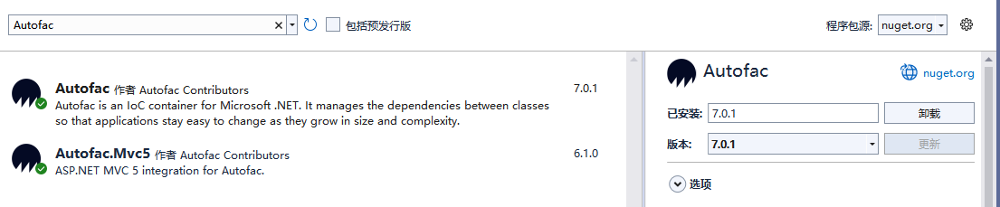
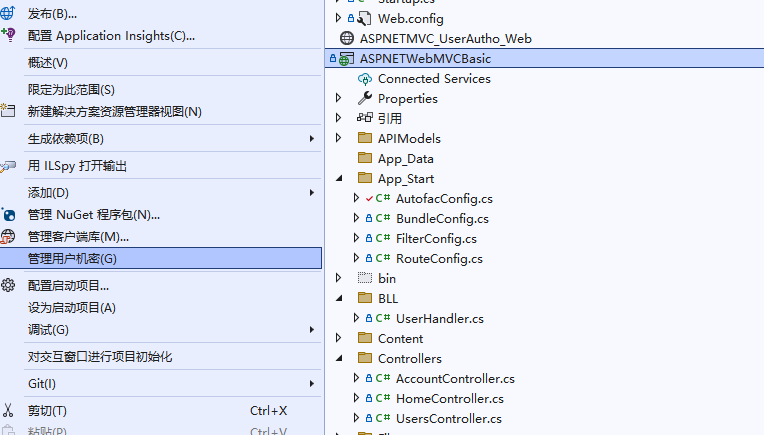

**在Asp.Net MVC5中的使用Autofac和Dapper连接Oracle数据库、管理用户机密、自定义配置文件路径**

[toc]

> ASPNETWebMVCBasic 项目下。

# Autofac的使用

## 安装nuget包 Autofac 和 Autofac.Mvc5



> 项目引用 - 程序集 System.Web.Mvc.dll 右键属性，可以查看 mvc 的版本号。
> 
> 项目文件 .csproj 中也可以查看 MVC 版本号。

## mvc项目的App_Start文件夹下添加AutofacConfig类

```cs
namespace ASPNETWebMVCBasic.App_Start
{
    public class AutofacConfig
    {
        /// <summary>
        /// 负责调用autofac框架实现 业务逻辑层 和 数据仓储层程序集中的类型对象的创建
        /// 负责创建MVC控制器类的对象(调用控制器中的有参构造函数),接管DefaultControllerFactory的工作
        /// </summary>
        public static void Register()
        {
            //实例化一个autofac的创建容器
            var builder = new ContainerBuilder();

            #region 注册单例
            builder.RegisterType<DataContext>().SingleInstance();
            #endregion

            #region 注入service

            builder.RegisterType<UserService>().As<IUserService>();

            #endregion

            #region 注入Repository

            builder.RegisterType<UserRepository>().As<IUserRepository>();

            #endregion

            //注入控制控制器
            builder.RegisterControllers(typeof(MvcApplication).Assembly);


            //创建一个Autofac的容器
            var container = builder.Build();
            //将MVC的控制器对象实例 交由autofac来创建
            DependencyResolver.SetResolver(new AutofacDependencyResolver(container));
        }
    }
}
```

**MVC和API不同的注入方式：**

```C#
var builder = new ContainerBuilder();
builder.RegisterControllers(Assembly.GetExecutingAssembly()); //Register MVC Controllers
builder.RegisterApiControllers(Assembly.GetExecutingAssembly()); //Register WebApi Controllers
builder.RegisterType<Type>().As<IType>();

var container = builder.Build();

DependencyResolver.SetResolver(new AutofacDependencyResolver(container)); //Set the MVC DependencyResolver
GlobalConfiguration.Configuration.DependencyResolver = new AutofacWebApiDependencyResolver((IContainer)container); //Set the WebApi DependencyResolver
```

## Global.asax 中初始化Autofac的配置

Global.asax 文件中：

```C#
namespace ASPNETWebMVCBasic
{
    public class MvcApplication : System.Web.HttpApplication
    {
        protected void Application_Start()
        {
            // Autofac 初始化注册
            AutofacConfig.Register();

            AreaRegistration.RegisterAllAreas();
            FilterConfig.RegisterGlobalFilters(GlobalFilters.Filters);
            RouteConfig.RegisterRoutes(RouteTable.Routes);
            BundleConfig.RegisterBundles(BundleTable.Bundles);
        }
    }
}
```

## Controller、Service 构造函数中 注入 


```C#
namespace WebAPI_CURD.Controllers
{
    [Route("[controller]")]
    public class UsersController : Controller
    {
        private IUserService _userService;

        public UsersController(IUserService userService)
        {
            _userService = userService;
        }
......
......
```


```C#
namespace WebAPI_CURD.Services
{

    /// <summary>
    /// core business logic and validation related to user CRUD operations.连接 controllers 和 repositories
    /// </summary>
    public class UserService : IUserService
    {
        private IUserRepository _userRepository;


        public UserService(IUserRepository userRepository)
        {
            _userRepository = userRepository;
        }

......
......
```

# Dapper连接Oracle

安装Nuget包 Dapper 和 Oracle.ManagedDataAccess 19.18.0（此版本没有其他依赖，之后的版本都有 System.Text.Json 依赖）


## data source connection string - dataSource连接字符串 的使用

> [Oracle Data Provider for .NET, Managed Driver Configuration](https://docs.oracle.com/en/database/oracle/oracle-database/19/odpnt/InstallManagedConfig.html#GUID-29A85CBD-948D-4C9F-A89D-A96A99EFF2D7)

### 配置 section

安装 `Oracle.ManagedDataAccess` 包后，会在 Web.config 或 app.config 中自动添加如下的配置信息：

```C#
<configuration>
  <configSections>
    <section name="oracle.manageddataaccess.client" type="OracleInternal.Common.ODPMSectionHandler, Oracle.ManagedDataAccess, Version=4.122.19.1, Culture=neutral, PublicKeyToken=89b483f429c47342" />
  </configSections>
  <system.data>
    <DbProviderFactories>
      <remove invariant="Oracle.ManagedDataAccess.Client" />
      <add name="ODP.NET, Managed Driver" invariant="Oracle.ManagedDataAccess.Client" description="Oracle Data Provider for .NET, Managed Driver" type="Oracle.ManagedDataAccess.Client.OracleClientFactory, Oracle.ManagedDataAccess, Version=4.122.19.1, Culture=neutral, PublicKeyToken=89b483f429c47342" />
    </DbProviderFactories>
  </system.data>
  <oracle.manageddataaccess.client>
    <version number="*">
      <dataSources>
        <dataSource alias="SampleDataSource" descriptor="(DESCRIPTION=(ADDRESS=(PROTOCOL=tcp)(HOST=localhost)(PORT=1521))(CONNECT_DATA=(SERVICE_NAME=ORCL))) " />
      </dataSources>
    </version>
  </oracle.manageddataaccess.client>
</configuration>
```

> 关于 `<oracle.manageddataaccess.client>` 配置节完整的结构可以参考上面的官方链接

**ODP.NET 托管驱动器会在应用程序启动时，读取和缓存来自 app.config、web.config、machine.config 和 tnsnames.ora 等文件中可以找到的所有的 alias 条目。**

> However, aliases that are defined in LDAP servers are resolved and cached on demand. This means for each unique alias that is used by the application, an alias resolution query is executed against an LDAP server and the full descriptor associated with the alias will be cached once it is fetched.

### 连接字符串使用 data source

如下，修改上面 dataSource 描述符的配置信息，在连接字符串中使用 data source 测试数据库连接。

```C#
// DataContext.cs
public static void Test()
{
    try
    {
        // Please replace the connection string attribute settings
        string constr = "user id=scott;password=tiger;data source=SampleDataSource";

        using (OracleConnection con = new OracleConnection(constr))
        {
            con.Open();
            Debug.WriteLine("Connected to Oracle Database {0}", con.ServerVersion);
        }
    }
    catch (Exception ex)
    {
        Debug.WriteLine("Error : {0}", ex);
    }
}
```

或者在 app.config / web.config 中指定连接字符串：

```xml
  <connectionStrings>
    <add name="SampleConnString" connectionString="User Id=scott;Password=tiger;Data Source=SampleDataSource" providerName="Oracle.ManagedDataAccess.Client.OracleConnection, Oracle.ManagedDataAccess"/>
  </connectionStrings>
```

获取并使用 ConnectionString：

```C#
string constr = WebConfigurationManager.ConnectionStrings["SampleConnString"].ConnectionString;
```

在上面 AutofacConfig.cs 配置中 `DependencyResolver.SetResolver` 后面，执行测试，并 使用 Autofac 创建对象：

**通过IOC容器创建对象。**

```C#
// 测试
DataContext.Test();

// 只有在使用时，才会创建相应对象
var dataCtx = container.Resolve<DataContext>();//通过IOC容器创建对象
```

```sh
Connected to Oracle Database: 11.2.0.4.0
ConnectionString: User Id=scott;Password=tiger;Data Source=SampleDataSource
Connected to Oracle Database - constructor: 11.2.0.4.0
```

### OracleDataSourceEnumerator.GetDataSources() 读取更新

`OracleDataSourceEnumerator.GetDataSources()` 用来读取或更新dataSource连接字符串。

> 如果是 tnsnames.ora 文件和LDAP Server的 alias 配置被修改或添加，可以直接使用 `OracleDataSourceEnumerator.GetDataSources()` 获取新的配置，而不需要重启，最好在之前调用 ClearPool(OracleConnection) 或 ClearAllPools() 清理旧的连接描述符。
>
> app.config, web.config 和 machine.config 中的配置，仅在程序启动时读取一次，再次调用 `OracleDataSourceEnumerator.GetDataSources()` 也不会获取更改后的连接信息，只能重启。

## 直接在 连接字符串 中指定连接描述符

```xml
<connectionStrings>
    <add name="DemoConnString" connectionString="User Id=scott;Password=tiger;Data Source=(DESCRIPTION=(ADDRESS_LIST=(ADDRESS=(PROTOCOL=TCP)(HOST=10.10.10.2)(PORT=1521)))(CONNECT_DATA=(SERVICE_NAME=ORCL)))" providerName="Oracle.ManagedDataAccess.Client.OracleConnection, Oracle.ManagedDataAccess"/>
  </connectionStrings>
```


# 管理用户机密

> .NETFx4.7.2



Web.config 文件中，`connectionStrings` 连接字符串配置节使用用户机密处理，添加 `configBuilders="Secrets"` 属性。

如下 `用户机密管理的说明 secrets.xml 文件中仍旧为 name/value 的形式取值，属性通过name中:实现，如'strict-cs:providerName'`：

```xml
  <connectionStrings configBuilders="Secrets">
    <!-- 用户机密管理的说明 secrets.xml 文件中仍旧为 name/value 的形式取值，属性通过name中:实现，如'strict-cs:providerName' -->
    <!--<add name="strict-cs" connectionString="Will get the value of 'strict-cs' or 'strict-cs:connectionString'"
                              providerName="Will only get the value of 'strict-cs:providerName'" />

    --><!-- Easy to imagine pulling these from a structured json file. --><!--
    <add name="token-cs1" connectionString="${tokenCS:connectionString}"
                          providerName="${tokenCS:providerName}" />
    --><!-- But token mode can be messy. --><!--
    <add name="token-cs2" connectionString="${token-names-not-important}"
                          providerName="${they-can-even-be-tagged-wrong:connectionString}" />-->
    
    <add name="SampleConnString" connectionString="User Id=用户名;Password=密码;Data Source=SampleDataSource" providerName="property name need exists in strict model？ :providerName in secret xml not work" />
    <!-- 推荐 -->
    <add name="SampleConnString2" connectionString="User Id=用户名;Password=密码;Data Source=(DESCRIPTION=(ADDRESS=(PROTOCOL=TCP)(HOST=DBServer_IP)(PORT=1521))(CONNECT_DATA=(SERVICE_NAME=ORCL)))" providerName="Oracle.ManagedDataAccess.Client.OracleConnection, Oracle.ManagedDataAccess" />
    <!-- 不推荐使用 ADDRESS_LIST ，没必要-->
    <add name="SampleConnString3" connectionString="User Id=用户名;Password=密码;Data Source=(DESCRIPTION=(ADDRESS_LIST=(ADDRESS=(PROTOCOL=TCP)(HOST=DBServer_IP)(PORT=1521)))(CONNECT_DATA=(SERVICE_NAME=ORCL)))" providerName="Oracle.ManagedDataAccess.Client.OracleConnection, Oracle.ManagedDataAccess" />
  </connectionStrings>
```

> 实际测试，设置 `:providerName` 无效，也可能设置不正确。

secrets.xml 文件中为真实的机密信息：

```xml
<?xml version="1.0" encoding="utf-8"?>
<root>
  <secrets ver="1.0">
    <secret name="SampleConnString" value="真实的连接字符信息" />
    <!-- SampleConnString 等同 SampleConnString:connectionString -->
    <!--<secret name="SampleConnString:connectionString" value="真实的连接字符信息" />-->
    <!-- providerName -->
    <secret name="SampleConnString:providerName" value="Oracle.ManagedDataAccess.Client.OracleConnection, Oracle.ManagedDataAccess" />

    <secret name="SampleConnString2" value="真实的连接字符信息" />
    <secret name="SampleConnString3" value="真实的连接字符信息" />
  </secrets>
</root>
```

# 参考

[【Autofac】在Asp.Net MVC5中的使用](https://www.cnblogs.com/chuankang/articles/9717873.html)