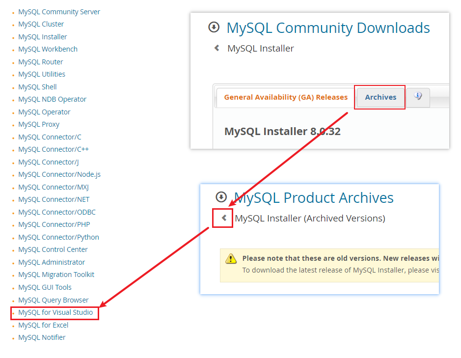

**多目标框架分别加载Nuget包和dll引用，MSB3274未能解析主引用，MySql.Data.dll 低版本的官方下载**

[toc]

# 多目标框架分别加载Nuget包和dll项目引用

- 编辑项目文件`.csproj`，修改目标框架设置项为`TargetFrameworks`，添加多个目标：

```xml
<TargetFrameworks>netstandard2.1;net452;net45</TargetFrameworks>
```

- 安装 `MySql.Data` Nuget包

打开 Nuget 管理器，搜索安装`MySql.Data`，基本从 `MySql.Data 6.10` 开始，其支持的 .Net 版本就是 `.Net Framework 4.5.2`。

  

因此，此时安装后，在`net45`版本下是没有该包引用的。

  

- 添加项目引用`MySql.Data.dll`文件

如下，添加对程序集文件`MySql.Data.dll`的引用。**该引用操作会在所有目标框架下，添加程序集引用**

  

如下，可以看到另两个目标框架多出了程序集引用。

  

解决办法，可以分别将其删除。或者，在`.csproj`文件中配置，只针对`net45`框架引用程序集。

将下面所有框架引用程序集：

```xml
  <ItemGroup>
    <Reference Include="MySql.Data">
      <HintPath>MySql ADO.NET 类库\MySql.Data.dll</HintPath>
    </Reference>
  </ItemGroup>
```

改为 仅`net45`时 引用：

```xml
  <ItemGroup Condition="'$(TargetFramework)' == 'net45'">
    <Reference Include="MySql.Data">
      <HintPath>MySql ADO.NET 类库\MySql.Data.dll</HintPath>
    </Reference>
  </ItemGroup>
```

这样就做到了，不同的目标框架，饮用不同的包或dll。

# MSB3274：未能解析主引用，因为它是针对xxx框架生成的。该框架版本高于当前目标框架

此时，生成项目会失败，产生`MSB3274`警告。

> MSB3274	未能解析主引用“MySql.Data”，因为它是针对“.NETFramework,Version=v4.5.2”框架生成的。该框架版本高于当前目标框架“.NETFramework,Version=v4.5”。	

原因在于引用的`MySql.Data.dll`的版本也是8.x的，而`MySql.Data`只有很低的版本才支持`v4.5`，甚至已经没有支持 `.NETFramework v4.5` 以下的`MySql.Data`了。

解决办法有两种：

- 一是修改项目的目标框架为 `net452`，满足 dll 类库的框架版本要求。
- 而是替换 dll 类库，使用支持`net45`的dll。

# MySql.Data.dll 低版本的官方下载方法

进入 MySQL 官网下载页：https://www.mysql.com/downloads/

现在页面的查找，确实有些曲折。具体如下图：

  

找到社区版下载，找到`MySOL Installer for Windows`。在`Archives`中，找到`MySQL for Visual Studio`：

  

进入下载压缩包即可，下载解压后，可以看到`v45`文件夹，里面有适用于`.NETFramework v4.5`的`mysql.data.dll`。

  

将项目引用，改为该`net45`的`mysql.data.dll`即可。

重新生成项目成功！！！

> 注：**即使是社区版的 MySQL 8，对免费用户、小企业也是不足够友好的。**