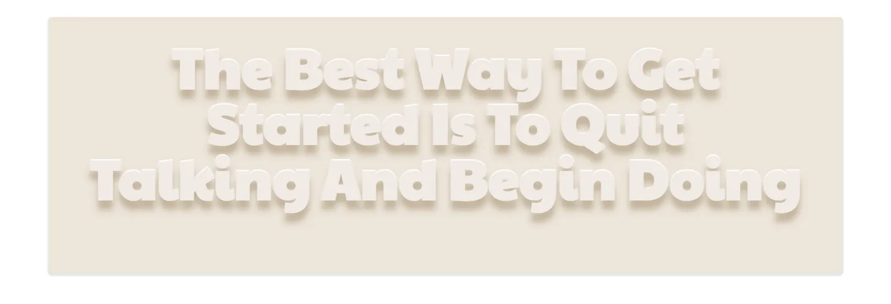

**如何使用CSS text-shadow：11个技巧和示例**

[toc]

> 原文 [How to Use CSS text-shadow: 11 Tricks and Examples](https://www.makeuseof.com/css-text-shadow-tricks-examples/)

不要让网站的文字使用户感到厌烦，通过CSS text-shadow 来修饰。


CSS是一种设计语言，使网页看起来比纯文本更优雅。`text-shadow` 是一个 CSS 属性，为文本添加阴影并使其更具视觉吸引力。借助文本阴影、字体、颜色和背景颜色的组合可以创建出色的文本设计。

在本文中，我们将使用 CSS 完成不同的文本阴影示例。

# 使用 CSS 文本阴影

CSS 属性 `text-shadow` 向文本添加阴影和分层。向文本添加阴影可以增强、突出显示或增加文本的视觉吸引力。此 CSS 属性接受要应用于文本的、以逗号分隔的阴影参数列表。

## CSS 属性 `text-shadow` 的语法

`text-shadow` 属性可以使用4个参数：offset-x、offset-y、blur-radius 和 color

```css
/* You can use 4 arguments with the text-shadow CSS property: 
   offset-x, offset-y, blur-radius, and color */

/* offset-x | offset-y | blur-radius | color */
text-shadow: 2px 2px 4px red;

/* color | offset-x | offset-y | blur-radius */
text-shadow: #18fa3e 1px 2px 10px;
```

color 和 blur-radius 是可选的。

```css
/* The color and blur-radius arguments are optional,
   if you want, you can remove them. Default values of
   color and blur-radius would be considered */

text-shadow: 10px 20px;
```

可以在 offset-x 和 offset-y 之前或之后使用 color 参数。

```css
/*  You can use color argument before or after 
    the offset-x and offset-y arguments */

text-shadow: 10px 10px blue;

text-shadow: blue 10px 10px;
```

支持使用全局值：

```css
/* The text-shadow CSS property also supports Global values */

text-shadow: inherit;
text-shadow: initial;
text-shadow: revert;
text-shadow: unset;
```

[MDN Web Docs](https://developer.mozilla.org/en-US/docs/Web/CSS/text-shadow) 定义这些值如下：

- **`<color>`**: Optional. The color of the shadow. It can be specified either before or after the offset values. If unspecified, the color's value is left up to the user agent, so when consistency across browsers is desired you should define it explicitly.

- **`<offset-x>` `<offset-y>`**: Required. These `<length>` values specify the shadow's distance from the text. `<offset-x>` specifies the horizontal distance; a negative value places the shadow to the left of the text. `<offset-y>` specifies the vertical distance; a negative value places the shadow above the text. If both values are 0, the shadow is placed directly behind the text, although it may be partly visible due to the effect of `<blur-radius>`.

- **`<blur-radius>`**: Optional. This is a `<length>` value. The higher the value, the bigger the blur; the shadow becomes wider and lighter. If not specified, it defaults to 0.


这里有一些很棒的文本阴影示例，可以将您的网站 UI 提升到一个新的水平。确保从 [Google Fonts](https://fonts.google.com/) 导入CSS文件中提到的字体。

# 1. 海绿 - The Sea Green


使用下面的 CSS 创建上述文本阴影：

```css
 background: #A0CBA4;
 color: #D5E2D6;
 font-family: 'Lobster';
 text-shadow: #4A744D 1px 1px,#4A744D 0px 0px,#4A744D 1px 1px,#4A744D 2px 2px,#4A744D 3px 3px,#4A744D 4px 4px,#4A744D 5px 5px,#4A744D 6px 6px,#4A744D 7px 7px,#4A744D 8px 8px,#4A744D 9px 9px,#4A744D 10px 10px,#4A744D 11px 11px,#4A744D 12px 12px,#4A744D 13px 13px,#4A744D 14px 14px,#4A744D 15px 15px,#4A744D 16px 16px,#4A744D 17px 17px,#4A744D 18px 18px,#4A744D 19px 19px,#4A744D 20px 20px,#4A744D 21px 21px,#4A744D 22px 22px,#4A744D 23px 23px,#4A744D 24px 24px,#4A744D 25px 25px,#4A744D 26px 26px,#4A744D 27px 27px,#4A744D 28px 28px,#4A744D 29px 29px;
```

# 2. 优雅的红色 - Classy Red


使用下面的 CSS 创建上述文本阴影：

```css
 background: #e74c3c;
 color: #fff;
 font-family: lato;
 text-shadow: 1px 1px rgba(123, 25, 15, 0.5), 2px 2px rgba(129, 28, 18, 0.51), 3px 3px rgba(135, 31, 20, 0.52), 4px 4px rgba(140, 33, 22, 0.53), 5px 5px rgba(145, 36, 24, 0.54), 6px 6px rgba(150, 38, 26, 0.55), 7px 7px rgba(154, 40, 28, 0.56), 8px 8px rgba(158, 42, 30, 0.57), 9px 9px rgba(162, 44, 31, 0.58), 10px 10px rgba(166, 45, 33, 0.59), 11px 11px rgba(169, 47, 34, 0.6), 12px 12px rgba(173, 48, 36, 0.61), 13px 13px rgba(176, 50, 37, 0.62), 14px 14px rgba(178, 51, 38, 0.63), 15px 15px rgba(181, 52, 39, 0.64), 16px 16px rgba(184, 54, 40, 0.65), 17px 17px rgba(186, 55, 41, 0.66), 18px 18px rgba(189, 56, 42, 0.67), 19px 19px rgba(191, 57, 43, 0.68), 20px 20px rgba(193, 58, 44, 0.69), 21px 21px rgba(195, 59, 45, 0.7), 22px 22px rgba(197, 60, 46, 0.71), 23px 23px rgba(199, 61, 47, 0.72), 24px 24px rgba(201, 62, 47, 0.73), 25px 25px rgba(202, 62, 48, 0.74), 26px 26px rgba(204, 63, 49, 0.75), 27px 27px rgba(206, 64, 49, 0.76), 28px 28px rgba(207, 65, 50, 0.77), 29px 29px rgba(209, 65, 51, 0.78), 30px 30px rgba(210, 66, 51, 0.79), 31px 31px rgba(211, 67, 52, 0.8), 32px 32px rgba(213, 67, 52, 0.81), 33px 33px rgba(214, 68, 53, 0.82), 34px 34px rgba(215, 69, 53, 0.83), 35px 35px rgba(216, 69, 54, 0.84), 36px 36px rgba(218, 70, 54, 0.85), 37px 37px rgba(219, 70, 55, 0.86), 38px 38px rgba(220, 71, 55, 0.87), 39px 39px rgba(221, 71, 56, 0.88), 40px 40px rgba(222, 72, 56, 0.89), 41px 41px rgba(223, 72, 57, 0.9), 42px 42px rgba(224, 73, 57, 0.91), 43px 43px rgba(225, 73, 57, 0.92), 44px 44px rgba(225, 73, 58, 0.93), 45px 45px rgba(226, 74, 58, 0.94), 46px 46px rgba(227, 74, 58, 0.95), 47px 47px rgba(228, 75, 59, 0.96), 48px 48px rgba(229, 75, 59, 0.97), 49px 49px rgba(230, 75, 59, 0.98), 50px 50px rgba(230, 76, 60, 0.99);
```

# 3. 霓虹灯盒 - Neon Box


使用下面的 CSS 创建上述文本阴影：

```css
 background: #090000;
 color: lightyellow;
 font-family: Londrina Outline;
 text-shadow: 0 0 10px gold, 0 0 20px firebrick, 0 0 40px pink, 0 0 80px red;
```

# 4. 石板滑板 - Slate Skateboard


使用下面的 CSS 创建上述文本阴影：

```css
 background: #e5e1b3;
color: #fff;
font-family: "Source Sans Pro", Arial, sans-serif;
text-shadow: 1px 1px 1px #66644d, 2px 2px 1px #66644d, 3px 3px 1px #66644d, 4px 4px 1px #66644d, 5px 5px 1px #66644d, 6px 6px 1px #66644d, 7px 7px 1px #66644d, 8px 8px 1px #66644d, 9px 9px 1px #66644d, 10px 10px 1px #66644d, 11px 11px 1px #66644d, 12px 12px 1px #66644d, 13px 13px 1px #66644d, 14px 14px 1px #66644d, 15px 15px 1px #66644d, 16px 16px 1px #66644d, 17px 17px 1px #66644d, 18px 18px 1px #66644d, 19px 19px 1px #66644d, 20px 20px 1px #66644d, 21px 21px 1px #66644d, 22px 22px 1px #66644d, 23px 23px 1px #66644d, 24px 24px 1px #66644d, 25px 25px 1px #66644d, 26px 26px 1px #66644d, 27px 27px 1px #66644d, 28px 28px 1px #66644d, 29px 29px 1px #66644d, 30px 30px 1px #66644d;
```

# 5. 红宝石海泡 - Ruby Seafoam


使用下面的 CSS 创建上述文本阴影：

```css
background: #2CFECB;
color: #FD787A;
font-family: 'Share Tech Mono';
text-shadow: #402929 1px 1px, #402929 -0px 0px, #402929 -1px 1px, #402929 -2px 2px, #402929 -3px 3px, #402929 -4px 4px, #402929 -5px 5px, #402929 -6px 6px, #402929 -7px 7px, #402929 -8px 8px, #402929 -9px 9px, #402929 -10px 10px, #402929 -11px 11px, #402929 -12px 12px, #402929 -13px 13px, #402929 -14px 14px, #402929 -15px 15px, #402929 -16px 16px, #402929 -17px 17px, #402929 -18px 18px, #402929 -19px 19px, #402929 -20px 20px, #402929 -21px 21px, #402929 -22px 22px, #402929 -23px 23px, #402929 -24px 24px, #402929 -25px 25px, #402929 -26px 26px, #402929 -27px 27px, #402929 -28px 28px, #402929 -29px 29px;
```

# 6. 玫瑰水 - Rose Water


使用下面的 CSS 创建上述文本阴影：

```css
background: #FD9597;
color: #FFFFFF;
font-family: 'Fugaz One';
text-shadow: #44090D 1px 1px, #44090D -0px 0px, #44090D -1px 1px, #44090D -2px 2px, #44090D -3px 3px, #44090D -4px 4px, #44090D -5px 5px, #44090D -6px 6px, #44090D -7px 7px, #44090D -8px 8px, #44090D -9px 9px, #44090D -10px 10px, #44090D -11px 11px, #44090D -12px 12px, #44090D -13px 13px, #44090D -14px 14px, #44090D -15px 15px, #44090D -16px 16px, #44090D -17px 17px, #44090D -18px 18px, #44090D -19px 19px, #44090D -20px 20px, #44090D -21px 21px, #44090D -22px 22px, #44090D -23px 23px, #44090D -24px 24px, #44090D -25px 25px, #44090D -26px 26px, #44090D -27px 27px, #44090D -28px 28px, #44090D -29px 29px;
```

# 7. 未知虹膜 - Unknown Iris


```css
background: #823A86;
color: #FA7399;
font-family: 'Lato';
text-shadow: #5E2962 1px 1px, #5E2962 -0px 0px, #5E2962 -1px 1px, #5E2962 -2px 2px, #5E2962 -3px 3px, #5E2962 -4px 4px, #5E2962 -5px 5px, #5E2962 -6px 6px, #5E2962 -7px 7px, #5E2962 -8px 8px, #5E2962 -9px 9px, #5E2962 -10px 10px, #5E2962 -11px 11px, #5E2962 -12px 12px, #5E2962 -13px 13px, #5E2962 -14px 14px, #5E2962 -15px 15px, #5E2962 -16px 16px, #5E2962 -17px 17px, #5E2962 -18px 18px, #5E2962 -19px 19px, #5E2962 -20px 20px, #5E2962 -21px 21px, #5E2962 -22px 22px, #5E2962 -23px 23px, #5E2962 -24px 24px, #5E2962 -25px 25px, #5E2962 -26px 26px, #5E2962 -27px 27px, #5E2962 -28px 28px, #5E2962 -29px 29px;
```

# 8. 老派鼠尾草 - The Sage of Old School


```css
background: #6A949E;
color: #D7818A;
font-family: 'Special Elite';
text-shadow: #484A46 1px 1px, #484A46 -0px 0px, #484A46 -1px 1px, #484A46 -2px 2px, #484A46 -3px 3px, #484A46 -4px 4px, #484A46 -5px 5px, #484A46 -6px 6px, #484A46 -7px 7px, #484A46 -8px 8px, #484A46 -9px 9px, #484A46 -10px 10px, #484A46 -11px 11px, #484A46 -12px 12px, #484A46 -13px 13px, #484A46 -14px 14px, #484A46 -15px 15px, #484A46 -16px 16px, #484A46 -17px 17px, #484A46 -18px 18px, #484A46 -19px 19px, #484A46 -20px 20px, #484A46 -21px 21px, #484A46 -22px 22px, #484A46 -23px 23px, #484A46 -24px 24px, #484A46 -25px 25px, #484A46 -26px 26px, #484A46 -27px 27px, #484A46 -28px 28px, #484A46 -29px 29px;
```

# 9. 灰色新拟态 - The Grey Neumorphism



```css
background: #ece5da;
color: #f1ebe5;
font-family: "Paytone One";
text-shadow: 0 13.36px 8.896px #c4b59d, 0 -2px 1px #fff;
```

# 10. 柠檬水桃 - Lemonade Peach


```css
background: #E6DEDC;
color: #EBA89F;
font-family: 'Amatic SC';
text-shadow: #2E2B32 1px 1px, #2E2B32 0px 0px, #2E2B32 1px 1px, #2E2B32 2px 2px, #2E2B32 3px 3px, #2E2B32 4px 4px, #2E2B32 5px 5px, #2E2B32 6px 6px, #2E2B32 7px 7px, #2E2B32 8px 8px, #2E2B32 9px 9px, #2E2B32 10px 10px, #2E2B32 11px 11px, #2E2B32 12px 12px, #2E2B32 13px 13px, #2E2B32 14px 14px, #2E2B32 15px 15px, #2E2B32 16px 16px, #2E2B32 17px 17px, #2E2B32 18px 18px, #2E2B32 19px 19px, #2E2B32 20px 20px, #2E2B32 21px 21px, #2E2B32 22px 22px, #2E2B32 23px 23px, #2E2B32 24px 24px, #2E2B32 25px 25px, #2E2B32 26px 26px, #2E2B32 27px 27px, #2E2B32 28px 28px, #2E2B32 29px 29px;
```

# 11. 高级黑 - The Premium Dark


```css
background-color: #333;
color: #e0dfdc;
font-family: "Avant Garde", Avantgarde, "Century Gothic", CenturyGothic, "AppleGothic", sans-serif;
text-shadow: 0 -1px 0 #fff, 0 1px 0 #2e2e2e, 0 2px 0 #2c2c2c, 0 3px 0 #2a2a2a, 0 4px 0 #282828, 0 5px 0 #262626, 0 6px 0 #242424, 0 7px 0 #222, 0 8px 0 #202020, 0 9px 0 #1e1e1e, 0 10px 0 #1c1c1c, 0 11px 0 #1a1a1a, 0 12px 0 #181818, 0 13px 0 #161616, 0 14px 0 #141414, 0 15px 0 #121212, 0 22px 30px rgba(0, 0, 0, 0.9);
```

# 使用 CSS 向你的产品添加生机

在本文中，你学习了如何使用 CSS 文本阴影属性。使用这些时尚的文本阴影可以为产品增添活力。

此外，如果你网站的边框和div看起来仍然平淡无奇，可以使用 CSS box-shadow 属性来修饰它们。

