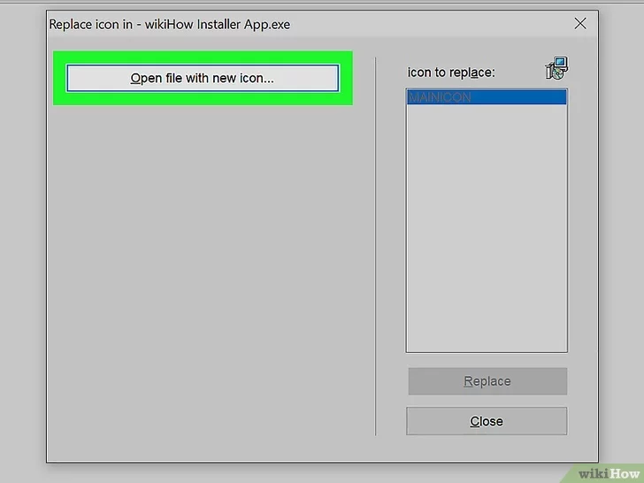
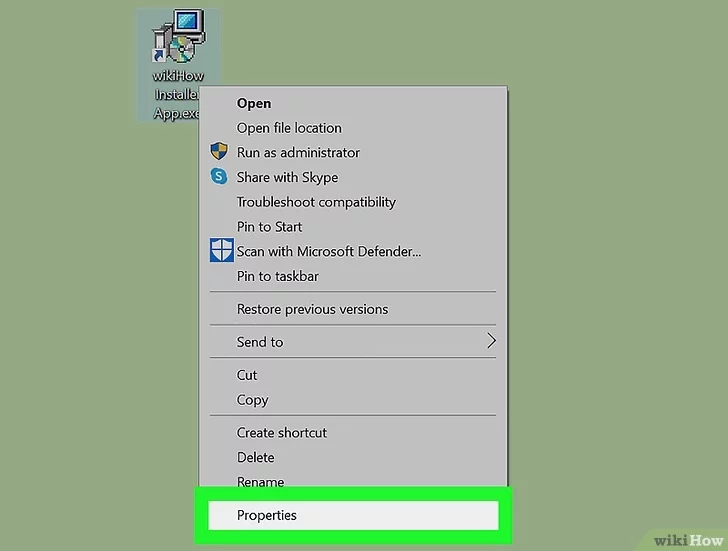

**VS如何给一个已有的exe可执行文件添加显示的icon图标？**

[toc]

# Visual Studio 实现直接给现有的exe添加图标

## 起因

想要给已有的exe程序文件直接添加图标的起源来自于下图的回复内容。（出自 [Change Setup.exe icon in Setup Project](https://social.msdn.microsoft.com/Forums/windows/en-US/95963729-c3da-437d-a9ec-ebcd3011a22d/change-setupexe-icon-in-setup-project?forum=winformssetup)）

如果可行的话，那么，就可以 **给任何的exe可执行程序文件添加或修改图标**。

## 实现

依照如下步骤：

1. 在 Visual Studio 中，顶部菜单栏的 文件(File) -> 打开(Open) -> 文件(File)。打开一个exe文件。

2. 打开后，右键 Icon 节点，选择"添加资源"：

3. 导入你想设置的icon图标文件

4. 确保导入的icon资源的ID最小（可以右键属性窗口中修改）

> 也可以根据需要，删除另外的图标资源，只保留刚导入的icon。

5. 保存即可。

> **注意：需要重启刷新资源管理器，才能使旧有的exe显示的图标生效，如图所示：**
> 
> 
> 
> 刚开始因为这一点，还以为图标修改无效。

# 自定义Windows中exe程序的图标【其他方法】

> 主要出自 [3 Easy Ways to Customize EXE Program Icons in Windows](https://www.wikihow.com/Change-the-Icon-for-an-Exe-File)

要实现自定义Windows中的exe可执行程序文件的图标，通常的做法是下载相关的免费软件修改exe实现，但这通常是永久性的修改程序文件。

此外，通过创建exe的快捷方式并更改快捷方式的图标，也可以实现图标的修改（而没有修改exe文件本身）。

Windows的icon文件必须为`.ico`格式。

Resource Hacker (免费) and GConvert (共享软件) 可以永久性的修改任何EXE文件的图标。

## Resource Hacker 中编辑 EXE

`Resource Hacker`允许编辑 exe 文件的属性，包括icon。同时也提供命令行语句进行操作。

- 下载安装 Resource Hacker

从 http://www.angusj.com/resourcehacker 下载

- Resource Hacker 打开 EXE

安装后，从开始菜单中打开 Resource Hacker，然后，添加 File -> Open，选择 exe 文件，打开后，在菜单栏的 Action 中找到`Replace icon in`（也可以执行按`Ctrl+R`）。

点击 “Open File with new icon...”

选择图标后，在`Replace icon in`窗口的右侧，点击`Replace`：

直接保存更改即可。

## GConvert 中编辑 EXE

从 https://www.gdgsoft.com/download/gconvert.aspx 中下载并安装。

打开 GConvert，点击菜单栏中的 Tools ，点击`Modify icons in EXE/DLL… `按钮打开`EXE/DLL Icon Patcher`窗口。

点击右侧的图标，打开 exe 文件。

点击 Modify selected icon... 并选择图标。

点击 Close and open in GConvert 等待修改完成。

# 创建快捷方式

- 保存 ICO 文件到一个不太会改变的位置。

防止移动 icon 文件后无法正确显示。

- 直接在桌面或资源管理器的文件夹内的空白处，右键 -> 新建 -> 快捷方式(shortcut)。

在创建快捷方式的对话框中，选择`Browse…`浏览打开要指向的文件。

点击 下一步：

输入快捷方式的名称，点击结束。

右键快捷方式的“属性”。

属性界面的底部可以看到三个对话框，其中有“更改图标”(`Change Icon…`)。

点击 更改图标 按钮，“浏览”选择查找图标，然后选择一个新图标。点 “确定” 保存。

快捷方式，就可以使用一个新的icon了。

> - If you're using Windows 10, you'll see a small arrow on the shortcut indicating that this is a shortcut and not the actual EXE file. Windows 11 users won't see this arrow. If the Windows 10 shortcut arrow bothers you, you can [remove the arrow](https://www.wikihow.com/Change-or-Create-Desktop-Icons-for-Windows#Removing_Arrows_from_Shortcut_Icons_sub "Change or Create Desktop Icons for Windows") in your registry.
> 
> - You can now drag the shortcut to the desired location, such as your taskbar or another area of [your desktop](https://www.wikihow.com/Arrange-Desktop-Icons-Horizontally "Arrange Desktop Icons Horizontally").
> 
> - You can also rename the icon by right-clicking it and selecting **Rename**. On Windows 11, this is the icon with the cursor at the top of the right-click context menu.
> 
> - Once you've created a shortcut to the EXE file, you cannot move the original EXE file as doing so will break the shortcut.