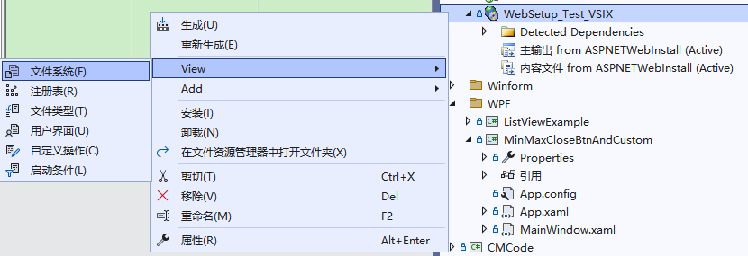
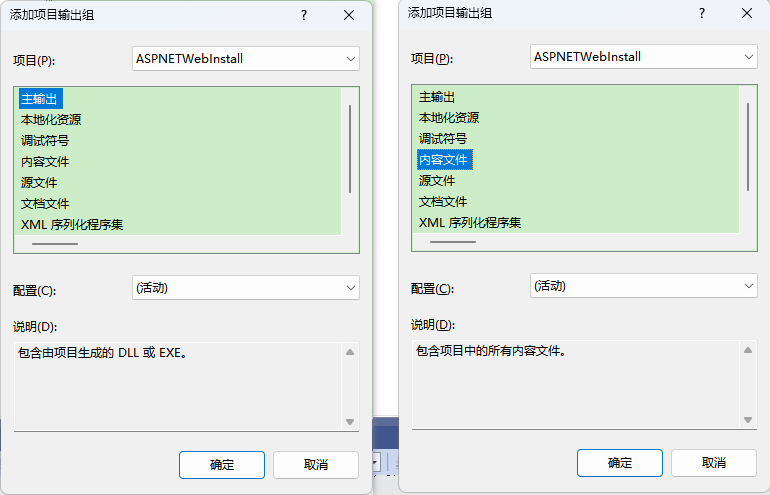
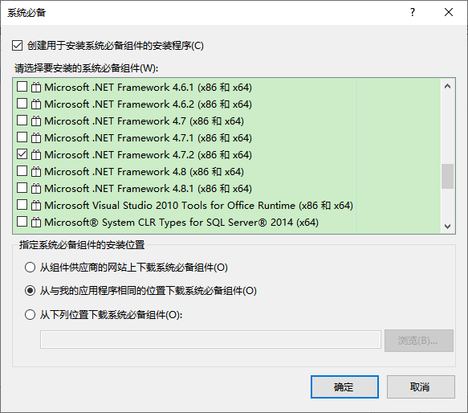
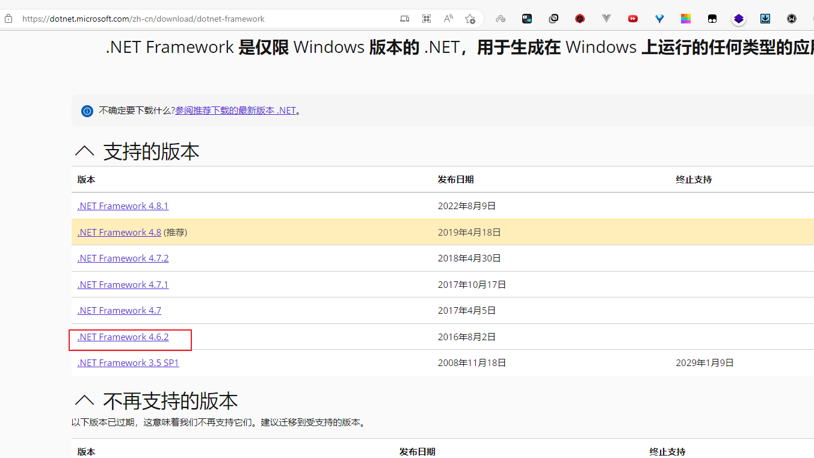

**安装包制作全讲解一：使用Visual Studio Installer Projects创建安装包的尝试【相对比较失败的实现】**

[toc]

尝试以`ASP.NET MVC`项目为目标制作安装包，对于安装包的制作，Winform、WPF等程序是同样适用的，甚至ASP.NET项目的安装包制作更复杂（设计部署到到IIS）。

> 相对来说，本篇介绍的使用 Web Setup Project 创建安装包是一个很失败的尝试，其生成的安装包几乎无法使用。后续不要使用，而是应该使用 Setup Project 制作。
> 
> 由于 `Installer Projects` 使用 "项目输出->主输出" 的方式引入项目生成的程序文件时，不会将生成目录下的子目录和子目录文件一起打包进安装包。因此，如果程序依赖用到了子文件夹中的dll等文件，需要手动“添加文件夹和文件”来实现，这一点会显示非常繁琐（尤其文件较多时）。
> 
> 一个取巧的解决办法是，将文件夹作为一个“网站项目”添加到VS（`添加`->`现有网站`），这种情况下，在`Installer Projects`安装项目中，使用“添加”-“项目输出”-“内容文件”的形式，可以将所有依赖包含进来，实现正确打包安装。
> 
> 比较较有价值的是，关于打包时，无法引入依赖组件时的报错的解决方法，如何下载DotNetFX，及放入 Microsoft SDK 所在路径下：
>
> ```
> ERROR: 要在“系统必备”对话框中启用“从与我的应用程序相同的位置下载系统必备组件”，必须将“Microsoft .NET Framework 4.6.2 (x86 和 x64)”项的文件“DotNetFX462\NDP462-KB3151800-x86-x64-AllOS-ENU.exe”下载到本地计算机。有关详细信息，请参见 http://go.microsoft.com/fwlink/?LinkId=616018。
> ```

# 安装 Microsoft Visual Studio Installer Projects 2022

[Microsoft Visual Studio Installer Projects 2022](https://marketplace.visualstudio.com/items?itemName=VisualStudioClient.MicrosoftVisualStudio2022InstallerProjects) 是专用于 VS2022 的扩展，用于制作安装项目。

> 其他 VS 版本的 `Visual Studio Installer Projects`，可以从[此处](https://marketplace.visualstudio.com/items?itemName=visualstudioclient.MicrosoftVisualStudio2017InstallerProjects)下载。

如果没有安装，需要下载并安装。

  

安装时需要关闭VS2022，否则会提示等待安装。

  

> 也可以从 VS 的 扩展 -> 管理扩展 -> Visual Studio Marketplace 中搜索查找，并安装。
> 
>   

# Web安装项目

## 创建 Web Setup Project

在 解决方案资源管理器 中，右键添加新项目，选择“Web安装项目”，如下，可以看到安装`Visual Studio Installer Projects`扩展后，新增的项目模板`Setup Project`、`Web Setup Project`、`Setup Wizrd`、`Merge Module Project`、`CAB Project`等。

  

下一步，设置项目名称、位置，点击创建：

  

## 指定安装 ASP.NET项目

> 关于具体操作，可以参考 [How to Create a Web Setup for Your Published Web Service](https://learn.microsoft.com/en-us/biztalk/core/how-to-create-a-web-setup-for-your-published-web-service)、[Setup Project Deployment of an ASP.NET Web Forms Application](https://docs.devexpress.com/eXpressAppFramework/113247/deployment/deployment-tutorial/setup-project-deployment-of-an-aspnet-application) 这两篇文章。


右键 刚刚创建的Web安装项目，选择“查看”->“文件系统”。

  

在文件系统窗口中，右键`Web Application Folder`节点，点击 Add -> 项目输出。

在项目输出组对话框中，选择要安装的 `ASP.NET` 项目`ASPNETWebInstall`（后续改为`ASPNETWebMVCBasic`），然后，分别选择“主输出”和“内容文件”，点击“确定”：

  

右击项目，点击“属性”：

  

根据需要修改输出文件名、点击系统必备，选择需要安装的.NET组件：

  

右键项目，“查看”->“启动条件”。可以查看 IIS条件 的 属性（右键-属性）。

  

.NET Framework 的属性，修改下版本：

  

> 官方文档的介绍中，有提到排除依赖，即：将 Web安装项目 下 `Detected Dependencies` 节点展开后的依赖，全选依赖，在属性窗口中，设置 Exclude（排除）为 True。
> 
> **极其不推荐这么做，很有可能导致最后生成安转的网站，在运行时报错找不到依赖项。**

## 安装界面

右键项目，“查看”->“用户界面”

在用户界面中可以看到安装过程中要显示的界面。

在启动中，右键添加对话框，可以根据需要添加界面，比如许可协议、组件选择等。

  

比如许可协议，在属性中指定License文件。

  

## 生成安装包

右键安装项目，选择“生成”或“重新生成”。

生成后可以看到安装包和依赖组件：

  

## 构建安装包报错

### .NET Framework 依赖问题

Building file 'xxxx\MyWebSetup.msi'...

ERROR: 要在“系统必备”对话框中启用“从与我的应用程序相同的位置下载系统必备组件”，必须将“Microsoft .NET Framework 4.6.2 (x86 和 x64)”项的文件“DotNetFX462\NDP462-KB3151800-x86-x64-AllOS-ENU.exe”下载到本地计算机。有关详细信息，请参见 http://go.microsoft.com/fwlink/?LinkId=616018。

ERROR: 要在“系统必备”对话框中启用“从与我的应用程序相同的位置下载系统必备组件”，必须将“Microsoft .NET Framework 4.6.2 (x86 和 x64)”项的文件“DotNetFX462\NDP462-KB3151800-x86-x64-AllOS-CHS.exe”下载到本地计算机。有关详细信息，请参见 http://go.microsoft.com/fwlink/?LinkId=616018。

根据提示，下载对应的文件，一个 .NetFX462 的运行时包，一个 .NetFX462 的语言包。

### .NET Framework 组件下载方式

#### 直接从官网SDK下载

**.NET SDK 的下载地址：https://dotnet.microsoft.com/zh-cn/download ，查找对应的运行时包。**

  

找到 .NET Framework 的下载地址：https://dotnet.microsoft.com/zh-cn/download/dotnet-framework

  

找到 .NET Framework 4.6.2 ：https://dotnet.microsoft.com/zh-cn/download/dotnet-framework/net462

  

下载脱机安装的 运行时包 `ndp462-kb3151800-x86-x64-allos-enu.exe` 和 语言包 `ndp462-kb3151800-x86-x64-allos-chs.exe`。

> 运行时包也可以直接从 [The .NET Framework 4.6.2 offline installer for Windows](https://support.microsoft.com/en-us/topic/the-net-framework-4-6-2-offline-installer-for-windows-9dce3874-a9e5-9b11-289d-5594824aafe0) 此处下载，但是单独找 语言包 就比较难找。

#### 依照错误提示链接指出的 Package.xml 下载

以上报错提示给出参考链接：[How to: Include Prerequisites with a ClickOnce Application](http://go.microsoft.com/fwlink/?LinkId=616018) 在安装程序时包含依赖，可以从 本地Microsoft SDK 中的 Package.xml 文件中找到对应版本的下载链接。

  

不过现在 Microsoft SDK 的 Package.xml 路径为 `C:\Program Files (x86)\Microsoft SDKs\ClickOnce Bootstrapper\Packages` 或者 `C:\Program Files (x86)\Microsoft SDKs\ClickOnce Bootstrapper\Packages`。

找到依赖组件的文件夹，如`DotNetFX462\`，里面包含不同语言版本 `en`、`zh-Hans` 等目录，点击进去，打开其中的 `Package.xml` 文件。

找到包含`go.microsoft.com/fwlink`链接的name元素，复制链接及之后的LinkID，如：`http://go.microsoft.com/fwlink/?LinkId=780603` 

将其URL复制到浏览器，然后保存下载文件。

> 但是，只从此处，找到了 离线的 语言包 的下载地址，运行时包，并未找到。

### 将依赖组件放到`Packages\`下的子文件夹及语言文件夹中

还是上面提到的 Microsoft SDK 中依赖组件路径（运行时包） 和 Package.xml 文件所在路径（语言包）。

即，错误提示中的 `DotNetFX462\`，运行时包放在该路径，语言包放在该路径下的`zh-Hans`文件夹下：

`C:\Program Files (x86)\Microsoft SDKs\ClickOnce Bootstrapper\Packages\DotNetFX462\` 和 `C:\Program Files (x86)\Microsoft SDKs\ClickOnce Bootstrapper\Packages\DotNetFX462\zh-Hans\`。

然后，再次重新生成。即可正确打包，**生成安装包**。

## 安装包的安装测试（Web Setup Project生成的安装包不能正常使用）

实际运行安装，并不理想。无法打开安装包。

# 关于尽量不要使用 Visual Studio Installer Projects 制作安装包的建议

之所以说不要使用，是因为 安装模板 项目微软从2012年停止支持，只是得益于强大的安装扩展支持，它一直到 VS2019、VS2022 仍然可以使用。

但是，其易于操作性、问题疑难等，可想而知。尤其自定义操作界面非常受限，不灵活。

# 关于 Installer Projects 安装项目的程序主输出无法包含子文件夹的问题

  

使用 Setup Project 在 文件系统 中，添加 项目输出时，主项目输出（项目生成的release/debug文件夹），在生成安装包时，无法将 主项目输出文件夹下 的 子文件夹及子文件夹中的内容 打包进安装包，安装后会缺少这部分的依赖。导致程序无法运行。

那么问题就可以有以下三种解决方案，以及 **绕过不使用此方法，从而避免该问题【下篇介绍使用`项目输出->内容文件`将项目生成的程序文件作为`内容文件`打包进安装包】**：

1. 如何设置 Setup Project 的项目输出中，包含项目生成文件夹下的子文件夹。

已经尝试找了很多资料和相关设置，没有这方面的介绍。

【感觉要通过修改 Visual Studio Installer Projects 扩展源文件（VS扩展）才能解决这个问题，使其生成安装包时，包含子文件夹。】

2. 是否可以通过添加自定义操作脚本，实现生成安装包时，将子文件夹一起读取并包含进安装包。

3. 最笨的方法，将子文件夹，通过添加文件的形式，一一添加进来。

  

# 可能的参考

[基于ASP.NET的网站发布、打包和安装](https://blog.csdn.net/u010539469/article/details/41985415) 介绍了 Web Setup Project 的使用，可做参考了解。