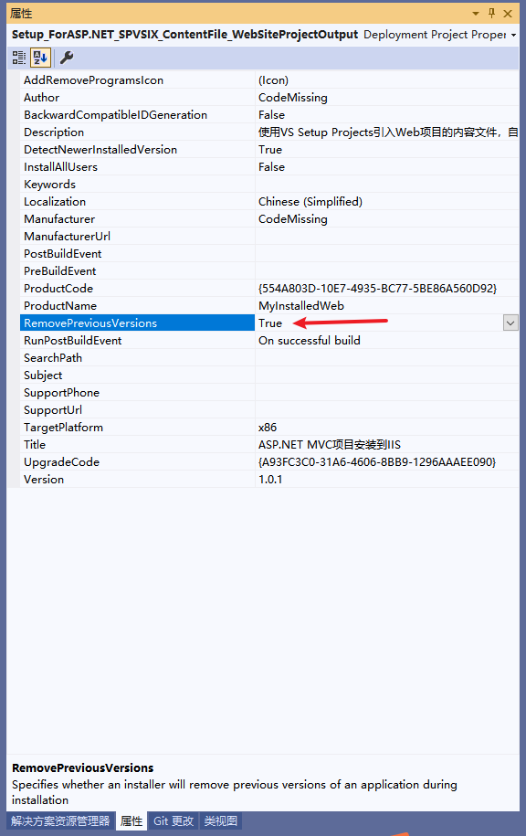
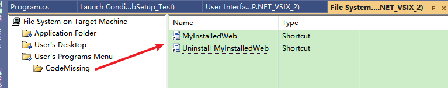

**安装包制作全讲解三：Setup Project制作安装包添加各种快捷方式，解决已安装了该产品另一个版本的问题，实现重复多次安装及升级**

[toc]

> 在自定义操作中，添加的安装类库中添加的组件无法显示使用。

# 指定安装包的各种信息

## 安装项目的属性窗口

安装项目属性窗口中，可以设置作者Author、制造商、产品名(程序名)、Title标题、目标平台x86或x64、描述、本地化等信息。


## 修改安装包名

右键 - 安装项目 - 属性，`Output file name` 用于设置生成安装包的路径，及安装包的名称。

如下，修改 .msi 名称：


## 无法设置msi安装包的icon图标

不能设置 .msi 安装文件的图标，它不像exe(`program file`)，因此没法修改，只能是默认的图标。


> **An MSI file is NOT an EXE.  As such, an MSI file cannot have an icon that is different than all the other MSI icons on the same system.**

> To clarify briefly - the icon for an MSI-based install is NOT in the MSI file. It is in Windows itself and shows on the install windows when Windows constructs each dialog from the tables in the MSI file. That means that if you want a customized icon for your install you need to provide your own UI.
> 
> Note that you can customize your setup with bitmaps and so on that are actually in the MSI file, and how you do that depends on the tool being used to build your MSI file. In Visual Studio setups you can have your own banner bitmap on each dialog.
>
> [How to set Icon for MSI installer in VS2010 setup and deployment project](https://social.msdn.microsoft.com/Forums/windows/en-US/aa3019db-5764-4e0f-a4d9-7fe3c072b8ff/how-to-set-icon-for-msi-installer-in-vs2010-setup-and-deployment-project?forum=winformssetup)

## 包装 msi安装包 到一个exe程序实现自定义安装包图标

msi文件无法修改其文件图标，但是可以将其包装到一个exe程序中，作为 content 内容文件，而后设置该exe的图标。运行时将 msi内容文件 写入到一个临时文件夹，然后再使用 Process.Start 调用执行。

> The solution I found for setting image to Msi file is ,
> 
> create a window application and add the msi file to that project as a content and write code in the windows application to write the msi file to a temp folder in the system and invoke it using the Process.Start method
>
> [Change Setup.exe icon in Setup Project](https://social.msdn.microsoft.com/Forums/windows/en-US/95963729-c3da-437d-a9ec-ebcd3011a22d/change-setupexe-icon-in-setup-project?forum=winformssetup)

## 设置 添加、移除程序的对话框图标(`AddRemoveProgramsIcon`)

可以设置 Windows系统的安装程序列表中的图标（添加、移除程序的对话框图标）。

点击选择“安装项目”，按F4打开属性窗口，在`属性窗口`（不是属性页中）中，**设置`AddRemoveProgramsIcon`图标即可。**


效果如下：


## 移除之前的版本【推荐】

应该总是选中“RemovePreviousVersions”：



## 修改默认安装位置，不选择安装路径

在文件系统中，`Application Folder`的属性窗口的`DefaultLocation`可以设置程序的默认安装路径。


默认是安装在程序文件夹下，公司/产品名 所在路径：`[ProgramFilesFolder][Manufacturer]\[ProductName]`。

我们将其修改为`C:\inetpub\Test\TestNew\`，或其它默认路径。

要想不让用户选择安装的位置，简单的办法，就是在用户界面中，删除“安装文件夹”对话框：


## 设置安装时的banner

可以为安装过程中的每个对话框界面，添加banner图标。

在 用户界面 的 开始下，找到每个界面，右键“属性窗口”，通过设置`BannerBitmap`实现：


# 实现覆盖安装【终极总结】

## 已经安装了该产品的另一个版本，无法继续安装此版本

  

**解决办法：修改版本号，重新生成，实现覆盖安装，允许程序安装后再次运行安装包。**

打开安装项目的属性窗口，修改版本号，重新生成 ProductCode：


> 如果只修改版本号，不重新生成 ProductCode，安装时仍会提示“已经安装了该产品的另一个版本...”，无法安装。

## 实现覆盖安装的终极总结

> 此部分主要参考自 [VS自带的打包工具，实现覆盖安装终极总结](https://www.cnblogs.com/dachuang/p/14026847.html)，很不错的总结。
>
> 真想说，VS Setup Projects 太坑了！！！


# 为安装的程序添加快捷方式

## 桌面和开始菜单中的快捷方式

在文件系统的`Application Folder`中，直接右键想要生成快捷方式的文件，选择`Create Shortcut to xxx...`，即可快速创建一个快捷方式。

比如，为主输出文件创建Shortcut：


之前为 vbs 文件创建shortcut：右键`open.vbs`，选择创建快捷方式`Create Shortcut to xxx`：


通常会重命名创建的快捷方式，将其剪切或复制到`User's Desktop`、`User's Programs Menu`中，在安装后，就会在 桌面和开始菜单中 生成对应快捷方式。

右键快捷方式的属性窗口，设置Icon图标：


## 添加卸载程序（快捷方式）

右键`Application Folder` -> Add -> 文件，选择 “C:\Windows\System32” 中的 `msiexec.exe` 文件。

> **如果为32位应用程序**，应该从`C:\Windows\SysWOW64\`中查找 `msiexec.exe` 文件。

右键`msiexec.exe`创建快捷方式，重命名为`Uninstall_xxx`。


打开 安装项目 的 属性窗口，复制`ProductCode`


将复制好的 ProductCode 内容，粘贴到创建好的快捷方式`Uninstall_xxx`的属性`Arguments`中，并在 `ProductCode` 前加入 `/X `：


将`UnInstall_xxx`快捷方式移动到`User’sPrograms Menu`开始菜单中。

> **注：修改安装包的版本Version时，会提示重新生成 ProductCode，ProductCode更新后，需要在卸载的`UnInstall_xxx`快捷方式属性的`Arguments`中，更新对应的版本号！！！**

重新打包生成安装包。

> 也可以专门写`Uninstall.exe`卸载程序，而不是复制`msiexec.exe`完成调用卸载。

## User’sPrograms Menu 开始菜单添加子文件夹

右键 `User’sPrograms Menu` -> Add -> Folder 



## Install安装类中 生成一个网页快捷方式

```C#
var urlLinkFile = "快捷方式文件.url";

File.WriteAllLines(urlLinkFile, new string[] {
    "[InternetShortcut]",
    $"URL=http://localhost:{sitePort}",
    "IconIndex=0",
    $"IconFile="+Path.Combine(targetdir,"favicon.ico")
});
```

> **可能要添加刷新的代码。刷新资源管理，以在开始菜单中显示出新建的快捷方式。重启电脑也可以！**
> 
> 参考 `SHChangeNotify` Win32 的 `shell32.dll` API
> 
> 用户所在的启动菜单目录下`%AppData%\Microsoft\Windows\Start Menu`。
> 
>
> **如果刷新无效，则只能重启系统！**

# 无法实现的几项功能

## 无法在生成后打开程序或打开一个文件【坑】

该功能无法实现，坑死人了！！！

尝试了很多，总是有问题！

## 添加的用户界面对话框，无法实现必填项的效果


## 密码框无法以星号隐藏显示【借助orca解决】

在安装界面中，添加的界面想要设置输入框密码内容隐藏，比如只能显示星号。正规方法无法实现。

但是借助 数据库表编辑器（orca）可以做到！

orca下载地址：https://pan.baidu.com/s/1bpDoia7

使用orca打开打包后生成的`Setup.msi`文件，

选择control，找到你要编辑的文本框，将`Attributes`改成`2097159`，保存。

此处是是`CustomTextA`中`Edit3`：


实现的效果：


> 参见 [C# Web项目制作安装包](https://www.cnblogs.com/fish520/archive/2016/09/22/5882450.html)

> 不知必填项借助类似工具能否实现？

# 重点注意项

## 自定义的安装类库Installer 中不要使用异步方法

发生错误将无法显示（或收到），虽然发生了错误仍然正常安装结束。

比如在安装类中使用`async/await`就遇到了这种情况。

## 自定义的安装类库Installer 修改后可能重新生成可能无效

遇到了虽然已经修改安装类的内容，但是重新生成安装包后，安装时并未生效。还是之前的安装处理代码。

需要进行多次尝试重新生成。【好在不总发生这种情况！】

**最好的做法是，删除之前的 .msi 安装包文件，再重新生成！**

## 自定义的安装类库Installer 不要引用其他项目

不要在引用中添加项目引用。因为测试发现，使用项目引用时，打包安装时，并不会调用自定义的Installer类库，原因不知。

解决办法，将用到的代码以类文件的形式，放在安装类库项目内，直接作为代码使用（调用）。然后，打包后安装时可以正常调用安装类库的处理。

## CustomActionData 传递数据到自定义操作的类库中

传递生产商、产品名、作者名、版本信息等：`/manufacturer="[Manufacturer]" /productName="[ProductName]" /author="[Author]" productVersion="[ProductVersion]"`（Author和ProductVersion未测试）

> **注意不要大写**

如果 `CustomActionData` 中**参数的格式错误**，将会在安装时直接报错：`Eoor 1001用法：InstallUtil [/u | /uninstall] [option [...]] assembly [[[option [...]] assembly] [...]]`
`InstallUtil 执行每个给定程序集中的安装程序。如果指定 /u 或 /uninstall 开关，则它卸载程序集；反之，则安装它们。`

  

**解决办法就是修改 `CustomActionData` 的值为正确的格式，不要有错误，不要有错误！！！**

## 不要直接复制程序文件到安装项目的文件系统(Application Folder)中

为了方便操作，后续看到有文章介绍可以直接将程序文件复制粘贴到 文件系统的`Application Folder`下。

相对来说，这是一种非常方便的制作安装包时处理源程序文件的方法，因为这样不会存在主输出中无法处理加载子文件夹文件的问题。

直接复制粘贴（Ctrl+C,V）：

  

**但是，但是，但是，这可能会产生隐藏的程序加载的问题**。

我测试的是Web发布后的程序文件，使用这种方式部署后，Web访问产生了报错：`未能加载文件或程序集"System.Data.Common"或它的某-个依赖项。找到的程序集清单定义与程序集引用不匹配。(异常来自 HRESULT:0x8131040)`。

> 查看安装后的该dll文件与源程序文件，确实不一样。不知道打包时是如何处理。

但是，这个问题应该不总是出现。不过还是，**不建议直接复制粘贴程序文件**。

> 复制粘贴的程序打包处理方式，应该和“内容文件”不一样。
>
> 并且，复制粘贴后打包的内容体积明显增多，不知道额外增加了哪些文件。。。

## 关于打包时的压缩问题

右键安装项目->属性，可以看到压缩处理，默认为“优化速度”：

  

同样是 `ASP.NET`(MVC) 项目，默认采用压缩时，竟然在安装部署完成后，报错编译时错误：`Compiler Error Message: The compiler failed with error code -532462766`（`"/"应用程序中的服务器错误`）

> **解决办法就是不要采用压缩！！！**
>
> 估计问题原因是在安装解压缩时`Web.config`文件中的特殊字符处理有问题，没有完全还原。
>
> 这也是一个不常遇到的问题。

针对该问题最简单的解决办法是删除`Web.config`中的`<system.codedom>`，如下，删除所示的所有行：

```xml
<system.codedom>
    <compilers>
      <compiler language="c#;cs;csharp" extension=".cs" type="Microsoft.CodeDom.Providers.DotNetCompilerPlatform.CSharpCodeProvider, Microsoft.CodeDom.Providers.DotNetCompilerPlatform, Version=1.0.3.0, Culture=neutral, PublicKeyToken=31bf3856ad364e35" warningLevel="4" compilerOptions="/langversion:6 /nowarn:1659;1699;1701" />
      <compiler language="vb;vbs;visualbasic;vbscript" extension=".vb" type="Microsoft.CodeDom.Providers.DotNetCompilerPlatform.VBCodeProvider, Microsoft.CodeDom.Providers.DotNetCompilerPlatform, Version=1.0.3.0, Culture=neutral, PublicKeyToken=31bf3856ad364e35" warningLevel="4" compilerOptions="/langversion:14 /nowarn:41008 /define:_MYTYPE=\&quot;Web\&quot; /optionInfer+" />
    </compilers>
</system.codedom>
```

> 参考自 [The compiler failed with error code -532462766](https://9to5answer.com/compiler-error-message-the-compiler-failed-with-error-code-532462766)

# 附：无法创建单个 setup.exe 安装文件

安装项目创建生成的安装包为`xxx.msi`，以及一个附带的`setup.exe`可执行文件。

`setup.exe`运行本质上也是调用`xxx.msi`，无法单独使用。

但是，实际上无法创建单个 `setup.exe` 的安装文件

参见 [Creating single setup.exe file for setup project](https://social.msdn.microsoft.com/Forums/windows/en-US/5bb12361-a387-4096-981b-7c578e95e534/creating-single-setupexe-file-for-setup-project?forum=winformssetup)

> 不过可以取巧，将msi安装文件，作为一个exe文件的资源内容进行包装，运行时提取msi并运行。

# 附：.NET Core / .NET6 + 项目的问题

> 参考 [Why I get a DLL installed by the setup project instead of an EXE and how to fix it?](https://stackoverflow.com/questions/67521475/why-i-get-a-dll-installed-by-the-setup-project-instead-of-an-exe-and-how-to-fix)

.NET Core 项目制作安装包时，似乎应该选择`published items`，而不是`primary output`。

具体说明参见：[Visual Studio Installer Projects Extension and .NET 6.0](https://learn.microsoft.com/en-us/visualstudio/deployment/installer-projects-net-core?view=vs-2019)

