**安装包制作全讲解二：C#操作IIS、修改文件权限、配置附加数据库，实现编程部署ASP.NET项目网站，Setup Project自定义安装包**

[toc]

**仍旧以`ASP.NET MVC`项目制作安装包为例，Winform、WPF等程序同样适用。**

# 添加 现有网站 为VS项目【打开一个已发布的网站】

- 发布 ASP.NET MVC 网站到文件夹。

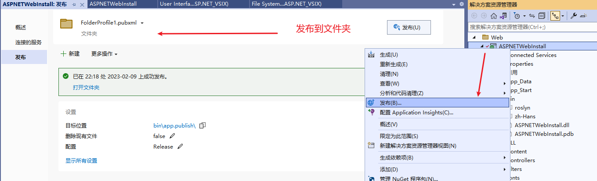  

- 解决方案下，添加现有网站。

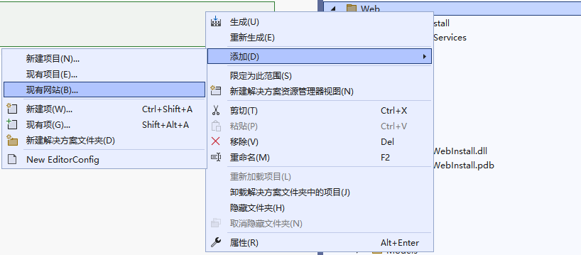  

- 根据需要选择 文件系统、本地 IIS、FTP 站点。

此处选择上面发布到文件夹的网站，即“文件系统”：

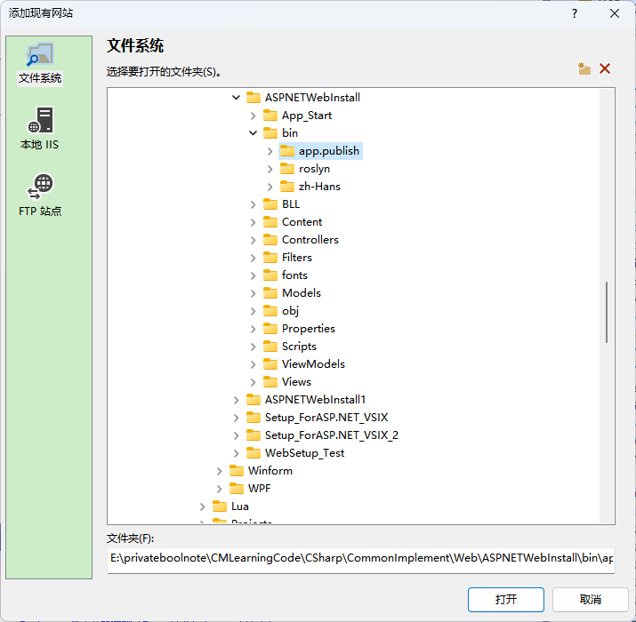  

点击打开。

网站项目（文件夹）就出现在解决方案资源管理器中。

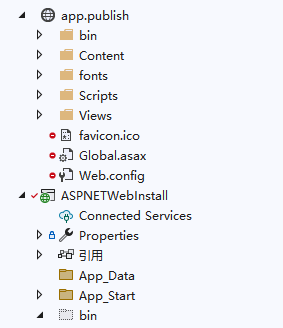  

# Setup Project 制作安装包测试

> 后续项目名改为了`Setup_ForASP.NET_SPVSIX_ContentFile_WebSiteProjectOutput`。用于ASP.NET的Setup Project扩展插件项目，引入网站项目输出的内容文件。

- 新建项目->选择“Setup Project”，命名为`Setup_ForASP.NET_VSIX_2`：

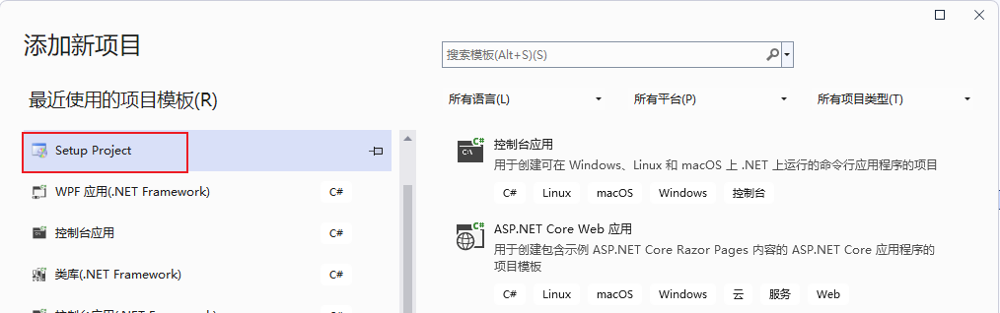  

- 右键查看文件系统。在 Application Folder 下，右键->Add->项目输出。在“项目输出组”中，选在添加的 “现有网站” 项目 `app.publish`：

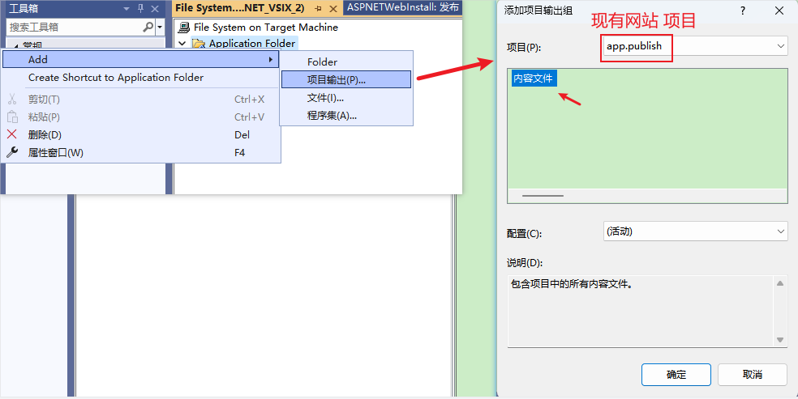  

**选择的项目是一个web网站，所以只有一个内容文件输出选项，选中内容文件点击确定。**

- 生成安装包，测试安装效果。

右键安装项目，点击“生成”或“重新生成”，生成安装包`Setup_ForASP.NET_VSIX_2.msi`。

点击安装，成功后，在安装的目录下查看所有文件及文件夹都成功复制了进来（**尤其是`\bin`目录下的子文件夹**），并且测试Web运行访问正常。

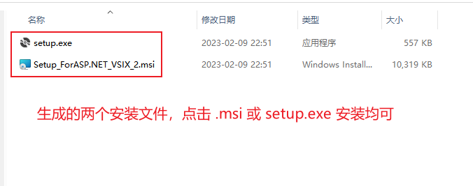  


# 自定义 Setup Project 安装包实现部署到IIS

## 自定义安装界面

右键安装项目，视图->用户界面，然后右键“启动”，选择添加对话框：

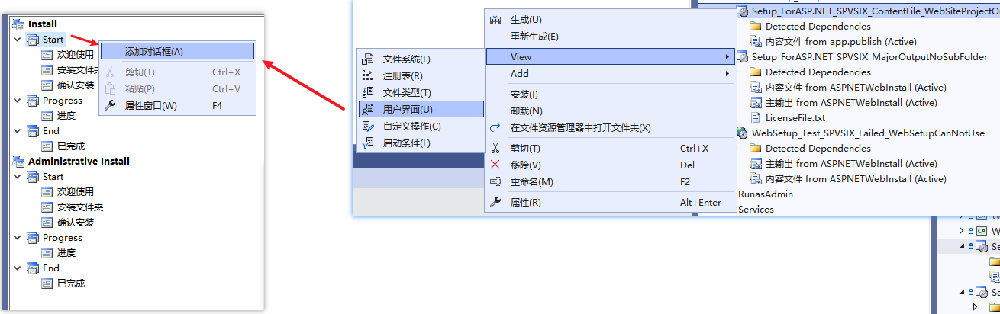  

在添加对话框中，依次选择添加许可协议、文本框（A）、文本框（B），并拖动对话框进行排序：

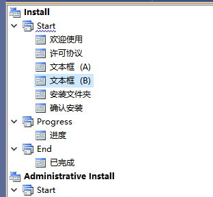  

> 两个文本框分别用来配置获取SQLServer和ISS站点的信息。

## 添加许可协议

首先在项目目录(或其他目录)下，创建一个License文件，通常为`.rtf`，`.txt`等其他格式也可。

右键安装项目，点击视图=>文件系统，在文件系统中选择“应用程序文件夹”，右击 “应用程序文件夹” 或 右边空白处，点击添加=>文件，添加自己创建的`License.rtf`文件，如图：

  

然后在“用户界面”下，右键“许可协议”->“属性”，`LicenseFile`下拉浏览选择刚添加的`License.rtf`文件：

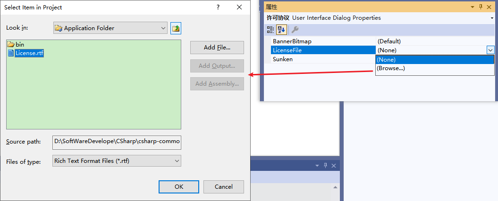  

## 设置数据库信息和IIS信息的文本框界面

安装的`ASP.NET MVC`项目使用到了SQL Server数据库，因此需要在安装时，让用户输入数据库服务器的信息。实现连接数据库、初始化必要的数据库或附加数据库文件等操作。

右键 对话框（A）-属性，设置如图：

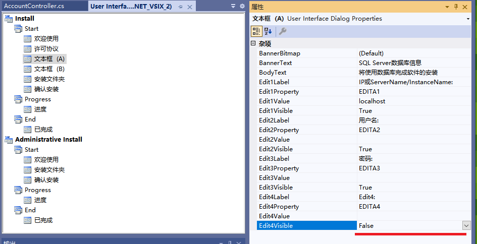  

此处需要SQL Server的服务器名或IP，命名实例还需要指定实例名，用户名，密码，额外的`Edit4Visible`设为false。

> **后续修改了`Edit1Property`等的属性名。**

> `ServerIp\InstanceName` 或`ServerName\InstanceName`

然后，设置IIS信息的安装界面，选择对话框（B）-属性，设置如图：

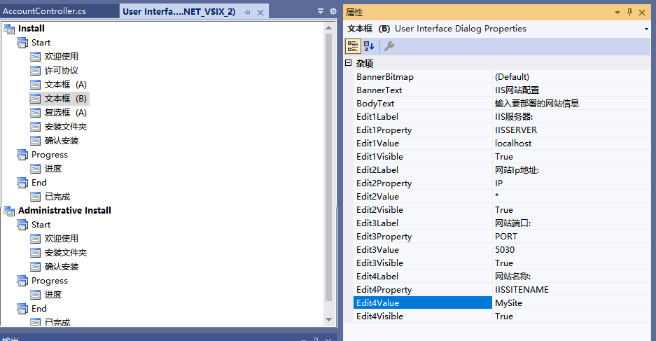  

> Value中的值为默认值。

> 添加的默认值是因为不能为空，但是似乎无法限制必填项。

## 创建自定义操作的安装类库

### 安装程序类

新建分别用于安装操作和卸载操作的安装类库（`Set_SQlServer_IIS_Lib`和`UnSet_SQlServer_IIS_Lib`），即设置/取消 SQlServer和IIS 的类库。安装类库继承自`installer`类。

创建C#类库：

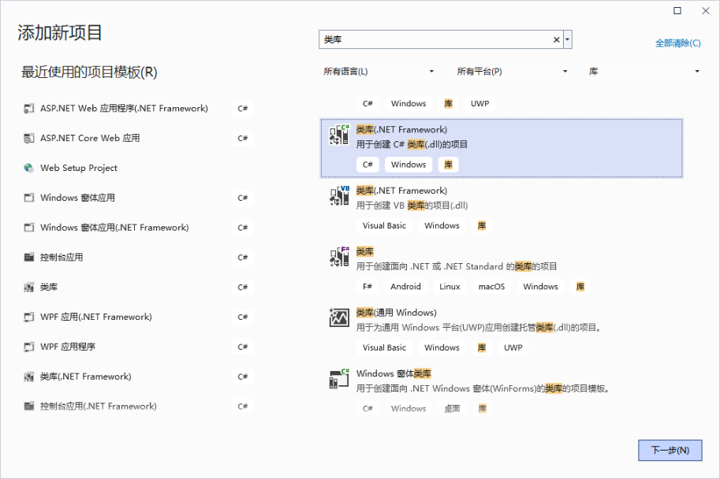  

然后，**右键创建好的该类库 -> 添加 -> 安装程序类**：

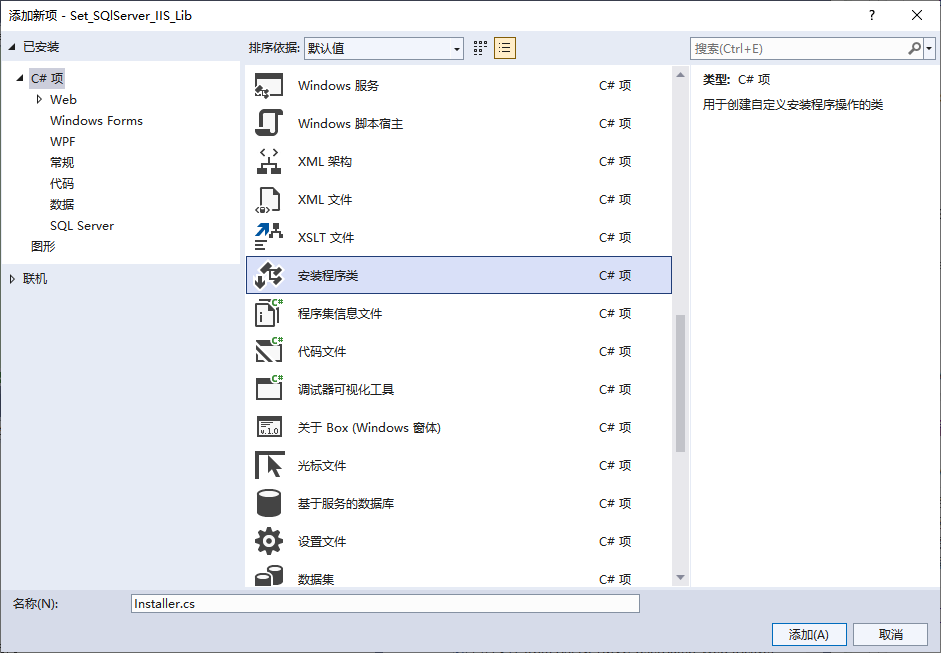  

> 可以删除默认生成的`Class1.cs`类文件

### 添加 自定义操作 类库

> 不知是否可以添加自定义操作的非类库项目？

在我们的安装项目(`Setup Project`)中，添加这两个用于安装和卸载的类库。右键->添加->项目输出 -> 选择`Set_SQlServer_IIS_Lib`类库项目和`UnSet_SQlServer_IIS_Lib`类库项目 -> 选择“主输出”。

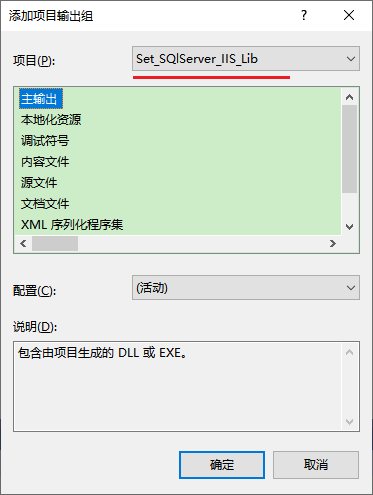  

然后，右键安装项目 -> View -> 自定义操作 中，右键“安装”(Install) -> 添加自定义操作 -> 应用程序文件夹 下，选择“主输出来自Set_SQlServer_IIS_Lib(活动)”：

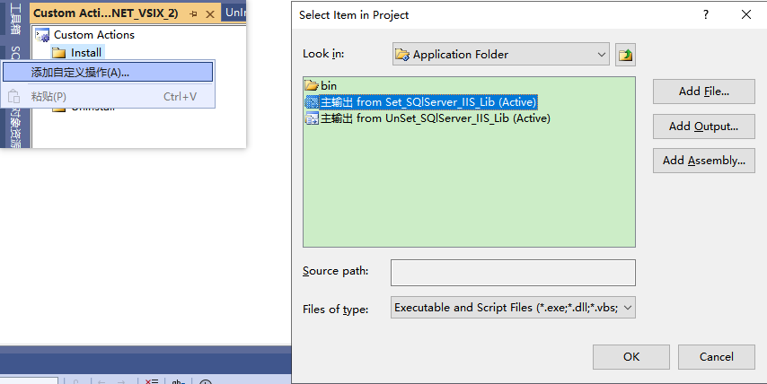  

同样，在 Uninstall，添加自定义操作，应用程序文件夹 下，选择“主输出 from UnSet_SQlServer_IIS_Lib(Active)”。

### 安装类库中获取输入数据

之后，需要将安装过程中输入的数据传递 安装类库 中，以便于完成类库中的操作。

选择`主输出 from Set_SQlServer_IIS_Lib (Active)`，右键-属性窗口，`CustomActionData`中将输入的数据传递进去。如图所示：
  
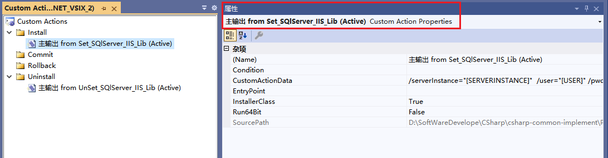  

属性框中的`CustomActionData`就是指定要传递到安装程序类库中的自定义数据：`/serverInstance="[SERVERINSTANCE]"  /user="[USER]" /pwd="[PWD]" /iisServer="[IISSERVER]"  /siteIp="[SITEIP]" /sitePort="[SITEPORT]"  /iisSiteName="[IISSITENAME]" /useDefaultAppPool=[USEDEFAULTAPPPOOL_CHECKBOX] /targetdir="[TARGETDIR]\"`

> `[USER]` 方括号中的名称即为 用户界面 中添加的文本框属性中`Edit1Property`、`Edit2Property`等的属性名.

> **注意：`/targetdir="[TARGETDIR]\"` 中的 `\` 记得不要丢了**【表示路径结尾，但测试不可以省略，需要在自定义的类库中替换结尾多余的`\\`】
> 
> 此外，还可以传递生产商、产品名、作者名、版本信息等：`/manufacturer="[Manufacturer]" /productName="[ProductName]" /author="[Author]" productVersion="[ProductVersion]"`（Author和ProductVersion未测试）
>
> **注意不要大写**


回到安装类库`Set_SQlServer_IIS_Lib`下的`Installer.cs`文件，查看代码，获取输入的自定义数据。

```cs
[RunInstaller(true)]
public partial class Installer : System.Configuration.Install.Installer
{
    public Installer()
    {
        InitializeComponent();
    }

    public override void Install(IDictionary stateSever)
    {
        base.Install(stateSever);

        //接收 CustomActionData 传入的参数

        //数据库服务器地址
        string sqlServer_IPInstance = Context.Parameters["serverInstance"];
        //账号
        string sqlServer_user = Context.Parameters["user"];
        //密码
        string sqlServer_pwd = Context.Parameters["pwd"];

        //IIS服务器地址【通常应该为本地地址，如果为远程IIS地址，可能还需要用户名密码】
        string iisServer = this.Context.Parameters["iisServer"];
        //ip
        string siteIp = this.Context.Parameters["siteIp"];
        //端口
        string sitePort = this.Context.Parameters["sitePort"];
        //网站名
        string iisSiteName = this.Context.Parameters["iisSiteName"];
        //是否使用默认应用程序池
        var useDefaultAppPool = !string.IsNullOrEmpty(Context.Parameters["useDefaultAppPool"]);

        //安装路径
        string targetdir = Context.Parameters["targetdir"].Replace(@"\\", @"\"); // .TrimEnd('\\')竟然对结尾多余的\\无效

        // SQL Server 和 IIS 操作....
    }
}
```

# C#操作SQL Server

## 关于对SQL Server数据库的处理【不推荐安装时处理】

其实要实现对SQL Server数据库的初始化，有很多方式可供选择。

0. 不在安装过程中处理数据。而是在程序运行时，检测是否是首次运行，是否设置了数据库信息，是否初始化了数据库的数据等等，并提供设置的操作界面。【极其推荐】

**尽量不在安装的过程中操作数据库。**

1. 仅更新数据库连接字符串。在(初次)运行网站或软件时，进行db的初始化和数据填充。db、table等在这个过程中创建，需要准备好SQL脚本，并确保执行不会出错（以及，出错后的处理方式）

ASP.NET中 Identity 就是这种方式，在第一次注册使用时，初始化数据库。

2. 更新数据库连接字符串，使用现有数据库文件，连接数据库后附加DB到SQL Server中使用。比如ASP.NET中 Identity 在开发中生成在`App_Data`下的数据库文件mdf、ldf。

3. 更新数据库连接字符串，将现有数据库文件复制到SQL Server的默认数据路径中，再附加使用。考虑到将数据库文件放在程序目录内，在卸载时可能的删除。【复制文件时还要考虑是否存在】

**用户数据或设置通常不应该放在程序目录中，并且可用于更新、重安装后的再次使用。**

并且，对于数据库的数据，不应该轻易删除或丢失。

4. 数据库的操作交由专门的DBA实现。

## 复制并附加数据库的实现

本篇介绍在安装时，复制并附加数据库。

> **使用之前介绍的`SQLServerHelper`帮助类，具体内容不再介绍。**


# C#创建IIS站点

## 创建IIS站点

## 判断IIS是否安装


```C#
public static bool IisInstalled()
{
    try
    {
        using (RegistryKey iisKey = Registry.LocalMachine.OpenSubKey(@"Software\Microsoft\InetStp"))
        {
            return (int)iisKey.GetValue("MajorVersion") >= 6;
        }
    }
    catch
    {
        return false;
    }
}
```
   
# 创建快捷方式（桌面、开始菜单）

## 添加桌面、开始菜单快捷方式

我们需要在开始菜单、桌面中，添加打开我们安装的网站url的快捷方式。通常情况下，为安装的程序的快捷方式。

在 安装项目 的文件系统的`Application Folder`下，添加或复制`open.vbs`文件。【通过vs打开站点链接】

右键`open.vbs`，选择创建快捷方式`Create Shortcut to xxx`：


重命名刚刚创建的快捷方式，并且其剪切或复制到文件系统的`User's Desktop`、`User's Programs Menu`中。

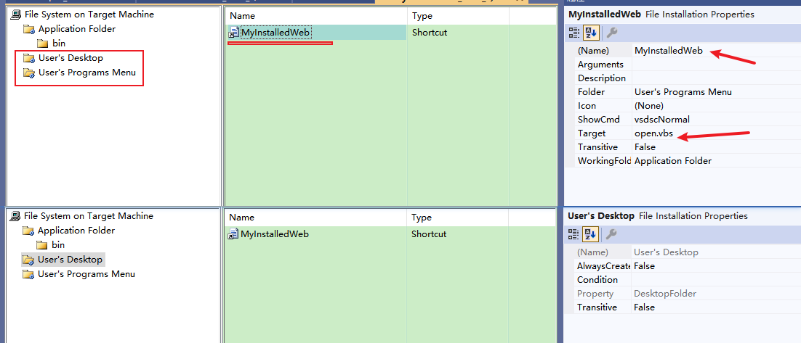

**在 快捷方式 的属性 `Icon` 中，可以指定快捷方式的图标。**

## open.vbs 写入打开链接的脚本内容

```C#
File.WriteAllLines(Path.Combine(targetdir,"open.vbs"),new string[]
{
    "Set objShell = CreateObject(\"Wscript.Shell\")",
    $"objShell.Run(\"http://localhost:{port}\")"
});
```

## 创建 .url 快捷方式

```C#
var urlLinkFile = "快捷方式文件.url";

File.WriteAllLines(urlLinkFile, new string[] {
    "[InternetShortcut]",
    $"URL=http://localhost:{port}",
    "IconIndex=0",
    $"IconFile="+Path.Combine(targetdir,"favicon.ico")
});
```

# 卸载时的额外删除


# 安装项目 的 启动条件【非必须】

右键项目，View->启动条件，打开启动条件界面。

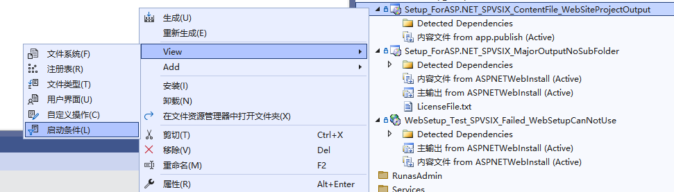  

右击“目标计算机上的要求”，选择“添加IIS启动条件”，会生成默认的`Condition1`，以及上面两个查找注册表项的设置。

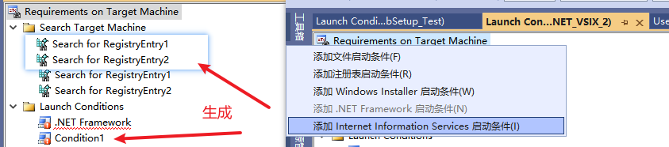  

`Condition1`的属性中，将其名称改为`IIS Condition`，Condition内容为 `(IISMAJORVERSION >= "#5" AND IISMINORVERSION >= "#1") OR IISMAJORVERSION >= "#6" OR (IISMAJORVERSION > "#1" AND IISMAJORVERSION < "#2")`，可以根据需要修改。

查找项改为`Search for IIS Major Version`和`Search for IIS Minor Version`：

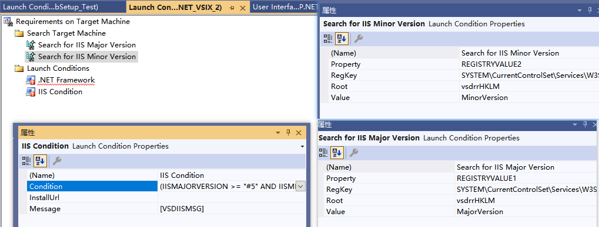  

也可以修改默认的`.NET Framework`条件：

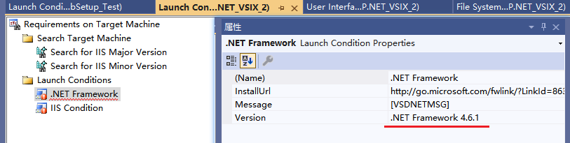  

> 右键安装项目，属性，查看和修改“系统必备”的组件：
> 
> 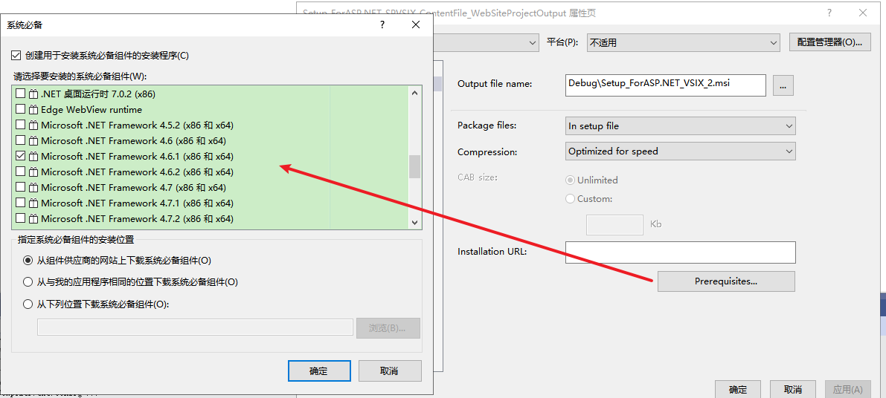  

# 附：关于 IIS 的离线安装包【默认系统集成的IIS，本身无需联网即可安装】

IIS作为Windows系统级的服务功能，默认不需要提供安装源或安装包，即可安装启用。【非默认版本需要升级实现】。

因此无需考虑是否联网、是否有网卡，默认均可以安装IIS。

Windows家庭版等没有提供IIS功能，无法安装。

对于IIS的安装包，提供有Express版本的安装包：[Internet Information Services (IIS) 10.0 Express](https://www.microsoft.com/zh-CN/download/details.aspx?id=48264)

# 附：关于通过 UI 或 命令行 安装IIS

[Configuring Step 1: Install IIS and ASP.NET Modules](https://learn.microsoft.com/en-us/iis/application-frameworks/scenario-build-an-aspnet-website-on-iis/configuring-step-1-install-iis-and-asp-net-modules)
