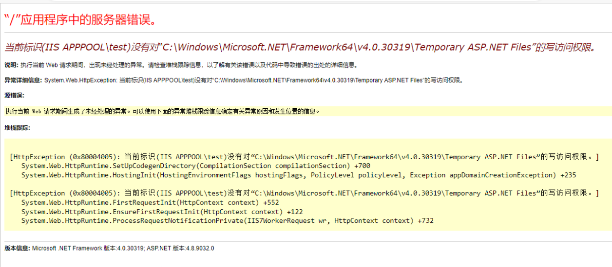

**当前标识(IIS APPPOOL\xxx)没有对“C:\Windows\Microsoft.NET\Framework64\v4.0.30319\Temporary ASP.NET Files”的写访问权限**

[toc]

无意间遇到此问题：

当前标识(IIS APPPOOL\test)没有对“C:\Windows\Microsoft.NET\Framework64\v4.0.30319\Temporary ASP.NET Files”的写访问权限。

  

> The current identity (IIS APPPOOL\domain) does not have write access to 'C:\Windows\Microsoft.NET\Framework64\v4.0.30319\Temporary ASP.NET Files'.

**发生该问题的是 https 的url，如果是 http 访问，则不会发生。**

解决办法有多种：

- 方法一：在 `C:\Windows\Microsoft.NET\Framework64\v4.0.30319\` 下创建`Temporary ASP.NET Files`文件夹(如果没有)，然后修改文件夹权限为 everyone 或 IIS_IUSRS 用户完全控制。


- 方法二：在网站根目录的`web.config`文件中指定临时文件。

```xml
<system.web>
  <compilation debug="true" targetFramework="4.6.1"  tempDirectory="c:\temp"/>
  ...
</system.web>
```

- 方法三：如果没有`web.config`文件，随便复制一个到Web站点目录中。（测试成功）

- 方法四：使用`aspnet_regiis -i`重新注册安装CLR版本。