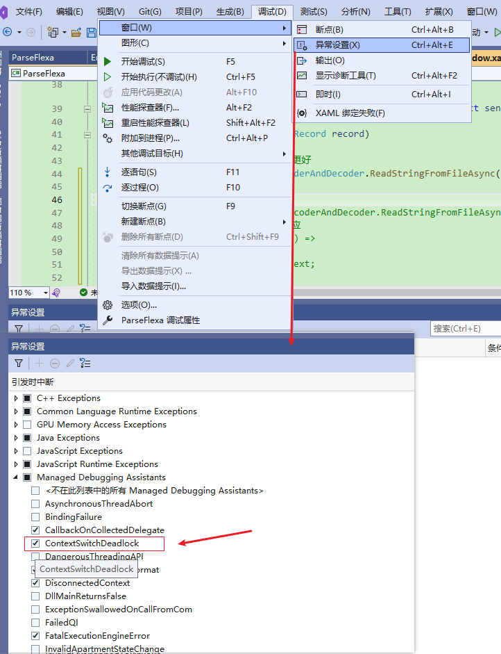
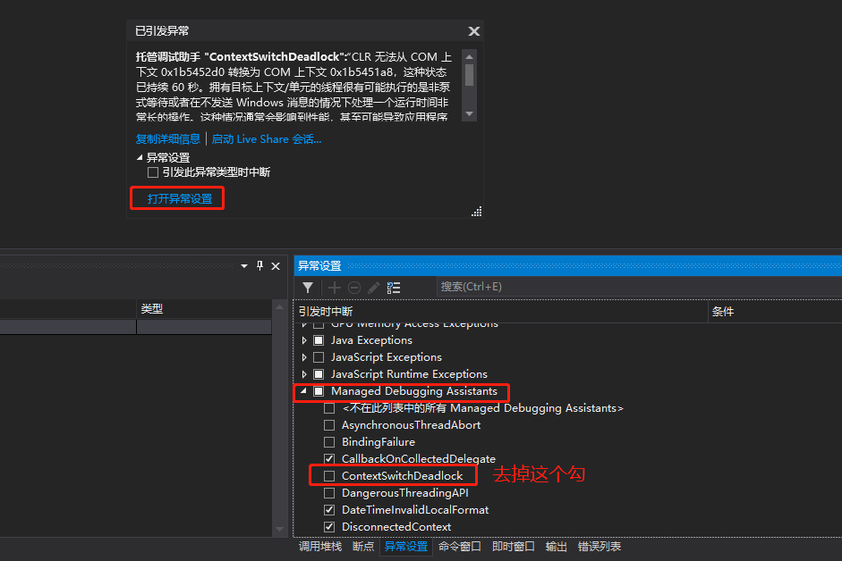

**托管调试助手ContextSwitchDeadloc,所有单线程单元 STA 线程都应使用泵式等待基元 如 CoWaitForMultipleHandles【正确的解决方法】，pumping wait primitives的使用**

[toc]

# 问题介绍及原因

问题的原文如下：

> 托管调试助手 "ContextSwitchDeadlock"
>  Message=托管调试助手 "ContextSwitchDeadlock":“CLR 无法从 COM 上下文 0xe5e880 转换为 COM 上下文 0xe5e7c8，这种状态已持续 60 秒。拥有目标上下文/单元的线程很有可能执行的是非泵式等待或者在不发送 Windows 消息的情况下处理一个运行时间非常长的操作。这种情况通常会影响到性能，甚至可能导致应用程序不响应或者使用的内存随时间不断累积。要避免此问题，所有单线程单元(STA)线程都应使用泵式等待基元(如 CoWaitForMultipleHandles)，并在运行时间很长的操作过程中定期发送消息。”


从问题的描述中就能看出产生的原因：执行一个长时间的耗时操作，导致没有响应（超过60秒）。尤其是在UI线程中执行耗时操作，导致界面没有响应（卡死）。

解决办法，也给出来了，**使用泵式等待基元，且定期发送Windows消息**！

实际的解决办法有多种，可以分为真正的解决和“掩盖式”的解决方法。

1. 取消`ContextSwitchDeadlock`的检查。上面的报错是由于`ContextSwitchDeadlock`检查上下文切换死锁导致的，实际上只是一个耗时无响应的操作，等待耗时操作完成自然就好了。

取消`ContextSwitchDeadlock`的检查，就不会在耗时过程中提示报错！（实际上，产生该报错后继续运行等待结束仍没问题）

类似“掩盖式”的解决方法。

2. 通过切换线程操作巧解。

通常该问题的产生是UI元素的操作耗时，那么，**可以通过减少或控制每次的“操作量/时间”，而不是一次性耗时操作UI，通过UI线程与非UI线程的切换操作**，巧妙的解决这个问题。

【缺点就是，线程切换的耗时和性能！】

> 对于耗时操作，通常产生的第一个解决办法是，切换到子线程运行。对于耗时操作交由子线程完成，可以不影响UI响应和操作！
> 
> 但是，如果耗时的操作就是UI控件元素本身，那就无法通过所谓的子线程实现了，因为本身就是在操作UI时的耗时，没法脱离出去！
> 
> 所以错误提示中，才推荐使用“使用泵式等待基元”。

3. 使用泵式等待基元 `CoWaitForMultipleHandles`。这就是错误提示中给出的解决方案，应该考虑使用。

正确的解决方案。


# 方法一：取消`ContextSwitchDeadlock`的检查【极其不推荐】

在 调试(菜单)（Debug）-> 窗口 -> 异常设置（Exceptions） -> Managed Debugging Assistants 中，去掉`ContextSwitchDeadlock`一项前面的钩。



同样，如果出现了其他类似 托管调试助手 的错误，比如`DisconnectedContext`，也可以才是此方法。

**不推荐！**

还可以在产生错误提示时，点击“打开异常设置”，然后找到 `Managed Debugging Assistants`：



> 前面也说过，产生此提示错误并不影响运行，点击“继续”运行，仍然可以正常等待结束。
> 
> 如果，想要产生此错误时中断程序的执行，可以在错误提示时，勾选“引发此异常类型时中断”：
> 
> 

**快捷菜单 `ctrl + alt + e` 也可以打开“异常设置”。**

# 方法二：切换线程操作巧解【的尝试】

## 切换线程分段操作

对于切换线程，控制每次的“操作量”的解决方法，通常需要具体问题具体分析，不同的操作内容，控制“操作量/时间”的方式肯定不同。

以我遇到的问题为例。我是通过 树形视图元素菜单 中 元素项 的选择，然后获取选择项对应的文件内容，将 大文件内容 赋值给 `RichTextBox` 时发生的。

原因就在于 赋值的文本内容Text 太大了，导致UI耗时！

```C#
// 树形菜单选择文件
private async void DirectoryTreeView_SelectedItemChanged(object sender, RoutedPropertyChangedEventArgs<object> e)
{
   if (e.NewValue is DirFileRecord record)
   {
       var text = await EncoderAndDecoder.ReadStringFromFileAsync(record.dirOrFilePath,Encoding.UTF7);
       rtbRun.Text = text;
   }
}
```

文件内容是通过 `await` 异步读取的，内部是由`StreamReader`实现。

【理论上的】巧解办法是 拆分大对象text 分段赋值，比如，将 text 在子线程中循环赋值给 UI的`RichTextBox`，如下，还考虑添加了 `Thread.Sleep()` 等待：

```C#
Task.Run(() =>
{
  for (int i = 0; i < text.Length; i+=800)
  {
      Thread.Sleep(500);
      Dispatcher.Invoke(() =>
      {
          rtbRun.Text += text.Substring(i, 800);
      });
  }
});
```

> Sleep > 300 时，前期还是不卡顿的。

但实际上，当不断赋值的Text内容越来越大时，UI依旧出现卡顿、卡死的状态（文本内容主键增多）。

后续，还出现了 `FatalExecutionEngineError` 等其他异常！

## FatalExecutionEngineError 错误

托管调试助手 "FatalExecutionEngineError":“运行时遇到了错误。此错误的地址为 0x5b97ad70，在线程 0x6108 上。错误代码为 0x80131623。此错误可能是 CLR 中的 bug，或者是用户代码的不安全部分或不可验证部分中的 bug。此 bug 的常见来源包括用户对 COM-interop 或 PInvoke 的封送处理错误，这些错误可能会损坏堆栈。”

## WPF 元素启用虚拟化和缓存模式

WPF 元素处理大数据量时，可以考虑开启虚拟化，这对于性能优化一般很有帮助。虚拟化最常用到Listbox、 Combobox，ListView 和 TreeView 等元素上。

**`IsVirtualizing`属性设为`True`**

`RichTextBox` 下 只有 `VirtualizingPanel` 相关的虚拟化属性，其具体使用待进一步了解。

```xml
<RichTextBox x:Name="rtb" Grid.Column="1" IsReadOnly="True"
            VirtualizingPanel.VirtualizationMode="Recycling" 
            VirtualizingPanel.IsVirtualizing="True" 
            VirtualizingPanel.IsContainerVirtualizable="True" 
            VirtualizingPanel.IsVirtualizingWhenGrouping="True" 
            VerticalScrollBarVisibility="Auto" HorizontalScrollBarVisibility="Auto">
   <FlowDocument>
       <Paragraph>
           <Run  x:Name="rtbRun" Text=""
            VirtualizingPanel.VirtualizationMode="Recycling" 
            VirtualizingPanel.IsVirtualizing="True" 
            VirtualizingPanel.IsContainerVirtualizable="True" 
            VirtualizingPanel.IsVirtualizingWhenGrouping="True" 
                />
       </Paragraph>
   </FlowDocument>
</RichTextBox>
```

## 进一步思考如何加载或呈现大数量的内容

通过上面的尝试，可以看到UI卡死无响应的原因不在于是否使用其他线程处理耗时操作，而是UI呈现本身就是耗时的，这个没法避免！

但可以从一个角度来思考，上面的 大对象text字符串 总长度达到了700多万，也就是中 WPF 的 `RichTextBox` UI一下子呈现这么多的内容，太耗时、太占内存、太耗费资源，几乎无法处理，我们可以尝试让 `RichTextBox` 不一下子呈现那么多Text内容，只需要显示一个屏幕内的全部`RichTextBox`范围就足够了（其他的再多也是看不到的）

可以结合滚动条，实现滚动查看当前一个`RichTextBox`范围之外的其他文本内容（本质上还是拆分，分片/分页加载）。

对应的，需要考虑的有以下几项：

1. 当前`RichTextBox`范围能呈现的文字字数、一行可以呈现的数量、一页可以呈现的总行数、显示时自动换行和不自动换行的情况
2. `RichTextBox` 宽高变化时，对应可以容纳的总字数、行内数量、页内总行数、自动换行等

【1、2 属于同一个问题，需要计算测量字符在 特定文本规格、文本范围 下 可以存放的数量】

3. 自定义滚动条。滚动条需要自定义，通过一屏的文字数量 和 总的文字数量，计算滚动条在垂直方向（高度）上 应该呈现的合适的大小；通过滚动滚动条（滚动条的位置）计算应该呈现的“哪一页”的字符内容。

【本质上是通过滚动条实现“分页”，而不是一次性显示所有字符串】

【设置滚动条的大小和垂直方向的位置，在于能够正确呈现真实的“全部数据”范围，就像所有数据全部加载进了文本框内一样】

4. 滚动条位置变化时，平滑的滚动显示文本内容。要考虑不是“整页”数据的替换，而是文本平滑的向上、向下依次出现。

5. 甚至不需要整个大文本数据内容（上文的text）一次性全部加载到内存，而是通过 流Stream 的方式，计算与真实文本对应的字数、行数、页数、每页数据量等数据，在需要是在加载真实数据显示。

6. 数据的预加载问题，在即将显示的文本内容之前，预先加载 当前显示内容的 前后一两页的数据作为预加载，做到平滑滚动显示。

7. 内存缓存的已加载数据的大小，适当调整已经加载的数据大小，防止过大。

8. 滚动条快速拉动滚动时的显示处理，没必须把滚动过程中的每一页都处理加载，而是只加载最后滚动条停止位置时的数据，以及前后的预加载等。与已加载数据的关联或替换等。

【可以考虑创建 数据显示相关的模型类、滚动条位置和分页的模型类、相关事件处理等】

以上是暂时水平下想到的一些可以很好的解决卡顿问题的解决方法！

> **VSCode加载大数据内容时的显示就非常好【即使是基于 Electron】，除了一开始加载时卡顿一下，如果真想解决这个问题，可以参考 vscode 的先关实现源码，深入研究下！**


# 方法三：pumping wait primitives - CoWaitForMultipleHandles 的使用

[How to use "CoWaitForMultipleHandles" ?](https://social.msdn.microsoft.com/Forums/vstudio/en-US/3a28f658-a047-4e52-9f53-9c1a4dad0014/how-to-use-quotcowaitformultiplehandlesquot-?forum=wpf)

[Pumping Windows Messages During Long Operation?](https://stackoverflow.com/questions/4806742/pumping-windows-messages-during-long-operation)


[MicrosoftSoftwareHardwareNetwork  Question : how to use CoWaitForMultipleHandles in  long running loops ?](https://microsoft.wmlcloud.com/forums/t/96488.aspx)

https://www.appsloveworld.com/csharp/100/108/cowaitformultiplehandles-api-doesnt-behave-as-documented

[CoWaitForMultipleHandles (ole32)](https://www.pinvoke.net/default.aspx/ole32/CoWaitForMultipleHandles.html)

[AF Element creation via C#.NET very slow](https://pisquare.osisoft.com/s/question/0D51I00004UHe69SAD/af-element-creation-via-cnet-very-slow)

[Help! pumping wait primitives - what is that?](https://microsoft.public.dotnet.languages.vb.narkive.com/WTwLk7Ss/help-pumping-wait-primitives-what-is-that)

https://www.ranorex.info/context-switch-deadlock-in-visual-studio-t11336.html

http://dotnetdud.blogspot.com/2009/01/clr-has-been-unable-to-transition-from.html

https://groups.google.com/g/microsoft.public.dotnet.framework.clr/c/Vw3LlQkls5g


[Error in windows application: long running operation without pumping Windows messages](https://www.codeproject.com/Questions/667027/long-running-operation-without-pumping-Windows-mes)  Release下不会显示。

# 附：UIElement.CacheMode

`CacheMode`如果需要提高呈现耗时的内容的性能，请设置该属性，具体使用参考 BitmapCache。

CacheMode：指示呈现的内容应尽可能缓存为复合位图。

# 参考

- [UIElement.CacheMode Property](https://learn.microsoft.com/en-us/uwp/api/windows.ui.xaml.uielement.cachemode?view=winrt-22621)